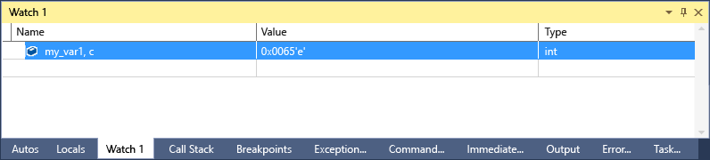

# Format Specifiers in C++
[!INCLUDE[vs2017banner](../includes/vs2017banner.md)]

You can change the format in which a value is displayed in the **Watch** window using format specifiers.  
  
 You can also use format specifiers in the **Immediate** window, the **Command** window, and even in source windows. If you pause on an expression in those windows, the result will appear in a DataTip. The DataTip display reflects the format specifier.  
  
> [!NOTE]
> The Visual Studio native debugger changed to a new debugging engine. As part of this change, some new format specifiers were added and some old ones were removed. The  older debugger is still used when you do interop (mixed native and managed) debugging with C++/CLI. The following sections in this topic show the format specifiers for each debug engine.  
> 
> - [Format Specifiers](#BKMK_Visual_Studio_2012_format_specifiers) describes the format specifiers in the new debugging engine.  
>   - [Format specifiers for interop debugging with C++/CLI](#BKMK_Format_specifiers_for_interop_debugging_and_C___edit_and_continue) describes the format specifiers in the older debugging engine.  
  
## Using Format Specifiers  
 If you have the following code:  
  
```cpp  
int main() {  
    int my_var1 = 0x0065;  
    int my_var2 = 0x0066;  
    int my_var3 = 0x0067;  
}  
```  
  
 Add the `my_var1` variable to the **Watch** window (while debugging, **Debug / Windows / Watch / Watch 1**) and set the display to hexadecimal (in the **Watch** window, right-click the variable and select **Hexadecimal Display**). Now the Watch window shows that it contains the value 0x0065. To see this value expressed as a character instead of an integer, in the Name column, after the variable name, add the character format specifier **, c**. The **Value** column now appears with **101 'e'**.  
  
   
  
## <a name="BKMK_Visual_Studio_2012_format_specifiers"></a> Format Specifiers  
 The following tables show the format specifiers that you can use in Visual Studio. Specifiers in bold are not supported for interop debugging with C++/CLI.  
  
|Specifier|Format|Original Watch Value|Value Displayed|  
|---------------|------------|--------------------------|---------------------|  
|d|decimal integer|0x00000066|102|  
|o|unsigned octal integer|0x00000066|000000000146|  
|x<br /><br /> **h**|hexadecimal integer|102|0xcccccccc|  
|X<br /><br /> **H**|hexadecimal integer|102|0xCCCCCCCC|  
|c|single character|0x0065, c|101 'e'|  
|s|const char* string|\<location> “hello world”|"hello world"|  
|**sb**|const char* string|\<location> “hello world”|hello world|  
|s8|const char* string|\<location> “hello world”|"hello world"|  
|**s8b**|const char* string|\<location> “hello world”|"hello world"|  
|su|const wchar_t*  const<br /><br /> char16_t\* string|\<location> L”hello world”|L"hello world"<br /><br /> u"hello world"|  
|sub|const wchar_t*  const<br /><br /> char16_t\* string|\<location> L”hello world”|hello world|  
|bstr|BSTR string|\<location> L”hello world”|L”hello world”|  
|**s32**|UTF-32 string|\<location> U”hello world”|U”hello world”|  
|**s32b**|UTF-32 string (no quotation marks)|\<location> U”hello world”|hello world|  
|**en**|enum|Saturday(6)|Saturday|  
|**hv**|Pointer type - indicates that the pointer value being inspected is the result of the heap allocation of an array, for example, `new int[3]`.|\<location>{\<first member>}|\<location>{\<first member>, \<second member>, …}|  
|**na**|Suppresses the memory address of a pointer to an object.|\<location>, {member=value…}|{member=value…}|  
|**nd**|Displays only the base class information, ignoring derived classes|`(Shape*) square` includes base class and derived class information|Displays only base class information|  
|hr|HRESULT or Win32 error code. (The debugger now decodes HRESULTs automatically, so this specifier is not required in those cases.|S_OK|S_OK|  
|wc|Window class flag|0x0010|WC_DEFAULTCHAR|  
|wm|Windows message numbers|16|WM_CLOSE|  
|!|raw format, ignoring any data type views customizations|\<customized representation>|4|  
  
> [!NOTE]
> When the **hv** format specifier is present, the debugger attempts to determine the length of the buffer and display the appropriate number of elements. Because it is not always possible for the debugger to find the exact buffer size of an array, you should use a size specifier `(pBuffer,[bufferSize])` whenever possible. The **hv** format specifier is intended for scenarios where the buffer size is not readily available  
  
### <a name="BKMK_Size_specifiers_for_pointers_as_arrays_in_Visual_Studio_2012"></a> Size specifiers for pointers as arrays  
 If you have a pointer to an object you want to view as an array, you can use an integer or an expression to specify the number of array elements:  
  
|Specifier|Format|Original Watch Valuen|Value Displayed|  
|---------------|------------|---------------------------|---------------------|  
|n|Decimal or **hexadecimal** integer|pBuffer,[32]<br /><br /> pBuffer,**[0x20]**|Displays `pBuffer` as a 32 element array.|  
|**[exp]**|A valid C++ expression that evaluates to an integer.|pBuffer,[bufferSize]|Displays pBuffer as an array of `bufferSize` elements.|  
|**expand(n)**|A valid C++ expression that evaluates to an integer|pBuffer, expand(2)|Displays the third element of  `pBuffer`|  
  
## <a name="BKMK_Format_specifiers_for_interop_debugging_and_C___edit_and_continue"></a> Format specifiers for interop debugging with C++/CLI  
 Specifiers in **bold** are supported only for debugging native and C++/CLI code.  
  
|Specifier|Format|Original Watch Value|Value Displayed|  
|---------------|------------|--------------------------|---------------------|  
|**d,i**|signed decimal integer|0xF000F065|-268373915|  
|**u**|unsigned decimal integer|0x0065|101|  
|o|unsigned octal integer|0xF065|0170145|  
|x,X|Hexadecimal integer|61541|0x0000f065|  
|**l,h**|long or short prefix for: d, i, u, o, x, X|00406042|0x0c22|  
|**f**|signed floating point|(3./2.), f|1.500000|  
|**e**|signed scientific notation|(3.0/2.0)|1.500000e+000|  
|**g**|signed floating point or signed scientific notation, whichever is shorter|(3.0/2.0)|1.5|  
|c|single character|\<location>|101 'e'|  
|s|const char*|\<location>|"hello world"|  
|su|const wchar_t*<br /><br /> const char16_t\*|\<location>|L"hello world"|  
|sub|const wchar_t*<br /><br /> const char16_t\*|\<location>|hello world|  
|s8|const char*|\<location>|"hello world"|  
|hr|HRESULT or Win32 error code. (The debugger now decodes HRESULTs automatically, so this specifier is not required in those cases.|S_OK|S_OK|  
|wc|Window class flag.|0x00000040,|WC_DEFAULTCHAR|  
|wm|Windows message numbers|0x0010|WM_CLOSE|  
|!|raw format, ignoring any data type views customizations|\<customized representation>|4|  
  
### <a name="BKMK_Format_specifiers_memory_locations_in_interop_debugging_and_C___edit_and_continue"></a> Format specifiers memory locations in interop debugging with C++/CLI  
 The following table contains formatting symbols used for memory locations. You can use a memory location specifier with any value or expression that evaluates to a location.  
  
|Symbol|Format|Original Watch Value|Value Displayed|  
|------------|------------|--------------------------|---------------------|  
|**ma**|64 ASCII characters|0x0012ffac|0x0012ffac .4...0...".0W&.......1W&.0.:W..1...."..1.JO&.1.2.."..1...0y....1|  
|**m**|16 bytes in hexadecimal, followed by 16 ASCII characters|0x0012ffac|0x0012ffac B3 34 CB 00 84 30 94 80 FF 22 8A 30 57 26 00 00 .4...0...".0W&..|  
|**mb**|16 bytes in hexadecimal, followed by 16 ASCII characters|0x0012ffac|0x0012ffac B3 34 CB 00 84 30 94 80 FF 22 8A 30 57 26 00 00 .4...0...".0W&..|  
|**mw**|8 words|0x0012ffac|0x0012ffac 34B3 00CB 3084 8094 22FF 308A 2657 0000|  
|**md**|4 doublewords|0x0012ffac|0x0012ffac 00CB34B3 80943084 308A22FF 00002657|  
|**mq**|2 quadwords|0x0012ffac|0x0012ffac 7ffdf00000000000 5f441a790012fdd4|  
|**mu**|2-byte characters (Unicode)|0x0012ffac|0x0012ffac 8478 77f4 ffff ffff 0000 0000 0000 0000|  
  
### <a name="BKMK_Size_specifier_for_pointers_as_arrays_in_interop_debugging_and_C___edit_and_continue"></a> Size specifier for pointers as arrays in interop debugging with C++/CLIt  
 If you have a pointer to an object you want to view as an array, you can use an integer to specify the number of array elements:  
  
|Specifier|Format|Expression|Value Displayed|  
|---------------|------------|----------------|---------------------|  
|n|Decimal integer|pBuffer[32]|Displays `pBuffer` as a 32 element array.|
