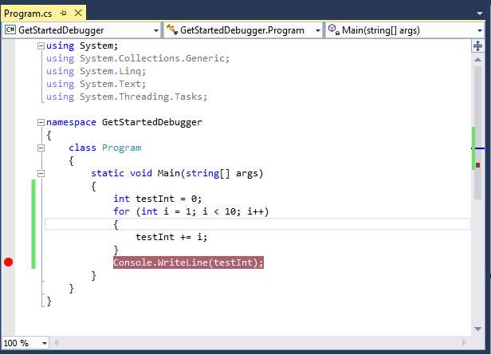
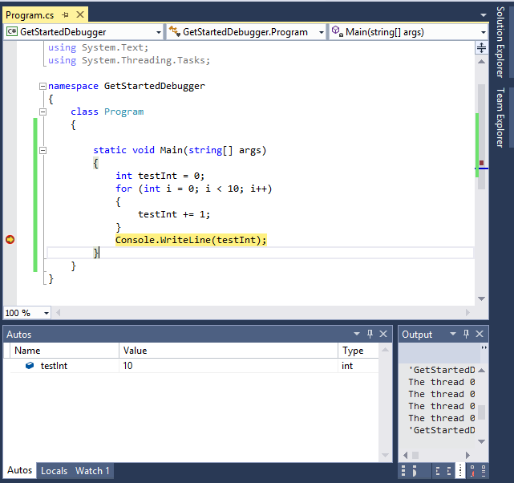

# Getting Started with the Debugger
[!INCLUDE[vs2017banner](../includes/vs2017banner.md)]

The Visual Studio debugger is easy to use in any language. Here we’ll show how to debug a simple C# program, but you can apply the same steps to code in other languages such as C++ and JavaScript.  
  
## <a name="BKMK_Start_debugging_a_VS_project"></a> Debug a Basic C# Project  
 Let’s start with a simple C# console application (**File / New / Project**, then select **Visual C#** and then select **Console Application**). If you’ve never worked with Visual Studio before, see [Walkthrough: Create a Simple Application](../ide/walkthrough-create-a-simple-application-with-visual-csharp-or-visual-basic.md). The **Main** method just adds 1 to an integer variable 10 times and prints the result to the console:  
  
```csharp  
static void Main(string[] args)  
{  
    int testInt = 0;  
    for (int i = 1; i <= 10; i++)  
    {  
        testInt += 1;  
    }  
    Console.WriteLine(testInt);  
}  
```  
  
 Build this code in the **Debug** configuration. This configuration is set by default. For more information about configurations, see [Understanding Build Configurations](../ide/understanding-build-configurations.md).  
  
 Run this code in the debugger by clicking **Debug / Start Debugging** (or **Start** on the toolbar, or **F5**). The application should exit almost immediately, so you can’t actually tell whether anything was printed in the Console window.  
  
 You can stop the execution long enough to see the Console window by setting a breakpoint and then stepping ahead. To set a breakpoint, put your cursor in the `Console.WriteLine` line and click **Debug / New Breakpoint / Function Breakpoint**, or just click in the left margin at the same line. The breakpoint should look like this:  
  
   
  
 For more information about breakpoints, see [Using Breakpoints](../debugger/using-breakpoints.md).  
  
## <a name="BKMK_Inspect_Variables"></a> Inspect Variables  
 Debugging often involves finding variables that don't contain the values you expect at a particular point. We will show some of the ways that you can inspect variables.  
  
 Start debugging again. Execution stops before the `Console.WriteLine` code executes. You can cause it to execute by stepping ahead (click **Debug / Step Over** or **F10**). In this case you could have chosen **Step Into** (**F11**) and gotten the same result; we’ll explain the difference later on. The line with the last curly brace of the method should have turned yellow. Look at the Console window. You should see **10**.  
  
 You can hover over the **testInt** variable to view the current value in a data tip.  
  
   
  
 Just below the code window you should see the **Autos**, **Locals**, and **Watch** windows. These windows show the current values of variables at the time of execution. Both the **Autos** and the **Locals** windows show **testInt** with a value of **10**.  
  
   
  
 For more information about these windows, see [Autos and Locals Windows](../debugger/autos-and-locals-windows.md).  
  
 Let’s see how the variable value changes as we walk through the program. Set a breakpoint on the `testInt += 1;` line, and restart debugging. You should see that **testInt** in the **Locals** and **Autos** windows is **0**, and **i** is **1**. When you continue debugging (**Debug / Continue**, or **Continue** on the toolbar, or **F5**), you can see that the value of **testInt** changes to **1**, then **2**, and so on. When you get tired of looking at these changes, remove the breakpoint (**Debug / Toggle Breakpoint**, or click on it in the margin), and continue debugging. If you want to remove all the breakpoints, click **Debug / Delete All Breakpoints**, or **CTRL+SHIFT+F9**, and click **Yes** on the dialog box that asks **Do you want to remove all breakpoints?**.  
  
## Stepping Into and Over Function Calls  
 You can execute code in the debugger statement-by-statement (**Step Into**) or you can execute code while the debugger skips functions (**Step Over**) to quickly get to code that you're more interested in (function code is still executed). You can switch between both methods in the same debugging session.  
  
 To see the difference between **Step Into** and **Step Over**, we need to add a method that is called by another method. Add a method to the C# application and call it from the Main method. The code should look something like this:  
  
```csharp  
static void Main(string[] args)  
{  
    Method1();  
    Console.WriteLine("end");  
}  
  
private static void Method1()  
{  
    Console.WriteLine("in Method1");  
}  
```  
  
 Set a breakpoint on the `Method1();` call in the Main method and start debugging. When execution breaks, click **Debug / Step Into** (or **Step Into** on the toolbar, or **F11**). Execution breaks again at the first curly brace in Method1():  
  
   
  
 Stop debugging and start again, and when execution breaks at the breakpoint, click **Debug / Step Over** (or **Step Over** on the toolbar, or **F10**). Execution breaks again at `Console.WriteLine("end");`.  
  
 If you want to know more about navigating code with the debugger, see [Navigating through Code with the Debugger](../debugger/navigating-through-code-with-the-debugger.md).
