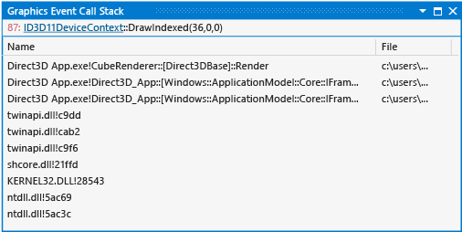

# Graphics Event Call Stack
[!INCLUDE[vs2017banner](../includes/vs2017banner.md)]

The Graphics Event Call Stack in Visual Studio Graphics Analyzer helps you map the relationship between problematic graphics events and your app's source code.  
  
 This is the Event Call Stack window:  
  
   
  
## Understanding the graphics event call stack  
 You can use the Event Call Stack to understand the flow of execution that led to a particular Direct3D event. It resembles the Visual Studio call stack window, except that instead of displaying the current call stack of the active thread in a running app, it displays the call stack as it existed when the selected Direct3D event occurred. From the Event Call Stack, you can jump to the call site of the selected Direct3D event to inspect the surrounding code.  
  
 By using the Event Call Stack to identify the code path from which a problem event originates, you can use your knowledge of the codebase to deduce potential sources of the problem, or you can add breakpoints in your app's source code so that you can use traditional debugging techniques to examine how the state of the app or event parameters are causing the event to misbehave. This examination can help you find problems in the source code that are only manifested as rendering problems.  
  
### Graphics Event Call Stack information  
 The event call stack doesn't support pre-frame events or user-defined events. The graphics event call stack is displayed in a table format.  
  
|Column|Description|  
|------------|-----------------|  
|**Name**|A symbol that uniquely identifies the function that contains the call site. The debug symbol for the function is displayed when it's available; otherwise, the function offset is displayed.|  
|**File**|The file name of the source code file or library file that contains the call site.|  
|**Location**|The line number of the call site.|  
  
### Links to graphics objects  
 To understand the selected graphics event, you might need information about the Direct3D objects that are associated with it. The **Graphics Event Call Stack** window provides links to this information.  
  
## See Also  
 [Walkthrough: Missing Objects Due to Vertex Shading](../debugger/walkthrough-missing-objects-due-to-vertex-shading.md)
