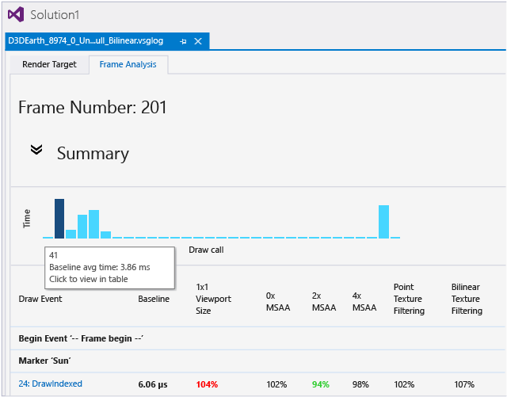
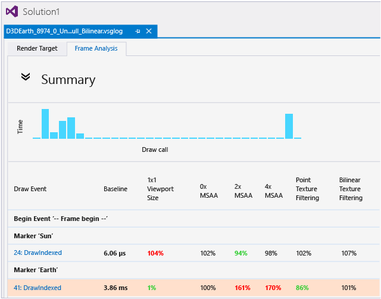
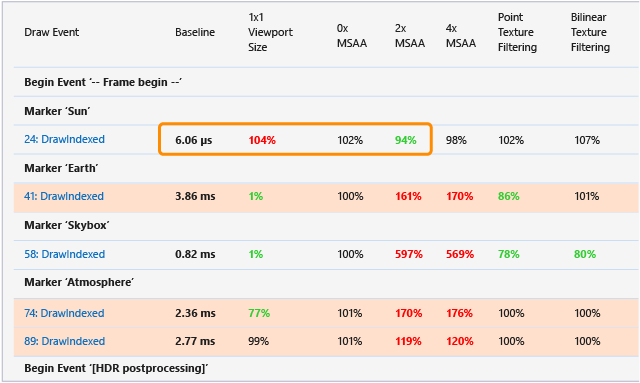
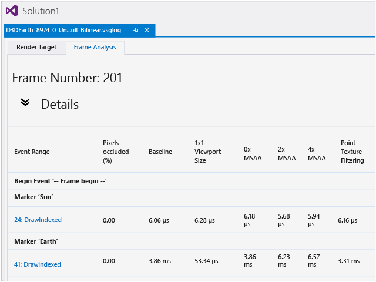

# Graphics Frame Analysis
[!INCLUDE[vs2017banner](../includes/vs2017banner.md)]

Use Graphics Frame Analysis in Visual Studio Graphics Analyzer to analyze and optimize the rendering performance of your Direct3D game or app.  
  
> [!IMPORTANT]
> Graphics Analyzer supports Frame Analysis for apps that use Direct3D 11 on supported platforms including Windows 10. Frame Analysis is not currently supported for apps that use Direct3D 12.  
  
## Frame analysis  
 Frame analysis uses the same information that's captured in a graphics log file for diagnostic purposes, but uses it to summarize rendering performance instead. Performance information is not recorded to the log during capture; instead the performance information is generated later, during frame analysis, by timing events and collecting statistics as the frame is played back. This approach has several advantages over recording performance information during capture:  
  
- Frame analysis can average results from multiple playbacks of the same frame to ensure that the performance summary is statistically sound.  
  
- Frame analysis can generate performance information for hardware configurations and devices other than the one where the information was captured.  
  
- Frame analysis can generate new performance summaries from previously captured information—for example, when GPU drivers are optimized or expose additional debugging features.  
  
  In addition to these advantages, frame analysis can also make changes to how the frame is rendered during playback so that it can present information about how those changes might impact the rendering performance of an app. You can use this information to decide among potential optimization strategies without having to implement them all and then capture and compare all of the results yourself.  
  
  Although frame analysis is primarily intended to help you achieve faster rendering performance, it can equally help you achieve better visual quality for a given performance target or reduce GPU power consumption.  
  
  To see a demonstration of what Frame Analysis can do for your app, you can watch the [Visual Studio Graphics Frame Analysis](https://channel9.msdn.com/Shows/C9-GoingNative/GoingNative-25-Offline-Analysis-Graphics-Tool) video on Channel 9.  
  
## Using Frame Analysis  
 Before you can use Frame Analysis, you have to capture graphics information from your app as it runs, just as you would when you use any of the other Graphics Analyzer tools. Then, in the graphics log document (.vsglog) window, choose the **Frame Analysis** tab.  
  
   
  
 After the analysis is complete, the results are displayed. The top part of the frame analysis tab displays the timeline and summary table. The bottom part displays the details tables. If errors or warnings were generated during playback, they are summarized above the timeline; from there, you can follow the links to learn more about the errors and warnings.  
  
### Interpreting results  
 By interpreting the results of each variant, you can infer useful information about your app's rendering performance and behavior. For more information about rendering variants, see [Variants](#Variants) later in this article.  
  
 Some results directly indicate how the variant affects rendering performance:  
  
- If the Bilinear Texture Filtering variant showed performance gains, then using bilinear texture filtering in your app will show similar performance gains.  
  
- If the 1x1 Viewport variant showed performance gains, then reducing the size of the render targets in your app will improve its rendering performance.  
  
- If the BC Texture Compression variant showed performance gains, then using BC texture compression in your app will show similar performance gains.  
  
- If the 2xMSAA variant has almost the same performance as the 0xMSAA variant, you can enable 2xMSAA in your app to improve its rendering quality without cost in performance.  
  
  Other results might suggest deeper, more subtle implications for your app's performance:  
  
- If the 1x1 Viewport variant shows very large performance gains, your app is probably consuming more fillrate than is available. If this variant shows no performance gains, the app is probably processing too many vertices.  
  
- If the 16bpp Render Target Format variant shows significant performance gains, your app is probably consuming too much memory bandwidth.  
  
- If the Half/Quarter Texture Dimensions variant shows significant performance gains, your textures probably occupy too much memory, consume too much bandwidth, or use the texture cache inefficiently. If this variant shows no change in performance, you can probably use larger, more-detailed textures without paying a performance cost.  
  
  When hardware counters are available, you can use them to gather very detailed information about why your app's rendering performance might be suffering. All feature-level 9.2 and higher devices support depth occlusion queries (**pixels occluded** counter) and timestamps. Other hardware counters may be available, depending on whether the GPU manufacturer has implemented hardware counters and exposed them in its driver. You can use these counters to confirm the precise cause of the results shown in the summary table—for example, you can determine whether overdraw is a factor by examining the percentage of pixels that were occluded by the depth test.  
  
### Timeline and Summary Table  
 By default, the Timeline and Summary Table are displayed and the other sections are collapsed.  
  
#### Timeline  
 The timeline shows an overview of draw-call timings relative to one another. Because larger bars correspond to longer draw times, you can use it to quickly locate the most expensive draw calls in the frame. When the captured frame contains a very large number of draw calls, multiple draw calls are combined into one bar whose length is the sum of those draw calls.  
  
   
  
 You can rest the pointer on a bar to see which draw-call event the bar corresponds to. Selecting the bar causes the event list to synchronize to that event.  
  
#### Table  
 The table of numbers below the timeline shows the relative performance of each rendering variant for each draw call with respect to your app's default rendering. Each column displays a different rendering variant and each row represents a different draw call that's identified in the left-most column; from here you can follow a link to the event in the Graphics Event List window.  
  
   
  
 The second left-most column in the Summary Table displays your app's baseline rendering time—that is, the length of time it takes for your app's default rendering to complete the draw call. The remaining columns show the relative performance of each rendering variant as a percentage of the Baseline so that it's easier to see whether performance is improved. Percentages larger than 100 percent took longer than the Baseline—that is, performance went down—and percentages smaller than 100 percent took less time—performance went up.  
  
 The values of both the absolute timing of the Baseline and the relative timing of the rendering variants are actually mean averages of multiple runs—5 by default. This averaging helps ensure that timing data is reliable and consistent. You can rest the pointer on each cell in the table to examine the minimum, maximum, mean, and median timing values that were observed when results for that draw call and rendering variant were generated. The Baseline timing is also displayed.  
  
#### "Hot" draw calls  
 To bring attention to draw calls that consume a greater proportion of overall rendering time or that might be unusually slow for reasons that could be avoided, the row that contains these "hot" draw calls is shaded red when its own Baseline timing is more than one standard deviation longer than the mean Baseline timing of all draw calls in the frame.  
  
   
  
#### Statistical significance  
 To bring attention to rendering variations that have the highest relevance, Frame Analysis determines the statistical significance of each rendering variant and displays the significant ones as boldface. It displays the ones that improve performance as green and the ones that reduce performance as red. It displays results that are not statistically significant as normal type.  
  
   
  
 To determine statistical relevance, Frame Analysis uses the [Student's t-test](https://en.wikipedia.org/wiki/Student's_t-test).  
  
### Details table  
 Below the Summary table is the Details table, which is collapsed by default. The content of the Details table depends on the hardware platform of the playback machine. For information about supported hardware platforms, see [Hardware support](#HardwareSupport).  
  
#### Platforms that do not support hardware counters  
 Most platforms don't fully support hardware GPU counters—these include all GPUs currently offered by Intel, AMD, and nVidia. When there are no hardware counters to collect, only one Details table is displayed and it contains the mean absolute timing of all variants.  
  
   
  
#### Platforms that support hardware counters  
 For platforms that support hardware GPU counters—for example, the nVidia T40 SOC and all Qualcomm SOCs—several Details tables are displayed, one for each variant. Every available hardware counter is collected for each rendering variant and displayed in its own Details table.  
  
   
  
 The hardware counter information provides a very detailed view of specific hardware-platform behavior for each draw call, which can help you identify the cause of performance bottlenecks very precisely.  
  
> [!NOTE]
> Different hardware platforms support different counters; there is no standard. The counters and what they represent are determined solely by each GPU manufacturer.  
  
### Marker regions and events  
 Frame Analysis supports user-defined event markers and event groups. They are displayed in the Summary table and in the Detail tables.  
  
 You can use either the ID3DUserDefinedAnnotation APIs or the legacy D3DPERF_ family of APIs to create markers and groups. When you use the D3DPERF_ API family, you can assign each marker and group a color that Frame Analysis displays as a colored band in the rows that contain the event marker or the event group begin/end markers and their contents. This feature can help you quickly identify important rendering events or groups of events.  
  
### Warnings and errors  
 Frame Analysis occasionally completes with warnings or errors, which are summarized above the Timeline, and detailed at the bottom of the Frame Analysis tab.  
  
 Usually, warnings and errors are only for informational purposes and don't require any intervention.  
  
 Warnings typically indicate that hardware support is lacking but can be worked around, hardware counters cannot be collected, or certain performance data may not be reliable—for example, when a workaround adversely affects it.  
  
 Errors typically indicate that the frame analysis implementation has bugs, a driver has bugs, hardware support is lacking and can't be worked around, or the app tries something that's not supported by playback.  
  
### Retries  
 If the GPU undergoes a power-state transition during frame analysis, the affected analysis pass must be retried because the GPU clockspeed changed and thereby invalidated relative timing results.  
  
 Frame Analysis limits the number of retries to 10. If your platform has aggressive power management or clock-gating, it might cause Frame Analysis to fail and report an error because it has exceeded the retry limit. You might be able to mitigate this problem by resetting your platform's power management and clock speed throttling to be less aggressive, if the platform enables it.  
  
##  Hardware support  
  
### Timestamps and occlusion queries  
 Timestamps are supported on all platforms that support Frame Analysis. Depth occlusion queries—required for the Pixels Occluded counter—are supported on platforms that support feature level 9.2 or higher.  
  
> [!NOTE]
> Although timestamps are supported on all platforms that support Frame Analysis, the accuracy and consistency of timestamps varies from platform to platform.  
  
### GPU counters  
 Support for GPU hardware counters is hardware-dependent.  
  
 Because no computer GPU currently offered by Intel, AMD, or nVidia supports GPU hardware counters reliably, Frame Analysis doesn't collect counters from them. However, Frame Analysis does collect hardware counters from these GPUs, which reliably support them:  
  
- Qualcomm SOCs (any that supports Windows Phone)  
  
- nVidia T40 (Tegra4).  
  
  No other platform that supports Frame Analysis collects GPU hardware counters.  
  
> [!NOTE]
> Because GPU hardware counters are hardware resources, it can take multiple passes to collect the complete set of hardware counters for each rendering variant. As a result, the order in which GPU counters are collected is unspecified.  
  
### Windows phone  
 Timestamps, occlusion queries, and GPU hardware counters are only supported on Windows Phone handsets that originally shipped with Windows Phone 8.1. Frame Analysis requires these in order to play back the graphics log file. Windows Phone handsets that were originally shipped with Windows Phone 8 do not support Frame Analysis, even for handsets that have been updated to Windows Phone 8.1.  
  
## Unsupported scenarios  
 Certain ways of using frame analysis are unsupported or are just a bad idea.  
  
### WARP  
 Frame analysis is intended to be used to profile and improve rendering performance on real hardware. Running frame analysis on WARP devices isn't prevented—the Windows Phone emulator runs on WARP—but it's not usually a worthwhile pursuit because WARP running on a high-end CPU is slower than even the least-capable modern GPUs, and because WARP performance can vary greatly depending on the particular CPU it's running on.  
  
### Playback of high-feature-level captures on down-level devices  
 In Graphics Analyzer, when you play back a graphics log file that uses a higher feature level than the playback machine supports, it automatically falls back to WARP. In Frame Analysis it explicitly does not fall back to WARP and it generates an error—WARP is useful for examining the correctness of your Direct3D app, but not for examining its performance.  
  
> [!NOTE]
> Although it's important to keep the feature-level issues in mind, you can capture and play back graphics log files on different hardware configurations and devices. For example, you can capture graphics information on a Windows Phone and play it back on a desktop computer, and the reverse is also supported. In both cases, the graphics log can be played back as long as the log file doesn't contain APIs or use feature levels that aren't supported on the playback machine.  
  
### Direct3D 10 and lower  
 Frame Analysis is only supported for the Direct3D 11 API. If your app calls the Direct3D 10 API, Frame Analysis won't recognize or profile them even though they're recognized and used by other Graphics Analyzer tools. If your app uses both the Direct3D11 and the Direct3D 10 APIs, only the Direct3D 11 calls are profiled.  
  
> [!NOTE]
> This applies only to the Direct3D API calls that you're using, not feature levels. As long as you're using the Direct3D 11, Direct3D 11.1, or Direct3D 11.2 API, you can use whatever feature level you like and Frame Analysis will just work.  
  
##  Variants  
 Each change that Frame Analysis makes to the way a frame is rendered during playback is known as a *variant*. The variants that Frame Analysis examines correspond to common, relatively easy changes that you could make to improve the rendering performance or visual quality of your app—for example, reducing the size of textures, using texture compression, or enabling different kinds of anti-aliasing. Variants override the usual rendering context and parameters of your app. Here's a summary:  
  
|Variant|Description|  
|-------------|-----------------|  
|**1x1 Viewport Size**|Reduces the viewport dimensions on all render targets to 1x1 pixels.   For more information, see [1x1 Viewport Size Variant](../debugger/1x1-viewport-size-variant.md)|  
|**0x MSAA**|Disables multi-sample anti-aliasing (MSAA) on all render targets.   For more information, see [0x/2x/4x MSAA Variants](../debugger/0x-2x-4x-msaa-variants.md)|  
|**2x MSAA**|Enables 2x multi-sample anti-aliasing (MSAA) on all render targets.   For more information, see [0x/2x/4x MSAA Variants](../debugger/0x-2x-4x-msaa-variants.md)|  
|**4x MSAA**|Enables 4x multi-sample anti-aliasing (MSAA) on all render targets.   For more information, see [0x/2x/4x MSAA Variants](../debugger/0x-2x-4x-msaa-variants.md)|  
|**Point Texture Filtering**|Sets the filtering mode to `DXD11_FILTER_MIN_MAG_MIP_POINT` (point texture filtering) for all appropriate texture samples.   For more information, see [Point, Bilinear, Trilinear, and Anisotropic Texture Filtering Variants](../debugger/point-bilinear-trilinear-and-anisotropic-texture-filtering-variants.md).|  
|**Bilinear Texture Filtering**|Sets the filtering mode to `DXD11_FILTER_MIN_MAG_LINEAR_MIP_POINT` (bilinear texture filtering) for all appropriate texture samples.   For more information, see [Point, Bilinear, Trilinear, and Anisotropic Texture Filtering Variants](../debugger/point-bilinear-trilinear-and-anisotropic-texture-filtering-variants.md).|  
|**Trilinear Texture Filtering**|Sets the filtering mode to `DXD11_FILTER_MIN_MAG_MIP_LINEAR` (trilinear texture filtering) for all appropriate texture samples.   For more information, see [Point, Bilinear, Trilinear, and Anisotropic Texture Filtering Variants](../debugger/point-bilinear-trilinear-and-anisotropic-texture-filtering-variants.md).|  
|**Anisotropic Texture Filtering**|Sets the filtering mode to `DXD11_FILTER_ANISOTROPIC` and `MaxAnisotropy` to `16` (16x anisotropic texture filtering) for all appropriate texture samples.   For more information, see [Point, Bilinear, Trilinear, and Anisotropic Texture Filtering Variants](../debugger/point-bilinear-trilinear-and-anisotropic-texture-filtering-variants.md).|  
|**16bpp Render Target Format**|Sets the pixel format to `DXGI_FORMAT_B5G6R5_UNORM` (16bpp, 565 format) for all render targets and backbuffers.   For more information, see [16bpp Render Target Format Variant](../debugger/16bpp-render-target-format-variant.md)|  
|**Mip-map Generation**|Enables mip-maps on all textures that are not render targets.   For more information, see [Mip-map Generation Variant](../debugger/mip-map-generation-variant.md).|  
|**Half Texture Dimensions**|Reduces the texture dimensions on all textures that are not render targets to half of their original size in each dimension. For example, a 256x128 texture is reduced to 128x64 texels.   For more information, see [Half/Quarter Texture Dimensions Variant](../debugger/half-quarter-texture-dimensions-variant.md).|  
|**Quarter Texture Dimensions**|Reduces the texture dimensions on all textures that are not render targets to a quarter of their original size in each dimension. For example, a 256x128 texture is reduced to 64x32 texels.   For more information, see [Half/Quarter Texture Dimensions Variant](../debugger/half-quarter-texture-dimensions-variant.md).|  
|**BC Texture Compression**|Enables block compression on all textures that have a B8G8R8X8, B8G8R8A8, or R8G8B8A8 pixel format variant. B8G8R8X8 format variants are compressed by using BC1; B8G8R8A8 and R8G8B8A8 format variants are compressed by using BC3.   For more information, see [BC Texture Compression Variant](../debugger/bc-texture-compression-variant.md).|  
  
 The result for most variants is prescriptive: "Reducing texture size by half is 25 percent faster" or "Enabling 2x MSAA is only 2 percent slower". Other variants might require more interpretation—for example, if the variant that changes the viewport dimensions to 1x1 shows a large performance gain, it might indicate that rendering is bottlenecked by a low fill rate; alternatively, if there's no significant change in performance, it might indicate that rendering is bottlenecked by vertex processing.
