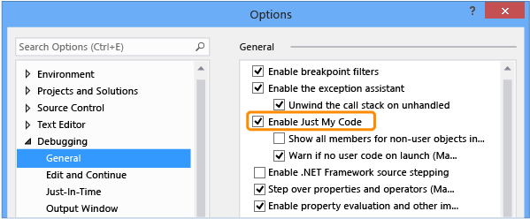

# Just My Code
[!INCLUDE[vs2017banner](../includes/vs2017banner.md)]

Developers who use .NET Framework languages are familiar with the Just My Code debugger feature that steps over system, framework, and other non-user calls and collapses those calls in the call stack windows. Just My Code has been extended to the C++ and JavaScript languages. This topic describes the specifics of using Just My Code in .NET Framework, native C++, and JavaScript projects.  
  
## <a name="BKMK_Enable_or_disable_Just_My_Code"></a> Enable or disable Just My Code  
 To enable or disable Just My Code, choose **Options and Settings** on the **Debug** menu. In the **Debugging** / **General** node, choose or clear **Enable Just My Code**.  
  
   
  
> [!NOTE]
> The **Enable Just My Code** setting is a global setting that is applied to all Visual Studio projects in all languages.  
  
### <a name="BKMK_Override_call_stack_filtering"></a> Override call stack filtering  
 In call stack displays, such as the Call Stack and Tasks windows, Just My Code collapses non-user code into an annotated frame labeled `[External Code]`. To view the collapsed frames, choose **Show External Code** on the context menu of the call stack display.  
  
> [!NOTE]
> The **Show External Code** setting is saved to the current user’s profiler. It is applied to all projects in all languages that are opened by the user.  
  
## <a name="BKMK__NET_Framework_Just_My_Code"></a> .NET Framework Just My Code  
  
### <a name="BKMK_NET_User_and_non_user_code"></a> User and non-user code  
 To distinguish user code from non-user code, Just My Code looks at symbol (.pdb) files and program optimizations. The debugger considers code to be non-user code when the binary is optimized or when the .pdb file is not available.  
  
 Three attributes also affect what the debugger considers to be My Code:  
  
- <xref:System.Diagnostics.DebuggerNonUserCodeAttribute> tells the debugger that the code it is applied to is not My Code.  
  
- <xref:System.Diagnostics.DebuggerHiddenAttribute> hides the code from the debugger, even if Just My Code is turned off.  
  
- <xref:System.Diagnostics.DebuggerStepThroughAttribute> tells the debugger to step through the code it is applied to, rather than step into the code.  
  
  All other code is considered to be user code.  
  
### <a name="BKMK_NET_Stepping_behavior"></a> Stepping behavior  
 When you **Step Into** (Keyboard shortcut: F11) non-user code, the debugger steps over the code to the next user statement. When you **Step Out** (Keyboard: Shift + F11), the debugger runs to the next line of user code. If no user code is encountered then execution continues until the app exits, a breakpoint is hit, or an exception occurs.  
  
### <a name="BKMK_NET_Breakpoint_behavior"></a> Breakpoint behavior  
 When Just My Code is enabled, you can choose **Break All** (Keyboard: Ctrl + Alt + Break) and stop execution at a location where there is no user code to display. When this happens, the No Source window is displayed. If you then choose a Step command, the debugger takes you to the next line of user code.  
  
### <a name="BKMK_NET_Exception_behavior"></a> Exception behavior  
 If an unhandled exception occurs in non-user code, the debugger breaks at the line in user code where the exception was generated.  
  
 If first chance exceptions are enabled for the exception, the user-code line is highlighted in green. The call stack displays an annotated frame labeled **[External Code]**.  
  
## <a name="BKMK_C___Just_My_Code"></a> C++ Just My Code  
  
### <a name="BKMK_CPP_User_and_non_user_code"></a> User and non-user code  
 C++ Just My Code is different than .NET Framework and JavaScript Just My Code because the stepping behavior is independent of the call stack behavior.  
  
 **Call stacks**  
  
 By default, the debugger considers these functions to be non-user code in call stack windows:  
  
- Functions with stripped source information in their symbols file.  
  
- Functions where the symbol files indicate that there is no source file corresponding to the stack frame.  
  
- Functions specified in `*.natjmc` files in the `%VsInstallDirectory%\Common7\Packages\Debugger\Visualizers` folder.  
  
  **Stepping**  
  
  By default, only functions specified in `*.natstepfilter` files in the `%VsInstallDirectory%\Common7\Packages\Debugger\Visualizers` folder are considered non-user code.  
  
  You can create your own `.natstepfilter` and `.natjmc` to customize the stepping and call stack window behavior in the `%USERPROFILE%\My Documents\Visual Studio 2015\Visualizers`.  
  
### <a name="BKMK_CPP_Stepping_behavior"></a> Stepping behavior  
 When you **Step Into** (Keyboard shortcut: F11) non-user code from user code, the debugger steps over the code to the next line of user-code. When you **Step Out** (Keyboard: Shift + F11), the debugger runs to the next line of user code. If no user code is encountered then execution continues until the app exits, a breakpoint is hit, or an exception occurs.  
  
 If the debugger breaks in non-user code (for example, if a Break All command stops in non-user code), stepping continues in the non-user code.  
  
### <a name="BKMK_CPP_Exception_behavior"></a> Exception behavior  
 When the debugger hits an exception, it will stop on the exception regardless of whether it is in user or non-user code. The **User-unhandled** options in the **Exceptions** dialog box are ignored.  
  
### <a name="BKMK_CPP_Customize_stepping_behavior"></a> Customize stepping behavior  
 You can specify functions to step over by listing them as non-user code in `*.natstepfilter` files.  
  
- To specify non-user code for all users of the Visual Studio machine, add the .natstepfilter file to the `%VsInstallDirectory%\Common7\Packages\Debugger\Visualizers` folder.  
  
- To specify non-user code for an individual user, add the .natstepfilter file to the `%USERPROFILE%\My Documents\Visual Studio 2015\Visualizers` folder.  
  
  .natstepfilter files are xml files with this syntax:  
  
```xml  
<?xml version="1.0" encoding="utf-8"?>  
<StepFilter xmlns="http://schemas.microsoft.com/vstudio/debugger/natstepfilter/2010">  
    <Function>  
        <Name>FunctionSpec</Name>  
        <Action>StepAction</Action>  
    </Function>  
    <Function>  
        <Name>FunctionSpec</Name>  
        <Module>ModuleSpec</Module>  
        <Action>StepAction</Action>  
    </Function>  
</StepFilter>  
  
```  
  
|Element|Description|  
|-------------|-----------------|  
|Function|Required. Specifies one or more functions as non-user functions.|  
|`Name`|Required. An ECMA-262 formatted regular expression specifying the full function name to match. For example:<br /><br /> `<Name>MyNS::MyClass.*</Name>`<br /><br /> tells the debugger that all methods in `MyNS::MyClass` are to be considered non-user code. The match is case-sensitive.|  
|`Module`|Optional. An ECMA-262 formatted regular expression specifying the full path to the module containing the function. The match is case-insensitive.|  
|`Action`|Required. One of these case-sensitive values:<br /><br /> -   `NoStepInto`  – tells the debugger to step over the matched function.<br />-   `StepInto`  – tells the debugger to step into the matched functions, overriding any other `NoStepInto` for the matched functions.|  
  
### <a name="BKMK_CPP_Customize_call_stack_behavior"></a> Customize call stack behavior  
 You can specify modules, source files, and functions to treat as non-user code in call stacks by specifying them in `*.natjmc` files.  
  
- To specify non-user code for all users of the Visual Studio machine, add the .natjmc file to the `%VsInstallDirectory%\Common7\Packages\Debugger\Visualizers` folder.  
  
- To specify non-user code for an individual user, add the .natjmc file to the `%USERPROFILE%\My Documents\Visual Studio 2015\Visualizers` folder.  
  
  .natjmc files are xml files with this syntax:  
  
```xml  
<?xml version="1.0" encoding="utf-8"?>  
<NonUserCode xmlns="http://schemas.microsoft.com/vstudio/debugger/jmc/2015">  
  
  <!-- Modules -->  
  <Module Name="ModuleSpec" />  
  <Module Name="ModuleSpec" Company="CompanyName" />  
  
  <!-- Files -->  
  <File Name="FileSpec"/>  
  
  <!-- Functions -->  
  <Function Name="FunctionSpec" />  
  <Function Name="FunctionSpec" Module ="ModuleSpec" />  
  <Function Name="FunctionSpec" Module ="ModuleSpec" ExceptionImplementation="true" />  
  
</NonUserCode>  
  
```  
  
 **Module element attributes**  
  
|Attribute|Description|  
|---------------|-----------------|  
|`Name`|Required. The full path of the module or modules. You can use the Windows wildcard characters `?` (zero or one characters) and `*` (zero or more characters). For example,<br /><br /> `<Module Name=”?:\3rdParty\UtilLibs\*” />`<br /><br /> tells the debugger to treat all modules in `\3rdParty\UtilLibs` on any drive as external code.|  
|`Company`|Optional. The name of the company that publishes the module that is embedded in the executable file. You can use this attribute to disambiguate the modules.|  
  
 **File element attributes**  
  
|Attribute|Description|  
|---------------|-----------------|  
|`Name`|Required. The full path of the source file or files to treat as external code. You can use the Windows wildcard characters `?` and `*` when specifying the path.|  
  
 **Function element attributes**  
  
|Attribute|Description|  
|---------------|-----------------|  
|`Name`|Required. The fully qualified name of the function to treat as external code.|  
|`Module`|Optional. The name or full path to the module that contains the function. You can use this attribute to disambiguate functions with the same name.|  
|`ExceptionImplementation`|When set to `true`, the call stack displays the function that threw the exception rather than this function.|  
  
## <a name="BKMK_JavaScript_Just_My_Code"></a> JavaScript Just My Code  
  
### <a name="BKMK_JS_User_and_non_user_code"></a> User and non-user code  
 **Code classifications**  
  
 JavaScript Just My Code controls stepping and call stack display by categorizing code in one of these classifications:  
  
|||  
|-|-|  
|**MyCode**|User code that you own and control.|  
|**LibraryCode**|Non-user code from libraries that you use regularly and your application relies on to function correctly (for example WinJS or jQuery).|  
|**UnrelatedCode**|Non-user code that could be running in your application, but you don’t own and your application doesn’t directly rely on it to function correctly (for example, an advertising SDK that displays ads). In Windows Store projects, any code that is loaded into your app from an HTTP or HTTPS URI is also considered UnrelatedCode.|  
  
 The JavaScript debugger automatically classifies these types of code:  
  
- Script that is executed by passing a string to the host-provided `eval` function is classified as **MyCode**.  
  
- Script that is executed by passing a string to the `Function` constructor is classified as **LibraryCode**.  
  
- Script that is contained in a framework reference, such as WinJS or the Azure SDK, is classified as **LibraryCode**.  
  
- Script that is executed by passing a string to the `setTimeout`, `setImmediate`, or `setInterval` functions is classified as **UnrelatedCode**.  
  
- The `%VSInstallDirectory%\JavaScript\JustMyCode\mycode.default.wwa.json` specifies other user and non-user code for all Visual Studio JavaScript projects.  
  
  You can modify the default classifications and classify specific files and urls by add a .json file named `mycode.json` to the root folder of a project.  
  
  All other code is classified as **MyCode**.  
  
### <a name="BKMK_JS_Stepping_behavior"></a> Stepping behavior  
  
- If a function is not user (**MyCode**) code, **Step Into** (Keyboard shortcut: F11) behaves as **Step Over** (Keyboard: F10).  
  
- If a step begins in non-user (**LibraryCode** or **UnrelatedCode**) code, then stepping temporarily behaves as if Just My Code is not enabled. As soon as you step back to user code, Just My Code stepping is re-enabled.  
  
- When a step in user code results in leaving the current execution context (such as doing a step on the last line of an event handler), the debugger stops at the next executed line of user code. For example, if a callback executes in **LibraryCode** code the debugger continues until the next line of user code executes.  
  
- **Step Out** (Keyboard: Shift + F11) stops on the next line of user code. If no user code is encountered then execution continues until the app exits, a breakpoint is hit, or an exception occurs.  
  
### <a name="BKMK_JS_Breakpoint_behavior"></a> Breakpoint behavior  
  
- Breakpoints that have been set in any code will always be hit regardless of the classification of that code  
  
- If the `debugger` keyword is encountered in:  
  
  - **LibraryCode** code, the debugger always breaks.  

  - **UnrelatedCode** code, the debugger doesn’t stop.  
  
### <a name="BKMK_JS_Exception_behavior"></a> Exception behavior  
 If an unhandled exception occurs in:  
  
- **MyCode** or **LibraryCode** code, the debugger always breaks.  
  
- **UnrelatedCode** code, and **MyCode** or **LibraryCode** code is on the call stack, the debugger breaks.  
  
  If first chance exceptions are enabled for the exception on the Exceptions dialog box, and the exception is thrown in **LibraryCode** or **UnrelatedCode** code:  
  
- If the exception is handled, the debugger doesn’t break.  
  
- If the exception is not handled, the debugger breaks.  
  
### <a name="BKMK_JS_Customize_Just_My_Code"></a> Customize Just My Code  
 To categorize user and non-user code for a single Visual Studio project, add a .json file named `mycode.json` to the root folder of the project.  
  
 Classifications are performed in this order:  
  
1. Default classifications  
  
2. Classifications in the `%VSInstallDirectory%\JavaScript\JustMyCode\mycode.default.wwa.json` file  
  
3. Classifications in the `mycode. json` file of the current project.  
  
   Each classification step overrides the previous steps. A .json file does not need to list all key value pairs, and the **MyCode**, **Libraries**, and **Unrelated** values can be empty arrays.  
  
   My Code .json files use this syntax:  
  
```json  
{  
    "Eval" : "Classification",  
    "Function" : "Classification",  
    "ScriptBlock" : "Classification",  
    "MyCode" : [  
        "UrlOrFileSpec”,  
        . . .  
        "UrlOrFileSpec”  
    ],  
    "Libraries" : [  
        "UrlOrFileSpec”,  
        . .  
        "UrlOrFileSpec”  
    ],  
    "Unrelated" : [  
        "UrlOrFileSpec”,  
        . . .  
        "UrlOrFileSpec”  
    ]  
}  
  
```  
  
 **Eval, Function, and ScriptBlock**  
  
 The **Eval**, **Function**, and **ScriptBlock** key value pairs determine how dynamically generated code is classified.  
  
|||  
|-|-|  
|**Eval**|Script that is executed by passing a string to the host-provided `eval` function. By default, Eval script is classified as **MyCode**.|  
|**Function**|Script that is executed by passing a string to the `Function` constructor. By default, Function script is classified as **LibraryCode**.|  
|**ScriptBlock**|Script that is executed by passing a string to the `setTimeout`, `setImmediate`, or `setInterval` functions. By default, ScriptBlock script is classified as **UnrelatedCode**.|  
  
 You can change the value to one of these keywords:  
  
- `MyCode`  classifies the script as **MyCode**.  
  
- `Library`  classifies the script as **LibraryCode**.  
  
- `Unrelated`  classifies the script as **UnrelatedCode**.  
  
  **MyCode, Libraries, and Unrelated**  
  
  The **MyCode**, **Libraries**, and **Unrelated** key value pairs specify the urls or files that you want to include in a classification:  
  
|||  
|-|-|  
|**MyCode**|An array of urls or files that are classified as **MyCode**.|  
|**Libraries**|An array of urls or files that are classified as **LibraryCode**.|  
|**Unrelated**|An array of urls or files that are classified as **UnrelatedCode**.|  
  
 The url or file string can contain one or more `*` characters, which match zero or more characters. `*` is the equivalent of the regular expression `.*`.
