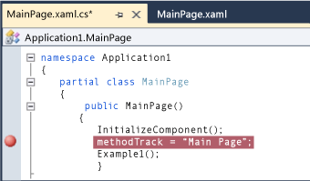
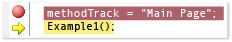
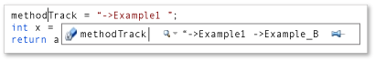
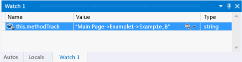
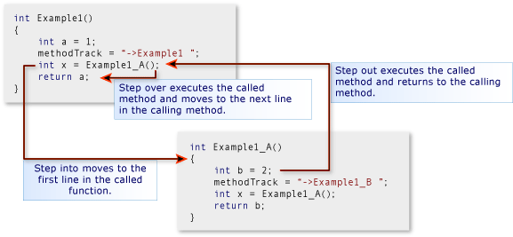
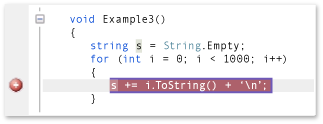
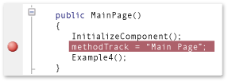
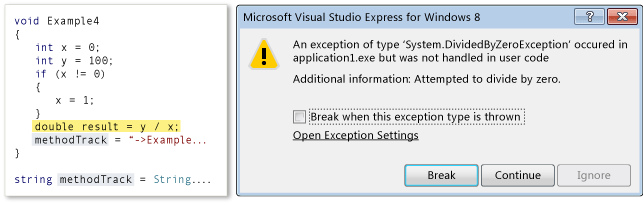
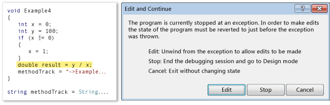

# Navigate a debugging session in Visual Studio (Xaml and C#)
[!INCLUDE[vs2017banner](../includes/vs2017banner.md)]

This quick start demonstrates how to navigate Visual Studio debug sessions and how to view and change the program state in a session.

 This quick start is for developers who are new to debugging with Visual Studio and for developers who want to learn more about navigating in a Visual Studio debug session. It does not teach the art of debugging itself. The methods in the sample code are designed only to demonstrate the debugging procedures described in this topic. The methods do not employ best practices of app or function design. In fact, you will quickly discover that the methods, and the app itself, do not do much of anything at all.

 The sections of this quick start were designed to be as independent as possible, so you can skip any section that includes information that you are already familiar with. You also aren't required to create a sample app; however, we do recommend it and have made the process as easy as possible.

 **Debugger keyboard shortcuts.** Visual Studio debugger navigation is optimized both for the mouse and the keyboard. Many of the steps in this topic include the keyboard accelerator or shortcut key in a parenthetical remark. For example, (Keyboard: F5) indicates that typing the key F5 starts or continues execution of the debugger.

## In this topic
 You can learn how to:

- [Create the sample app](#BKMK_CreateTheApplication)

- [Set and run to a breakpoint, step into a method, and examine program data](#BKMK_StepInto)

- [Step into, over, and out of methods](#BKMK_StepIntoOverOut)

- [Set a conditional breakpoint, run to the cursor, and visualize a variable](#BKMK_ConditionCursorVisualize)

- [Edit and continue, recover from an exception](#BKMK_EditContinueRecoverExceptions)

##  Create the sample app
 Debugging is about code, so the sample app uses the framework of the Windows Store app only to create a source file in which you can see how navigating a debug session works and how to examine and change program state. All of the code that you will invoke is called from the constructor of the main page; no controls are added and no events are handled.

 **Create a default C# Windows Store app.** Open Visual Studio. On the home page, choose the **New Project** link. On the New Project dialog box, choose **Visual C#** in the **Installed** list and then choose **Windows Store**. In the list of project templates, choose **Application**. Visual Studio creates a new solution and project and displays the MainPage.xaml designer and XAML code editor.

 **Open the MainPage.xaml.cs source file.** Right-click anywhere in the XAML editor and choose **View Code**. The MainPage.xaml.cs code-behind file is displayed. Note that only one method, the `MainPage()` constructor, is listed in the file.

 **Replace the MainPage constructor with the sample code.** Delete the MainPage() method. Follow this link: [Debugger navigation sample code (Xaml and C#)](../debugger/debugger-navigation-sample-code-xaml-and-csharp.md), and then copy the code listed in the C# section to the clipboard. (Choose **Back** in the browser or help viewer to return to this quick start page.) In the Visual Studio editor, paste the code in the `partial class MainPage` block. Choose CTRL + s to save the file.

 You can now follow along with the examples in this topic.

##  Set and run to a breakpoint, step into a method, and examine program data
 The most common way that you can start a debug session is to choose **Start Debugging** from the **Debug** menu (Keyboard: F5). Execution begins and continues until a breakpoint is reached, you manually suspend execution, an exception occurs, or the app ends.

 When execution is suspended in the debugger, you can view the value of an active variable in a data tip by hovering the mouse over the variable. You can also open the Locals and Autos windows to see lists of the active variables and their current values. Adding one or more variables to a watch window lets you focus on the value of the variables as the app continues execution.

 After you suspend execution of the app (which is also called breaking into the debugger), you control the way the rest of the program code is executed. You can continue line by line, moving from a method call to the method itself, or you can execute a called method in a single step. These procedures are called stepping through the app. You can also resume the standard execution of the app, running to the next breakpoint that you have set, or to the line where you positioned your cursor. You can stop the debug session at any time. The debugger is designed to perform the necessary clean-up operations and exit execution.

### Example 1
 In this example, you set a breakpoint in the MainPage constructor of the MainPage.xaml.cs file, step into the first method, view variable values and then stop debugging.

 **Set a breakpoint.** Set a breakpoint at the statement `methodTrack = "Main Page";` in the MainPage constructor. Choose the line in the shaded gutter of the source code editor (Keyboard: Position the cursor on the line and choose the F9 key).

 

 The breakpoint icon appears in the gutter.

 **Run to the breakpoint.** Start the debug session by choosing **Start Debugging** on the **Debug** menu (Keyboard: F5).

 The app begins executing and suspends execution immediately before the statement at which you set the breakpoint. The current line icon in the gutter identifies your location and the current statement is highlighted.

 

 You are now in control of the execution of the app and can examine the program state as you step through the program statements.

 **Step into the method.** On the **Debug** menu, choose **Step Into** (Keyboard: F11).

 

 Note that the debugger moves to the next line, which is a call to the Example1 method. Choose Step Into again. The debugger moves to the entry point of the Example1 method. This indicates that the method has been loaded on the call stack and the memory for local variables have been allocated.

 When you step into a line of code, the debugger performs one of the following actions:

- If the next statement is not a call to a function in your solution, the debugger executes the statement, moves to the next statement, and then suspends execution.

- If the statement is a call to a function in your solution, the debugger moves to the entry point of the called function and then suspends execution.

  Continue to step into the statements of Example1 until you have reached the exit point. The debugger highlights the closing curly brace of the method.

  **Examine variable values in data tips.** When you hover the mouse over a variable name, the name, value, and type of the variable is displayed in a data tip.

  

  Hover the mouse over the variable `a`. Note the name, value, and data type. Hover the mouse over the variable `methodTrack`. Again, note the name, value, and data type.

  **Examine variable values in the Locals window.** On the **Debug** menu, point to **Windows**, and then choose **Locals**. (Keyboard: Alt+4).

  

  The Locals windows is a tree view of the parameters and variables of the function. The properties of an object variable are child nodes of the object itself. The `this` variable is a hidden parameter in every object method that represents the object itself. In this case, it represents the MainPage class. Because `methodTrack` is a member of the MainPage class, its value and data type are listed in a line underneath `this`. Expand the `this` node to view the `methodTrack` information.

  **Add a watch for the methodTrack variable.** The `methodWatch` variable is used throughout this quick start to show the methods called in the examples. To make it easier to view the value of the variable, add it to a watch window. Right-click the variable name in the Locals window and then choose **Add Watch**.

  

  You can watch multiple variables in a watch window. The values of watched variables, like values in the Locals and data tip windows, are updated whenever execution is suspended. You can also add variables to the watch window from the code editor. Select the variable to watch, right-click, and then choose **Add Watch**.

##  Step into, over, and out of methods
 In contrast to stepping into a method called by a parent method, stepping over a method executes the child method and then suspends execution in the calling method as the parent resumes. You might step over a method when you are familiar with the way the method works and are sure that its execution will not affect the issue that you are investigating.

 Stepping over a line of code that doesn't contain a method call executes the line just like stepping into the line.

 Stepping out of a child method continues execution of the method and then suspends execution after the method returns to its calling method. You might step out of a long function when you have determined that the rest of the function is not significant.

 Both stepping over and stepping out of a function execute the function.

 

### Example 2
 In this example, you step into, over, and out of methods.

 **Call the Example2 method in the MainPage constructor.** Edit the MainPage constructor and replace the line following `methodTrack = String.Empty;` with `Example2();`.

 

 **Run to the breakpoint.** Start the debug session by choosing **Start Debugging** on the **Debug** menu (Keyboard: F5). The debugger suspends execution at the breakpoint.

 **Step over the line of code.** On the **Debug** menu, choose **Step Over** (Keyboard: F10). The debugger executes the `methodTrack = "MainPage";` statement in the same manner as stepping into the statement.

 **Step into Example2 and Example2_A.** Choose the F11 key to step into the Example 2 method. Continue to step into the Example2 statements until you reach the line `int x = Example2_A();`. Again, step into this line to move to the entry point of Example2_A. Continue to step into each statement of Example2_A until you return to Example2.

 

 **Step over a function.** Note that the next line in Example2, `int y = Example2_A();` is basically the same as the previous line. You can safely step over this line. Choose the F10 key to move from the resumption of Example2 to this second call to Example2_A. Choose F10 to step over this method. Note that the `methodTrack` string indicates the Example2_A method was executed twice. You will also notice that the debugger immediately moves to the next line. It does not suspend execution at the point Example2 resumes.

 **Step out of a function.** Choose the F11 key to step into Example2_B method. Note that Example2_B is not very different from Example2_A. To step out of the method, choose **Step Out** on the **Debug** menu (Keyboard: Shift + F11). Note that the `methodTrack` variable indicates that Example2_B was executed and that the debugger has returned to the point where Example2 resumes.

 **Stop debugging.** On the Debug menu, choose Stop Debugging (Keyboard: Shift+F5). This ends your debug session.

##  Set a conditional breakpoint, run to the cursor, and visualize a variable
 A conditional breakpoint specifies a condition that causes the debugger to suspend execution. The condition is specified by any code expression that can be evaluated as true or false. For example, you might use a conditional breakpoint to examine the program state in a frequently called method only when a variable reaches a certain value.

 Running to the cursor is like setting a one-time breakpoint. When execution is suspended, you can select a line in the source and resume execution until the selected line is reached. For example, you might be stepping through a loop in a method and determine that the code in the loop is performing correctly. Rather than stepping through every iteration of the loop, you can run to the cursor that is positioned after the loop is executed.

 Sometimes, it's difficult to view a variable value in the row of data tip or variable window. The debugger can display strings, HTML, and Xml in a text visualizer that presents a formatted view of the value in a scrollable window.

### Example 3
 In this example, you set a conditional breakpoint to break at a specific iteration of a loop, then run to the cursor that is positioned after the loop. You also view the value of a variable in a text visualizer.

 **Call the Example3 method in the MainPage constructor.** Edit the MainPage constructor and replace the line following `methodTrack = String.Empty;` with the line `Example3();`.

 

 **Run to the breakpoint.** Start the debug session by choosing **Start Debugging** on the **Debug** menu (Keyboard: F5). The debugger suspends execution at the breakpoint in the MainPage method.

 **Step into the Example3 Method.** Choose **Step Into** on the **Debug** menu (Keyboard: F11) to move to the entry point of the Example3 method. Continue stepping into the method until you have iterated one or two loops of the `for` block. Note that it would take you a long time to step through all 1000 iterations.

 **Set a conditional breakpoint.** In the left gutter of the code window, right-click the line `x += i;` and then choose **Condition**. Choose the **Condition** check box, and then type `i == 500;` in the text box. Choose the **Is true** option and choose **OK**. The breakpoint allows you to check the value at the 500th iteration of the `for` loop.

 

 You can identify a conditional breakpoint icon by its white cross.

 

 **Run to the breakpoint.** On the Debug menu, choose Continue (Keyboard: F5). In the Locals window, confirm that the current value of `i` is 500. Note that the variable `s` is represented as single line and is much longer than the window.

 **Visual a string variable.** Click the magnifying glass icon in the **Value** column of the `s`.

 The Text Visualizer window appears and the value of the string is presented as a multi-line string.

 **Run to the cursor.** Right-click the line `methodTrack += "->Example3";` and then choose **Run to Cursor** (Keyboard: Move the cursor to the line; Ctrl + F10). The debugger completes the loop iterations and then suspends execution at the line.

 **Stop debugging.** On the Debug menu, choose Stop Debugging (Keyboard: Shift+F5). This ends your debug session.

##  Edit and continue, recover from an exception
 In some circumstances, when you break into code in the Visual Studio debugger you have the opportunity to change the value of variables and even the logics of statements. This functionality is called edit and continue.

 Edit and continue can be especially useful when you break at an exception. Instead of having to stop and restart debugging a long and involved procedure to avoid the exception, you can "unwind" the exception to move execution to the point immediately before the exception occurred, and then change the offending variable or statement and continue with the current debugging session in state that does not throw an exception.

 Although you can use edit and continue in a wide variety of situations, the particular conditions that don't support edit and continue are difficult to specify because the conditions depend on the programming language, the current state of the program stack, and the ability of the debugger to change state without corrupting the process. The best way to determine if an edit change is supported is to just try it; the debugger lets you know immediately if the change is not supported.

### Example 4
 In this example, you run the debugger to an exception, rewind the exception, correct the logic of the method, and then change the value of a variable so that you can continue executing the method.

 **Call the Example4 method in the MainPage constructor.** Edit the MainPage() constructor and replace the line following `methodTrack = String.Empty;` with the line `Example4();`.

 

 **Run to the exception.** Start the debug session by choosing **Start Debugging** on the **Debug** menu (Keyboard: F5). Press F5 again to resume execution. The debugger suspends execution at the exception in the Example4 method and displays an exception dialog box.

 

 **Change the program logic.** It's obvious that the mistake is in the `if` condition: the value of `x` should be changed when `x` equals 0; not when `x` is not equal to zero. Choose **Break** to fix the logic of the method. When you try to edit the line, another dialog box appears.

 

 Choose **Edit** and then change the line `if (x != 0)` to `if (x == 0)`. The debugger persists changes to the program logic to the source file.

 **Change the variable value.** Examine the value of `x` in a data tip or in the Locals window. It is still 0 (zero). If you try to execute the statement that caused the original exception, it will only throw again. You can change the value of `x`. In the Locals window, double-click the **Value** column of the **x** row. Change the value from 0 to 1.

 

 Choose the F11 key to step into the statement that previously threw an exception. Note that the line executes without an error. Choose F11 again.

 **Stop debugging.** On the **Debug** menu, choose **Stop Debugging** (Keyboard: Shift+F5). This ends your debug session.

## See Also
 [Start a debug session (VB, C#, C++ and XAML)](../debugger/start-a-debugging-session-for-a-store-app-in-visual-studio-vb-csharp-cpp-and-xaml.md)
 [Trigger suspend, resume, and background events for Windows Store)](../debugger/how-to-trigger-suspend-resume-and-background-events-for-windows-store-apps-in-visual-studio.md)
 [Debug apps in Visual Studio](../debugger/debug-store-apps-in-visual-studio.md)
