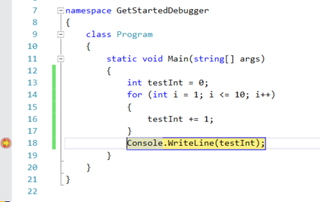
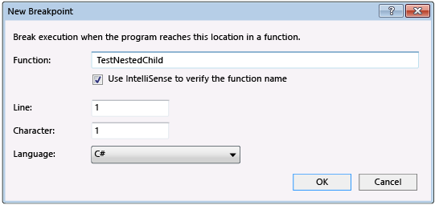
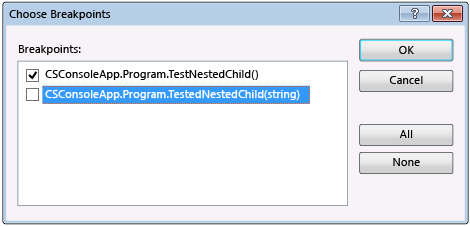

# Navigating through Code with the Debugger
[!INCLUDE[vs2017banner](../includes/vs2017banner.md)]

Get familiar with commands and shortcuts to navigate code in the debugger and that will make it faster and easier to find and resolve issues in your app. While you navigate code in the debugger, you can [inspect the state of your app](https://msdn.microsoft.com/library/mt243867.aspx#BKMK_Inspect_Variables) or learn more about its execution flow.  
  
## Start debugging  
 Often, you start a debugging session using **F5** (**Debug** / **Start Debugging**). This command starts your app with the debugger attached.  
  
 The green arrow also starts the debugger (same as **F5**).  
  
   
  
 A few other ways that you can start the app with the debugger attached include **F11** ([step into code](#BKMK_Step_into__over__or_out_of_the_code)),  **F10** ([step over code](#BKMK_Step_over_Step_out)), or by using **Run to Cursor**.  See the other sections in this topic for info on what these options do.  
  
 When you debug, the yellow line shows you the code that will execute next.  
  
   
  
 While debugging, you can switch between commands like **F5**, **F11** and use other features described in this topic (like breakpoints) to quickly get to the code you want to look at.  
  
 Most debugger features, such as viewing variable values in the Locals window or evaluating expressions in the Watch window, are available only while the debugger is paused (also called *break mode*). When the debugger is paused, your app state is suspended while functions, variables, and objects remain in memory. While in break mode, you can examine the elements' positions and states to look for violations or bugs. For some project types, you can also make adjustments to the app while in break mode.  
  
## <a name="BKMK_Step_into__over__or_out_of_the_code"></a> Step into code, line by line  
 To stop on each line of code (each statement) while debugging, use the **F11** keyboard shortcut (or **Debug** / **Step Into** on the menu).  
  
> [!TIP]
> As you execute each line of code, you can hover over variables to see their values, or use the [Locals](../debugger/autos-and-locals-windows.md) and [Watch](../debugger/autos-and-locals-windows.md) windows to watch their values change.  
  
 Here are some details about the behavior of **Step Into**:  
  
- On a nested function call, **Step Into** steps into the most deeply nested function. If you use **Step Into** on a call like `Func1(Func2())`, the debugger steps into the function `Func2`.  
  
- The debugger actually steps through code statements rather than physical lines. For example an `if` clause can be written on one line:  
  
  ```csharp  
  int x = 42;  
  string s = "Not answered";  
  if( int x == 42) s = "Answered!";  
  ```  
  
  ```vb  
  Dim x As Integer = 42  
  Dim s As String = "Not answered"  
  If x = 42 Then s = "Answered!"  
  ```  
  
   When you step into this line, the debugger treats the condition as one step and the consequence as another (In this example, the condition is true).  
  
  To visually trace the call stack while stepping into functions, see [Map methods on the call stack while debugging](../debugger/map-methods-on-the-call-stack-while-debugging-in-visual-studio.md).  
  
## <a name="BKMK_Step_over_Step_out"></a> Step through code, skipping functions  
 When running code in the debugger, often you will realize that you don't need to see what happens in a particular function (you don't care about it or you know it works, like well-tested library code). Use these commands to skip through code (the functions still execute, of course, but the debugger skips over them).  
  
|Keyboard Command|Menu Command|Description|  
|----------------------|------------------|-----------------|  
|**F10**|**Step Over**|If the current line contains a function call, **Step Over** runs the code then suspends execution at the first line of code after the called function returns.|  
|**Shift+F11**|**Step Out**|**Step Out** continues running code and suspends execution when the current function returns (the debugger skips through the current function).|  
  
> [!TIP]
> If you need to find the entry point in your app, start with **F10** or **F11**. These commands are often helpful when you are inspecting your app state or trying to find out more about its execution flow.  
  
## <a name="BKMK_Break_into_code_by_using_breakpoints_or_Break_All"></a> Run to a specific location or function  
 Often the preferred method of debugging code, these methods are useful when you know exactly what code you want to inspect, or at least you know where you want to start debugging.  
  
- **Set breakpoints in the code**  
  
     To set a simple breakpoint in your code, open the source file in the Visual Studio editor. Set the cursor at the line of code where you want to suspend execution, and then right-click in the code window to see the context menu and choose **Breakpoint / Insert Breakpoint** (or press **F9**). The debugger suspends execution right before the line is executed.  
  
       
  
     Breakpoints in Visual Studio provide a rich set of additional functionality, such as conditional breakpoints and tracepoints. See [Using Breakpoints](../debugger/using-breakpoints.md).  
  
- **Run to the cursor location**  
  
     To run to the cursor location, place the cursor on an executable line of code in a source window. On the editor's context menu (right-click in the editor), choose **Run to Cursor**. This is like setting a temporary breakpoint.  
  
- **Manually break into code**  
  
     To break into the next available line of code in an executing app, choose **Debug**, **Break All** (keyboard: **Ctrl+Alt+Break**).  
  
     If you break while executing code without corresponding source or symbol (.pdb) files), the debugger displays a **Source Files Not Found** or a **Symbols Not Found** page that can help you find the appropriate files. See [Specify Symbol (.pdb) and Source Files](../debugger/specify-symbol-dot-pdb-and-source-files-in-the-visual-studio-debugger.md). If you can't access the supporting files, you can still debug the assembly instructions in the Disassembly window.  
  
- **Run to a function on the call stack**  
  
     In the **Call Stack** window (available while debugging), select the function, right-click and  choose **Run to Cursor**. To visually trace the call stack, see [Map methods on the call stack while debugging](../debugger/map-methods-on-the-call-stack-while-debugging-in-visual-studio.md).  
  
- **Run to a function specified by name**  
  
     You can tell the debugger to run your application until it reaches a specified function. You can specify the function by name or you can choose it from the call stack.  
  
     To specify a function by name, choose **Debug**, **New Breakpoint**, **Break at Function**, then enter the name of the function and other identifying information.  
  
       
  
     If the function is overloaded or is in multiple namespace, you can choose the functions that you want in the **Choose Breakpoints** dialog box.  
  
       
  
## <a name="BKMK_Set_the_next_statement_to_execute"></a> Move the pointer to change the execution flow  
 While the debugger is paused, you can move the instruction pointer to set the next statement of code to be executed. A yellow arrowhead in the margin of a source or Disassembly window marks the location of the next statement to be executed. By moving this arrowhead, you can skip over a portion of code or return to a line previously executed. You can use this for situations such as skipping a section of code that contains a known bug.  
  
   
  
 To set the next statement to execute, use one of these procedures:  
  
- In a source window, drag the yellow arrowhead to a location where you want to set the next statement in the same source file  
  
- In a source window, set the cursor on the line that you want to execute next, right-click and choose **Set Next Statement**.  
  
- In the Disassembly window, set the cursor on the assembly instruction that you want to execute next, right-click an and choose **Set Next Statement**.  
  
> [!CAUTION]
> Setting the next statement causes the program counter to jump directly to the new location. Use this command with caution:  
> 
> - Instructions between the old and new execution points are not executed.  
>   - If you move the execution point backwards, intervening instructions are not undone.  
>   - Moving the next statement to another function or scope usually results in call-stack corruption, causing a run-time error or exception. If you try moving the next statement to another scope, the debugger opens a dialog box with a warning and gives you a chance to cancel the operation. In Visual Basic, you cannot move the next statement to another scope or function.  
>   - In native C++, if you have run-time checks enabled, setting the next statement can cause an exception to be thrown when execution reaches the end of the method.  
>   - When Edit and Continue is enabled, **Set Next Statement** fails if you have made edits that Edit and Continue cannot remap immediately. This can occur, for example, if you have edited code inside a catch block. When this happens, you’ll see an error message that tells you that the operation is not supported.  
> 
> [!NOTE]
> In managed code, you cannot move the next statement under the following conditions:  
> 
> - The next statement is in a different method than the current statement.  
>   - Debugging was started by using Just-In-Time debugging.  
>   - A callstack unwind is in progress.  
>   - A System.StackOverflowException or System.Threading.ThreadAbortException exception has been thrown.  
  
 You cannot set the next statement while your application is actively running. To set the next statement, the debugger must be in break mode.  
  
## Step into non-user code  
 By default, the debugger tries to show you only your app code while debugging, which is determined by a debugger setting called *Just My Code*. (See [Just My Code](../debugger/just-my-code.md) to see how this works for different project types and languages and how you might customize the behavior.) However, sometimes while you are debugging, you might want to look at framework code, third-party library code, or calls to the operating system (system calls).  
  
 You can turn off Just My Code  by going to **Tools** / **Options** / **Debugging** and clear the **Enable Just My Code** checkbox.  
  
 When Just My Code is disabled, the debugger can step into non-user code and non-user code appears in the debugger windows.  
  
> [!NOTE]
> Just My Code is not supported for device projects.  
  
 **Step into system calls**  
  
 If you have loaded debugging symbols for system code and Just My Code is not enabled, you can step into a system call just as you can any other call.  
  
 To access Microsoft symbol files, see [Use symbol servers to find symbol files not on your local machine](../debugger/specify-symbol-dot-pdb-and-source-files-in-the-visual-studio-debugger.md#BKMK_Use_symbol_servers_to_find_symbol_files_not_on_your_local_machine) in the [Specify Symbol (.pdb) and Source Files](../debugger/specify-symbol-dot-pdb-and-source-files-in-the-visual-studio-debugger.md) topic.  
  
 To load symbols for a specific system component while you are debugging:  
  
1. Open the Modules window (keyboard: **Ctrl+Alt+U**).  
  
2. Select the module that you want to load symbols for.  
  
     You can tell which modules have symbols loaded by looking at the **Symbol Status** column.  
  
3. Choose **Load Symbols** on the context menu.  
  
## <a name="BKMK_Step_into_properties_and_operators_in_managed_code"></a> Step into properties and operators in managed code  
 The debugger steps over properties and operators in managed code by default. In most cases, this provides a better debugging experience. To enable stepping into properties or operators, choose **Debug** / **Options**. On the **Debugging** / **General** page, clear the **Step over properties and operators (Managed only)** check box
