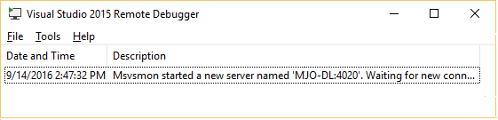
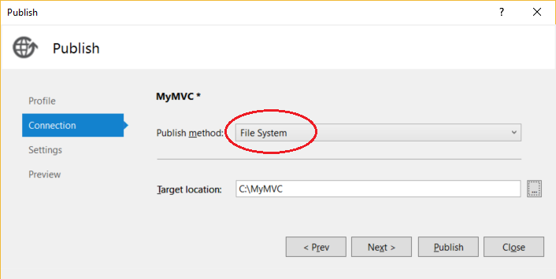
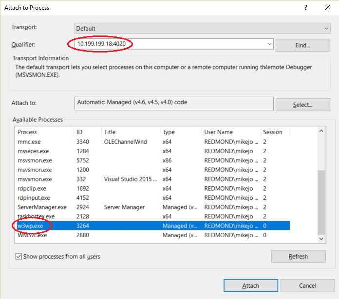

# Remote Debugging ASP.NET on a Remote IIS Computer
[!INCLUDE[vs2017banner](../includes/vs2017banner.md)]

You can deploy an ASP.NET Web application to a Windows Server computer with IIS, and set it up for remote debugging. This guide explains how to set up and configure a Visual Studio 2015 MVC 4.5.2 application, deploy it to IIS, and attach the remote debugger from Visual Studio.

These procedures have been tested on these server configurations:
* Windows Server 2012 R2 and IIS 10
* Windows Server 2008 R2 and IIS 7.5

Most of the information in this article also applies to remote debugging an ASP.NET Core application, except that deployment of ASP.NET core apps is different and requires extra steps. To deploy an ASP.NET Core app to IIS, You will need to complete all sections of [this article](https://docs.asp.net/en/latest/publishing/iis.html).

## Prerequisites: install the remote debugger on the Windows Server computer

For instructions about how to download the remote debugger to the Windows Server computer, see [Remote Debugging](../debugger/remote-debugging.md).

To do remote debugging of ASP.NET applications, you can either run the remote debugger application as an Administrator or start the remote debugger as a service. Details about how to run the remote debugger as a service can be found in [Remote Debugging](../debugger/remote-debugging.md).

Once it is installed, make sure the remote debugger is running on the target machine. (If it's not, search for **Remote Debugger** in the **Start** menu. ) The remote debugger window looks like this. (4020 is the default port number)


  
## Create the application on the Visual Studio computer  
  
1. Create a new MVC ASP.NET application. (**File / New / Project**, then select **Visual C# / Web / ASP.NET Web Application** . In the **ASP.NET 4.5.2** templates section, select **MVC**. Make sure that **Host in Cloud** is not selected under the Azure section. Name the project **MyMVC**.)
1. Open the  HomeController.cs file, and set a breakpoint in the `About()` method.
1. In the **Solution Explorer**,  right-click the project node and select **Publish**.
1. For **Select a publish target**, select **Custom** and name the profile **MyMVC**. Click **Next**.
1. On the **Connection** tab, set the **Publish method** field to **File System** and  the **Target location** field to a local directory. Click **Next**.

    
1. Set the configuration to **Debug**. Click **Publish**.

    
    
    The application should be published to the local directory.

## <a name="BKMK_deploy_asp_net"></a> Deploy the ASP.NET application on the Windows Server remote computer

 This section assumes that the Windows Server computer already has IIS enabled. On Windows Server 2012 R2, see [IIS Configuration](https://docs.asp.net/en/latest/publishing/iis.html#iis-configuration) to enable IIS. (You can skip other sections of this article unless you are trying to deploy an ASP.NET Core app. For ASP.NET Core, follow the steps in the article to deploy the app instead of the steps described here.)
1. Install ASP.NET
    Use the Web Platform Components to install ASP.NET 4.5 (from the Server node in Windows Server 2012 R2, choose **Get New Web Platform Components** and then search for ASP.NET)

    

    On Windows Server 2008 R2, install ASP.NET 4 instead using this command:
     **C:\Windows\Microsoft.NET\Framework(64)\v4.0.30319\aspnet_regiis.exe -ir**
1. Copy the ASP.NET project directory from the Visual Studio computer  to a local directory (which we'll call **C:\Publish**) on the Windows Server computer. You can copy the project manually, use Xcopy, Web Deploy, Robocopy, Powershell, or other options.

    > [!CAUTION]
    > If you need to make changes to the code or rebuild, you must republish and repeat this step. The executable you copied to the remote machine must exactly match your local source and symbols.
1. Make sure that the web.config file lists the correct version of the .NET Framework.  For example, the .NET Framework version installed  by default on Windows Server 2008 R2 is 4.0.30319, but we created an ASP.NET 4.5.2 version. If an ASP.NET 4.0 app is running on the Windows Server computer, you need to change the version:
  
    ```xml
    <system.web>
        <authentication mode="None" />  
        <compilation debug="true" targetFramework="4.0.30319" />
        <httpRuntime targetFramework="4.0.30319" />
      </system.web>
  
    ```

1. Open the **Internet Information Services (IIS) Manager** and go to **Sites**.
1. Right-click the **Default Web Site** node and select **Add Application**.
1. Set the **Alias** field to **MyMVC** and the Application pool field to **ASP.NET v4.0** (ASP.NET 4.5 is not an option for the Application pool). Set the **Physical path** to **C:\Publish** (where you copied the ASP.NET project directory).

    >[!NOTE] 
    > For ASP.NET Core apps, set the Application pool field to **No Managed Code**.
1. Test the deployment by right-clicking **Default Web Site** and select **Browse**.
    If you successfully deployed the app, you will see the web page.

## Attach to the ASP.NET application from the Visual Studio computer

1. On the Visual Studio computer, open the **MyMVC** solution.
1. In Visual Studio, click **Debug / Attach to Process** (**Ctrl + Alt + P**).
1. Set the Qualifier field to **\<remote computer name>:4020**.
1. Click **Refresh**.
    You should see some processes appear in the **Available Processes** window.

    If you don't see any processes, try using the IP address instead of the remote computer name (the port is required). Use `ipconfig` in a command line to get the IPv4 address.
1. Check  **Show processes from all users**.
1. Look for **w3wp.exe** and click **Attach**.

     To quickly find the process name, type the first letter of the process.
     
    >[!NOTE]
    > For an ASP.NET Core app, choose the dnx.exe process instead of w3wp.exe. (This process name may change in an upcoming release.)

    

1. Open the remote computer's website. In a browser, go to **http://\<remote computer name>**.
    
    You should see the ASP.NET web page.
1. In the ASP.NET web page, click the link to the **About** page.

    The breakpoint should be hit in Visual Studio.
