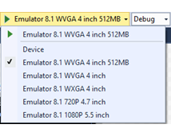
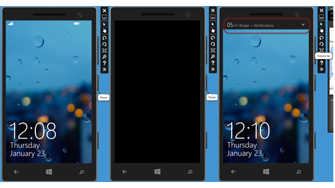
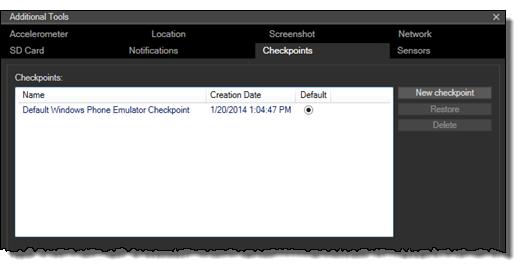
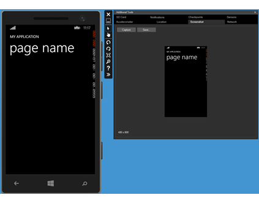

# Run Windows Phone apps in the emulator
[!INCLUDE[vs2017banner](../includes/vs2017banner.md)]

The Windows Phone emulator provides a virtualized environment in which you can debug and test Windows Phone apps on your computer without a physical device. You can simulate common touch and rotation events and choose the physical screen size and resolution that you want to emulate. You can also test many commonly used features, such as location, networking, notifications, sensors, the accelerometer, and the optional SD card.  
  
 For more info about the features that you can test in the emulator, see [Test app features in Windows Phone Emulator](https://msdn.microsoft.com/c1b2b0ec-b8cc-4a98-84c1-701428e45cb1).  
  
 Together with Visual Studio, the emulator provides a complete environment in which you can design, develop, debug, and test Windows Phone apps.  
  
##  Run a Windows Phone app in the emulator  
 While you’re developing a Windows Phone app, you can use Windows Phone Emulator to deploy and test your app quickly. We recommend that you test your app on an actual Windows Phone device, however, before you publish your app in the Windows Phone Store. This lets you experience your app as users will experience it.  
  
 When you run a Windows Phone app for the first time in Windows Phone Emulator, the following events occur:  
  
1. The emulator starts.  
  
2. The emulator loads the Windows Phone operating system.  
  
3. The emulator displays the Windows Phone Start screen.  
  
4. Your app is deployed to the emulator.  
  
5. Your app runs on the emulator.  
  
   If the selected emulator is already running, your app is deployed and started in the running emulator. Only one instance of each emulator can run at a time.  
  
> [!TIP]
> When you’re testing your app on the emulator, leave the emulator open between debugging sessions so you can run your app again quickly.  
  
###  Run an app from Visual Studio  
  
##### To deploy and run an app from Visual Studio  
  
1. In Visual Studio, open a Windows Phone project.  
  
2. On the **Standard** toolbar, select one of the emulator options.  
  
       
  
3. To deploy and run your app with debugging, on the **Debug** menu, click **Start Debugging**, or press F5.  
  
     To deploy and run your app without debugging, on the **Debug** menu, click **Start without Debugging**, or press Ctrl+F5.  
  
     Your app is deployed and started.  
  
     To deploy your app without running it, on the **Build** menu, click **Deploy Solution**.  
  
##### To stop a running app  
  
- To stop a running app, do one of the following:  
  
  - In Visual Studio, on the **Debug** menu, click **Stop Debugging**, or press Shift+F5.  
  
  - In the emulator, press the **Back** button to exit the app. If the active page of the app was not the app’s start page, you may have to press the **Back** button more than once.  
  
    The app exits and the Start screen opens. This ends the current debugging session.  
  
##### To restart an app without debugging  
  
1. In the emulator, on the Start screen, swipe left to view the app list.  
  
2. In the app list, tap the app icon. The app restarts without debugging.  
  
##### To deactivate a running app  
  
1. Before you run your app, in Visual Studio, right-click the project in Solution Explorer, and then select **Properties** to open **Project Designer**.  
  
2. In **Project Designer**, on the **Debug** page, leave the **Tombstone upon deactivation while debugging** check box unchecked if you want the app to go into a dormant state when deactivated. Check the check box if you want the app to be tombstoned when deactivated.  
  
3. On the **Debug** menu, click **Start Debugging**, or press F5 to run the app.  
  
4. In the emulator, press the **Start** button. The Start screen appears and the app is deactivated. The app either goes into a dormant state or it is tombstoned, depending on the setting of the **Tombstone upon deactivation while debugging** check box.  
  
##### To reactivate a dormant or tombstoned app  
  
- In the emulator, press the **Back** button to return to the app. If you navigated to other pages or opened another app, you may have to press the **Back** button more than once to reactivate the app.  
  
     The debugging session resumes. If the debugger has detached from the app, you may have to press F5 to resume the debugging session.  
  
###  Run an app with the Application Deployment tool  
 You can also use the Windows Phone Application Deployment tool (**AppDeploy.exe**) to run your app in the emulator. This tool is a stand-alone app that is installed when you install the Windows Phone development tools.  
  
 For more info, see [Deploy Windows Phone 8.1 apps with the Application Deployment tool](https://msdn.microsoft.com/library/23700f82-1399-44d9-bc0c-714be4a48ee6).  
  
##  Configure the Windows Phone emulator with the emulator toolbar  
 This table shows the configuration buttons available on the emulator toolbar.  
  
|Toolbar buttons|Configuration options|  
|---------------------|---------------------------|  
||**Configure single-point or multi-point input**   When you enable multi-point input, you can right-click to move the touch points without touching the screen. Then you can left-click to move both touch points simultaneously.|  
||**Configure the orientation of the emulator**   You can change the orientation in Windows Phone Emulator to one of three orientations: portrait, landscape left, or landscape right. The size of the emulator does not change when you change the orientation.   To change the orientation, click the **Rotate Left** button or the **Rotate Right** button.|  
||**Configure the size of the emulator**   You can change the size of the emulator on the host computer screen. The dots per inch (DPI) for the emulator is based on the host monitor DPI, regardless of the zoom value.   -   To fit the emulator to the screen, click the **Fit to Screen** button. -   To change the zoom setting, click the **Zoom** button. The **Zoom** dialog box opens. In the **Zoom** dialog box, enter a zoom value between 33 and 100.|  
  
##  Use the simulated hardware buttons on the emulator  
 Simulate the use of a phone's hardware buttons by using the simulated hardware buttons on the right side of the emulator screen.  
  
- Click the **Power** button to simulate turning the display off and on. Click and hold to simulate turning the phone off.  
  
- Click the **Volume Up** or **Volume Down** button to simulate changing the volume of the phone's speaker for phone calls and notifications.  
  
- The **Camera** button launches the camera app. You can simulate taking a photo or a video by using the controls in the camera app.  
  
  The following screenshot shows the simulated hardware buttons.  
  
1. The left image displays the Start screen on the emulator.  
  
2. The middle image displays the emulator after tapping the **Power** button to turn the display off.  
  
3. The right image displays the emulator screen after tapping the **Volume Up** button to increase the volume.  
  
     
  
##  Use the computer keyboard with the emulator  
 The emulator supports mapping of the hardware keyboard on your development computer to the keyboard on a Windows Phone. The behavior of the keys is the same as on a Windows Phone device.  
  
 By default, the hardware keyboard is not enabled. This implementation is equivalent to a sliding keyboard that must be deployed before you can use it. Before you enable the hardware keyboard, the emulator accepts key input only from the control keys.  
  
 Special characters on the keyboard of a localized version of a Windows development computer are not supported by the emulator. To enter special characters that are present on a localized keyboard, use the Software Input Panel (SIP) instead.  
  
 To use your computer’s keyboard in the emulator, press the PAGE UP key or the PAUSE/BREAK key (Windows 8/8.1 emulator) or F4 (Windows 10 emulator).  
  
 To stop using your computer’s keyboard in the emulator, press the PAGE DOWN key or the PAUSE/BREAK key (Windows 8/8.1 emulator) or F4 (Windows 10 emulator).  
  
 The following table lists the keys on a hardware keyboard that you can use to emulate the buttons and other controls on a Windows Phone.  
  
|Computer hardware key|Windows Phone hardware button|Notes|  
|---------------------------|-----------------------------------|-----------|  
|F1|BACK|Long presses work as expected.|  
|F2|START|Long presses work as expected.|  
|F3|SEARCH||  
|F4|In the Windows 10 emulator, toggles between using the local computer’s keyboard and not using the local computer’s keyboard.|Not applicable in the Windows 8/8.1 emulator.|  
|F5|Not applicable.||  
|F6|CAMERA HALF|A dedicated camera button that is pressed halfway.|  
|F7|CAMERA FULL|A dedicated camera button.|  
|F8|Not applicable.||  
|F9|VOLUME UP||  
|F10|VOLUME DOWN||  
|F11|Not applicable.||  
|F12|POWER|Press the F12 key twice to enable the lock screen.   Long presses work as expected.|  
|ESC|BACK|Long presses work as expected.|  
|PAUSE/BREAK|Toggle Keyboard (windows 8/8.1 emulator only).|Not applicable for the Windows 10 emulator.|  
|PAGE UP|Enables the hardware keyboard (Windows 8/8.1 emulator only).|Not applicable for the Windows 10 emulator.|  
|PAGE DOWN|Disables the hardware keyboard (Windows 8/8.1 emulator only).|Not applicable for the Windows 10 emulator.|  
  
##  Save and load custom checkpoints  
 Save a snapshot of the emulator's state by using the **Checkpoints** tab of the emulator's **Additional Tools**. This feature is useful if you frequently test your app with the same data and settings.  
  
 For example, if your app requires several contacts, you can create the contact records one time and save a snapshot of the emulator. Otherwise you have to recreate the contact records every time you start the emulator.  
  
- Click **New checkpoint** to capture a new snapshot of the state of the emulator with the data and settings required to test your app again later. The new checkpoint is added to the **Checkpoints** list.  
  
   You can't capture a checkpoint while the debugger is attached to the emulator.  
  
- Select a checkpoint in the **Checkpoints** list to view info about the checkpoint.  
  
- Select the radio button in the **Default** column to make a saved checkpoint the default checkpoint for the active emulator.  
  
- Click **Restore** to restart the Windows Phone operating system on the emulator and load the selected snapshot.  
  
- Click **Delete** to delete a snapshot that you no longer need.  
  
  The original emulator image always appears as the first item in the **Checkpoints** list and cannot be changed or deleted. However you can select a different snapshot as the default emulator image.  
  
    
  
##  Capture screenshots in the emulator  
 You can create screenshots of your Windows Phone apps by using the screenshot tool from the Additional Tools window. The tool creates PNG files that match the resolution of the running emulator.  
  
   
  
#### To create an app screenshot by using the built-in emulator screenshot tool  
  
1. To optimize the quality of your screenshots, set the zoom level of the emulator to 100 percent. The higher you set the zoom level, the better the quality of the screenshot.  
  
2. Start your app in the emulator.  
  
3. On the emulator toolbar, click the expand button to open the **Additional Tools** window.  
  
4. Click the **Screenshot** tab.  
  
5. When your app is ready, click the **Capture** button.  
  
    The screenshot appears in the workspace.  
  
6. Click the **Save** button to open the **Save As** dialog box.  
  
7. Choose the location and **File name** that you want, and then click **Save**.  
  
8. Optionally, navigate to other pages in your app and capture additional screenshots.  
  
9. Launch an emulator with a different screen resolution to capture the same screenshots at a different resolution. If you ran your app with debugging, you have to stop debugging before you can run it again on another emulator.  
  
   Disable the frame rate counters on the emulator screen before you capture screenshots that will be submitted to the Windows Phone Store.  
  
#### To disable frame rate counters in the emulator before capturing screenshots  
  
- Specify a release build in Visual Studio. After specifying a release build, launch your app by selecting the **Deploy _[app name]_** link on the **Build** menu.  
  
- Alternately, you can comment out the line of code in the app.xaml.cs or app.xaml.vb file that sets the value of `EnableFrameRateCounter` to `true`.
