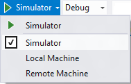
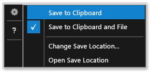

# Run Windows Store apps in the simulator
[!INCLUDE[vs2017banner](../includes/vs2017banner.md)]

The Visual Studio simulator for Windows Store apps is a desktop application that simulates a Windows Store app. You can run applications and simulate common touch and rotation events on your development computer. You can also choose the physical screen size and resolution that you want to emulate and simulate network connection properties.  
  
 The simulator provides an environment in which you can design, develop, debug, and test Windows Store apps. However, before you publish your app to the Windows Store, you should test your app on an actual device.  
  
 The Visual Studio simulator for Windows Store apps does not run in an isolated environment on your local machine. Therefore, errors that occur in the simulator, such as a non-recoverable system-wide error, can also affect the entire machine.  
  
 See [Run Windows Phone apps in the emulator](../debugger/run-windows-phone-apps-in-the-emulator.md) for Windows Phone information.  
  
> [!IMPORTANT]
> The Visual Studio 2015 simulator does not include the geolocation button. This is because the Windows 10 simulator does not include geolocation simulation. If you need to do this kind of simulation, you can use the Visual Studio 2013 simulator on Windows 8.1 or earlier operating systems.  
  
##  Set the simulator as the target  
 To run your Windows Store app in the simulator, select **Simulator** from the drop-down list next to the **Start Debugging** button on the debugger **Standard** toolbar.  
  
   
  
##  Choose an interaction mode  
 You can choose the following interaction modes  
  
-  Mouse mode: sets the interaction mode to mouse gestures. Mouse gestures include clicks, double-clicks, and drags.  
  
-  Start touch emulation: sets the interaction mode to touch gestures of a single finger. Single-finger events include tapping, dragging, and swiping.  
  
      The single target icon indicates the location of events in the simulator. Use the mouse to position the pointer.  
  
      Press the left mouse button to activate the touch mode. For example, click the button to simulate a tap, or press and hold the button as you drag or swipe.  
  
## Pinch and Zoom  
 Sets the interaction mode to pinch and zoom gestures of two fingers.  
  
-   

  - The double target icon indicates the location of two fingers on the device screen.  

  - Move the mouse to position the icons over the object on the device screen.  

  - Rotate the mouse wheel backward or forward to change the simulated distance of the two fingers before you pinch or zoom.  

-   

  - Press the left button and rotate the wheel backward (towards you) to zoom in (pinch).  

  - Press the left button and rotate the mouse wheel forward (away from you) to zoom out (zoom).  
  
## Object rotation  
 The **Touch emulation rotate** button sets the interaction mode to rotation gestures using two fingers.  
  
- Move the mouse to position the icons over the object on the device screen.  
  
  - Rotate the mouse wheel backward or forward to change the simulated orientation of the two fingers before you rotate the object.  

- Press the left button and rotate the wheel backward (towards you) to rotate the object counter-clockwise. As you rotate the mouse wheel, one of the two target icons rotates around the other to indicate the relative size of the rotation.  

  - Press the left button and rotate the mouse wheel forward (away from you) to rotate the object clockwise.  

##  Enable or disable Always on top mode  
 You can set the simulator window to always be on top of other windows. The **Toggle Topmost Window** button enables or disables the **Always on top** mode of the simulator window.  
  
##  Change the device orientation  
 You can switch the device orientation between portrait and landscape by rotating the simulator 90 degrees in any direction.  
  
> [!NOTE]
> The simulator does not respect [DisplayProperties.AutoRotationPreferences](https://go.microsoft.com/fwlink/?LinkId=249460) property of a project. For example, if your project sets the orientation to `Landscape`, and you then rotate the simulator to a portrait orientation, the simulator display image will also be rotated and resized. Test these settings on an actual device.  
  
> [!NOTE]
> If you rotate the simulator so that one edge of the simulator is larger than the screen it is displayed on, the simulator is automatically resized to fit within the screen. The simulator is not resized to its original size if you rotate it again.  
  
##  Change the simulated screen size and resolution  
 To change the simulated screen size and resolution, choose the **Change Resolution** button  on the palette and choose a new size and resolution from the list.  
  
 The screen size and resolution are listed as *Screen width inches, pixel width X pixel height*. Note that both the screen size and the resolution are simulated. Location co-ordinates on the simulator are translated to the co-ordinates of the selected device size and resolution.  
  
> [!NOTE]
> You can save scaled versions of bitmap images in your app and Windows will load the correct image for the current scale. For more information, see [Responsive Design 101](https://msdn.microsoft.com/library/windows/apps/dn958435.aspx). However, if you change the simulator resolution so that Windows picks a different image to fit the resolution, you have to stop and restart your debug session to view the new image.  
  
##  Capture a screenshot of your app for submission to the Windows Store  
 When you submit an app to the Windows app store, you must include screenshots of the app.  
  
> [!NOTE]
> The screenshot is saved at the current resolution of the simulator. To change the resolution, choose the **Change Resolution** button.  
  
- To create screenshots of your app from the simulator, choose the **Capture screenshot to clipboard** button.  
  
- To set the location where screenshots are located, choose the **Screenshot settings** button and choose the location from the shortcut menu.  
  
       
  
##  Simulate network connection properties  
 You can help your app’s users manage the cost of metered network connections by maintaining awareness of network connection cost or data plan status changes and enabling your app to use this information to avoid incurring additional costs for roaming or exceeding a specified data transfer limit. The [Windows.Networking.Connectivity](https://msdn.microsoft.com/library/windows/apps/windows.networking.connectivity.aspx) APIs lets you respond to [NetworkStatusChanged](https://msdn.microsoft.com/library/windows/apps/windows.networking.connectivity.networkinformation.networkstatuschanged.aspx) and [TriggerType](https://msdn.microsoft.com/library/windows/apps/windows.applicationmodel.background.systemtrigger.triggertype.aspx) events that sign. See [Quickstart: Managing metered network cost constraints](https://msdn.microsoft.com/library/windows/apps/Hh750310.aspx).  
  
 To debug or test your network cost-aware code, the simulator can mimic properties of a network that are exposed through the [ConnectionProfile](https://msdn.microsoft.com/library/windows/apps/windows.networking.connectivity.connectionprofile.aspx) object returned by [GetInternetConnectionProfile](https://msdn.microsoft.com/library/windows/apps/windows.networking.connectivity.networkinformation.getinternetconnectionprofile.aspx)..  
  
 To simulate network properties:  
  
1. On the simulator toolbar, choose the **Change network properties** button.  
  
2. On the **Set Network Properties** dialog box, select **Use simulated network properties**.  
  
    Clear the check box to remove the simulation and return to the network properties of the currently connected interface.  
  
3. Enter a **Profile Name** for the simulated network. We recommend using a unique name that you can use to identify the simulation in the [ProfileName](https://msdn.microsoft.com/library/windows/apps/windows.networking.connectivity.connectionprofile.profilename.aspx) property of the [ConnectionProfile](https://msdn.microsoft.com/library/windows/apps/windows.networking.connectivity.connectionprofile.aspx) object.  
  
4. Select the [NetworkCostType](https://msdn.microsoft.com/library/windows/apps/windows.networking.connectivity.networkcosttype.aspx) value for the profile from the **Network Cost Type** list.  
  
5. From the **Data Limit Status Flag** list, you can set the [ApproachingDataLimit](https://msdn.microsoft.com/library/windows/apps/windows.networking.connectivity.connectioncost.approachingdatalimit.aspx) property or the [OverDataLimit](https://msdn.microsoft.com/library/windows/apps/windows.networking.connectivity.connectioncost.overdatalimit.aspx)property to true, or you can choose **Under Data Limit** to set both values to false.  
  
6. From the **Roaming State** list, set the [Roaming](https://msdn.microsoft.com/library/windows/apps/windows.networking.connectivity.connectioncost.roaming.aspx) property.  
  
7. Choose **Set Properties** to simulate the network properties by triggering a foreground [NetworkStatusChanged](https://msdn.microsoft.com/library/windows/apps/windows.networking.connectivity.networkinformation.networkstatuschanged.aspx) event and a background [SystemTrigger](https://msdn.microsoft.com/library/windows/apps/windows.applicationmodel.background.systemtrigger.aspx) of type **NetworkStateChange**.  
  
   **More information about managing network connections**  
  
   [Quickstart: Managing metered network cost constraints](https://msdn.microsoft.com/library/windows/apps/Hh750310.aspx)  
  
   [Network information sample](https://code.msdn.microsoft.com/windowsapps/Network-Information-Sample-63aaa201)  
  
   [Analyze energy use](../profiling/analyze-energy-use-in-store-apps.md)  
    
   [Windows.Networking.Connectivity](https://msdn.microsoft.com/library/windows/apps/windows.networking.connectivity.aspx)  
  
   [How to respond to system events with background tasks](https://msdn.microsoft.com/f7c86e86-a7ae-4abb-a923-76b03337a80a)  
  
   [How to trigger suspend, resume, and background events in Windows Store apps](https://msdn.microsoft.com/library/windows/apps/hh974425.aspx)  
  
##  Navigate the simulator with the keyboard  
 You can navigate the simulator toolbar by pressing **CTRL+ALT+Up Arrow** to switch focus from the simulator window to the simulator toolbar. Use the **Up Arrow** and the **Down Arrow** to move between toolbar buttons.  
  
 You can shut down the simulator by pressing **CTRL+ALT+F4**.  
  
## See Also  
 [Run apps from Visual Studio](../debugger/run-store-apps-from-visual-studio.md)
