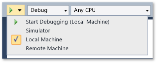
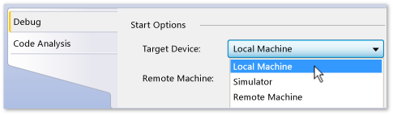

# Run Windows Store apps on the local machine
[!INCLUDE[vs2017banner](../includes/vs2017banner.md)]

Applies to Windows only](../Image/windows_only_content.png "windows_only_content")  
  
 To debug, test, or run performance analysis on a Windows Store app, you can run the app on the same machine that hosts Visual Studio. If the display on the device is touch-enabled, you can exercise the full functionality of the app; otherwise, you will be limited to mouse and keyboard gestures.  
  
##  In this topic  
 You can learn:  
  
 [How to run on a local machine](#BKMK_How_to_run_on_a_local_machine)  
  
 [How to switch between a Windows Store app and Visual Studio on a single monitor](#BKMK_How_to_switch_between_a_Windows_Store_app_and_Visual_Studio_on_a_single_monitor)  
  
##  How to run on a local machine  
 To run the app on the local machine, select **Local Machine** from the drop-down list next to the Start Debugging button on the debugger **Standard** toolbar.  
  
   
  
 If you can't see the **Standard** toolbar, click the **View** menu, point to **Toolbars**, and then click **Standard**.  
  
 The choice you make in the drop-down list is persisted in the project properties file and becomes the default run target.  
  
 You can also set the run target directly in the project properties file. Right-click the project name in **Solution Explorer** and then choose **Properties**. Then do one of the following:  
  
- In C# and Visual Basic projects, click **Debug** and then select **Local Machine** from the **Target Device** drop-down list.  
  
       
  
- In C++ and JavaScript projects, expand the **Configuration Properties** node, click **Debugging**, and then select **Local Debugger** from the **Debugger to launch** list.  
  
       
  
##  How to switch between a Windows Store app and Visual Studio on a single monitor  
 **To switch from a running instance of a Windows Store app to Visual Studio**  
  
 When you run a Windows Store app on a local machine and use only a single monitor, you might want to switch back to Visual Studio while leaving the app running. For example, the app might be in a state that cannot be reached by a breakpoint, such as waiting for an event or trapped in a long or endless loop. To return to Visual Studio, press ALT + TAB.
