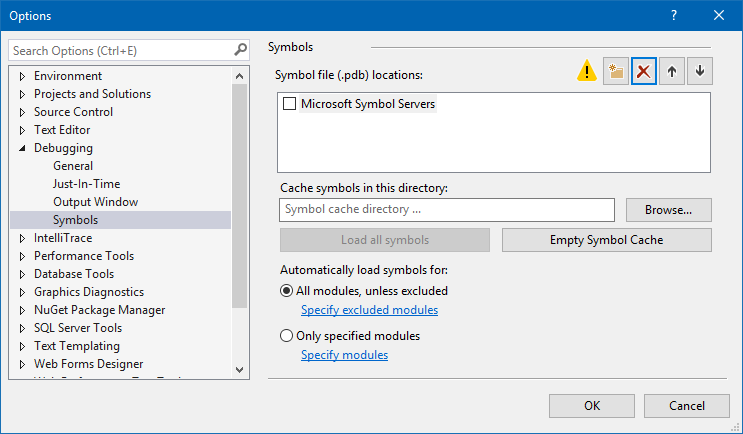
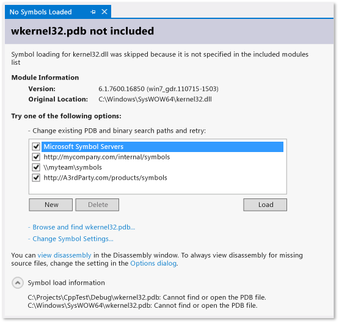
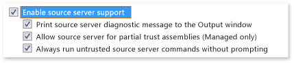

# Specify Symbol (.pdb) and Source Files in the Visual Studio Debugger
[!INCLUDE[vs2017banner](../includes/vs2017banner.md)]

A program database (.pdb) file, also called a symbol file, maps the identifiers that you create in source files for classes, methods, and other code to the identifiers that are used in the compiled executables of your project. The .pdb file also maps the statements in the source code to the execution instructions in the executables. The debugger uses this information to determine two key pieces of information: the source file and line number that are displayed in the Visual Studio IDE and the location in the executable to stop at when you set a breakpoint. A symbol file also contains the original location of the source files, and optionally, the location of a source server where the source files can be retrieved from.

 When you debug a project in the Visual Studio IDE, the debugger knows the default location for the .pdb and source files for your code. If you want to debug code outside your project source code, such as the Windows or third-party code your project calls, you have to specify the location of the .pdb (and optionally, the source files of the external code) and those files need to exactly match the build of the executables.

 Before Visual Studio 2012, when you debugged managed code on a remote device you needed to put the symbol files on the remote machine. This is no longer the case. All symbol files must be located on the local machine or in a location specified in the **Tools / Options / Debugging / Symbols** page.

##  Where the debugger searches for .pdb files

1. The location that is specified inside the DLL or the executable file.

     (By default, if you have built a DLL or an executable file on your computer, the linker places the full path and file name of the associated .pdb file inside the DLL or the executable file. The debugger first checks to see if the symbol file exists in the location that is specified inside the DLL or the executable file. This is helpful, because you always have symbols available for code that you have compiled on your computer.)

2. .pdb files that could be present in the same folder as the DLL or executable file.

3. Any local symbol cache folders.

4. Any network, internet, or local symbol servers and locations that are specified on, such as the Microsoft symbol server if enabled.

###  Why do symbol files need to exactly match the executable files?
 The debugger will load only a .pdb file for an executable file that exactly matches the .pdb file that was created when the executable was built (that is, the .pdb must be the original or a copy of the original .pdb file). Because the compiler is optimized for compilation speed in addition to its main task of creating correct and efficient code, the actual layout of an executable can change even if the code itself has not changed. For more information see [Why does Visual Studio require debugger symbol files to exactly match the binary files that they were built with?](https://blogs.msdn.microsoft.com/jimgries/2007/07/06/why-does-visual-studio-require-debugger-symbol-files-to-exactly-match-the-binary-files-that-they-were-built-with/).

###  Specify symbol locations and loading behavior
 When you debug a project in the VS IDE, the debugger automatically loads symbol files that are located in the project directory. You can specify alternative search paths and symbol servers for Microsoft, Windows, or third-party components in **Tools / Options / Debugging / Symbols**.You can also specify specific modules that you want the debugger to automatically load symbols for. And you can then change these settings manually while you are actively debugging.

1. In Visual Studio, open the **Tools / Options / Debugging / Symbols** page.

    

2. Choose the folder  icon. Editable text appears in the **Symbol file (.pdb) locations** box.

3. Type the URL or directory path of the symbol server or symbol location. Statement completion helps you find the correct format.

4. To improve symbol loading performance type the path a local directory where symbols can be copied by symbol servers in the **Cache symbols in this directory** box a local directory that symbols can be copied to.

   > [!NOTE]
   > Do not place your symbol cache in a protected folder (such as the C:\Windows folder or one of its subfolders). Use a read-write folder instead.

   **Specify symbol loading behavior**

   You can specify the files that you want to be loaded automatically from **Symbol file (.pdb) locations** box locations when you start debugging. Symbol files in the project directory are always loaded.

5. Choose **All modules, unless excluded** to load all the symbols for all modules except those that you specify when you choose the **Specify excluded modules** link.

6. Choose the **Only specified modules** option and then choose **Specify modules** to list the modules that you symbol files that you want loaded automatically. The symbol files for other modules are ignored.

   **Specify additional symbol options**

   You can also set the following options on the **Tools / Options / Debugging / Symbols** page:

   **Warn if no symbols on launch (native only)**

   When selected, displays a warning dialog box when you try to debug a program for which the debugger has no symbolic information.

   **Load DLL exports**

   When selected, loads DLL export tables. Symbolic information from DLL export tables can be useful if you are working with Windows messages, Windows procedures (WindowProcs), COM objects, or marshaling, or any DLL for which you do not have symbols. Reading DLL export information involves some overhead. Therefore, this capability is turned off by default.

   To see what symbols are available in the export table of a DLL, use `dumpbin /exports`. Symbols are available for any 32-bit system DLL. By reading the `dumpbin /exports` output, you can see the exact function name, including non-alphanumeric characters. This is useful for setting a breakpoint on a function. Function names from DLL export tables might appear truncated elsewhere in the debugger. The calls are listed in the calling order, with the current function (the most deeply nested) at the top. For more information, see [dumpbin /exports](https://msdn.microsoft.com/library/2971ab7e-4ee6-478b-9c85-cda42a4ce1bf).

###  Use symbol servers to find symbol files not on your local machine
 [!INCLUDE[vsprvs](../includes/vsprvs-md.md)] can download debugging symbol files from symbol servers that implement the symsrv protocol. [Visual Studio Team Foundation Server](https://msdn.microsoft.com/library/bd6977ca-e30a-491a-a153-671d81222ce6) and the [Debugging Tools for Windows](https://msdn.microsoft.com/library/windows/hardware/ff551063\(v=VS.85\).aspx) are two tools that can implement symbol servers. You specify the symbol servers to use in the VS **Options** dialog box.

 Symbol servers that you might use include:

 **Microsoft public symbol servers**

 To debug a crash that occurs during a call to a system DLL or to a third-party library, you will often need system .pdb files, which contain symbols for Windows DLLs, EXEs, and device drivers. You can obtain these symbols from the Microsoft public sysmbol servers. The Microsoft public symbol servers provide symbols for Windows operating systems, in addition to MDAC, IIS, ISA, and the [!INCLUDE[dnprdnshort](../includes/dnprdnshort-md.md)].

 To use the Microsoft symbol servers, choose **Options and Settings** on the **Debug** menu and then choose **Symbols**. Select **Microsoft Symbol Servers**.

 **Symbol servers on an internal network or on your local machine**

 Your team or company can create symbol servers for your own products and as a cache for symbols from external sources. You might have a symbol server on your own machine. You can enter the location of the symbol servers as a URL or as a path on the **Debugging**/**Symbols** page of the VS **Option Dialog**.

 **Third-party symbol servers**

 Third-party providers of Windows applications and libraries can provide access to symbol server on the internet. You also enter the URL of these symbol servers on the **Debugging**/**Symbols** page,

> [!NOTE]
> If you use a symbol server other than the Microsoft public symbol servers, make sure that the symbol server and its path are trustworthy. Because symbol files can contain arbitrary executable code, you can become exposed to security threats.

###  Find and load symbols while debugging
 At any time that the debugger is in break mode, you can load symbols for a module that was previously excluded by debugger options or that the compiler could not find. You can load symbols from the shortcut menus of the Call Stack, Modules, Locals, Autos, and all Watch windows. If the debugger breaks in code that does not have symbol or source files available, a document window appears. Here you can find information about the missing files and take actions to locate and load them.

 **Find symbols with the No Symbols Loaded document pages**

 There are a number of ways for the debugger to break into code that does not have symbols available:

1. Stepping into code.

2. Breaking into code from a breakpoint or exception.

3. Switching to a different thread.

4. Changing the stack frame by double-clicking a frame in the Call Stack window.

   When one of these events occurs, the debugger displays the **No Symbols Loaded** page to help you find and load the necessary symbols.

   

- To change the search paths, choose an unselected path or choose **New** and enter a new path. Choose **Load** to search the paths again and load the symbol file if it is found.

- Choose **Browse and find**_executable-name_**...** to override any symbol options and retry the search paths. The symbol file is loaded if it is found, or a File Explorer is displayed for you to manually select the symbol file.

- Choose **Change Symbol Settings ...** to display the **Debugging** / **Symbols** page of the VS Options dialog.

- Choose **view disassembly** to show the disassembly in a new window one time.

- To always show the disassembly when the source or symbol files are not found, choose the **Options dialog** link, and select both **Enable address level debugging** and **Show disassembly if source not available**.

   

  **Change symbol options from the shortcut menu**

  While you are in break mode, you can find and load symbols for items that are displayed in the Call Stack, Modules, Locals, Autos, and all Watch windows. Select an item in the window, open the shortcut menu, and choose one of the following options:

|Option|Description|
|------------|-----------------|
|**Load Symbols**|Attempts to load symbols from locations specified on the **Debugging** / **Symbols** page of the **Options** dialog box. If the symbol file cannot be found, File Explorer is launched so that you can specify a new location to search.|
|**Symbol Load Information**|Presents information showing the location of a loaded symbol file, or the locations that were searched if the debugger cannot find the file.|
|**Symbol Settings...**|Opens the **Debugging** / **Symbols** page of the VS **Options** dialog box.|
|**Always Load Automatically**|Adds the symbol file to the list of files that are automatically loaded by the debugger.|

###  Set compiler options for symbol files
 When you build your project from the VS IDE and use the standard **Debug** build configuration, the C++ and managed compilers create the appropriate symbols files for your code. You can also set compiler options on the command line to create the symbol files.

 **C++ options**

 A program database (.pdb) file holds debugging and project state information that allows incremental linking of a Debug configuration of your program. A .pdb file is created when you build with [/ZI or /Zi](https://msdn.microsoft.com/library/ce9fa7e1-0c9b-47e3-98ea-26d1a16257c8) (for C/C++).

 In [!INCLUDE[vcprvc](../includes/vcprvc-md.md)], the [/Fd](https://msdn.microsoft.com/library/3977a9ed-f0ac-45df-bf06-01cedd2ba85a) option names the .pdb file created by the compiler. When you create a project in [!INCLUDE[vsprvs](../includes/vsprvs-md.md)] using wizards, the **/Fd** option is set to create a .pdb file named *project*.pdb.

 If you build your C/C++ application using a makefile, and you specify **/ZI** or **/Zi** without **/Fd**, you end up with two .pdb files:

- VC*x*.pdb, where *x* represents the version of Visual C++, for example VC11.pdb. This file stores all debugging information for the individual OBJ files and resides in the same directory as the project makefile.

- project.pdb   This file stores all debug information for the.exe file. For C/C++, it resides in the \debug subdirectory.

  Each time it creates an OBJ file, the C/C++ compiler merges debug information into VC*x*.pdb. The inserted information includes type information but does not include symbol information such as function definitions. So even if every source file includes common header files such as \<windows.h>, the typedefs from those headers are stored only once, rather than being in every OBJ file.

  The linker creates project.pdb, which contains debug information for the project's EXE file. The project.pdb file contains full debug information, including function prototypes, not just the type information found in VC*x*.pdb. Both .pdb files allow incremental updates. The linker also embeds the path to the .pdb file in the .exe or .dll file that it creates.

  The [!INCLUDE[vsprvs](../includes/vsprvs-md.md)] debugger uses the path to the .pdb file in the EXE or DLL file to find the project.pdb file. If the debugger cannot find the .pdb file at that location or if the path is invalid (for example, if the project was moved to another computer), the debugger searches the path containing the EXE, the symbol paths specified in the **Options** dialog box (**Debugging** folder, **Symbols** node). The debugger will not load a .pdb file that does not match the executable being debugged. If the debugger cannot find a .pdb file, a **Find Symbols** dialog box appears, which allows you to search for symbols or to add additional locations to the search path.

  **.NET Framework options**

  A program database (.pdb) file holds debugging and project state information that allows incremental linking of a debug configuration of your program. A .pdb file is created when you build with **/debug**. You can build applications with **/debug:full** or **/debug:pdbonly**. Building with **/debug:full** generates debuggable code. Building with **/debug:pdbonly** generates .pdb files but does not generate the `DebuggableAttribute` that tells the JIT compiler that debug information is available. Use **/debug:pdbonly** if you want to generate .pdb files for a release build that you do not want to be debuggable. For more information, see [/debug (C# Compiler Options)](https://msdn.microsoft.com/library/e2b48c07-01bc-45cc-a52c-92e9085eb969) or [/debug (Visual Basic)](https://msdn.microsoft.com/library/c2b0bea5-1d5e-499f-9bd5-4f6c6b715ea2).

  The [!INCLUDE[vsprvs](../includes/vsprvs-md.md)] debugger uses the path to the .pdb file in the EXE or DLL file to find the project.pdb file. If the debugger cannot find the .pdb file at that location, or if the path is invalid, the debugger searches the path containing the EXE, and then the symbol paths specified in the **Options** dialog box. This path is generally the **Debugging** folder in the **Symbols** node. The debugger will not load a .pdb file that does not match the executable file being debugged. If the debugger cannot find a .pdb file, a **Find Symbols** dialog box appears, which allows you to search for symbols or to add additional locations to the search path.

  **Web applications**

  The configuration file of your application (Web.config) must be set to debug mode. Debug mode causes ASP.NET to generate symbols for dynamically generated files and enables the debugger to attach to the ASP.NET application. VS sets this automatically when you start to debug, if you created your project from the Web projects template.

##  Find source files

###  Where the debugger searches for source files
 The debugger looks for source files in the following locations:

1. Files that are open in the IDE of the Visual Studio instance that launched the debugger.

2. Files in the solution that is open in the Visual Studio instance.

3. Directories that are specified in the **Common Properties** / **Debug Source Files** page in the properties of the solution. (In the **Solution Explorer**, select the solution node, right-click, and select **Properties**. )

4. The source information of the .pdb of the module. This can be the location of the source file when the module was built, or it can be a command to a source server.

###  Find and load source files with the No Source / No Symbols Loaded pages
 When the debugger breaks execution at a location where the source file is not available, it will display the **No Source Loaded** or **No Symbols Loaded** pages that can help you find the source file. The **No Symbols Loaded** appears when the debugger cannot find a symbol (.pdb) file for the executable file to complete its search. The No Symbols page provides options to search for the file. If the .pdb is found of after you execute one of the options and the debugger can retrieve the source file using the information in the symbols file, the source is displayed. Otherwise, a **No Source Loaded** page appears that describes the issue. The page displays option links that can perform actions that might resolve the issue.

###  Add source file search paths to a solution
 You can specify a network or local directories to search for source files.

1. Select the solution in Solution Explorer and then choose **Properties** from the shortcut menu.

2. Under the **Common Properties** node, choose **Debug Source Files**.

3. Click the folder  icon. Editable text appears in the **Directories containing source code** list.

4. Add the path that you want to search.

   Note that only the specified directory is searched. You must add entries for any subdirectories that you want to search.

###  Use source servers
 When there is no source code on the local machine or the .pdb file does not match the source code, you can use Source Server to help debug an application. Source Server takes requests for files and returns the actual files. Source Server runs by means of a DLL file named srcsrv.dll. Source Server reads the application's .pdb file, which contains pointers to the source code repository, as well as commands used to retrieve source code from the repository. You can limit what commands are allowed to be executed from the application's .pdb file by listing the allowed commands inside a file named srcsrv.ini, which must be placed in the same directory as srcsrv.dll and devenv.exe.

> [!IMPORTANT]
> Arbitrary commands can be embedded in the application's .pdb file, so make sure you put only the ones you want to execute in the srcsrv.ini file. Any attempt to execute a command not in the srcsvr.ini file will cause a confirmation dialog box to appear. For more information, see [Security Warning: Debugger Must Execute Untrusted Command](../debugger/security-warning-debugger-must-execute-untrusted-command.md). No validation is done on command parameters, so be careful with trusted commands. For example, if you trusted cmd.exe, a malicious user might specify parameters that would make the command dangerous.

 **To enable the use of a Source Server**

1. Ensure that you have complied with the security measures described in the previous section.

2. On the **Tools** menu, choose **Options**.

     The **Options** dialog box appears.

3. In the **Debugging** node, choose **General**.

4. Select the **Enable source server support** check box.

     

5. (Optional) Choose the child options that you want.

     Note that both **Allow source server for partial trust assemblies (Managed only)** and **Always run untrusted source server commands without prompting** can increase the security risks discussed above.

## See Also
 [.NET Remote Symbol Loading Changes in Visual Studio 2012 and 2013](https://devblogs.microsoft.com/devops/net-remote-symbol-loading-changes-in-visual-studio-2012-and-2013/)
