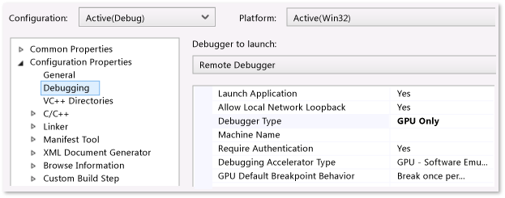

# Start a debugging session for a Store app in Visual Studio (VB, C#, C++ and XAML)
[!INCLUDE[vs2017banner](../includes/vs2017banner.md)]

Applies to Windows and Windows Phone](../Image/windows_and_phone_content.png "windows_and_phone_content")

 This topic describes how to start a debugging session for Store apps written in XAML and Visual C++, Visual C#, or Visual Basic. Debugging an app involves both configuring the debugging session and choosing the way to start the app.

> [!NOTE]
> For apps written in JavaScript and HTML see [Start a debug session  (JavaScript)](../debugger/start-a-debugging-session-for-store-apps-in-visual-studio-javascript.md).

##  In this topic
 [The easy way to start debugging](#BKMK_The_easy_way_to_start_debugging)

 [Configure the debugging session](#BKMK_Configure_the_debugging_session)

- [Open the debugging property page for the project](#BKMK_Open_the_debugging_property_page_for_the_project)

- [Choose the build configuration options](#BKMK_Choose_the_build_configuration_options)

- [Choose the deployment target](#BKMK_Choose_the_deployment_target)

- [Choose the debugger to use](#BKMK_Choose_the_debugger_to_use)

- [(Optional) Delay starting the debug session](#BKMK__Optional__Delay_starting_the_debug_session)

- [(Optional) Disable network loopbacks](#BKMK__Optional__Disable_network_loopbacks)

- [(Optional) Reinstall the app when you start debugging](#BKMK__Optional__Reinstall_the_app_when_you_start_debugging)

- [(Optional) Disable authentication requirement to start the remote debugger](#BKMK__Optional__Disable_authentication_requirement_to_start_the_remote_debugger)

  [Start the debugging session](#BKMK_Start_the_debugging_session)

- [Start debugging (F5)](#BKMK_Start_debugging__F5_)

- [Start debugging (F5) but delay the app start](#BKMK_Start_debugging__F5__but_delay_the_app_start)

- [Start an installed app in the debugger](#BKMK_Start_an_installed_app_in_the_debugger)

- [Attach the debugger to a running app](#BKMK_Attach_the_debugger_to_a_running_app_)

  - [Set the app to run in debug mode](#BKMK_Set_the_app_to_run_in_debug_mode)

  - [Attach the debugger](#BKMK_Attach_the_debugger)

##  The easy way to start debugging

1. Open the app solution in Visual Studio.

2. Choose F5.

   Visual Studio builds and starts the app with the debugger attached. Execution continues until a breakpoint is reached, you manually suspend execution, an un handled exception occurs, or the app ends. For more information, see [Navigate a debug session  (Xaml and C#)](../debugger/navigate-a-debugging-session-in-visual-studio-xaml-and-csharp.md) .

##  Configure the debugging session

###  Open the debugging property page for the project

1. In Solution Explorer, select the project. On the shortcut menu, choose **Properties**.

2. Do this to open the debug property page for the project :

    - For Visual C# and Visual Basic apps, choose **Debug**.

         

    - For Visual C++ apps, expand the **Configuration Properties**  node and then choose **Debugging**.

         

###  Choose the build configuration options

1. From the **Configuration** list, choose **Debug** or **(Active) Debug**.

2. From the **Platform** list choose the target platform to build for. In most cases, **Any CPU** (**All Platforms** in Visual C++) is the best choice.

###  Choose the deployment target
 

 You can deploy and debug a Windows Store app on the Visual Studio machine, in the Visual Studio simulator on the local machine, or on a remote device.

- For C# and Visual Basic apps, choose the target from the **Target device** list on the **Debug** property page for the project.

- For C++ apps, choose the target from the **Debugger to launch** list on the **Debugging** property page:

  Choose one of these options:

|||
|-|-|
|**Local Machine**|Debug the app in the current session on your local machine. See [Run Windows Store apps on the local machine](../debugger/run-windows-store-apps-on-the-local-machine.md).|
|**Simulator**|Debug the app in the Visual Studio simulator for [!INCLUDE[win8_appname_long](../includes/win8-appname-long-md.md)] apps. The simulator is a Desktop window that enables you to debug device functionality—such as touch gestures and device rotation—that are not available on the local machine. See [Run Windows Store apps in the simulator](../debugger/run-windows-store-apps-in-the-simulator.md).|
|**Remote Machine**|Debug the app on a device that is connected to the local machine over an intranet or directly connected by using an Ethernet cable. To debug remotely, the Visual Studio Remote Tools must be installed and running on hte remote device. See [Run Windows Store apps on a remote machine](../debugger/run-windows-store-apps-on-a-remote-machine.md).|

 If you choose **Remote Machine**, specify the name or IP address of the remote machine in one of these ways:

- Enter the name or IP address of the remote machine.

  - For C# and Visual Basic apps, enter the name or IP address in the **Remote machine** box.

  - For C++ apps, enter the name or IP address in the **Machine Name** box.

- Choose the remote machine from the **Select Remote Debugger Connection** dialog box.

   To open the dialog box:

  - For C# and Visual Basic apps, choose **Find**.

  - For C++ apps, choose the down arrow in the **Machine Name** box and choose **\<Locate...>**.

    

  > [!NOTE]
  > The **Select Remote Debugger Connection** dialog box displays machines that are on the local sub-net and machines that are directly connected to the Visual Studio machine by an Ethernet cable. To specify another machine, enter the name in the **Machine Name** box.

  

  You can deploy and debug a Windows Phone Store app on a device or on one of the Visual Studio phone emulators. Select the device or emulator from the **Target device** list.

###  Choose the debugger to use
 By default, Visual Studio debugs managed code in C# and Visual Basic apps.

 For C# and Visual Basic apps, you can choose to debug both the managed and native C/C++ code in your app. Select the **Enable unmanaged code debugging** check box to include native code in your debug session.

 By default, Visual Studio debugs native code in your C++ app.

 For C++ apps, you can choose to debug specific types of code that are in components of your app instead of, or in addition to, the native code. You specify the code to debug in the **Debugger Type** list on the **Debugging** property page of the app project.

 Choose one of these debuggers from the **Application process** list:

|||
|-|-|
|**Script Only**|Debug JavaScript code in your app. Managed code and native code are ignored.|
|**Native Only**|Debug native C/C++ code in your app. Managed code and JavaScript code are ignored.|
|**Managed Only**|Debug managed code in your app. JavaScript code and native C/C++ code are ignored.|
|**Mixed (Managed and Native)**|Debug native C/C++ code and managed code in your app. JavaScript code is ignored.|
|**GPU only**|Debug native C++ code that runs on a graphics processing unit (GPU).|

 

 For Windows Store Phone apps, you can also choose the debugger to use for background processes from the **Background task process**.

###  (Optional) Delay starting the debug session
 By default, Visual Studio immediately starts the app when you start debugging. You can also start a debug session but delay the start of your app. When you choose this option, the app is started in the debugger when it is launched from the Start screen or by an activation contract or when it is started by another process or method. You also delay the start of your app when you want to debug a background task when the app itself is not running.

 To delay the launch of your app, you can:

- For Visual C# and Visual Basic apps, select **Do not launch, but debug my code when it starts** on the **Debug** property page.

- For Visual C++ apps, choose **Yes** from the **Launch Application** list on the **Debugging** property page.

###  (Optional) Disable network loopbacks
 

 For security reasons, a Windows Store app that is installed in the standard manner is not allowed to make network calls to the device it is installed on. By default, Visual Studio deployment creates an exemption from this rule for the deployed app. This exemption allows you to test communication procedures on a single machine. Before you submit your app to the Windows Store, you should test your app without the exemption.

 To remove the network loopback exemption:

- For Visual C# and Visual Basic apps, clear the **Allow Network Loopback** check box on the **Debug** property page.

- For Visual C++ apps, choose **No** from the **Allow Network Loopback** list on the **Debugging** property page.

###  (Optional) Reinstall the app when you start debugging
 To diagnose problems with the installation and initial configuration of your Visual C# or Visual Basic app, choose **Uninstall and then reinstall my package** on the **Debug**  property page to recreate an original install when you start debugging. This option is not available for Visual C++ projects.

###  (Optional) Disable authentication requirement to start the remote debugger
 

 By default, you must supply credentials to run the remote debugger.

> [!IMPORTANT]
> You can choose to run the remote debugger in No Authentication mode, but this mode is strongly discouraged. There is no network security when you run in this mode. Choose the No Authentication mode only if you are sure that the network is not at risk of from malicious or hostile traffic.

 To remove the authentication requirement:

1. For Visual C# and Visual Basic apps, clear the **Use Authentication** check box on the **Debug** property page.

2. For Visual C++ apps, choose **No** from the **Require Authentication** list on the **Debugging** property page.

   [In this topic](#BKMK_In_this_topic)

##  Start the debugging session

###  Start debugging (F5)
 When you choose **Start Debugging** (Keyboard: F5) on the **Debug** menu, Visual Studio launches the app with the debugger attached. Execution continues until a breakpoint is reached, you manually suspend execution, an exception occurs, or the app ends.

###  Start debugging (F5) but delay the app start
 You can set the app to run in debug mode, but start it by a method other than the debugger. For example, you might want to debug the launch of your app from the Start menu, or to debug a background process in the app without starting the app.To delay the app start, do this:

- On the **Debugging** property page of the app (**Debug** in Visual C++)

  - For Visual C# and Visual Basic apps, choose **Do not launch, but debug my code when it starts**.

  - For Visual C++ apps, choose **Yes** from the **Launch Application** list.

- Choose **Start Debugging** on the **Debug** menu (Keyboard: F5).

- Start your app from the Start menu, an execution contract, or by another procedure.

  The app starts in debug mode. Execution continues until a breakpoint is reached, you manually suspend execution, an unhandled exception occurs, or the app ends.

  . For more information about debugging background tasks, see [Trigger suspend, resume, and background events for Windows Store)](../debugger/how-to-trigger-suspend-resume-and-background-events-for-windows-store-apps-in-visual-studio.md).

###  Start an installed app in the debugger
 When you start debugging by using F5, Visual Studio builds and deploys the app, sets the app to run in debug mode, and then starts it. To start an app that is already installed on a device, use the Debug Installed App Package dialog box. This procedure is useful when you need to debug an app that was installed from the Windows store, or when you have the source files for the app, but you do not have a Visual Studio project for the app. For example, you might have a custom build system that does not use Visual Studio projects or solutions.

 The app can be installed on the local device, or it can be on a remote device.  You can start the app immediately, or you can set it to run in the debugger when it is started by another process or method, such as from the Start menu or by an activation contract, You can also set the app to run in debug mode when you want to debug a background process without starting the app. For more information, see [Trigger suspend, resume, and background events for Windows Store)](../debugger/how-to-trigger-suspend-resume-and-background-events-for-windows-store-apps-in-visual-studio.md).

 To set an installed app to run in debug mode, do this:

> [!NOTE]
> The app must not be running when you start this procedure.

1. On the **Debug** menu, choose **Debug Installed App Package**

2. Choose one of the following options from the list:

   |                    |                                                                                                                                                                                                                                                                                                                                                                                                           |
   |--------------------|-----------------------------------------------------------------------------------------------------------------------------------------------------------------------------------------------------------------------------------------------------------------------------------------------------------------------------------------------------------------------------------------------------------|
   | **Local Machine**  |                                                                                                                Debug the app in the current session on your local machine. See [Run Windows Store apps on the local machine](../debugger/run-windows-store-apps-on-the-local-machine.md).                                                                                                                 |
   |   **Simulator**    | Debug the app in the Visual Studio simulator for [!INCLUDE[win8_appname_long](../includes/win8-appname-long-md.md)] apps. The simulator is a Desktop window that enables you to debug device functionality—such as touch gestures and device rotation—that are not available on the local machine. See [Run Windows Store apps in the simulator](../debugger/run-windows-store-apps-in-the-simulator.md). |
   | **Remote Machine** |                          Debug the app on a device that is connected to the local machine over an intranet or directly connected by using an Ethernet cable. To debug remotely, the Visual Studio Remote Tools must be installed and running on the remote device. See [Run Windows Store apps on a remote machine](../debugger/run-windows-store-apps-on-a-remote-machine.md).                           |

3. Choose the app from the **Installed App Packages** list.

4. Choose the debug engine to use from the **Debug this code type** list.

5. (Optional). Choose **Do not launch, but debug my code when it starts** to debug the app when it is started by some other method, or to debug a background process.

   When you click **Start**, the app is launched or is set to run in debug mode.

###  Attach the debugger to a running app
 To attach the debugger to a [!INCLUDE[win8_appname_long](../includes/win8-appname-long-md.md)] app, you must use the Debuggable Package Manager to set the app to run in debug mode. The Debuggable Package Manager is installed with the Visual Studio Remote Tools.

 Attaching the debugger to an app is useful when you need to debug an already-installed app, such as an app that was installed from the [!INCLUDE[win8_appstore_long](../includes/win8-appstore-long-md.md)]. Attaching is required when you have the source files for the app, but you do not have a Visual Studio project for the app. For example, you might have a custom build system that does not use Visual Studio projects or solutions.

 Attaching the debugger to an app requires these steps:

1. Set the app to run in debug mode. This must be done when the app is not running.

2. Start the app. You can start the app from the Start screen, an execution contract, or some other method.

3. Attach the debugger to the running app.

####  Set the app to run in debug mode

1. Install the Visual Studio Remote Tools on the device where the app is installed. See [Installing the Remote Tools](https://msdn.microsoft.com/library/windows/apps/hh441469.aspx#BKMK_Installing_the_Remote_Tools).

2. On the Start screen, search for `Debuggable Package Manager` and then start it.

     A PowerShell window properly configured for the AppxDebug cmdlet appears.

3. To enable debugging of an app, you must specify the PackageFullName identifier of the app. To view a list all apps that includes the PackageFullName, type `Get-AppxPackage` at the PowerShell prompt.

4. At the PowerShell prompt, enter `Enable-AppxDebug` *PackageFullName* where *PackageFullName* is the PackageFullName identifier of the app.

####  Attach the debugger
 To attach the debugger:

1. On the **Debug** menu, choose **Attach to Process**.

    The **Attach to Process** dialog box appears.

2. To attach to an app on a remote device, specify the remote device in the **Qualifier** box. You can:

   - Enter the name in the **Qualifier** box.

   - Choose the down-arrow in the **Qualifier** box and then choose the device from a list of devices that you have attached to before.

   - Choose **Find** to select the device from a list of devices on your local subnet.

3. Specify the type of code that you want to debug in the **Attach to** box.

    Choose **Select** and then do one of the following:

   - Choose **Automatically determine the type of code to debug**

   - Choose **Debug these code types** and then choose one or more types from the list.

4. In the **Available Processes**  list, choose the app process.

5. Choose **Attach**.

   Visual Studio attaches the debugger to the process. Execution continues until a breakpoint is reached, you manually suspend execution, an unhandled exception occurs, or the app ends.

   [In this topic](#BKMK_In_this_topic)

## See Also
 [Debug apps in Visual Studio](../debugger/debug-store-apps-in-visual-studio.md)
 [Navigate a debug session  (Xaml and C#)](../debugger/navigate-a-debugging-session-in-visual-studio-xaml-and-csharp.md)
