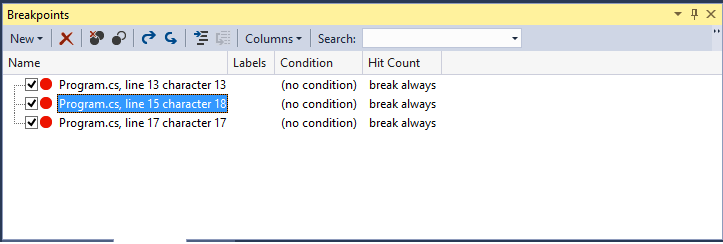
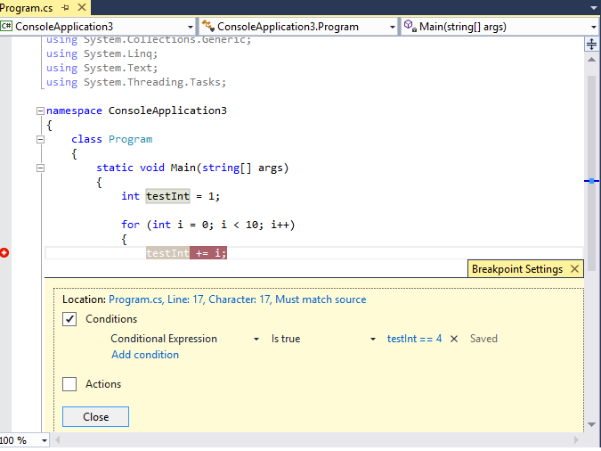

# Using Breakpoints
[!INCLUDE[vs2017banner](../includes/vs2017banner.md)]
You can set breakpoints when you want to stop debugger execution, perhaps to see the state of code variables or to look at the call stack. They are one of the most important debugging techniques in a developer's toolbox.
  
## <a name="BKMK_Overview"></a> Setting a function breakpoint in source code  
 You set a function breakpoint in source code by clicking in the left margin of a source code file, or by putting your cursor on a line of code and pressing F9. The breakpoint appears as a red dot in the left margin, and the line of code is colored as well:  
  
   
  
 When you run this code in the debugger, execution stops whenever the breakpoint is hit, before the code on that line is executed. The line of source code is colored yellow:  
  
   
  
 At this point the value of `testInt` is still 1.  
  
 You can look at the current state of the application, including variable values and the call stack. For more information about the call stack, see [How to: Use the Call Stack Window](../debugger/how-to-use-the-call-stack-window.md).  
  
 You can set a breakpoint on any line of executable code. For example, in the C# code above you can set a breakpoint on the variable declaration, the `for` loop, or any code inside the `for` loop, but you cannot set a breakpoint on the namespace or class declarations or the method signature.  
  
## <a name="BKMK_Set_a_breakpoint_in_a_source_file"></a> Setting Other Kinds of Breakpoints  
 You can also set breakpoints in the call stack, in the Disassembly window, and, in native C++ code, at a data condition or a memory address.  
  
## <a name="BKMK_Set_a_breakpoint_in_the_call_stack_window"></a> Setting a Breakpoint in the Call Stack Window  
 You can break execution at the instruction or line that a calling function returns to by setting a breakpoint in the **Call Stack** window. For more information about the call stack, see [How to: Use the Call Stack Window](../debugger/how-to-use-the-call-stack-window.md). The debugger must have stopped executing.  
  
1. Start debugging the application, and wait execution is stopped (for example, at a breakpoint). Open the **Call Stack** window (**Debug / Windows / Call Stack**, or **CTRL + ALT + C**).  
  
2. Right-click the calling function and then select **Breakpoint / Insert Breakpoint**, or just use the shortcut key **F9**.  
  
3. A breakpoint symbol appears in the left margin of the call stack, next to the function call name.  
  
   In the **Breakpoints** window, the call stack breakpoint appears as an address with a memory location that corresponds to the next executable instruction in the function. The debugger breaks execution at the instruction.  
  
   To visually trace breakpoints during code execution, see [Map methods on the call stack while debugging](../debugger/map-methods-on-the-call-stack-while-debugging-in-visual-studio.md).  
  
## Setting a Breakpoint in the Disassembly Window  
 To set a breakpoint at an assembly instruction, the debugger must be in break mode.  
  
1. Start debugging the application, and wait execution is stopped (for example, at a breakpoint). Open the **Disassembly** window (**Debug / Windows / Disassembly**, or **Ctrl + Alt + D**).  
  
2. Click in the left margin at the instruction that you want to break at, or set your cursor at the instruction and press **F9**.  
  
## <a name="BKMK_set_a_data_breakpoint_native_cplusplus_only"></a> Setting a Data Breakpoint (native C++ only)  
 Data breakpoints break execution when a value that is stored at a specified memory address changes. If the value is read but not changed, execution doesn't break. To set data breakpoints, the debugger must be in break mode.  
  
1. Start debugging the application, and wait until a breakpoint is reached. On the **Debug** menu, choose **New Breakpoint / Data Breakpoint** (or open the **Breakpoints** window and choose **New / Data Breakpoint**.  
  
2. In the **Address** box, type a memory address or an expression that evaluates to a memory address. For example, type `&avar` to break when the contents of the variable `avar` changes.  
  
3. In the **Byte Count** dropdown, select the number of bytes you want the debugger to watch. For example, if you select **4**, the debugger will watch the four bytes starting at `&avar` and break if any of those bytes change value.  
  
   Keep in mind that data breakpoints depend on the applicability of specific memory addresses.  
  
- The address of a variable changes from one debugging session to the next. Data breakpoints are automatically disabled at the end of each debugging session.  
  
- If you set a data breakpoint on a local variable, the breakpoint remains enabled when the function ends, but the memory address is no longer applicable, and the behavior of the breakpoint is unpredictable. If you set a data breakpoint on a local variable, you should remove or disable the breakpoint before the function ends.  
  
  Data breakpoints don't work under these conditions:  
  
- A process that is not being debugged writes to the memory location  
  
- The memory location is shared between two or more processes  
  
- The memory location is updated within the kernel. For example, if memory is passed to the 32-bit Windows `ReadFile` function, the memory will be updated from kernel mode and the debugger doesn't break on the memory write.  
  
## Setting a Breakpoint with a Memory Address (native C++ only)  
 You can also use the address of an object to set a breakpoint on a method called on a specific instance of a class.  Here's an example:  
  
 For example, given an object of type `my_class` with the address, you can set a function breakpoint on a method named `my_method` called from that instance.  
  
1. Set a breakpoint somewhere after that instance of the class is instantiated.  
  
2. Find the address of the instance (we'll say it's `0xcccccccc`).  
  
3. Click **Debug / New Breakpoint / Function Breakpoint** (or **ALT + F9, B**).  
  
4. Add the following text to the **Function Name** box:  
  
    ```cpp  
    ((my_class *) 0xcccccccc)->my_method  
    ```  
  
## <a name="BKMK_Specify_advanced_properties_of_a_breakpoint_"></a> Managing Breakpoints  
 You can use the **Breakpoints** window (**Debug / Windows / Breakpoints**, or **CTRL + ALT + B**) to see all the breakpoints you have set in your solution:  
  
   
  
 The **Breakpoints** window gives you a central place to manage all your breakpoints, which can be especially helpful in a large solution or a complex debugging scenario where breakpoints are critical. If you need to save or share the state and location of a set of breakpoints, you can export and import breakpoints only from the **Breakpoints** window.  
  
## <a name="BKMK_Specify_a_breakpoint_condition_using_a_code_expression"></a> Advanced Breakpoints  
  
## Breakpoint conditions  
 You can control when and where a breakpoint executes by setting conditions.  
  
1. Right-click the breakpoint, or hover over the breakpoint and choose the settings icon.  
  
2. In the context menu, select **Conditions**. This opens the **Breakpoint Settings** window:  
  
     
  
   When you check the **Conditions** box, the window expands to show the different kinds of conditions.  
  
   **Conditional Expression:** When you select Conditional Expression, you can then choose two conditions: **Is true** and **When changed**. Choose **Is true** if you want to break when the expression is satisfied, or choose **When changed** if you want to break when the value of the expression has changed.  
  
   In the following example we set the breakpoint to hit only when the value of `testInt` is **4**:  
  
     
  
   In the following example we set the breakpoint to hit only when the value of `testInt` changes:  
  
     
  
   The behavior of the When changed field is different for different programming languages. If you choose **When changed** for native code, the debugger doesn't consider the first evaluation of the condition to be a change, so the breakpoint won't be hit on the first evaluation. If you choose **When changed** for managed code, he breakpoint is hit on the first evaluation after **When changed** is selected.  
  
   If you set a breakpoint condition with invalid syntax, a warning message appears. If you specify a breakpoint condition with valid syntax but invalid semantics, a warning message appears the first time the breakpoint is hit. In either case, the debugger breaks execution when the invalid breakpoint is hit. The breakpoint is skipped only if the condition is valid and evaluates to `false`.  
  
   The condition can be any valid expression that is recognized by the debugger. For more information about valid expressions, see [Expressions in the Debugger](../debugger/expressions-in-the-debugger.md).  
  
## Using Object IDs in Breakpoint Conditions (C# and F#)  
 There are times when you want to observe the behavior of a specific object; for example, you might want to find out why an object was inserted more than once into a collection. In C# and F#, you can create object IDs for specific instances of [reference types](https://msdn.microsoft.com/library/801cf030-6e2d-4a0d-9daf-1431b0c31f47) and use them in breakpoint conditions. The object ID is generated by the common language runtime (CLR) debugging services and associated with the object.  To create an object ID, do the following:  
  
1. Set a breakpoint in the code some time after the object has been created.  
  
2. Start debugging, and when execution stops in the breakpoint, find the breakpoint in the **Locals** window, right-click it, and select **Make Object ID**.  
  
    You should see a **$** plus a number in the **Locals** window. This is the object ID.  
  
3. Add a new conditional breakpoint at the point you want to investigate, for example when the object is to be added to the collection.  
  
4. Use the Object ID in the Conditional Expression field. For example, if there is a variable `item` referring to the object that is to be added to the collection, you would put **item == $n**, where **n** is the object ID number.  
  
    Execution will break at the point when that object is to be added to the collection.  
  
   If you later want to delete the object ID, you can right-click the variable in the **Locals** window and select **Delete Object ID**.  
  
   Note that Object IDs create weak references, and do not prevent the object from being garbage collected. They are valid only for the current debugging session.  
  
## Hit Count  
 If you suspect that a loop in your code starts misbehaving after a certain number of iterations, you can set a breakpoint to stop execution after a specified number of hits to the to the associated line of code, rather than being forced to repeatedly press **F5** to reach the iteration level.  
  
 In the **Breakpoint Settings** window, set the condition to **Hit Count**. You can then specify the number of iterations. In the following example, we set the breakpoint to hit on every other iteration:  
  
   
  
## Filter  
 You can restrict a breakpoint to fire only on specified devices, or in specified processes and threads.  
  
 In the **Breakpoint Setting**s window, set the condition to **Filter**. Enter one or more of the following expressions.  
  
- MachineName = "name"  
  
- ProcessId = value  
  
- ProcessName = "name"  
  
- ThreadId = value  
  
- ThreadName = "name"  
  
  Enclose string values in double quotes. You can combine clauses using `&` (AND), `||` (OR), `!` (NOT), and parentheses.  
  
## <a name="BKMK_Print_to_the_Output_window_with_tracepoints"></a> Breakpoint Actions and Tracepoints  
 A tracepoint is a breakpoint that prints a message to the Output window. A tracepoint can act like a temporary trace statement in the programming language.  
  
 In the **Breakpoint Settings** window, check the **Actions** box. Choose **Log a message to Output window** in the **Action** group. You can print a generic string, such as **this is a test**. To include the value of a variable or expression, enclose it in curly braces.  
  
 To break execution when the tracepoint is hit, clear the **Continue Execution** check box. When **Continue Execution** is checked, execution is not halted. In both cases, the message is printed.  
  
 You can use the following special keywords in the **Message**.  
  
|||  
|-|-|  
|**$ADDRESS**|Current instruction|  
|**$CALLER**|Calling function name|  
|**$CALLSTACK**|Call stack|  
|**$FUNCTION**|Current function name|  
|**$PID**|Process id|  
|**$PNAME**|Process name|  
|**$TID**|Thread id|  
|**$TNAME**|Thread name|  
|**$TICK**||  
|**$TNAME**||  
  
## <a name="BKMK_Set_a_breakpoint_at_a_function_return_in_the_Call_Stack_window"></a> Breakpoint labels  
 Breakpoint labels are used only in the **Breakpoints** window to sort and filter the list of breakpoints. To add a label to a breakpoint, choose the breakpoint row and then choose **Label** on the context menu.  
  
## Export and Import Breakpoints  
 You can export a breakpoint to an XML file by right-clicking on the breakpoint and selecting **Export**. The file is saved by default in the solution directory. To import breakpoints, open the **Breakpoints** window (**CTRL + ALT + B**) and on the toolbar click the right-pointing arrow (the tooltip is **Import breakpoints from a file**).  
  
## Troubleshoot breakpoints  
  
### I deleted a breakpoint, but I continue to hit it when I start debugging again  
 If you deleted a breakpoint while debugging, in some cases you may hit the breakpoint again the next time you start debugging. To stop hitting this breakpoint, make sure all the instances of the breakpoint are removed from the **Breakpoints** window.  
  
### The debugger can't locate the correct version of the source file for a breakpoint  
 If a source file has changed and the source no longer matches the code you are debugging, the debugger might locate the source file that corresponds to a breakpoint, even though the source file exists.  
  
1. If you want Visual Studio to display source code that doesn't match the version you are debugging, choose **Debug / Options and Settings**. On the **Debugging/General** page, clear the **Require source files that exactly match the original version** option.  
  
2. You can also bind the breakpoint to the source file. Select the breakpoint and choose **Conditions** on the context menu. Check **Allow the source code to be different from the original** in the **Breakpoint Settings** window.  
  
### Breakpoints don't work in a DLL  
 You cannot set a breakpoint in a source file when the debugger hasn't loaded the debug information for the module where the code is located. Symptoms may include messages such as **the breakpoint will not be set**. The Warning breakpoint glyph appears at the breakpoint location. However, these Warning breakpoints become actual breakpoints when the code is loaded. For more information about loading symbols, see [Specify Symbol (.pdb) and Source Files](../debugger/specify-symbol-dot-pdb-and-source-files-in-the-visual-studio-debugger.md).  
  
## See Also  
 [Navigating through Code with the Debugger](../debugger/navigating-through-code-with-the-debugger.md)
