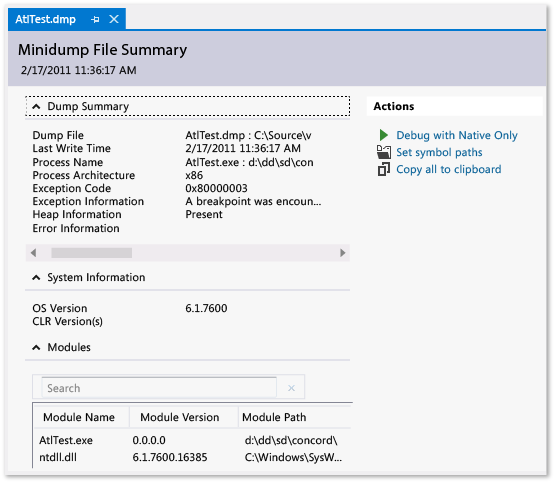

# Using Dump Files
[!INCLUDE[vs2017banner](../includes/vs2017banner.md)]

Dump files with or without heaps; create a dump file; open a dump file; find the binaries, pdbs, and source file for a dump file. 
  
##  Contents  
 [What is a dump file?](#BKMK_What_is_a_dump_file_)  
  
 [Dump files, with or without heaps](#BKMK_Dump_files__with_or_without_heaps)  
  
 [Requirements and limitations](#BKMK_Requirements_and_limitations)  
  
 [Create a dump file](#BKMK_Create_a_dump_file)  
  
 [Open a dump file](#BKMK_Open_a_dump_file)  
  
 [Find binaries, symbol (.pdb) files, and source files](#BKMK_Find_binaries__symbol___pdb__files__and_source_files)  
  
##  What is a dump file?  
 A *dump file* is a snapshot of an app at the point in time the dump is taken. It shows what process was executing and what modules were loaded. If the dump was saved with heap information, the dump file contains a snapshot of what was in the app's memory at that point in time. Opening a dump file with a heap in Visual Studio is like stopping at a breakpoint in a debug session. Although you cannot continue execution, you can examine the stacks, threads, and variable values of the app at the time the dump occurred.  
  
 Dumps are primarily used for debugging issues that occur on machines that the developer doesn’t have access to. For example, you can use a dump file from a customer's machine when you can’t reproduce the customer's crash or hang on your machine. Dumps are also created by testers to save crash or hang data so that the test machine can be used for more testing. The Visual Studio debugger can save dump files for managed or native code. The debugger can load dump files that were created by Visual Studio or by other programs that save files in the *minidump* format.  
  
  [Contents](#BKMK_Contents)  
  
##  Dump files, with or without heaps  
 You can create dump files with or without heap information.  
  
- **Dump files with heaps** contain a snapshot of the app's memory. This includes the values of variables at the time the dump was created. If you load a dump file that was saved with a heap, Visual Studio can load the symbols even if the application binary is not found. Visual Studio also saves the binaries of loaded native modules in the dump file, which can make debugging much easier.  
  
- **Dump files without heaps** are much smaller than dumps with heap information. However, the debugger has to load the app binaries to find the symbol information. The binaries must be an exact match of the binaries that were used when the dump was created. Only the values of stack variables are saved in dump files without heap data.  
  
   [Contents](#BKMK_Contents)  
  
##  Requirements and limitations  
  
- Debugging dump files of optimized code can be confusing. For example, compiler inlining of functions can result in unexpected call stacks and other optimizations might change the lifetime of variables.  
  
- Dump files from 64-bit machines must be debugged on an instance of Visual Studio that is running on a 64-bit computer.  
  
- In versions of Visual Studio before VS 2013, dumps of 32-bit apps that were run on 64-bit machines that were collected by some tools (such as Task Manager and 64-bit WinDbg) could not be opened in Visual Studio. This limitation has been removed in VS 2013.  
  
- Visual Studio can debug dump files of native apps from ARM devices. Visual Studio can also debug apps dump files of managed apps from ARM devices, but only in the native debugger.  
  
- To debug [kernel-mode](https://msdn.microsoft.com/library/windows/hardware/ff551880.aspx) dump files in Visual Studio 2013, download the [Windows 8.1 Version of Debugging Tools for Windows](https://msdn.microsoft.com/windows/hardware/gg463009). See [Kernel Debugging in Visual Studio](https://msdn.microsoft.com/library/windows/hardware/jj149675.aspx).  
  
- Visual Studio can't debug dump files saved in the older dump format known as a [full user-mode dump](/windows-hardware/drivers/debugger/user-mode-dump-files#full). Note that a full user-mode dump is not the same a dump with heap.  
  
- To debug with the [SOS.dll (SOS Debugging Extension)](https://msdn.microsoft.com/library/9ac1b522-77ab-4cdc-852a-20fcdc9ae498) in Visual Studio, you must install the Debugging Tools for Windows that is part of the Windows Driver Kit (WDK). See [Windows 8.1 Preview: Download kits, bits, and tools](https://msdn.microsoft.com/library/windows/hardware/bg127147.aspx).  
  
   [Contents](#BKMK_Contents)  
  
##  Create a dump file  
 To create a dump file with Visual Studio:  
  
- While you are debugging a process in Visual Studio, you can save a dump file when the debugger has stopped at an exception or at a breakpoint. Choose **Save Dump As**, **Debug**. In the **Save Dump As** dialog box, in the **Save as type** list, you can select **Minidump** or **Minidump with Heap** (the default).  
  
- With [Just-In-Time Debugging](../debugger/just-in-time-debugging-in-visual-studio.md) enabled, you can attach the debugger to a crashed process that is running outside the debugger, and then save a dump file. See [Attach to Running Processes](../debugger/attach-to-running-processes-with-the-visual-studio-debugger.md)  
  
  You can also create dump files with any program that supports the Windows minidump format. For example, the **Procdump** command-line utility from [Windows Sysinternals](https://technet.microsoft.com/sysinternals/default) can create process crash dump files based on triggers or on-demand. See [Requirements and limitations](../debugger/using-dump-files.md#BKMK_Requirements_and_limitations) in this topic for additional information about using other tools to create dump files.  
  
   [Contents](#BKMK_Contents)  
  
##  Open a dump file  
  
1. In Visual Studio, choose **File**, **Open**, **File**.  
  
2. In the **Open File** dialog box, locate and select the dump file. It will usually have a .dmp extension. Then choose **OK**.  
  
3. The **Dump File Summary** window appears. In this window, you can view debugging summary information for the dump file, set the symbol path, start debugging, and copy the summary information to the clipboard.  
  
       
  
4. To start debugging, go to the **Actions** section, and choose either **Debug with Native Only** or **Debug with Mixed**.  
  
##  Find binaries, symbol (.pdb) files, and source files  
 To use the full features of Visual Studio to debug a dump file, you need access to:  
  
- The .exe file for which the dump was taken and other binaries (DLLs, etc.) that were used in the dump process.  
  
   If you are debugging a dump with heap data, Visual Studio can cope with missing binaries for some modules, but it must have binaries for enough modules to generate valid call stacks. Visual Studio includes the native modules in a dump file with heap.  
  
- Symbol (.pdb) files for the .exe and other binaries.  
  
- Source files for the modules that you are interested in.  
  
   The executable and the .pdb files must match exactly the version and build of the files used when the dump was created.  
  
   You can debug using the disassembly of the modules if you can’t find the source files,  
  
  **Default search paths for executable files**  
  
  Visual Studio automatically searches these locations for executable files that aren’t included in the dump file:  
  
1. The directory that contains the dump file.  
  
2. The path of the module that is specified in the dump file. This is the module path on the machine where the dump was collected.  
  
3. The symbol paths specified in the **Debugging**, **Options**, **Symbols** page of the Visual Studio **Tools**, **Options** dialog box. You can add more locations to search on this page.  
  
   **Using the No Binary / Symbol / Source pages**  
  
   If Visual Studio can’t find the files needed to debug a module in the dump, it displays an appropriate page (**No Binary Found**, **No Symbols Found**, or **No Source Found**). These pages provide detailed information about the cause of the issue and provide action links that can help you identify the correct location of the files. See [Specify Symbol (.pdb) and Source Files](../debugger/specify-symbol-dot-pdb-and-source-files-in-the-visual-studio-debugger.md).  
  
    [Contents](#BKMK_Contents)  
  
## See Also  
 [Just-In-Time Debugging](../debugger/just-in-time-debugging-in-visual-studio.md)   
 [Specify Symbol (.pdb) and Source Files](../debugger/specify-symbol-dot-pdb-and-source-files-in-the-visual-studio-debugger.md)   
 [IntelliTrace](../debugger/intellitrace.md)
