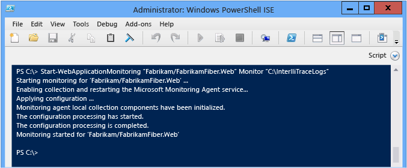
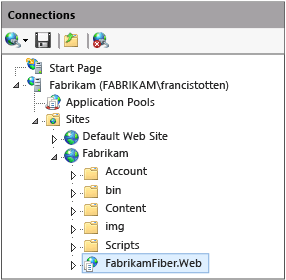
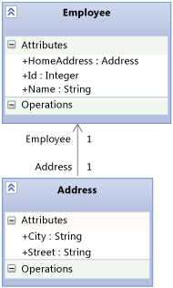

# Using the Microsoft Monitoring Agent
[!INCLUDE[vs2017banner](../includes/vs2017banner.md)]

For the latest documentation on Visual Studio, see [Using the Microsoft Monitoring Agent](https://docs.microsoft.com/visualstudio/debugger/using-the-microsoft-monitoring-agent).

You can locally monitor IIS-hosted ASP.NET web apps and SharePoint 2010 or 2013 applications for errors, performance issues, or other problems by using **Microsoft Monitoring Agent**. You can save diagnostic events from the agent to an IntelliTrace log (.iTrace) file. You can then open the log file in Visual Studio Enterprise (but not Professional or Community editions) to debug problems with all the Visual Studio diagnostic tools. You can also collect IntelliTrace diagnostic data and method data by running the agent in **Trace** mode. Microsoft Monitoring Agent can be integrated with [Application Insights](/azure/azure-monitor/app/app-insights-overview) and [System Center Operation Manager](https://technet.microsoft.com/library/hh205987.aspx). Microsoft Monitoring Agent does alter the target system's environment when it is installed.  
  
> [!NOTE]
> You can also collect IntelliTrace diagnostic and method data for web, SharePoint, WPF, and Windows Form apps on remote machines without changing the target environment by using the **IntelliTrace stand-alone collector**. The stand-alone collector has a greater performance impact than running the Microsoft Monitoring Agent in **Monitor** mode. See [Using the IntelliTrace stand-alone collector](../debugger/using-the-intellitrace-stand-alone-collector.md).  
  
 If you use System Center 2012, use Microsoft Monitoring Agent with Operations Manager to get alerts about problems and create Team Foundation Server work items with links to the saved IntelliTrace logs. You can then assign these work items to others for further debugging. See [Integrating Operations Manager with Development Processes](https://technet.microsoft.com/library/jj614609.aspx) and [Monitoring with Microsoft Monitoring Agent](https://technet.microsoft.com/library/dn465153.aspx).  
  
 Before you start, check that you have the matching source and symbols for the built and deployed code. This helps you go directly to the application code when you start debugging and browsing diagnostic events in the IntelliTrace log. [Set up your builds](../debugger/diagnose-problems-after-deployment.md) so that Visual Studio can automatically find and open the matching source for your deployed code.  
  
1. [Step 1: Set up Microsoft Monitoring Agent](#SetUpMonitoring)  
  
2. [Step 2: Start monitoring your app](#MonitorEvents)  
  
3. [Step 3: Save recorded events](#SaveEvents)  
  
## <a name="SetUpMonitoring"></a> Step 1: Set up Microsoft Monitoring Agent  
 Set up the standalone agent on your web server to perform local monitoring without changing your application. If you use System Center 2012, see [Installing Microsoft Monitoring Agent](https://technet.microsoft.com/library/dn465156.aspx).  
  
### <a name="SetUpStandaloneMMA"></a> Set up the standalone agent  
  
1. Make sure that:  
  
    - Your web server is running [supported versions of Internet Information Services (IIS)](https://technet.microsoft.com/library/dn465154.aspx).  
  
    - Your web server has .NET Framework 3.5, 4, or 4.5.  
  
    - Your web server is running Windows PowerShell 3.0 or later. [Q: What if I have Windows PowerShell 2.0?](#PowerShell2)  
  
    - You have administrator permissions on your web server to run PowerShell commands and to recycle the application pool when you start monitoring.  
  
    - You've uninstalled any earlier versions of Microsoft Monitoring Agent.  
  
2. [Download the free Microsoft Monitoring Agent](https://go.microsoft.com/fwlink/?LinkId=320384), either the 32-bit version **MMASetup-i386.exe** or 64-bit version **MMASetup-AMD64.exe**, from the Microsoft Download Center to your web server.  
  
3. Run the downloaded executable to start the installation wizard.  
  
4. Create a secure directory on your web server to store the IntelliTrace logs, for example, **C:\IntelliTraceLogs**.  
  
     Make sure that you create this directory before you start monitoring. To avoid slowing down your app, choose a location on a local high-speed disk that’s not very active.  
  
    > [!IMPORTANT]
    > IntelliTrace logs might contain personal and sensitive data. Restrict this directory to only those identities that must work with the files. Check your company's privacy policies.  
  
5. To run detailed, function-level monitoring or to monitor SharePoint applications, give the application pool that hosts your web app or SharePoint application read and write permissions to the IntelliTrace log directory. [Q: How do I set up permissions for the application pool?](#FullPermissionsITLog)  
  
### Q & A  
  
#### <a name="PowerShell2"></a> Q: What if I have Windows PowerShell 2.0?  
 **A:** We strongly recommend that you use PowerShell 3.0. Otherwise, you'll have to import the Microsoft Monitoring Agent PowerShell cmdlets each time you run PowerShell. You also won't have access to downloadable Help content.  
  
1. Open a **Windows PowerShell** or **Windows PowerShell ISE** command prompt window as an administrator.  
  
2. Import the Microsoft Monitoring Agent PowerShell module from the default installation location:  
  
     **PS C:>Import-Module "C:\Program Files\Microsoft Monitoring Agent\Agent\PowerShell\Microsoft.MonitoringAgent.PowerShell\Microsoft.MonitoringAgent.PowerShell.dll"**  
  
3. [Visit TechNet](https://technet.microsoft.com/systemcenter/default) to get the most recent Help content.  
  
#### <a name="FullPermissionsITLog"></a> Q: How do I set up permissions for the application pool?  
 **A:** Use the Windows **icacls** command or use Windows Explorer (or File Explorer). For example:  
  
- To set up permissions with the Windows **icacls** command:  
  
  - For a web app in the **DefaultAppPool** application pool:  
  
     `icacls "C:\IntelliTraceLogs" /grant "IIS APPPOOL\DefaultAppPool":RX`  
  
  - For a SharePoint application in the **SharePoint - 80** application pool:  
  
     `icacls "C:\IntelliTraceLogs" /grant "IIS APPPOOL\SharePoint - 80":RX`  
  
    -or-  
  
- To set up permissions with Windows Explorer (or File Explorer):  
  
  1. Open **Properties** for the IntelliTrace log directory.  
  
  2. On the **Security** tab, choose **Edit**, **Add**.  
  
  3. Make sure that **Built-in security principals** appears in the **Select this object type** box. If it’s not there, choose **Object Types** to add it.  
  
  4. Make sure your local computer appears in the **From this location** box. If it’s not there, choose **Locations** to change it.  
  
  5. In the **Enter the object names to select** box, add the application pool for the web app or SharePoint application.  
  
  6. Choose **Check Names** to resolve the name. Choose **OK**.  
  
  7. Make sure the application pool has **Read & execute** permissions.  
  
## <a name="MonitorEvents"></a> Step 2: Start monitoring your app  
 Use the Windows PowerShell [Start-WebApplicationMonitoring](https://go.microsoft.com/fwlink/?LinkID=313686) command to start monitoring your app. If you use System Center 2012, see [Monitoring Web Applications with Microsoft Monitoring Agent](https://technet.microsoft.com/library/dn465157.aspx).  
  
1. On your web server, open a **Windows PowerShell** or **Windows PowerShell ISE** command prompt window as an administrator.  
  
       
  
2. Run the [Start-WebApplicationMonitoring](https://go.microsoft.com/fwlink/?LinkID=313686) command to start monitoring your app. This will restart all the web apps on your web server.  
  
     Here's the short syntax:  
  
     **Start-WebApplicationMonitoring** *"\<appName>"* *\<monitoringMode>* *"\<outputPath>"* *\<UInt32>* *"\<collectionPlanPathAndFileName>"*  
  
     Here's an example that uses just the web app name and lightweight **Monitor** mode:  
  
     **PS C:>Start-WebApplicationMonitoring "FabrikamFabrikamFiber.Web" Monitor "C:IntelliTraceLogs"**  
  
     Here's an example that uses the IIS path and lightweight **Monitor** mode:  
  
     **PS C:>Start-WebApplicationMonitoring "IIS:sitesFabrikamFabrikamFiber.Web" Monitor "C:IntelliTraceLogs"**  
  
     After you start monitoring, you might see the Microsoft Monitoring Agent pause while your apps restart.  
  
       
  
    |||  
    |-|-|  
    |*"\<appName>"*|Specify the path to the web site and web app name in IIS. You can also include the IIS path, if you prefer.<br /><br /> *"\<IISWebsiteName>\\<IISWebAppName\>"*<br /><br /> -or-<br /><br /> **"IIS:\sites** *\\<IISWebsiteName\>\\<IISWebAppName\>"*<br /><br /> You can find this path in IIS Manager. For example:<br /><br /> <br /><br /> You can also use the [Get-WebSite](https://technet.microsoft.com/library/ee807832.aspx) and [Get WebApplication](https://technet.microsoft.com/library/ee790554.aspx) commands.|  
    |*\<monitoringMode>*|Specify the monitoring mode:<br /><br /> <ul><li>**Monitor**: Record minimal details about exception events and performance events. This mode uses the default collection plan.</li><li>**Trace**: Record function-level details or monitor SharePoint 2010 and SharePoint 2013 applications by using the specified collection plan. This mode might make your app run more slowly.<br /><br /> <ul><li>[Q: How do I set up permissions for the application pool?](#FullPermissionsITLog)</li><li>[Q: How do I get the most data without slowing down my app?](#Minimizing)</li></ul><br />     This example records events for a SharePoint app hosted on a SharePoint site:<br /><br />     **Start-WebApplicationMonitoring "FabrikamSharePointSite\FabrikamSharePointApp" Trace "C:\Program Files\Microsoft Monitoring Agent\Agent\IntelliTraceCollector\collection_plan.ASP.NET.default.xml" "C:\IntelliTraceLogs"**</li><li>**Custom**: Record custom details by using specified custom collection plan. You'll have to restart monitoring if you edit the collection plan after monitoring has already started.</li></ul>|  
    |*"\<outputPath>"*|Specify the full directory path to store the IntelliTrace logs. Make sure that you create this directory before you start monitoring.|  
    |*\<UInt32>*|Specify the maximum size for the IntelliTrace log. The default maximum size of the IntelliTrace log is 250 MB.<br /><br /> When the log reaches this limit, the agent overwrites the earliest entries to make space for more entries. To change this limit, use the **-MaximumFileSizeInMegabytes** option or edit the `MaximumLogFileSize` attribute in the collection plan.|  
    |*"\<collectionPlanPathAndFileName>"*|Specify the full path or relative path and the file name of the collection plan. This plan is an .xml file that configures settings for the agent.<br /><br /> These plans are included with the agent and work with web apps and SharePoint applications:<br /><br /> -   **collection_plan.ASP.NET.default.xml**<br />     Collects only events, such as exceptions, performance events, database calls, and Web server requests.<br />-   **collection_plan.ASP.NET.trace.xml**<br />     Collects function-level calls plus all the data in default collection plan. This plan is good for detailed analysis but might slow down your app.<br /><br /> You can find localized versions of these plans in the agent's subfolders. You can also [customize these plans or create your own plans](https://go.microsoft.com/fwlink/?LinkId=227871) to avoid slowing down your app. Put any custom plans in the same secure location as the agent.<br /><br /> [Q: How do I get the most data without slowing down my app?](#Minimizing)|  
  
     For the more information about the full syntax and other examples, run the **get-help Start-WebApplicationMonitoring –detailed** command or the **get-help Start-WebApplicationMonitoring –examples** command.  
  
3. To check the status of all monitored web apps, run the [Get-WebApplicationMonitoringStatus](https://go.microsoft.com/fwlink/?LinkID=313685) command.  
  
### Q & A  
  
#### <a name="Minimizing"></a> Q: How do I get the most data without slowing down my app?  
 **A:** Microsoft Monitoring Agent can collect lots of data and affects your app's performance depending on the data that you choose to collect and how you collect it. Here are some ways to get the most data without slowing down your app:  
  
- For web apps and SharePoint applications, the agent records data for every app that shares the specified application pool. This might slow down any app that shares the same application pool, even though you can restrict collection to the modules for a single app. To avoid slowing down other apps, host each app in its own application pool.  
  
- Review the events for which the agent collects data in the collection plan. Edit the collection plan to disable events that aren't relevant or don't interest you. This can improve startup performance and runtime performance.  
  
   To disable an event, set the `enabled` attribute for the `<DiagnosticEventSpecification>` element to `false`:  
  
   `<DiagnosticEventSpecification enabled="false">`  
  
   If the `enabled` attribute doesn't exist, the event is enabled.  
  
   For example:  
  
  - Disable Windows Workflow events for apps that don't use Windows Workflow.  
  
  - Disable registry events for apps that access the registry but don't show problems with registry settings.  
  
- Review the modules for which the agent collects data in the collection plan. Edit the collection plan to include only the modules that interest you.  
  
   This reduces how much method call information and other instrumentation data that the agent collects when the app starts and runs. This data helps you to step through code when you're debugging and reviewing values passed into and returned from function calls.  
  
  1. Open the collection plan. Find the `<ModuleList>` element.  
  
  2. In `<ModuleList>`, set the `isExclusionList` attribute to `false`.  
  
  3. Use the `<Name>` element to specify each module with one of the following: file name, string value to include any module whose name contains that string, or public key.  
  
     This example creates a list that collects data only from the main module of the Fabrikam Fiber web app:  
  
  ```xml  
  <ModuleList isExclusionList="false">  
     <Name>FabrikamFiber.Web.dll</Name>  
  </ModuleList>  
  
  ```  
  
   To collect data from any module whose name includes "Fabrikam", create a list like this one:  
  
  ```xml  
  <ModuleList isExclusionList="false">  
     <Name>Fabrikam</Name>  
  </ModuleList>  
  
  ```  
  
   To collect data from modules by specifying their public key tokens, create a list like this one:  
  
  ```xml  
  <ModuleList isExclusionList="false">  
     <Name>PublicKeyToken:B77A5C561934E089</Name>  
     <Name>PublicKeyToken:B03F5F7F11D50A3A</Name>  
     <Name>PublicKeyToken:31BF3856AD364E35</Name>  
     <Name>PublicKeyToken:89845DCD8080CC91</Name>  
     <Name>PublicKeyToken:71E9BCE111E9429C</Name>  
  </ModuleList>  
  
  ```  
  
   **Q: Why not just exclude modules instead?**  
  
   **A:** By default, collection plans exclude modules by setting the `isExclusionList` attribute to `true`. However, this might still collect data from modules that don't meet the list's criteria or that might not interest you, such as third-party or open-source modules.  
  
#### Q: What values does the agent collect?  
 **A:** To reduce impact on performance, the agent collects only these values:  
  
- Primitive data types that are passed into and returned from methods  
  
- Primitive data types in fields for top-level objects passed into and returned from methods  
  
  For example, suppose you have an `AlterEmployee` method signature that accepts an integer `id` and an `Employee` object `oldemployee`:  
  
  `public Employee AlterEmployee(int id, Employee oldemployee)`  
  
  The `Employee` type has the following attributes: `Id`, `Name`, and `HomeAddress`. An association relationship exists between `Employee` and the `Address` type.  
  
    
  
  The agent records values for `id`, `Employee.Id`, `Employee.Name` and the `Employee` object returned from the `AlterEmployee` method. However, the agent doesn't record information about the `Address` object other than whether it was null or not. The agent also doesn't record data about local variables in the `AlterEmployee` method unless other methods use those local variables as parameters at which point they are recorded as method parameters.  
  
## <a name="SaveEvents"></a> Step 3: Save recorded events  
 When you find an error or a performance issue, save the recorded events to an IntelliTrace log. The agent creates the log only if it recorded events. If you use System Center 2012, see [Monitoring Web Applications with Microsoft Monitoring Agent](https://technet.microsoft.com/library/dn465157.aspx).  
  
### Save recorded events but continue monitoring  
 Follow these steps when you want to create the IntelliTrace log but don't want to restart your app or stop monitoring. The agent continues monitoring even if the server or application restarts.  
  
1. On your web server, open a Windows PowerShell command prompt window as an administrator.  
  
2. Run the [Checkpoint-WebApplicationMonitoring](https://go.microsoft.com/fwlink/?LinkID=313684) command to save a snapshot of the IntelliTrace log:  
  
    **Checkpoint-WebApplicationMonitoring** *"\<IISWebsiteName>\\<IISWebAppName\>"*  
  
    \- or -  
  
    **Checkpoint-WebApplicationMonitoring "IIS:\sites** *\\<IISWebsiteName\>\\<IISWebAppName\>"*  
  
    For example:  
  
    **PS C:\\>Checkpoint-WebApplicationMonitoring "Fabrikam\FabrikamFiber.Web"**  
  
    -or-  
  
    **PS C:>Checkpoint-WebApplicationMonitoring "IIS:sitesFabrikamFabrikamFiber.Web"**  
  
    For more information, run the **get-help Checkpoint-WebApplicationMonitoring –detailed** command or the **get-help Checkpoint-WebApplicationMonitoring –examples** command.  
  
3. Copy the log to a secure shared folder, and then open the log from a computer that has Visual Studio Enterprise (but not Professional or Community editions).  
  
   > [!IMPORTANT]
   > Be cautious when you share IntelliTrace logs because they might contain personal and sensitive data. Make sure that whoever can access these logs has permissions to look at that data. Check your company's privacy policies.  
  
   **Next:** [Diagnose recorded events in Visual Studio Enterprise](../debugger/diagnose-problems-after-deployment.md#InvestigateEvents)  
  
### Save recorded events and stop monitoring  
 Follow these steps when you just want to get diagnostic information while reproducing a specific problem. This will restart all the web apps on your web server.  
  
1. On your web server, open a Windows PowerShell command prompt window as an administrator.  
  
2. Run the [Stop-WebApplicationMonitoring](https://go.microsoft.com/fwlink/?LinkID=313687) command to create the IntelliTrace log and stop monitoring a specific web app:  
  
    **Stop-WebApplicationMonitoring** *"\<IISWebsiteName>\\<IISWebAppName\>"*  
  
    \- or -  
  
    **Stop-WebApplicationMonitoring "IIS:\sites** *\\<IISWebsiteName\>\\<IISWebAppName\>"*  
  
    Or to stop monitoring all web apps:  
  
    **Stop-WebApplicationMonitoring -All**  
  
    For example:  
  
    **PS C:\\>Stop-WebApplicationMonitoring "Fabrikam\iFabrikamFiber.Web"**  
  
    \- or -  
  
    **PS C:\\>Stop-WebApplicationMonitoring "IIS:\sites\Fabrikam\FabrikamFiber.Web"**  
  
    For more information, run the **get-help Stop-WebApplicationMonitoring –detailed** command or the **get-help Stop-WebApplicationMonitoring –examples** command.  
  
3. Copy the log to a secure shared folder, and then open the log from a computer that has Visual Studio Enterprise.  
  
   **Next:** [Diagnose recorded events in Visual Studio Enterprise](../debugger/diagnose-problems-after-deployment.md#InvestigateEvents)  
  
## Q & A  
  
### Q: Where can I get more information?  
  
#### Blogs  
 [Introducing Microsoft Monitoring Agent](https://devblogs.microsoft.com/devops/introducing-microsoft-monitoring-agent-2/)  
  
 [Optimizing IntelliTrace Collection on Production Servers](https://go.microsoft.com/fwlink/?LinkId=255233)  
  
#### Forums  
 [Visual Studio Diagnostics](https://go.microsoft.com/fwlink/?LinkId=262263)
