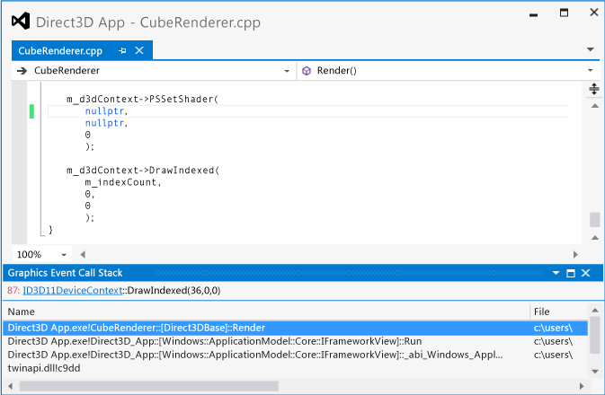
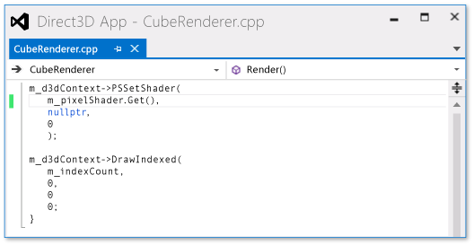
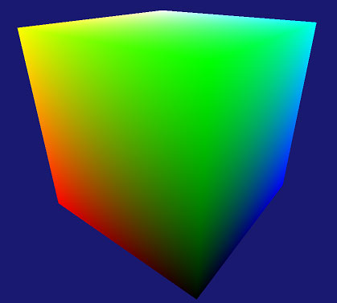

# Walkthrough: Missing Objects Due to Misconfigured Pipeline
[!INCLUDE[vs2017banner](../includes/vs2017banner.md)]

This walkthrough demonstrates how to use the [!INCLUDE[vsprvs](../includes/vsprvs-md.md)] Graphics Diagnostics tools to investigate an object that's missing due to an unset pixel shader.  
  
 This walkthrough illustrates these tasks:  
  
- Using the **Graphics Event List** to locate potential sources of the problem.  
  
- Using the **Graphics Pipeline Stages** window to examine the effect of the `DrawIndexed` Direct3D API call.  
  
- Inspecting the device context to confirm that a shader stage was not set.  
  
- Using the **Graphics Pipeline Stages** window together with the **Graphics Event Call Stack** to help find the source of the unset pixel shader.  
  
## Scenario  
 When an object is missing in a 3-D app, it's sometimes because one of the shader stages is not set before the object is rendered. In apps that have simple rendering needs, the source of this error is usually located somewhere in the call stack of the object's draw call. However, as an optimization, some apps batch together objects that have shader programs, textures, or other data in common to minimize state-change overhead. In these apps, the source of the error might be buried in the batching system, rather than located in the call stack of the draw call. The scenario in this walkthrough demonstrates an app that has simple rendering needs, and so the source of the error can be found in the call stack.  
  
 In this scenario, when the app is run to test it, the background is rendered as expected, but one of the objects doesn't appear. By using Graphics Diagnostics, you capture the problem to a graphics log so that you can debug the app. The problem looks like this in the app:  
  
   
  
## Investigation  
 By using the Graphics Diagnostics tools, you can load the graphics log document to inspect the frames that were captured during the test.  
  
#### To examine a frame in a graphics log  
  
1. In [!INCLUDE[vsprvs](../includes/vsprvs-md.md)], load a graphics log document that contains a frame that exhibits the missing object. A new graphics log tab appears in [!INCLUDE[vsprvs](../includes/vsprvs-md.md)]. In the top part of this tab is the render target output of the selected frame. In the bottom part is the **Frame List**, which displays each captured frame as a thumbnail image.  
  
2. In the **Frame List**, select a frame that demonstrates that the object is not displayed. The render target is updated to reflect the selected frame. In this scenario, the graphics log tab looks like this:  
  
      
  
   After you select a frame that demonstrates the problem, you can begin to diagnose it by using the **Graphics Event List**. The **Graphics Event List** contains every Direct3D API call that was made to render the active frame—for example, to set up device state, to create and update buffers, and to draw objects that appear in the frame. Many kinds of calls—for example, Draw, Dispatch, Copy, or Clear calls—are interesting because there is often (but not always) a corresponding change in the render target when the app is working as expected. Draw calls are particularly interesting because each one represents geometry that the app rendered.  
  
   Because you know that the render target doesn't contain the missing object but also that there do not appear to be other errors, you can use the **Graphics Event List** together with the **Graphics Pipeline Stages** tool to determine which draw call corresponds to the missing object's geometry. The **Graphics Pipeline Stages** window shows the geometry that was sent to each draw call, regardless of its effect on the render target. As you move through the draw calls, the pipeline stages are updated to show the geometry that's associated with each call as it flows through each enabled stage, and the render target output is updated to show the state of the render target after the call is completed.  
  
#### To find the draw call for the missing geometry  
  
1. Open the **Graphics Event List** window. On the **Graphics Diagnostics** toolbar, choose **Event List**.  
  
2. Open the **Graphics Pipeline Stages** window. On the **Graphics Diagnostics** toolbar, choose **Pipeline Stages**.  
  
3. As you move through each draw call in the **Graphics Event List** window, watch the **Graphics Pipeline Stages** window for the missing object. To make this easier, enter "Draw" in the **Search** box in the upper-right corner of the **Graphics Event List** window. This filters the list so that it only contains events that have "Draw" in their titles.  
  
    In the **Graphics Pipeline Stages** window, the **Input Assembler** stage shows the object's geometry before it's transformed, and the **Vertex Shader** stage shows the same object after it's transformed. In this scenario, notice that the **Graphics Pipeline Stages** window shows the **Input Assembler** and  **Vertex Shader** stages, but not the **Pixel Shader** stage for one of the draw calls.  
  
   > [!NOTE]
   > If other pipeline stages—for example, the hull shader, domain shader, or geometry shader stages—process the object, any of them might be the cause of the problem. Typically, the problem is related to the earliest stage in which the result is not displayed or is displayed in an unexpected way.  
  
4. Stop when you reach the draw call that corresponds to the missing object. In this scenario, the **Graphics Pipeline Stages** window indicates that the geometry was issued to the GPU (indicated by the presence of the **Input Assembler** stage) and transformed (indicated by the **Vertex Shader** stage), but doesn't appear in the render target because there doesn't seem to be an active pixel shader (indicated by the absence of the **Pixel Shader** stage). In this scenario, you can even see the silhouette of the missing object in the **Output Merger** stage:  
  
      
  
   After you confirm that the app issued a draw call for the missing object's geometry and discover that the pixel shader stage was inactive, you can examine the device state to confirm your findings. You can use the **Graphics Object Table** to examine device context and other Direct3D object data.  
  
#### To examine device context  
  
1. Open the **d3d11 device context**. In the **Graphics Pipeline Stages** window, choose the **ID3D11DeviceContext** link that’s part of the `DrawIndexed` call that's displayed at the top of the window.  
  
2. Examine the device state that's displayed in the **d3d11 device context** tab to confirm that no pixel shader was active during the draw call. In this scenario, the **shader general information**—displayed under **pixel shader state**—indicates that the shader is **NULL**:  
  
      
  
   After you confirm that the pixel shader was set to null by your app, the next step is to find the location in your app's source code where the shader is set. You can use the **Graphics Event List** together with the **Graphics Event Call Stack** to find this location.  
  
#### To find where the pixel shader is set in your app's source code  
  
1. Find the `PSSetShader` call that corresponds to the missing object. In the **Graphics Event List** window, enter "Draw;PSSetShader" in the **Search** box in the upper-right corner of the **Graphics Event List** window. This filters the list so that it only contains "PSSetShader" events, and events that have "Draw" in their titles. Choose the first `PSSetShader` call that appears before the draw call of the missing object.  
  
   > [!NOTE]
   > `PSSetShader` won't appear in the **Graphics Event List** window if it was not set during this frame. Usually this occurs only if just one pixel shader is used for all objects, or if the `PSSetShader` call was unintentionally skipped during this frame. In either case, we recommend that you search the app's source code for `PSSetShader` calls, and use traditional debugging techniques to examine the behavior of these calls.  
  
2. Open the **Graphics Event Call Stack** window. On the **Graphics Diagnostics** toolbar, choose **Graphics Event Call Stack**.  
  
3. Use the call stack to locate the `PSSetShader` call in your app's source code. In the **Graphics Event Call Stack** window, choose the top-most call and examine the value that the pixel shader is being set to. The pixel shader might be set directly to null, or the null value might occur because of an argument that was passed into the function or other state. If it's not set directly, you might be able to locate the source of the null value somewhere up the call stack. In this scenario, you discover that the pixel shader is being set directly to `nullptr` in the top-most function, which is named `CubeRenderer::Render`:  
  
      
  
   > [!NOTE]
   > If you can't locate the source of the null value just by examining the call stack, we recommend that you set a conditional breakpoint on the `PSSetShader` call, such that execution of the program breaks when the pixel shader will be set to null. Then restart the app in debug mode and use traditional debugging techniques to locate the source of the null value.  
  
   To fix the problem, assign the correct pixel shader by using the first parameter of the `ID3D11DeviceContext::PSSetShader` API call.  
  
     
  
   After you fix the code, you can rebuild it and run the app again to verify that the rendering issue is solved:  
  
   
