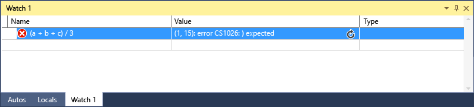
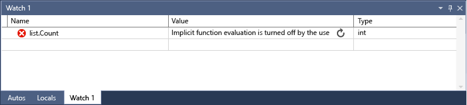

# Watch and QuickWatch Windows
[!INCLUDE[vs2017banner](../includes/vs2017banner.md)]

You can use the **Watch** (**Debug / Windows / Watch / Watch (1, 2, 3, 4)**) and **QuickWatch** (right-click on variable / **Debug / QuickWatch**) windows to watch variables and expressions during a debugging session.  The difference is that the **Watch** window can display several variables, while the **QuickWatch** window displays a single variable at a time.  
  
## Observing a single variable with QuickWatch  
 You can use the **QuickWatch** window to observe a single variable. For example, if you have the following code:  
  
```csharp  
static void Main(string[] args)  
{  
    int a, b;  
    a = 1;  
    b = 2;  
    for (int i = 0; i < 10; i++)  
    {  
        a = a + b;  
    }   
}  
```  
  
 You can observe the a variable in the QuickWatch window as follows:  
  
1. Set a breakpoint on the `a = a + b;` line.  
  
2. Start debugging. Execution stops at the breakpoint.  
  
3. Open the **QuickWatch** window (right-click on a, then choose **Debug / QuickWatch**, or **SHIFT+F9**).You can open the window and add the a variable to the **Expression** window, then click **Reevaluate**. You should see the a variable in the **Values** window, with a value of 2.  
  
4. The **QuickWatch** window is a modal dialog window, so you can’t continue debugging as long as it is open. You can add the variable to the **Watch** window by clicking **Add Watch**.  
  
5. Close the **QuickWatch** window. Now you can continue debugging while you observe the value in the **Watch** window  
  
## Observing variables with the Watch window  
 You can observe multiple variables with the **Watch** window. For example, if you have the following code:  
  
```csharp  
static void Main(string[] args)  
{  
    int a, b, c;  
    a = 1;  
    b = 2;  
    c = 0;  
  
     for (int i = 0; i < 10; i++)  
    {  
        a++;  
        b *= 2;  
        c = a + b;  
     }  
}  
  
```  
  
 Add the values of the three variables to the Watch window as follows:  
  
1. Set a breakpoint on the `c = a + b;` line.  
  
2. Start debugging (**F5**). Execution stops at the breakpoint.  
  
3. Open the Watch window (**Debug / Windows / Watch / Watch 1**, or **CTRL+ALT+W, 1**).  
  
4. Add the `a` variable to the first row, the `b` variable to the second row, and the `c` variable to the third row.  
  
5. Continue debugging.  
  
   You should see the variable values changing as you iterate through the `for` loop.  
  
   If you are programming in native code, you may sometimes need to qualify the context of a variable name or an expression containing a variable name. The context is the function, source file, and module where a variable is located. If you have to do this, you can use the context operator syntax. For more information, see Expressions in C++.  
  
## Observing expressions with the Watch window  
 Now let’s try using an expression instead. You can add any valid expression recognized by the debugger.  
  
 For example, if you have the code listed in the preceding section, you can get the average of the three values like this:  
  
   
  
 In general, the rules for evaluating expressions in the **Watch** window are the same as the rules for evaluating expressions in your coding language. If your expression has a syntax error, you can expect the same compiler error that you would see in the code editor. Here’s an example:  
  
   
  
## <a name="bkmk_refreshWatch"></a> Refreshing Watch values that are out of date  
 In certain circumstances you might see a refresh icon (a circle with two arrows, or a circle with two wavy lines) when an expression is evaluated in the **Watch** window.  For example, if you have property evaluation turned off (**Tools / Options / Debugging / Enable property evaluation and other implicit function calls**), and you have the following code:  
  
```csharp  
static void Main(string[] args)  
{  
    List<string> list = new List<string>();  
    list.Add("hello");  
    list.Add("goodbye");  
}  
  
```  
  
 If you set a watch on the `Count` property of the list, you should see something like the following:  
  
   
  
 This indicates an error or a value that is out of date. You can generally refresh the value by clicking on the icon, but in some cases you might prefer not to refresh it. First you need to know why the value was not evaluated.  
  
 If you point to the icon, a tooltip provides information about why the expression was not evaluated.  If the circling arrows appear, the expression was not evaluated for one of the following reasons:  
  
- •   An error occurred as the expression was being evaluated. For example, a time-out might have occurred, or a variable might have been out of scope.  
  
- •   The expression contains a function call which could trigger a side effect in the application (see [Side Effects and Expressions](#bkmk_sideEffects)).  
  
- Automatic evaluation of properties and implicit functions calls by the debugger is turned off (**Tools / Options / Debugging / Enable property evaluation and other implicit function calls**), and then the expression cannot be automatically evaluated.  
  
  To refresh the value, click the refresh icon or press the spacebar. The debugger will try to reevaluate the expression. If the refresh icon appeared because automatic evaluation of properties and implicit side effects was turned off, the expression can be evaluated.  
  
  If you see an icon that is a circle with two wavy lines that resemble threads, the expression was not evaluated because of a potential cross-thread dependency. In other words, evaluating the code requires other threads in your application to run temporarily. When you are in break mode, all threads in your application are typically stopped. Allowing other threads to run temporarily can have unexpected effects on the state of your program and causes the debugger to ignore events such as breakpoints and exceptions thrown on those threads.  
  
## <a name="bkmk_sideEffects"></a> Side Effects and Expressions  
 Evaluating some expressions can change the value of a variable or otherwise affect the state of your program. For example, evaluating the following expression changes the value of `var1`:  
  
```  
var1 = var2  
```  
  
 This is called  a [side effect](https://en.wikipedia.org/wiki/Side_effect_\(computer_science\)). Side effects can make debugging more difficult by changing the way your program operates.  
  
 An expression that is known to have side effects is  evaluated only once, when you first enter it. Subsequent evaluations are disabled. You can manually override this behavior by clicking the update icon that appears next to the value.  
  
 One way to avoid all side effects is to turn off automatic function evaluation (**Tools / Options / Debugging / Enable property evaluation and other implicit function calls**).  
  
 When evaluation of properties or implicit function calls is turned off, you can force evaluation by using the **ac** format modifier (for C# only). See [Format Specifiers in C#](../debugger/format-specifiers-in-csharp.md).  
  
## Using Object IDs in the Watch window (C# and Visual Basic)  
 There are times when you want to observe the behavior of a specific object; for example, you might want to track an object referred to by a local variable after that variable has gone out of scope. In C# and Visual Basic, you can create object IDs for specific instances of reference types and use them in the Watch window and in breakpoint conditions. The object ID is generated by the common language runtime (CLR) debugging services and associated with the object.  
  
> [!NOTE]
> Object IDs create weak references, and do not prevent the object from being garbage collected. They are valid only for the current debugging session.  
  
 In the following code one method creates a `Person` using a local variable, but you want to find out what the `Person`’s name is in a different method:  
  
```csharp  
class Person  
{  
    public Person(string name)  
    {  
        Name = name;  
    }  
    public string Name { get; set; }  
}  
  
public class Program  
{  
    List<Person> _people = new List<Person>();  
    public static void Main(string[] args)  
    {  
        MakePerson();  
        DoSomething();  
    }  
  
    private static void MakePerson()  
    {  
        var p = new Person("Bob");  
        _people.Add(p);  
    }  
  
    private static void DoSomething()  
    {  
        // more processing  
         Console.WriteLine("done");  
    }  
}  
  
```  
  
 You can add a reference to that `Person` object in the **Watch** window as follows:  
  
1. Set a breakpoint in the code some time after the object has been created.  
  
2. Start debugging, and when execution stops in the breakpoint, find the variable in the **Locals** window, right-click it, and select **Make Object ID**.  
  
3. You should see a **$** plus a number in the **Locals** window. This is the object ID.  
  
4. Add the object ID to the Watch window.  
  
5. Set a breakpoint where you want to observe the object’s behavior.  In the code above, that would be in the `DoSomething()` method.  
  
6. Continue debugging, and when execution stops in the `DoSomething()` method, the **Watch** window displays the `Person` object.  
  
> [!NOTE]
> If you want to see the object’s properties, such as `Person.Name` in the example above, you must have enabled property evaluation .  
  
## Using registers in the Watch window (C++ only)  
 If you are debugging native code, you can add register names as well as variable names using **$\<register name>** or **@\<register name>**.  For more information, see [Pseudovariables](../debugger/pseudovariables.md).  
  
## DynamicView and the Watch window  
 Some scripting languages (e.g. JavaScript or Python) use dynamic or [duck typing](https://en.wikipedia.org/wiki/Duck_typing), and .NET languages (in version 4.0 and later) support objects that are difficult to observe using the normal debugging windows, because they may have runtime properties and methods that cannot be displayed.  
  
 When the Watch window displays a or an object created from a type that implements the <xref:System.Dynamic.IDynamicMetaObjectProvider>, the debugger adds a special **Dynamic View**  node to the **Autos** display. This node shows the dynamic members of the dynamic object but does not allow editing of the member values.  
  
 If you right-click any child of a **Dynamic View** and choose **Add Watch**, the debugger inserts a new watch variable that casts an object to a dynamic object. In other words, **object Name** becomes (**(dynamic)object).Name**.  
  
 Evaluating the members of a **Dynamic View** can have side effects. For an explanation of what side effects are, see [Side Effects and Expressions](#bkmk_sideEffects). For C#, the debugger does not automatically reevaluate the values shown in the **Dynamic View** when you step to a new line of code. For Visual Basic, expressions added through the **Dynamic View** are automatically refreshed.  
  
 For instructions about how to refresh the Dynamic View values, see [Refreshing Watch values that are out of date](#bkmk_refreshWatch).  
  
 If you want to display only the **Dynamic View** for an object, you can use the **dynamic** format specifier:  
  
- C#: **ObjectName, dynamic**  
  
- Visual Basic:: **$dynamic, ObjectName**  
  
  The **Dynamic View** also enhances the debugging experience for COM objects. When the debugger encounters a COM object wrapped in **System.__ComObject**, it adds a **Dynamic View** node for the object.  
  
## See Also  
 [Debugger Windows](../debugger/debugger-windows.md)
