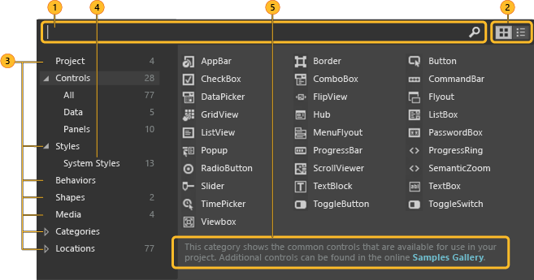
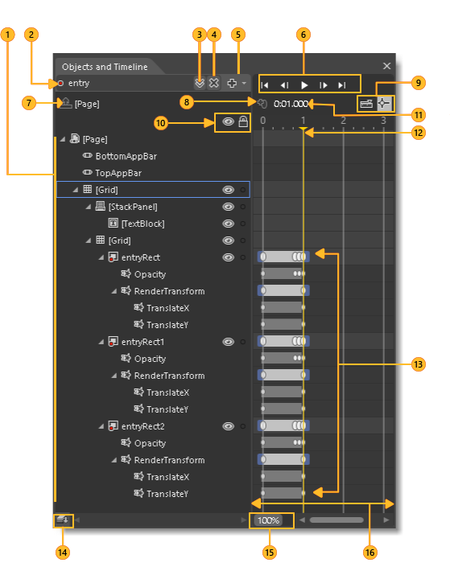
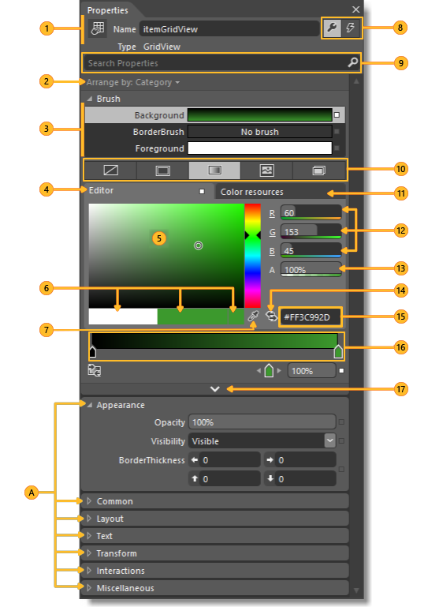

# Creating a UI by using Blend for Visual Studio
[!INCLUDE[vs2017banner](../includes/vs2017banner.md)]

Blend for Visual Studio helps you design XAML-based Windows desktop, web, [Windows Phone](https://msdn.microsoft.com/library/windowsphone/develop/jj683071.aspx), and [Windows Store](https://msdn.microsoft.com/library/windows/apps/jj129478.aspx) apps. It provides the same basic XAML design experience as Visual Studio and adds visual designers for advanced tasks such as animations and behaviors.

 Since Blend for Visual Studio is included as a part of Visual Studio, you don't need to download it. However, you need to select it in the Visual Studio installer for it to install on your system.

 If you’re new to Blend for Visual Studio, take a moment to become familiar with the unique features of the workspace. This topic takes you on a quick tour.

> [!NOTE]
> To tour the shared design features such as the artboard, Document Outline window, and Device window, see [Creating a UI by using XAML Designer](../designers/creating-a-ui-by-using-xaml-designer-in-visual-studio.md).

 **In this topic**:

- [Tour of the Tools panel](#Tools)

- [Tour of the Assets panel](#Assets)

- [Tour of the Objects and Timeline panel](#Objects)

- [Tour of the Properties panel](#Properties)

##  Tour of the Tools panel
 You can use the **Tools** panel in Blend for Visual Studio to create and modify objects in your application. You create the objects by selecting a tool and drawing on the artboard with your mouse.

 

|||||
|-|-|-|-|
||**Selection tools** Select objects and paths.   Use the **Direct Selection** tool to select nested objects and path segments.||**Gradient and brush tools**|
||**View tools** Adjust the view of the artboard, such as for panning and zooming.||**Path tools**|
||**Brush tools** Work with the visual attributes of an object, such as transforming a brush, painting an object, or selecting the attributes of one object to apply them to another object.||**Shape tools**|
||**Object tools** Draw the most common objects on the artboard, such as paths, shapes, layout panels, text, and controls.||**Layout panels**|
||**Asset tools** Access the **Assets** panel and to show the most recently used asset from the library.||**Text controls**|
||||**Common controls**|

 **Watch a short video:**  [The Toolbar](https://www.youtube.com/watch?v=VkdUJcvoo54&list=PLBDF977B2F1DAB358&index=4).

##  Tour of the Assets panel
 You can find all controls in the **Assets** panel, similar to the **Toolbox** in Visual Studio. In addition to controls, you’ll find everything you can add to your artboard in the **Assets** panel, including styles, media, behaviors, and effects.

 

|||
|-|-|
||**Search box** Type in the **Search** box to filter the list of assets.|
||**Grid mode and List mode** Switch between the **Grid mode** view and the **List mode** view of assets.|
||**Assets categories** Click a category or subcategory to view the list of assets in that category.|
||**Styles** Show all the styles that are contained in the resource dictionary.|
||**Description** View a description of the selected assets category or subcategory.|

##  Tour of the Objects and Timeline panel
 Use this panel to organize the objects on your artboard and, if you want, to animate them.

 

|||
|-|-|
||**Objects view** View a visual tree of a document. You can drill down to varying levels of detail. You can also add layers to further organize objects on the artboard. That way you can lock and hide them as a group.|
||**Record mode indicator** See whether you’re recording property changes in a timeline.|
||**Storyboard picker** View a list of storyboards that you’ve created.|
||**Close storyboard** Close the current storyboard.|
||**Storyboard options** Create, duplicate, reverse, delete, rename, or close a storyboard.|
||**Playback controls** Navigate through the timeline. You can also drag the playhead to navigate through (or *scrub*) the timeline.|
||**Return scope to** Scope the objects view back to the previous root object or previous scope. You can do this only when you’re modifying a style or template.|
||**Record a keyframe** Record a snapshot of the properties of the selected object at the current point in time.|
||**Snapping options** Set timeline snapping, snap resolution, and turn off timeline snapping.|
||**Show/hide**, **Lock/unlock** Show or hide the visibility and locking options for the objects view.|
||**Playhead position on the timeline** Show the current time in milliseconds. You can also enter a time value directly in this field to jump to a particular point in time. The precision depends on the snap resolution set in the **Snapping Options**.|
||**Playhead** Determine what point in time the animation is at. You can drag the playhead across the timeline to preview animation.|
||**Keyframes set on timelines** Change a property value at a specific point in time.|
||**Change order of objects** Set the display order of objects. Click this button to arrange objects in the structure view by Z order (front-to-back) or by markup order (the order in which they appear in **XAML** view).|
||**Timeline zoom** Set the zoom resolution of the timeline. Zooming in lets you edit an animation with more detail, and zooming out shows more of an overview of what is happening over longer periods of time. If you zoom in but can't set a keyframe at the position in time that you want, verify that the snap resolution is set high enough.|
||**Timeline composition area** View the timeline, and move keyframes around by dragging them or using their shortcut menus.|

##  Tour of the Properties panel
 Use this panel to view and modify the properties of an object. You can also set them directly on the artboard. If you do, the property changes will be reflected in the **Properties** panel.

 

 **Categories** Expand and collapse categories of properties. Click **Expand**  and **Collapse**  to show or hide category details.

|                                                                                                         |                                                                                                                                                                                                                                  |
|---------------------------------------------------------------------------------------------------------|----------------------------------------------------------------------------------------------------------------------------------------------------------------------------------------------------------------------------------|
|                                                                  |                                                                              **Name and Type** View the icon, name and type of the selected object.                                                                              |
|                                                                  |                                                                          **Arrange by** Arrange properties alphabetically by name, source, or category.                                                                          |
|                                                                  |                                                        **Brush properties** Set the visual properties for brushes such as Fill brush, Stroke brush, and Foreground brush.                                                        |
|                                                                  |                                                                                    **Color editor** Use for solid color and gradient brushes.                                                                                    |
|                                                                  |                                                                                                 **Color picker** Select a color.                                                                                                 |
|                                                                  |                                                                              **Color chips** View the initial color, current color, and last color                                                                               |
|                                                                  | **Eyedroppers** Use the color of any element on your screen. The **Color eyedropper** is available when the **Solid color brush** is selected. The **Gradient eyedropper** is available when the **Gradient brush** is selected. |
|                                                                  |                                                                        **Properties and Events** Set properties or choose events for a selected element.                                                                         |
|                                                                  |                                                         **Search box** Search for properties. Filter the properties that are displayed by typing in the **Search** box.                                                          |
|  |                                **Brush editor tabs** Use to select a brush editor. You can choose **No brush**, **Solid Color brush**, **Gradient brush**, **Tile brush**, or **Brush resource**.                                |
|                                                                |                                    **Color resources** Apply the exact same color to different properties. The **Color Resources** tab includes **Local Resources** and **System Resources**.                                    |
|                                                                |                                                 **RGB color space** Modify the color by adjusting the values for the **R**,  **G**, or **B** (red, green, blue) number editors.                                                  |
|                                                                |                                                                        **Alpha channel** Modify the Alpha value by using the number editor next to **A**.                                                                        |
|  |                                       **Convert color to resource** Convert the selected color to a color resource. Color resources are available when you click the Color resources tab.                                        |
|                                                                |                                                                                 **Hex value** View the hexadecimal value of the color displayed.                                                                                 |
|                                          |                                                                                **Gradient slider** Appears only if a gradient brush is selected.                                                                                 |
|  |                                                                     **Show advanced properties** View categories of properties that are less commonly used.                                                                      |

 **Watch a short video:**  [Properties panel](https://www.youtube.com/watch?v=HCqQfiobdag&list=PLBDF977B2F1DAB358&index=7).

## See Also
 [Insert controls and modify their behavior](../designers/insert-controls-and-modify-their-behavior-in-xaml-designer.md)
 [Animate objects](../designers/animate-objects-in-xaml-designer.md)
 [Draw shapes and paths](../designers/draw-shapes-and-paths.md)
 [Designing XAML in Visual Studio and Blend for Visual Studio](../designers/designing-xaml-in-visual-studio.md)
