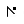

# Direct Selection tool modifier keys in Blend
[!INCLUDE[vs2017banner](../includes/vs2017banner.md)]

The following table lists shortcuts that you can use to modify the shape of an existing path with the **Direct Selection** tool . To add or remove points on an existing path, or to join two existing paths, use the **Pen** tool.

|To do this action|Do this|Pointer|
|-----------------------|-------------|-------------|
|Make tangent handles appear for a point on a path|Click a point on a path|   Move point pointer|
|Move a point on a path|Drag a point on a path|   Move point pointer|
|Make tangent handles appear for a segment between two points on a path|Click a segment of a path|   Move segment pointer|
|Move a segment between two points on a path|Drag a segment of a path|   Move segment pointer|
|Change the angle of a tangent for a point on a path|Click a point or a segment of a path to make the tangent handles appear, and then drag one of the tangent end points|   Move tangent pointer|
|Make a point into a sharp corner or reduces the tangent to zero|Hover over a point, hold down ALT, and then click the point|   Convert point pointer|
|Make any sharp corner smooth (or, if it's already smooth, change the angle of the curve as it passes through the clicked point)|Hover over a point, hold down ALT, and then drag the point|   Convert point pointer|
|Change a curve segment into a straight line|Hover over a segment in a path, hold down ALT, and then click the segment|   Convert segment pointer|
|Take a segment and bend it into a curve to pass through the pointer position|Hover over a segment in a path, hold down ALT, and then drag the segment|   Convert segment pointer|
|Adjust one end of a tangent independently of the other side|Direct-select a point or a segment, hold down ALT, and then drag a tangent end point|   Convert tangent pointer|

## See Also
 [Keyboard shortcuts and modifier keys](../designers/keyboard-shortcuts-and-modifier-keys-in-blend.md)
 [Artboard modifier keys](../designers/artboard-modifier-keys-in-blend.md)
 [Pen tool modifier keys](../designers/pen-tool-modifier-keys-in-blend.md)
 [Draw shapes and paths](../designers/draw-shapes-and-paths.md)
