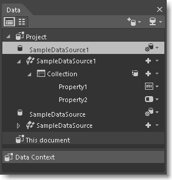
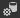

# Display data in Blend
[!INCLUDE[vs2017banner](../includes/vs2017banner.md)]

You can view sample data in your designer as you customize the layout of your pages. You can generate sample data from scratch or by using an existing class. You can also connect to *Live data* that will appear in your app when you run it.

 **In this topic:**

- [Generate sample data](#Scratch)

- [Generate sample data from a class](#Existing)

- [Show live data in a WPF application](#LiveWPF)

- [Show live data in a Store or Phone app](#LiveStore)

##  Generate sample data
 To generate sample data, open a XAML document. In the **Data** panel, choose the **Create sample data** button, and then choose **New Sample Data**.

 Define the structure of your data in the **Data** panel, and then bind it to UI elements on any page.

 

 If you want your sample data to appear in your pages when you run the app, choose **Data source options** , and then choose **Enable When Running Application**.

 

 **Watch a short video:**  [Create sample data from scratch](https://www.bing.com/videos/search?q=blend%20data&qs=n&form=QBVR&pq=blend%20data&sc=8-7&sp=-1&sk=#view=detail&mid=F8F2449A76956D480FD2F8F2449A76956D480FD2).

 **Watch a short video:**  [Mixing up some data binding with Blend](https://www.youtube.com/watch?v=LSwPB6CAvjg).

##  Generate sample data from a class
 If you’ve already created classes that describe the structure of your data, you can generate sample data from them.

 To generate sample data from a class, open a XAML document, and then in the **Data** panel, click the **Create sample data** button, and then click **Create Sample Data from Class**.

 **Watch a short video:**  [Create sample data from a class](https://channel9.msdn.com/Shows/Inside+Windows+Phone/IWP54--Windows-Phone-Data-Binding-and-the-Magic-of-XAML).

 **Watch a short video:**  [Mixing up some data binding with Blend](https://www.youtube.com/watch?v=LSwPB6CAvjg).

##  Show live data in a WPF application
 **Watch a short video:**  [Create an XML data source](https://www.youtube.com/watch?v=RjQueappjqk&feature=youtube_gdata).

##  Show live data in a Store or Phone app
 See [Working with data and files (XAML)](https://msdn.microsoft.com/library/windows/apps/xaml/br229562.aspx).

## See Also
 [Creating a UI by using Blend for Visual Studio](../designers/creating-a-ui-by-using-blend-for-visual-studio.md)
