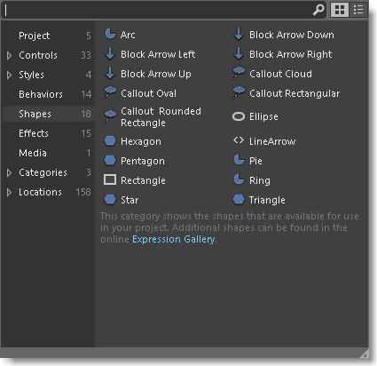
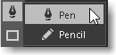
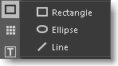
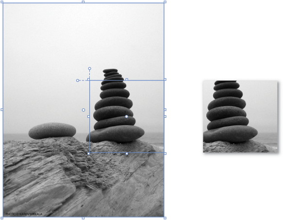

# Draw shapes and paths
[!INCLUDE[vs2017banner](../includes/vs2017banner.md)]

In XAML Designer, a *shape* is exactly what you’d expect. For example: a rectangle, circle, or ellipse. A *path* is a more flexible version of a shape. You can do things like reshape them or combine them together to form new shapes.

 Shapes and paths use vector graphics so they scale well to high resolution displays. If you want to learn more about vector graphics, see [What are Vector Graphics](https://www.youtube.com/watch?v=MoCSwF0n-io) or [vector graphics](https://www.webopedia.com/TERM/V/vector_graphics.html).

 **In this topic:**

- [Draw a shape](#Shape)

- [Draw a path](#Path)

- [Convert a shape to a path](#Convert)

- [Combine paths](#Combine)

- [Create a compound path](#Compound)

- [Create a clipping path](#Clipping)

##  Draw a shape
 You can find shapes in the **Assets** panel.

 

 Drag any shape that you want to the artboard. Then, you can use handles on the shape to scale, rotate, move, or skew the shape.

 

##  Draw a path
 A path is a series of connected lines and curves. Use a path to create interesting shapes that are not available in the **Assets** panel.

 You can draw a path by using a line, pen or pencil. You can find these tools in the **Tools** panel.

  

### Draw a straight line
 Use the **Pen** tool , or the **Line** tool .

 **Using the Pen tool** 

 On the artboard, click once to define the start point, and then click again to define the end of the line.

 **Using the Line tool** 

 On the artboard, drag from where you want the line to start, and then release at the point where you want the line to end.

### Draw a curve
 Use the **Pen** tool .

 On the artboard, click once to define the start point of a line, and then click and drag your pointer to create the desired curve.

 If you want to close the path, click the first point on the line.

### Change the shape of a curve
 Use the **Direct selection** tool .

 Click the shape, and then drag any point on the shape to change curve shapes.

### Draw a free-form path
 Use the **Pencil** tool .

 On the artboard, draw a free-form path just as you would by using a real pencil.

### Remove part of a path
 Use the **Direct selection** tool .

 Select the path that contains the segment you want to delete, and then click the **Delete** button.

### Remove a point in a path
 Use the **Selection** tool  , and the **Pen** tool .

 Use the **Selection** tool   to select the path. Then, use the **Pen** tool  to click the point that you want to remove.

### Add a point to a path
 Use the **Selection** tool  , and the **Pen** tool .

 Use the **Selection** tool   to select the path. Use the **Pen** tool  to click anywhere on the path where you want to add the point.

##  Convert a shape to a path
 To modify a shape in the same ways that you modify a path, convert the shape to a path.

 **Watch a short video:**  [Working with paths: Convert a shape to a path](https://www.youtube.com/watch?v=Io5bC0-nH6Q#t=147).

##  Combine paths
 You can combine paths and shapes into a single path.

 

|||||
|-|-|-|-|
||Two shapes before combining||Intersect|
||Unite||Exclude Overlap|
||Divide||Subtract|

 **Watch a short video:**  [Working with paths: Combine paths](https://www.youtube.com/watch?v=Io5bC0-nH6Q#t=195).

##  Create a compound path
 When you create a compound path, any intersecting parts of the paths are subtracted from the result, and the resulting path takes on the visual properties of the bottommost path.

 You can break apart a compound path any time after you create it.

 

 **Watch a short video:**  [Working with paths: Create a compound path](https://www.youtube.com/watch?v=Io5bC0-nH6Q).

##  Create a clipping path
 A clipping path is a path or shape that is applied to another object, hiding the parts of the masked object that fall outside the clipping path.

 

 **Watch a short video:**  [Working with paths: Create a clipping path](https://www.youtube.com/watch?v=Io5bC0-nH6Q#t=232).

## See Also
 [Creating a UI by using Blend for Visual Studio](../designers/creating-a-ui-by-using-blend-for-visual-studio.md)
