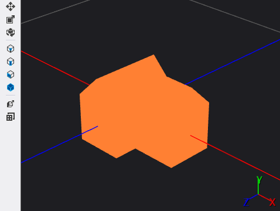

# How to: Apply a Shader to a 3-D Model
[!INCLUDE[vs2017banner](../includes/vs2017banner.md)]

This document demonstrates how to use the Model Editor to apply a Directed Graph Shader Language (DGSL) shader to a 3-D model.

 This document demonstrates this activity:

- Applying a shader to a 3-D model

## Applying a shader to a 3-D model
 You can apply a shader effect to a 3-D model to give it an interesting appearance.

 Before you begin, make sure that the **Properties** window is displayed.

#### To apply a shader to a 3-D model

1. Begin with a 3-D scene that contains one or more models. If you don't have a suitable 3-D scene, create one as described in [How to: Create a Basic 3-D Model](../designers/how-to-create-a-basic-3-d-model.md). You also have to have a DGSL shader that you can apply to the model. If you don't have a suitable shader, create one as described in [How to: Create a Basic Color Shader](../designers/how-to-create-a-basic-color-shader.md) and make sure that you have saved it to a file before you continue.

2. In **Select** mode, select the model that you want to apply the shader to, and then in the **Properties** window, in the **Filename** property of the **Effect** property group, specify the DGSL shader that you want to apply to the model.

   Here's a model that has the basic color effect applied to it:

   

   After you apply a shader to a model, you can open it in the Shader Designer by selecting the model, and then in the **Properties** window, in the **(Advanced)** property of the **Effect** property group, choosing the ellipsis (**...**) button.

## See Also
 [How to: Create a Basic 3-D Model](../designers/how-to-create-a-basic-3-d-model.md)
 [How to: Create a Basic Color Shader](../designers/how-to-create-a-basic-color-shader.md)
 [Model Editor](../designers/model-editor.md)
 [Shader Designer](../designers/shader-designer.md)
