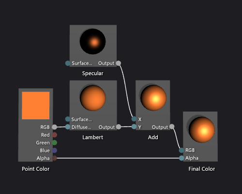
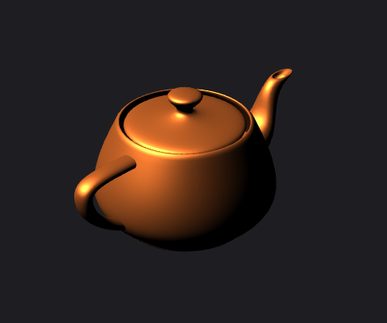

# How to: Create a Basic Phong Shader
[!INCLUDE[vs2017banner](../includes/vs2017banner.md)]

This document demonstrates how to use the Shader Designer and the Directed Graph Shader Language (DGSL) to create a lighting shader that implements the classic Phong lighting model.

 This document demonstrates these activities:

- Adding nodes to a shader graph

- Disconnecting nodes

- Connecting nodes

## The Phong lighting model
 The Phong lighting model extends the Lambert lighting model to include specular highlighting, which simulates the reflective properties of a surface. The specular component provides additional illumination from the same directional light sources that are used in the Lambert lighting model, but its contribution to the final color is processed differently. Specular highlighting affects every surface in the scene differently, based on the relationship between the view direction, the direction of the light sources, and the orientation of the surface. It's a product of the specular color, specular power, and orientation of the surface, and the color, intensity, and direction of the light sources. Surfaces that reflect the light source directly at the viewer receive the maximum specular contribution and surfaces that reflect the light source away from the viewer receive no contribution. Under the Phong lighting model, one or more specular components are combined to determine the color and intensity of specular highlighting for each point on the object, and then are added to the result of the Lambert lighting model to produce the final color of the pixel.

 For more information about the Lambert lighting model, see [How to: Create a Basic Lambert Shader](../designers/how-to-create-a-basic-lambert-shader.md).

 Before you begin, make sure that the **Properties** window and the **Toolbox** are displayed.

#### To create a Phong shader

1. Create a Lambert shader, as described in [How to: Create a Basic Lambert Shader](../designers/how-to-create-a-basic-lambert-shader.md).

2. Disconnect the **Lambert** node from the **Final Color** node. Choose the **RGB** terminal of the **Lambert** node, and then choose **Break Links**. This makes room for the node that's added in the next step.

3. Add an **Add** node to the graph. In the **Toolbox**, under **Math**, select **Add** and move it to the design surface.

4. Add a **Specular** node to the graph. In the **Toolbox**, under **Utility**, select **Specular** and move it to the design surface.

5. Add the specular contribution. Move the **Output** terminal of the **Specular** node to the **X** terminal of the **Add** node, and then move the **Output** terminal of the **Lambert** node to the **Y** terminal of the **Add** node. These connections combine the total diffuse and specular color contributions for the pixel.

6. Connect the computed color value to the final color. Move the **Output** terminal of the **Add** node to the **RGB** terminal of the **Final Color** node.

   The following illustration shows the completed shader graph and a preview of the shader applied to a teapot model.

> [!NOTE]
> To better demonstrate the effect of the shader in this illustration, an orange color has been specified by using the **MaterialDiffuse** parameter of the shader, and a metallic-looking finish has been specified by using the **MaterialSpecular** and **MaterialSpecularPower** parameters. For information about material parameters, see the Previewing Shaders section in [Shader Designer](../designers/shader-designer.md).

 

 Certain shapes might provide better previews for some shaders. For more information about how to preview shaders in the Shader Designer, see the Previewing Shaders section in [Shader Designer](../designers/shader-designer.md)

 The following illustration shows the shader that's described in this document applied to a 3-D model. The **MaterialSpecular** property is set to (1.00, 0.50, 0.20, 0.00), and its **MaterialSpecularPower** property is set to 16.

> [!NOTE]
> The **MaterialSpecular** property determines the apparent finish of the surface material. A high-gloss surface such as glass or plastic tends to have a specular color that is a bright shade of white. A metallic surface tends to have a specular color that is close to its diffuse color. A satin-finish surface tends to have a specular color that is a dark shade of gray.
>
> The **MaterialSpecularPower** property determines how intense the specular highlights are. High specular powers simulate duller, more-localized highlights. Very low specular powers simulate intense, sweeping highlights that can oversaturate and conceal the color of the whole surface.

 

 For more information about how to apply a shader to a 3-D model, see [How to: Apply a Shader to a 3-D Model](../designers/how-to-apply-a-shader-to-a-3-d-model.md).

## See Also
 [How to: Apply a Shader to a 3-D Model](../designers/how-to-apply-a-shader-to-a-3-d-model.md)
 [How to: Export a Shader](../designers/how-to-export-a-shader.md)
 [How to: Create a Basic Lambert Shader](../designers/how-to-create-a-basic-lambert-shader.md)
 [Shader Designer](../designers/shader-designer.md)
 [Shader Designer Nodes](../designers/shader-designer-nodes.md)
