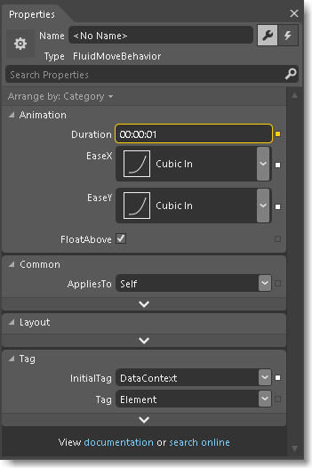

# Insert controls and modify their behavior in XAML Designer
[!INCLUDE[vs2017banner](../includes/vs2017banner.md)]

Controls enable users to interact with your app. You can use them to collect information and to perform actions such as animate an object or query a data source.

 **In this topic:**

- [Add controls to the artboard](#Insert)

- [Make controls do things](#Modify)

##  Add controls to the artboard
 You can drag controls from the **Assets** panel onto the **artboard**, and then modify them in the **Properties** window.

 

 These videos show you how to use some of the more common controls.

|Control|Watch a short video|
|-------------|-------------------------|
|`Menu` | [Add the controls](https://www.youtube.com/watch?v=ra4AHfgD4Ys&list=PLBDF977B2F1DAB358&index=45)|
|`Button` | [Design a button](http://www.popscreen.com/v/6A4gb/Microsoft-Expression-Blend-Designing-a-Button)|
|`Textblock` | [Add images to a textblock](http://www.popscreen.com/v/6A4du/Microsoft-Expression-Blend-Adding-Images-to-a-TextBlock)|
|`Slider` | [Build a Slider with a  ToolTip](https://www.bing.com/videos/search?q=slider%20expression%20blend&qs=n&form=QBVR&pq=slider%20expression%20blend&sc=1-23&sp=-1&sk=#view=detail&mid=F1BB7DB91B2772A8CA2AF1BB7DB91B2772A8CA2A)|
|`GridSplitter` | [Work with a GridSplitter](https://www.youtube.com/watch?v=bf4t6c8ms2w)|

### Make a control out of an image, shape, or path
 You can make any object into a control.

 

 For example, imagine a picture of a television in the center of a page. You could make controls out of small images that look like television buttons. Then, users could click those buttons to change the channel.

 This is possible because the buttons are now controls. With controls, you can respond to user interactions; in this case, when the user clicks a button.

 To make a control, select an object. Then, on the **Tools** menu, click **Make Control**.

##  Make controls do things
 Controls can perform actions when users interact with them. For example, they can start an animation, update a data source or play a video.

 Use *triggers*, *behaviors*, and *events* to make controls do things.

### Triggers
 A *trigger* changes a property or performs a task in response to an event or a change in another property. For example, you can change the color of a button when users hover over it.

 

 **Watch a short video:**  [Add a property trigger](http://www.popscreen.com/v/6A4gO/Microsoft-Expression-Blend-Adding-a-Property-Trigger).

### Behaviors
 A *behavior* is a reusable package of code. It can do a bit more than change properties. It can perform actions such as query a data service. Blend comes with a small collection of them, but you can add more. Drag a behavior onto any object in your artboard, and then customize the behavior by setting properties.

 

 **Watch a short video:**  [Blend tips: Intro to using behaviors Part 1](https://www.bing.com/videos/search?q=Expression%20blend%20behaviors&qs=n&form=QBVR&pq=expression%20blend%20behavior&sc=4-25&sp=-1&sk=#view=detail&mid=CF0DD797ED84DE740904CF0DD797ED84DE740904).

### Events
 For ultimate flexibility, handle an *event*. You’ll have to write some code.

 **Watch a short video:**  [Add a Mouse event](https://www.youtube.com/watch?v=2PMxAlb-x_E).
