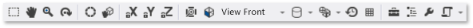

# Model Editor
[!INCLUDE[vs2017banner](../includes/vs2017banner.md)]

This document describes how to work with the [!INCLUDE[vsprvs](../includes/vsprvs-md.md)] Model Editor to view, create, and modify 3-D models.

 You can use the Model Editor to create basic 3-D models from scratch, or to view and modify more-complex 3-D models that were created by using full-featured 3-D modeling tools. The Model Editor supports several 3-D model formats that are used in DirectX app development.

## Supported formats
 The Model Editor supports these model formats:

|Format Name|File Extension|Supported Operations (View, Edit, Create)|
|-----------------|--------------------|-------------------------------------------------|
|AutoDesk FBX Interchange File|.fbx|View, Edit, Create|
|Collada DAE File|.dae|View, Edit (Modifications to Collada DAE files are saved by using the FBX format.)|
|OBJ|.obj|View, Edit (Modifications to OBJ files are saved by using the FBX format.)|

## Getting started
 This section describes how to add a 3-D model to your [!INCLUDE[vsprvs](../includes/vsprvs-md.md)] project and provides the basic information you need to get started.

#### To add a 3-D model to your project

1. In **Solution Explorer**, open the shortcut menu for the project that you want to add the image to, and then choose **Add**, **New Item**.

2. In the **Add New Item** dialog box, under **Installed**, select **Graphics**, and then select **3D Scene (.fbx)**.

3. Specify the **Name** of the model file, and the **Location** where you want it to be created.

4. Choose the **Add** button.

### Axis orientation
 [!INCLUDE[vsprvs](../includes/vsprvs-md.md)] supports every orientation of the 3-D axis, and loads axis orientation information from model file formats that support it. If no axis orientation is specified, [!INCLUDE[vsprvs](../includes/vsprvs-md.md)] uses the right-handed coordinate system by default. The **axis indicator** shows the current axis orientation in the lower-right corner of the design surface. On the **axis indicator**, red represents the x-axis, green represents the y-axis, and blue represents the z-axis.

### Beginning your 3-D model
 In the Model Editor, each new object always begins as one of the basic 3-D shapes—or *primitives*—that are built into the Model Editor. To create new and unique objects you add a primitive to the scene and then change its shape by modifying its vertices. For complex shapes, you add additional vertices by using extrusion or subdivision and then modify them. For information about how to add a primitive object to your scene, see [Creating and importing 3-D objects](#Adding3DObjects). For information about how to add more vertices to an object, see [Modifying objects](#ModifyingObjects).

## Working with the Model Editor
 The following sections describe how to use the Model Editor to work with 3-D models.

### Model Editor toolbars
 The Model Editor toolbars contain commands that help you work with 3-D models.

 Commands that affect the state of the Model Editor are located on the **Model Editor Mode** toolbar in the main [!INCLUDE[vsprvs](../includes/vsprvs-md.md)] window. Modeling tools and scripted commands are located on the **Model Editor** toolbar on the Model Editor design surface.

 Here's the **Model Editor Mode** toolbar:

 

 This table describes the items on the **Model Editor Mode** toolbar, which are listed in the order in which they appear from left to right.

|Toolbar Item|Description|
|------------------|-----------------|
|**Select**|Enables selection of points, edges, faces, or objects in the scene, depending on the active selection mode.|
|**Pan**|Enables movement of a 3-D scene relative to the window frame. To pan, select a point in the scene and move it around.   In **Select** mode, you can press and hold Ctrl to activate **Pan** mode temporarily.|
|**Zoom**|Enables the display of more or less scene detail relative to the window frame. In **Zoom** mode, select a point in the scene and then move it right or down to zoom in, or left or up to zoom out.   In **Select** mode, you can zoom in or out by using the mouse wheel while you press and hold Ctrl.|
|**Orbit**|Positions the view on a circular path around the selected object. If no object is selected, the path is centered on the scene origin. **Note:**  This mode has no effect when **Orthographic** projection is enabled.|
|**World Local**|When this item is enabled, transformations on the selected object occur in world-space. Otherwise, transformations on the selected object occur in local-space.|
|**Pivot Mode**|When this item is enabled, transformations affect the location and orientation of the *pivot point* of the selected object (The pivot point defines the center of translation, scaling, and rotation operations.) Otherwise, transformations affect the location and orientation of the object's geometry, relative to the pivot point.|
|**Lock X axis**|Restricts object manipulation to the x axis. Applies only when you use the center part of the manipulator widget.|
|**Lock Y axis**|Restricts object manipulation to the y axis. Applies only when you use the center part of the manipulator widget.|
|**Lock Z axis**|Restricts object manipulation to the z axis. Applies only when you use the center part of the manipulator widget.|
|**Frame Object**|Frames the selected object so that it's located in the center of the view.|
|**View**|Sets the view orientation. Here are the available orientations:   **Front**  Positions the view in front of the scene.   **Back**  Positions the view behind the scene.   **Left**  Positions the view to the left of the scene.   **Right**  Positions the view to the right of the scene.   **Top**  Positions the view above the scene.   **Bottom**  Positions the view beneath the scene. **Note:**  This is the only way to change the view direction when **Orthographic** projection is enabled.|
|**Projection**|Sets the kind of projection that is used to draw the scene. Here are the available projections:   **Perspective**  In perspective projection, objects that are farther away from the viewpoint appear smaller in size and ultimately converge to a point in the distance.   **Orthographic**  In Orthographic projection, objects appear to be the same size, regardless of their distance from the viewpoint. No convergence is displayed. When **Orthographic** projection enabled, you can't use **Orbit** mode to position the view.|
|**Draw Style**|Sets how objects in the scene are rendered. Here are the available styles:   **Wire Frame**  When enabled, objects are rendered as wireframes.   **Overdraw**  When enabled, objects are rendered by using additive blending. You can use this to visualize how much overdraw is occurring in the scene.   **Flat Shaded**  When enabled, objects are rendered by using a basic, flat shaded lighting model. You can use this to see the faces of an object more easily.   If none of these options are enabled, each object is rendered by using the material that's applied to it.|
|**Real-Time Rendering Mode**|When real-time rendering is enabled, [!INCLUDE[vsprvs](../includes/vsprvs-md.md)] redraws the design surface, even when no user action is performed. This mode is useful when you work with shaders that change over time.|
|**Toggle Grid**|When this item is enabled, a grid is displayed. Otherwise, the grid is not displayed.|
|**Toolbox**|Alternately shows or hides the **Toolbox**.|
|**Document Outline**|Alternately shows or hides the **Document Outline** window.|
|**Properties**|Alternately shows or hides the **Properties** window.|
|**Advanced**|Contains advanced commands and options.   **Graphics Engines**   **Render with D3D11**  Uses Direct3D 11 to render the Model Editor design surface.   **Render with D3D11WARP**  Uses Direct3D 11 Windows Advanced Rasterization Platform (WARP) to render the Model Editor design surface.   **Scene Management**   **Import**  Imports objects from another 3-D model file to the current scene.   **Attach to Parent**  Establishes the first of multiple selected objects as the parent of the remaining selected objects.   **Detach from Parent**  Detaches the selected object from its parent. The selected object becomes a *root object* in the scene. A root object doesn't have a parent object.   **Create Group**  Groups the selected objects as sibling objects.   **Merge Objects**  Combines the selected objects into one object.   **Create New Object From Polygon Selection**  Removes the selected faces from the current object and adds to the scene a new object that contains those faces.   **Tools**   **Flip Polygon Winding**  Flips the selected polygons so that its winding order and surface normal are inverted.   **Remove All Animation**  Removes animation data from the objects.   **Triangulate**  Converts the selected object to triangles.   **View**   Backface Culling  Enables or disables backface culling.   **Frame Rate**  Displays the frame rate in the upper-right corner of the design surface. The frame rate is the number of frames that are drawn per second.   This option is useful when you enable the **Real-Time Rendering Mode** option.   **Show All**  Shows all objects in the scene. This resets the **Hidden** property of each object to **False**.   **Show Face Normals**  Shows the normal of each face.   **Show Missing Materials**  Displays a special texture on objects that don't have a material assigned to them.   **Show Pivot**  Enables or disables the display of a 3-D axis marker at the pivot point of the active selection.   **Show Placeholder Nodes**  Shows placeholder nodes. A placeholder node is created when you group objects.   **Show Vertex Normals**  Shows the normal of each vertex. **Tip:**  You can choose the **Scripts** button to run the last script again.|

 Here's the **Model Editor** toolbar:

 

 The next table describes the items on the **Model Editor** toolbar, which are listed in the order in which they appear from top to bottom.

|Toolbar Item|Description|
|------------------|-----------------|
|**Translate**|Moves the selection.|
|**Scale**|Changes the size of the selection.|
|**Rotate**|Rotates the selection.|
|**Select Point**|Sets the **Selection mode** to select individual points on an object.|
|**Select Edge**|Sets the **Selection mode** to select an edge (a line between two vertices) on an object.|
|**Select Face**|Sets the **Selection mode** to select a face on an object.|
|**Select Object**|Sets the **Selection mode** to select an entire object.|
|**Extrude**|Creates an additional face and connects it to the selected face.|
|**Subdivide**|Divides each selected face into multiple faces. To create the new faces, new vertices are added—one in the center of the original face, and one in the middle of each edge—and then joined together with the original vertices. The number of added faces is equal to the number of edges in the original face.|

### Controlling the view
 The 3-D scene is rendered according to the view, which can be thought of as a virtual camera that has a position and an orientation. To change the position and orientation, use the view controls on the **Model Editor Mode** toolbar.

 The following table describes the primary view controls.

|View Control|Description|
|------------------|-----------------|
|**Pan**|Enables movement of a 3-D scene relative to the window frame. To pan, select a point in the scene and move it around.   In **Select** mode, you can press and hold Ctrl to activate **Pan** mode temporarily.|
|**Zoom**|Enables the display of more or less scene detail relative to the window frame. In **Zoom** mode, select a point in the scene and then move it right or down to zoom in, or left or up to zoom out.   In **Select** mode, you can zoom in or out by using the mouse wheel while you press and hold Ctrl.|
|**Orbit**|Positions the view on a circular path around the selected object. If no object is selected, the path is centered on the scene origin. **Note:**  This mode has no effect when **Orthographic** projection is enabled.|
|**Frame Object**|Frames the selected object so that it's located in the center of the view.|

 The view is established by the virtual camera, but it's also defined by a projection. The projection defines how shapes and objects in the view are translated into pixels on the design surface. On the **Model Editor** toolbar, you can choose either **Perspective** or **Orthographic** projection.

|Projection|Description|
|----------------|-----------------|
|**Perspective**|In perspective projection, objects that are farther away from the viewpoint appear smaller in size and ultimately converge to a point in the distance.|
|**Orthographic**|In Orthographic projection, objects appear to be the same size, regardless of their distance from the viewpoint. No convergence is displayed. When **Orthographic** projection enabled, you can't use **Orbit** mode to position the view arbitrarily.|

 You might find it useful to view a 3-D scene from a known position and angle, for example, when you want to compare two similar scenes. For this scenario, the Model Editor provides several predefined views. To use a predefined view, on the **Model Editor Mode** toolbar, choose **View**, and then choose the predefined view you want—front, back, left, right, top, or bottom. In these views, the virtual camera looks directly at the origin of the scene. For example, if you choose **View Top**, the virtual camera looks at the origin of the scene from directly above it.

### Viewing additional geometry details
 To better understand a 3-D object or scene, you can view additional geometry details such as per-vertex normals, per-face normals, the pivot points of the active selection, and other details. To enable or disable them, on the **Model Editor** toolbar, choose **Scripts**, **View**, and then choose the one you want.

###  Creating and importing 3-D objects
 To add a predefined 3-D shape to the scene, in the **Toolbox**, select the one you want and then move it to the design surface. New shapes are positioned at the origin of the scene. The Model Editor provides seven shapes: **Cone**, **Cube**, **Cylinder**, **Disc**, **Plane**, **Sphere**, and **Teapot**.

 To import a 3-D object from a file, on the **Model Editor** toolbar, choose **Advanced**, **Scene Management**, **Import**, and then specify the file that you want to import.

### Transforming objects
 You can *transform* an object by changing its **Rotation**, **Scale**, and **Translation** properties. *Rotation* orients an object by applying successive rotations around the x-axis, y-axis, and z-axis defined by its pivot point. Each rotation specification has three components—x, y, and z, in that order—and the components are specified in degrees. **Scaling** resizes an object by stretching it by a specified factor along one or more axes centered on its pivot point. *Translation* locates an object in 3-dimensional space relative to its parent instead of its pivot point.

 You can transform and object either by using modeling tools or by setting properties.

##### To transform an object by using modeling tools

1. In **Select** mode, select the object you want to transform. A wireframe overlay indicates that the object is selected.

2. On the **Model Editor** toolbar, choose the **Translate**, **Scale**, or **Rotate** tool. A translation, scaling, or rotation manipulator appears for the selected object.

3. Use the manipulator to perform the transformation. For translation and scaling transformations, the manipulator is an axis indicator. You can change one axis at a time, or you can change all axes at the same time by using the white cube at the center of the indicator. For rotation, the manipulator is a sphere made of color-coded circles that correspond to the x-axis (red), y-axis (green), and z-axis (blue). You have to change each axis individually to create the rotation you want.

##### To transform an object by setting its properties

1. In **Select** mode, select the object that you want to transform. A wireframe overlay indicates that the object is selected.

2. In the **Properties** window, specify values for the **Rotation**, **Scale**, and **Translation** properties.

   > [!IMPORTANT]
   > For the **Rotation** property, specify the degree of rotation around each of the three axes. Rotations are applied in order, so make sure to plan a rotation, first in terms of the x-axis rotation, then the y-axis, and then the z-axis.

   By using the modeling tools, you can create transformations quickly but not precisely. By setting the object properties, you can specify transformations precisely but not quickly. We recommend that you use the modeling tools to get "close enough" to the transformations you want, and then fine-tune the property values.

   If you don't want to use manipulators, you can enable free-form mode. On the **Model Editor** toolbar, choose **Scripts**, **Tools**, **Free-form Manipulation** to enable (or disable) free-form mode. In free-form mode, you can begin a manipulation at any point on the design surface instead of a point on the manipulator. In free-form mode, you can constrain changes to certain axes by locking the ones you don't want to change. On the **Model Editor Mode** toolbar, choose any combination of the **Lock X**, **Lock Y**, and **Lock Z** buttons.

   You might find it useful to work with objects by using snap-to-grid. On the **Model Editor Mode** toolbar, choose **Snap** to enable (or disable) snap-to-grid. When snap-to-grid is enabled, translation, rotation, and scaling transformations are constrained to predefined increments.

### Working with the pivot point
 The pivot point of an object defines its center of rotation and scaling. You can change the pivot point of an object to change how it's affected by rotation and scaling transformations. On the **Model Editor Mode** toolbar, choose **Pivot Mode** to enable (or disabled) pivot mode. When pivot mode is enabled, a small axis indicator appears at the pivot point of the selected object. You can then use the **Translation** and **Rotation** tools to manipulate the pivot point.

 For a demonstration that shows how to use the pivot point, see [How to: Modify the Pivot Point of a 3-D Model](../designers/how-to-modify-the-pivot-point-of-a-3-d-model.md).

### World and local modes
 Translation and rotation can occur in either the local coordinate system (or *local frame-of-reference*) of the object, or in the coordinate system of the world (or the *world frame-of-reference*). The world frame-of-reference is independent of the rotation of the object. Local mode is the default. To enable (or disable) world mode, on the **Model Editor Mode** toolbar, choose the **WorldLocal** button.

###  Modifying objects
 You can change the shape of a 3-D object by moving or deleting its vertices, edges, and faces. By default, the Model Editor is in *object mode*, so that you can select and transform entire objects. To select points, edges, or faces, choose the appropriate selection mode. On the **Model Editor Mode** toolbar, choose **Selection modes**, and then choose the mode that you want.

 You can create additional vertices by extrusion or by subdivision. Extrusion duplicates the vertices of a face (a co-planar set of vertices), which remain connected by the duplicated vertices. Subdivision adds vertices to create several faces where there was previously one. To create the new faces, new vertices are added—one in the center of the original face, and one in the middle of each edge—and then joined together with the original vertices. The number of added faces is equal to the number of edges in the original face. In both cases, you can translate, rotate, and scale the new vertices to change the geometry of the object.

##### To extrude a face from an object

1. In face-select mode, select the face you want to extrude.

2. On the **Model Editor** toolbar, choose **Scripts**, **Tools**, **Extrude**.

##### To subdivide faces

1. In face-select mode, select the faces you want to subdivide. Because subdivision creates new edge data, subdividing all faces at once gives more-consistent results when the faces are adjacent.

2. On the **Model Editor** toolbar, choose **Scripts**, **Tools**, **Subdivide**.

   You can also triangulate faces, merge objects, and convert polygon selections into new objects. Triangulation creates additional edges such that a non-triangular face is converted to an optimal number of triangles; however, it doesn't provide additional geometric detail. Merging combines selected objects into one object. New objects can be created from a polygon selection.

##### To triangulate a face

1. In face-select mode, select the face you want to triangulate.

2. On the **Model Editor** toolbar, choose **Scripts**, **Tools**, **Triangulate**.

##### To merge objects

1. In object-select mode, select the objects you want to merge.

2. On the **Model Editor** toolbar, choose **Scripts**, **Tools**, **Merge Objects**.

##### To create an object from a polygon selection

1. In face-select mode, select the faces you want to create a new object from.

2. On the **Model Editor** toolbar, choose **Scripts**, **Tools**, **Create New Object from Polygon Selection**.

### Working with materials and shaders
 The appearance of an object is determined by the interaction of lighting in the scene and the material of the object. Materials are defined by properties that describe how the surface reacts to different types of light and by a shader program that calculates the final color of each pixel on the object surface based on lighting information, texture maps, normal maps, and other data.

 The Model Editor provides these default materials:

|Material|Description|
|--------------|-----------------|
|Unlit|Renders a surface without any simulated lighting.|
|Lambert|Renders a surface with simulated ambient lighting and diffuse lighting.|
|Phong|Renders a surface with simulated ambient lighting, diffuse lighting, and specular highlights.|

 Each of these materials applies one texture on the surface of an object. You can set a different texture for each object that uses the material.

 To modify how a particular object reacts to the different light sources in the scene, you can change the lighting properties of material independent of other objects that use the material. This table describes common lighting properties:

|Lighting Property|Description|
|-----------------------|-----------------|
|Ambient|Describes how the surface is affected by ambient lighting.|
|Diffuse|Describes how the surface is affected by directional and point lights.|
|Emissive|Describes how the surface emits light, independent of other lighting.|
|Specular|Describes how the surface reflects directional and point lights.|
|Specular Power|Describes the breadth and intensity of specular highlights.|

 Depending on what a material supports, you can change its lighting properties, textures, and other data. In **Select** mode, select the object whose material you want to change, and then in the **Properties** window, change the **MaterialAmbient**, **MaterialDiffuse**, **MaterialEmissive**, **MaterialSpecular**, **MaterialSpecularPower**, or other available property. A material can expose up to eight textures, whose properties are named sequentially from **Texture1** to **Texture8**.

 To remove all materials from an object, on the **Model Editor** toolbar, choose **Scripts**, **Materials**, **Remove Materials**.

 You can use the **Shader Designer** to create custom shader materials that you can apply to objects in your 3-D scene. For information about how to create custom shader materials, see [Shader Designer](../designers/shader-designer.md). For information about how to apply a custom shader material to an object, see [How to: Apply a Shader to a 3-D Model](../designers/how-to-apply-a-shader-to-a-3-d-model.md).

### Scene management
 You can manage scenes as a hierarchy of objects. When multiple objects are arranged in a hierarchy, any translation, scale, or rotation of a parent node also affects its children. This is useful when you want to construct complex objects or scenes from more basic objects.

 You can use the **Document Outline** window to view the scene hierarchy and select scene nodes. When you select a node in the outline, you can use the **Properties** window to modify its properties.

 You can construct a hierarchy of objects either by making one of them the parent to the others or by grouping them together as siblings under a placeholder node that acts as the parent.

##### To create a hierarchy that has a parent object

1. In **Select** mode, select two or more objects. The first one you select will be the parent object.

2. On the **Model Editor** toolbar, choose **Scripts**, **Scene Management**, **Attach to Parent**.

##### To create a hierarchy of sibling objects

1. In **Select** mode, select two or more objects. A placeholder object is created and becomes their parent object.

2. On the **Model Editor** toolbar, choose **Scripts**, **Scene Management**, **Create Group**.

   The Model Editor uses a white wireframe to identify the first selected object, which becomes the parent. Other objects in the selection have a blue wireframe. By default, placeholder nodes are not displayed. To display placeholder nodes, on the **Model Editor** toolbar, choose **Scripts**, **Scene Management**, **Show Placeholder Nodes**. You can work with placeholder nodes just as you work with non-placeholder objects.

   To remove the parent-child association between two objects, select the child object, and then on the **Model Editor** toolbar, choose **Scripts**, **Scene Management**, **Detach from Parent**. When you detach the parent from a child object, the child object becomes a root object in the scene.

## Keyboard shortcuts

|Command|Keyboard shortcuts|
|-------------|------------------------|
|Switch to **Select** mode|Ctrl+G, Gtrl+Q   S|
|Switch to **Zoom** mode|Ctrl+G, Ctrl+Z   Z|
|Switch to **Pan** mode|Ctrl+G, Ctrl+P   K|
|Select all|Ctrl+A|
|Delete the current selection|Delete|
|Cancel the current selection|Escape|
|Zoom in|Mouse wheel forward   Ctrl+Mouse wheel forward   Shift+Mouse wheel forward   Ctrl+PageUp   Plus Sign (+)|
|Zoom out|Mouse wheel backward   Ctrl+Mouse wheel backward   Shift+Mouse wheel backward   Ctrl+PageDown   Minus Sign (-)|
|Pan the camera up|PageDown|
|Pan the camera down|PageUp|
|Pan the camera left|Mouse wheel left   Ctrl+PageDown|
|Pan the camera right|Mouse wheel right   Ctrl+PageDown|
|View top of model|Ctrl+L, Ctrl+T   T|
|View bottom of model|Ctrl+L, Ctrl+U|
|View left side of model|Ctrl+L, Ctrl+L|
|View right side of model|Ctrl+L, Ctrl+R|
|View front of model|Ctrl+L, Ctrl+F|
|View back of model|Ctrl+L, Ctrl+B|
|Frame object in window|F|
|Toggle wireframe mode|Ctrl+L, Ctrl+W|
|Toggle snap-to-grid|Ctrl+G, Ctrl+N|
|Toggle pivot mode|Ctrl+G, Ctrl+V|
|Toggle x-axis restriction|Ctrl+L, Ctrl+X|
|Toggle y-axis restriction|Ctrl+L, Ctrl+Y|
|Toggle z-axis restriction|Ctrl+L, Ctrl+Z|
|Switch to translation mode|Ctrl+G, Ctrl+W   W|
|Switch to scale mode|Ctrl+G, Ctrl+E   E|
|Switch to rotation mode|Ctrl+G, Ctrl+R   R|
|Switch to point-select mode|Ctrl+L, Ctrl+1|
|Switch to edge-select mode|Ctrl+L, Ctrl+2|
|Switch to face-select mode|Ctrl+L, Ctrl+3|
|Switch to object-select mode|Ctrl+L, Ctrl+4|
|Switch to orbit (camera) mode|Ctrl+G, Ctrl+O|
|Select next object in scene|Tab|
|Select previous object in scene|Shift+Tab|
|Manipulate the selected object based on the current tool.|The arrow keys|
|Deactivate current manipulator|Q|
|Rotate camera|Alt+Drag with left mouse button|

## Related topics

|Title|Description|
|-----------|-----------------|
|[Working with 3-D Assets for Games and Apps](../designers/working-with-3-d-assets-for-games-and-apps.md)|Provides an overview of the [!INCLUDE[vsprvs](../includes/vsprvs-md.md)] tools that you can use to work with graphics assets such as textures and images, 3-D models, and shader effects.|
|[Image Editor](../designers/image-editor.md)|Describes how to use the [!INCLUDE[vsprvs](../includes/vsprvs-md.md)] Image Editor to work with textures and images.|
|[Shader Designer](../designers/shader-designer.md)|Describes how to use the [!INCLUDE[vsprvs](../includes/vsprvs-md.md)] Shader Designer to work with shaders.|
