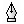
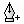
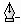
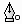
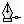
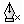

# Pen tool modifier keys in Blend
[!INCLUDE[vs2017banner](../includes/vs2017banner.md)]

The following table lists shortcuts that you can use to modify a path while you are creating it with the **Pen** tool . You can also use the **Pen** tool to add or remove points on an existing path, or to join two existing paths.

|To do this action|Do this|Pointer|
|-----------------------|-------------|-------------|
|Create a point to start a straight line segment|Click to create the new point|   Pen pointer|
|Create a point to start a curved line segment|Click to create the new point, and then drag to adjust the tangent handles before releasing the mouse button|   Pen pointer|
|Adjust the last tangent without the smooth constraint, allowing you to make a sharp corner|Click to create the new point, and then press ALT before releasing the mouse button|   Pen adjust pointer|
|Split the last tangent so that the tangent end points operate independently, allowing you to make a sharp corner|Click to create the new point, and then hold down ALT and drag before releasing the mouse button|   Pen adjust pointer|
|Move the tangent end point around the new point in 15-degree increments|Click to create the new point, and then hold down SHIFT+ALT and drag before releasing the mouse button|   Pen adjust pointer|
|Reduce the tangent at an end point to zero length|Click the end point|   Pen adjust pointer|
|Add a new point to an existing path|Click the path at the location where you want the new point|   Pen insert pointer|
|Remove a point from a path|Hover over an existing point and click|   Pen delete pointer|
|Close a path with a sharp corner|Click the start point|   Pen close pointer|
|Close a path with a smooth curve at the corner|Click the start point and drag to modify the tangent handle before releasing the mouse button|   Pen close pointer|
|Create a sharp corner when joining two paths|Select two paths, click the **Pen** tool, click an end point of one of the paths, and then click an end point of the other path|   Pen join pointer|
|Create a smooth corner when joining two paths|Select two paths, click the **Pen** tool, click an end point of one of the paths, and then drag an end point of the other path|   Pen join pointer|
|Create a new path|Hold down CTRL and click outside the previous path to stop adding points to the previous path, and then click or drag where you want the new path to begin|   Pen start pointer|

## See Also
 [Keyboard shortcuts and modifier keys](../designers/keyboard-shortcuts-and-modifier-keys-in-blend.md)
 [Artboard modifier keys](../designers/artboard-modifier-keys-in-blend.md)
 [Direct Selection tool modifier keys](../designers/direct-selection-tool-modifier-keys-in-blend.md)
 [Draw shapes and paths](../designers/draw-shapes-and-paths.md)
