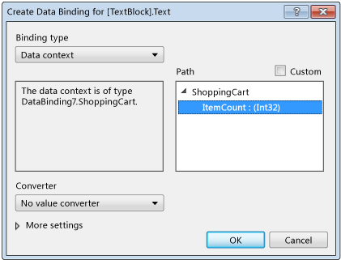

# Walkthrough: Binding to data in XAML Designer
[!INCLUDE[vs2017banner](../includes/vs2017banner.md)]

In XAML Designer, you can set data binding properties by using the artboard and the Properties window. The example in this walkthrough shows how to bind data to a control. Specifically, the walkthrough shows how to create a simple shopping cart class that has a [DependencyProperty](https://msdn.microsoft.com/library/windows/apps/windows.ui.xaml.dependencyproperty.aspx) named `ItemCount`, and then bind the `ItemCount` property to the **Text** property of a [TextBlock](https://msdn.microsoft.com/library/windows/apps/windows.ui.xaml.controls.textblock.aspx) control.

### To create a class to use as a data source

1. On the **File** menu, choose **New**, **Project**.

2. In the **New Project** dialog box, choose either the **Visual C#** or **Visual Basic** node, expand the **Windows Desktop** node, and then choose the **WPF Application** template.

3. Name the project **BindingTest**, and then choose the **OK** button.

4. Open the MainWindow.xaml.cs (or MainWindow.xaml.vb) file and add the following code. In C#, add the code in the `BindingTest` namespace (before the final closing parenthesis in the file). In Visual Basic, just add the new class.

    ```csharp
    public class ShoppingCart : DependencyObject
    {
        public int ItemCount
        {
            get { return (int)GetValue(ItemCountProperty); }
            set { SetValue(ItemCountProperty, value); }
        }

        public static readonly DependencyProperty ItemCountProperty =
             DependencyProperty.Register("ItemCount", typeof(int),
             typeof(ShoppingCart), new PropertyMetadata(0));
    }

    ```

    ```vb
    Public Class ShoppingCart
        Inherits DependencyObject

        Public Shared ReadOnly ItemCountProperty As DependencyProperty = DependencyProperty.Register(
            "ItemCount", GetType(Integer), GetType(ShoppingCart), New PropertyMetadata(0))
        Public Property ItemCount As Integer
            Get
                ItemCount = CType(GetValue(ItemCountProperty), Integer)
            End Get
            Set(value As Integer)
                SetValue(ItemCountProperty, value)
            End Set
        End Property
    End Class
    ```

     This code sets a value of 0 as the default item count by using the [PropertyMetadata](https://msdn.microsoft.com/library/windows/apps/windows.ui.xaml.propertymetadata.aspx) object.

5. On the **File** menu, choose **Build**, **Build Solution**.

### To bind the ItemCount property to a TextBlock control

1. In Solution Explorer, open the shortcut menu for MainWindow.xaml and choose **View Designer**.

2. In the Toolbox, choose a [Grid](https://msdn.microsoft.com/library/windows/apps/windows.ui.xaml.controls.grid.aspx) control and add it to the form.

3. With the `Grid` selected, in the Properties window, choose the **New** button next to the **DataContext** property.

4. In the **Select Object** dialog box, make sure that **Show all assemblies** checkbox is cleared, choose **ShoppingCart** under the **BindingTest** namespace, and then choose the **OK** button.

     The following illustration shows the **Select Object** dialog box with **ShoppingCart** selected.

     

5. In the **Toolbox**, choose a `TextBlock` control to add it to the form.

6. With the `TextBlock` control selected, in the Properties window, choose the property marker to the right of the **Text** property, and then choose **Create Data Binding**. (The property marker looks like a small box.)

7. In the Create Data Binding dialog box, in the **Path** box, choose the **ItemCount : (int32)** property and then choose the **OK** button.

     The following illustration shows the **Create Data Binding** dialog box with the **ItemCount** property selected.

     

8. Press F5 to run the app.

     The `TextBlock` control should show the default value of 0 as text.

## See Also
 [Creating a UI by using XAML Designer](../designers/creating-a-ui-by-using-xaml-designer-in-visual-studio.md)
 [NIB: Add Value Converter dialog box](https://msdn.microsoft.com/c5f3d110-a541-4b55-8bca-928f77778af8)
