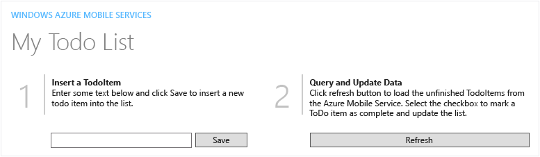
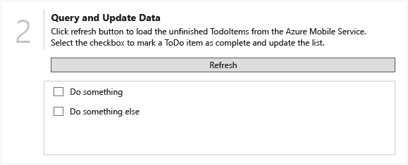

# Walkthrough: Create a WPF Desktop Application connected to an Azure Mobile Service
[!INCLUDE[vs2017banner](../includes/vs2017banner.md)]

You can use Windows Presentation Foundation (WPF) to quickly create a modern desktop application that uses an Azure Mobile Service to store and provide data.

## <a name="Requirements"></a> Prerequisites
 You’ll need the following to complete this walkthrough:

- Visual Studio 2015 – any version that supports WPF development.

- An active Microsoft Azure account.

  - You can sign up for a free trial account [here](https://azure.microsoft.com/pricing/free-trial/).

  - You can activate [MSDN subscriber benefits](https://azure.microsoft.com/pricing/member-offers/msdn-benefits-details/?WT.mc_id=A261C142F). Your MSDN subscription gives you credits every month that you can use for paid Azure services.

## Create a project and add references
 The first step is to create a WPF project and add a NuGet package that lets you connect to Azure Mobile Services.

#### To create the project

1. On the menu bar, choose **File**, **New**, **Project**.

2. In the **New Project** dialog, expand either the **Visual C#** or **Visual Basic** node and choose the **Windows** node, and then expand the **Windows** node and choose the **Classic Desktop** node.

3. In the template list, choose the **WPF Application** template.

4. In the **Name** textbox enter `WPFQuickStart`, and then choose the **OK** button.

     The project is created and the project files are added to **Solution Explorer**, and the designer for the default application window named **MainWindow.xaml** is displayed.

#### To add a reference to the Windows Azure Mobile Services SDK

1. In **Solution Explorer**, open the shortcut menu for the **References** node and choose **Manage NuGet Packages**.

2. In the **NuGet Package Manager**, choose the **Search** field and enter `mobileservices`.

3. In the left pane, choose **WindowsAzure.MobileServices**, and then in the right pane choose the **Install** button.

    > [!NOTE]
    > If a **Preview** dialog appears, review the proposed changes and then choose the **OK** button.

4. In the **License Acceptance** dialog, review the license terms and then accept them by choosing the **I Accept** button.

     The necessary references will be added to **Solution Explorer**.

    > [!NOTE]
    > If you don’t agree with the license terms, choose the **I Decline** button. You won’t be able to finish the rest of the walkthrough.

## Create the user interface
 The next step is to create the user interface for the application. First you’ll create a reusable user control that displays a standard side-by-side two pane layout. You’ll add the user control to the main application window and add controls to enter and display data, then write some code to define the interaction with the mobile service backend.

#### To add a user control

1. In **Solution Explorer**, open the shortcut menu for the **WPFQuickStart** node and choose **Add**, **New Folder**.

2. Name the folder `Common`.

3. Open the shortcut menu for the **Common** folder and choose **Add**, **User Control**.

4. In the **Add New Item** dialog, choose the Name field and enter `QuickStartTask`, and then choose the **Add** button.

     The user control will be added to the project and the **QuickStartTask.xaml** file will open in the designer.

5. In the lower pane of the designer, select the `<Grid>` and `</Grid>` tags and replace them with the following XAML code:

    ```xaml
    <Grid VerticalAlignment="Top">
            <StackPanel Orientation="Horizontal">
                <Border BorderThickness="0,0,1,0" BorderBrush="DarkGray" Margin="0,10" MinWidth="70">
                    <TextBlock Text="{Binding Number}" FontSize="45" Foreground="DarkGray" Margin="20,0"/>
                </Border>
                <StackPanel>
                    <TextBlock Text="{Binding Title}" Margin="10,10,0,0" FontSize="16" FontWeight="Bold" />
                    <TextBlock Text="{Binding Description}" Margin="10,0,0,0" TextWrapping="Wrap" MaxWidth="500" />
                </StackPanel>
            </StackPanel>
        </Grid>
    ```

     This XAML code creates a reusable layout with placeholders for number, title and description fields. At run time the placeholders can be replaced with text as shown in the following illustration.

     

6. In **Solution Explorer**, expand the **QuickStartTask.xaml** node and open the **QuickStartTask.xaml.cs** or **QuickStartTask.xaml.vb** file.

7. In the code editor, replace the `namespace WPFQuickStart.Common` (C#) namespace or the `Public Class QuickStartTask` (VB) method with the following code:

    ```csharp
    namespace WPFQuickStart.Common
    {
        /// <summary>
        /// Interaction logic for QuickStartTask.xaml
        /// </summary>
        public partial class QuickStartTask : UserControl
        {
            public QuickStartTask()
            {
                this.InitializeComponent();
                this.DataContext = this;
            }

            public int Number
            {
                get { return (int)GetValue(NumberProperty); }
                set { SetValue(NumberProperty, value); }
            }

            // Using a DependencyProperty as the backing store for Number.  This enables animation, styling, binding, etc...
            public static readonly DependencyProperty NumberProperty =
                DependencyProperty.Register("Number", typeof(int), typeof(QuickStartTask), new PropertyMetadata(0));

            public string Title
            {
                get { return (string)GetValue(TitleProperty); }
                set { SetValue(TitleProperty, value); }
            }

            // Using a DependencyProperty as the backing store for Title.  This enables animation, styling, binding, etc...
            public static readonly DependencyProperty TitleProperty =
                DependencyProperty.Register("Title", typeof(string), typeof(QuickStartTask), new PropertyMetadata(default(string)));

            public string Description
            {
                get { return (string)GetValue(DescriptionProperty); }
                set { SetValue(DescriptionProperty, value); }
            }

            // Using a DependencyProperty as the backing store for Description.  This enables animation, styling, binding, etc...
            public static readonly DependencyProperty DescriptionProperty =
                DependencyProperty.Register("Description", typeof(string), typeof(QuickStartTask), new PropertyMetadata(default(string)));
        }
    }
    ```

    ```vb
    Partial Public Class QuickStartTask
            Inherits UserControl

            Public Sub New()
                Me.InitializeComponent()
                Me.DataContext = Me
            End Sub

            Public Property Number() As Integer
                Get
                    Return CInt(Fix(GetValue(NumberProperty)))
                End Get
                Set(ByVal value As Integer)
                    SetValue(NumberProperty, value)
                End Set
            End Property

            ' Using a DependencyProperty as the backing store for Number.  This enables animation, styling, binding, etc...
            Public Shared ReadOnly NumberProperty As DependencyProperty = DependencyProperty.Register("Number", GetType(Integer), GetType(QuickStartTask), New PropertyMetadata(0))

            Public Property Title() As String
                Get
                    Return CStr(GetValue(TitleProperty))
                End Get
                Set(ByVal value As String)
                    SetValue(TitleProperty, value)
                End Set
            End Property

            ' Using a DependencyProperty as the backing store for Title.  This enables animation, styling, binding, etc...
            Public Shared ReadOnly TitleProperty As DependencyProperty = DependencyProperty.Register("Title", GetType(String), GetType(QuickStartTask), New PropertyMetadata(Nothing))

            Public Property Description() As String
                Get
                    Return CStr(GetValue(DescriptionProperty))
                End Get
                Set(ByVal value As String)
                    SetValue(DescriptionProperty, value)
                End Set
            End Property

            ' Using a DependencyProperty as the backing store for Description.  This enables animation, styling, binding, etc...
            Public Shared ReadOnly DescriptionProperty As DependencyProperty = DependencyProperty.Register("Description", GetType(String), GetType(QuickStartTask), New PropertyMetadata(Nothing))
        End Class
    ```

     This code uses dependency properties to set the values for the number, title and description fields at run time.

8. On the menu bar, choose **Build**, **Build WPFQuickStart** to build the user control.

#### To create and modify the main window

1. In **Solution Explorer**, open the **MainWindow.xaml** file.

2. **Important**. This step is for C# only. If you are using Visual Basic, skip to the next step. In the lower pane of the designer, locate the line `xmlns:local=”clr-namespace:WPFQuickStart”` and replace it with the following XAML code:

    ```xaml
    xmlns:local=”clr-namespace:WPFQuickStart.Common”
    ```

3. In the **Properties** window, expand the **Common** category node and choose the **Title** property, and then enter `WPF Todo List` and press the **Enter** key.

     Notice that the **Title** element in the XAML window changes to match the new value. You can modify XAML properties in either the XAML window or the **Properties** window, and the changes are synchronized.

4. In the XAML window, set the value of the **Height** element to `768`, and set the value of the **Width** property to `1280`.

     These elements correspond to the **Height** and **Width** properties, found in the **Layout** category in the **Properties** window.

5. Select the `<Grid>` and `</Grid>` tags and replace them with the following XAML code:

    ```xaml
    <Grid>

            <Grid Margin="50,50,10,10">
                <Grid.ColumnDefinitions>
                    <ColumnDefinition Width="*" />
                    <ColumnDefinition Width="*" />
                </Grid.ColumnDefinitions>
                <Grid.RowDefinitions>
                    <RowDefinition Height="Auto" />
                    <RowDefinition Height="*" />
                </Grid.RowDefinitions>

                <Grid Grid.Row="0" Grid.ColumnSpan="2" Margin="0,0,0,20">
                    <StackPanel>
                        <TextBlock Foreground="#0094ff" FontFamily="Segoe UI Light" Margin="0,0,0,6">MICROSOFT AZURE MOBILE SERVICES</TextBlock>
                        <TextBlock Foreground="Gray" FontFamily="Segoe UI Light" FontSize="45" ><Run Text="My Todo List"/></TextBlock>
                    </StackPanel>
                </Grid>

                <Grid Grid.Row="1">
                    <StackPanel>

                        <local:QuickStartTask Number="1" Title="Insert a TodoItem" Description="Enter some text below and click Save to insert a new todo item into the list." />

                        <StackPanel Orientation="Horizontal" Margin="72,0,0,0">
                            <TextBox x:Name="TodoInput" Margin="5" MinWidth="300"/>
                            <Button x:Name="ButtonSave" Click="ButtonSave_Click" Content="Save"/>
                        </StackPanel>

                    </StackPanel>
                </Grid>

                <Grid Grid.Row="1" Grid.Column="1">
                    <Grid.RowDefinitions>
                        <RowDefinition Height="Auto" />
                        <RowDefinition />
                    </Grid.RowDefinitions>
                    <StackPanel>
                        <local:QuickStartTask Number="2" Title="Query and Update Data" Description="Click the Refresh button to load the unfinished TodoItems from the Azure Mobile Service. Select the checkbox to mark a ToDo item as complete and update the list." />
                        <Button Margin="72,0,0,0" Name="ButtonRefresh" Click="ButtonRefresh_Click">Refresh</Button>
                    </StackPanel>

                    <ListView Name="ListItems" Margin="62,10,0,0" Grid.Row="1">
                        <ListView.ItemTemplate>
                            <DataTemplate>
                                <StackPanel Orientation="Horizontal">
                                    <CheckBox Name="CheckBoxComplete" IsChecked="{Binding Complete, Mode=TwoWay}" Checked="CheckBoxComplete_Checked" Content="{Binding Text}" Margin="10,5" VerticalAlignment="Center"/>
                                </StackPanel>
                            </DataTemplate>
                        </ListView.ItemTemplate>
                    </ListView>

                </Grid>

            </Grid>
        </Grid>
    ```

     Notice that the changes are reflected in the Design window. Once again, you also could have defined the user interface by adding controls from the **Toolbox** window and setting properties in the **Properties** window. Anything that can be done in the designer can be done in XAML code, and vice versa.

     At this point, the design should look like the following illustration.

     

    > [!NOTE]
    > While following the next few procedures you might see errors in the **Error List** if it is open. Don’t worry; these errors will go away once you complete the remaining procedures.

6. In **Solution Explorer**, expand the **MainWindow.xaml** node and open the **MainWindow.xaml.cs** or **MainWindow.xaml.vb** file.

7. In the Code Editor, add the following `using` or `Imports` directives to the top of the file:

    ```csharp
    using Microsoft.WindowsAzure.MobileServices;
    using Newtonsoft.Json;
    ```

    ```vb
    Imports Microsoft.WindowsAzure.MobileServices
    Imports Newtonsoft.Json
    ```

8. Replace all of the code in the **WPFQuickStart** namespace (C#) or **Class MainWindow** class (VB) with the following code:

    ```csharp
    namespace WPFQuickStart
    {
        /// <summary>
        /// Interaction logic for MainWindow.xaml
        /// </summary>
        public class TodoItem
        {
            public string Id { get; set; }

            [JsonProperty(PropertyName = "text")]
            public string Text { get; set; }

            [JsonProperty(PropertyName = "complete")]
            public bool Complete { get; set; }
        }

        public partial class MainWindow : Window
        {
            private MobileServiceCollection<TodoItem, TodoItem> items;
            private IMobileServiceTable<TodoItem> todoTable = App.MobileService.GetTable<TodoItem>();

            public MainWindow()
            {
                InitializeComponent();
            }

            private async void InsertTodoItem(TodoItem todoItem)
            {
                // This code inserts a new TodoItem into the database. When the operation completes
                // and Mobile Services has assigned an Id, the item is added to the CollectionView
                await todoTable.InsertAsync(todoItem);
                items.Add(todoItem);
            }

            private async void RefreshTodoItems()
            {
                try
                {
                    // This code refreshes the entries in the list view by querying the TodoItem table.
                    // The query excludes completed TodoItems
                    items = await todoTable
                        .Where(todoItem => todoItem.Complete == false)
                        .ToCollectionAsync();
                    ListItems.ItemsSource = items;
                }
                catch (MobileServiceInvalidOperationException e)
                {
                    MessageBox.Show(e.Message, "Error loading items");
                }
            }

            private async void UpdateCheckedTodoItem(TodoItem item)
            {
                // This code takes a freshly completed TodoItem and updates the database. When the MobileService
                // responds, the item is removed from the list
                await todoTable.UpdateAsync(item);
                items.Remove(item);
            }

            private void ButtonRefresh_Click(object sender, RoutedEventArgs e)
            {
                RefreshTodoItems();
            }

            private void ButtonSave_Click(object sender, RoutedEventArgs e)
            {
                var todoItem = new TodoItem { Text = TodoInput.Text };
                InsertTodoItem(todoItem);
                TodoInput.Text = "";
            }

            private void CheckBoxComplete_Checked(object sender, RoutedEventArgs e)
            {
                CheckBox cb = (CheckBox)sender;
                TodoItem item = cb.DataContext as TodoItem;
                UpdateCheckedTodoItem(item);
            }

            protected override void OnActivated(EventArgs e)
            {
                RefreshTodoItems();
            }
        }

    }
    ```

    ```vb
    Public Class TodoItem
        Public Property Id() As String

        <JsonProperty(PropertyName:="text")>
        Public Property Text() As String

        <JsonProperty(PropertyName:="complete")>
        Public Property Complete() As Boolean
    End Class

    Partial Public Class MainWindow
        Inherits Window

        Private items As MobileServiceCollection(Of TodoItem, TodoItem)
        Private todoTable As IMobileServiceTable(Of TodoItem) = Application.MobileService.GetTable(Of TodoItem)()

        Public Sub New()
            InitializeComponent()
        End Sub

        Private Async Sub InsertTodoItem(ByVal todoItem As TodoItem)
            ' This code inserts a new TodoItem into the database. When the operation completes
            ' and Mobile Services has assigned an Id, the item is added to the CollectionView
            Await todoTable.InsertAsync(todoItem)
            items.Add(todoItem)
        End Sub

        Private Async Sub RefreshTodoItems()
            Dim exception As MobileServiceInvalidOperationException = Nothing
            Try
                ' This code refreshes the entries in the list view by querying the TodoItem table.
                ' The query excludes completed TodoItems
                items = Await todoTable.Where(Function(todoItem) todoItem.Complete = False).ToCollectionAsync()
            Catch e As MobileServiceInvalidOperationException
                exception = e
            End Try

            If exception IsNot Nothing Then
                MessageBox.Show(exception.Message, "Error loading items")
            Else
                ListItems.ItemsSource = items
            End If
        End Sub

        Private Async Sub UpdateCheckedTodoItem(ByVal item As TodoItem)
            ' This code takes a freshly completed TodoItem and updates the database. When the MobileService
            ' responds, the item is removed from the list
            Await todoTable.UpdateAsync(item)
            items.Remove(item)
        End Sub

        Private Sub ButtonRefresh_Click(ByVal sender As Object, ByVal e As RoutedEventArgs)
            RefreshTodoItems()
        End Sub

        Private Sub ButtonSave_Click(ByVal sender As Object, ByVal e As RoutedEventArgs)
            Dim todoItem = New TodoItem With {.Text = TodoInput.Text}
            InsertTodoItem(todoItem)
            TodoInput.Text = ""
        End Sub

        Private Sub CheckBoxComplete_Checked(ByVal sender As Object, ByVal e As RoutedEventArgs)
            Dim cb As CheckBox = DirectCast(sender, CheckBox)
            Dim item As TodoItem = TryCast(cb.DataContext, TodoItem)
            UpdateCheckedTodoItem(item)
        End Sub

        Protected Overrides Sub OnActivated(ByVal e As EventArgs)
            RefreshTodoItems()
        End Sub
    End Class
    ```

     This code defines the interaction between the user interface and the database in the mobile service using asynchronous methods.

## Create the Azure mobile service
 The final step is to create a mobile service in Microsoft Azure, add a table to store your data, and then reference the service instance from your application.

#### To create a mobile service

1. Open a web browser and log in to your Microsoft Azure portal, and then choose the **MOBILE SERVICES** tab.

2. Choose the **NEW** button, and in the pop up dialog choose **COMPUTE**, **MOBILE SERVICE,CREATE**.

3. In the **NEW MOBILE SERVICE** dialog, choose the **URL** textbox and enter `wpfquickstart01`.

    > [!NOTE]
    > You may need to change the numeric portion of the URL. Microsoft Azure requires a unique URL for each mobile service.

     This sets the URL for the service to `https://wpfquickstart01.azure-mobile.net/`.

4. In the **DATABASE** list, choose a database option. Since this is an application that probably won’t get a lot of usage, you might want to choose the **Create a free 20MB SQL database** option, or choose the free database already associated with your subscription.

5. In the **REGION** list, choose the data center where you want to deploy the mobile service, and then choose the **Next** (right arrow) button.

    > [!NOTE]
    > For this service you will use the default **BACKEND** setting, **JavaScript**.

6. If you are creating a new database, on the **Specify database settings** page, in the **SERVER** list choose **New SQL database server**, enter your **SQL LOGIN NAME** and **PASSWORD**, and then choose the **Complete** (checkmark) button.

7. If you chose an existing database, on the **Database Settings** page, enter your **LOGIN PASSWORD** and then choose the **Complete** (checkmark) button.

     The process of creating the mobile service will begin. Once the process is completed the status will change to **Ready** and you can move on to the next step.

8. In the portal, select the newly created mobile service and then choose the **MANAGE KEYS** button.

9. In the **Manage Access Keys** dialog, copy the **APPLICATION KEY**.

     You’ll use this in the next procedure.

#### To create a table

1. In the Microsoft Azure portal, choose the right arrow next to the name of your mobile service, and on the menu bar, choose **DATA**, and then choose the **ADD A TABLE** link.

2. In the **Create New Table** dialog, in the **TABLE NAME** text box enter `TodoItem`, and then choose the **Complete** (checkmark) button.

     Wait for the table to be created, and then move on to the final procedure.

#### To add a declaration for the mobile service

1. Return to Visual Studio. In **Solution Explorer**, expand the **App.xaml** (C#) or **Application.xaml** (Visual Basic) node and open the **App.xaml.cs** or **App.xaml.vb** file.

2. In the Code Editor, add the following `using` or **Imports** directives to the top of the file:

    ```csharp
    using Microsoft.WindowsAzure.MobileServices;
    ```

    ```vb
    Imports Microsoft.WindowsAzure.MobileServices
    ```

3. Add the following declaration to the class, replacing *YOUR-SERVICE_HERE* with the name of the URL for your service, and replacing *YOUR-KEY-HERE* with the application key that you copied in the previous procedure:

    ```csharp
    public static MobileServiceClient MobileService = new MobileServiceClient(
                 "https://YOUR-SERVICE-HERE.azure-mobile.net/",
                 "YOUR-KEY-HERE"
             );
    ```

    ```vb
    Public Shared MobileService As New MobileServiceClient("https://YOUR-SERVICE-HERE.azure-mobile.net/", "YOUR-KEY-HERE")
    ```

     This code allows the application to access the mobile service running on Microsoft Azure.

## Test the application
 That’s it – you’ve created a WPF desktop application that accesses an Azure Mobile Service. Now all that’s left is to run the application and see it in action.

#### To run the application

1. On the menu bar, choose **Debug**, **Start Debugging** (or press F5).

2. In the **Insert a TodoItem** textbox, enter `Do something`, and then choose the **Save** button.

3. Enter `Do something else`, and then choose the **Save** button again.

     Notice that the two entries are added to the **Query and Update Data** list, as shown in the following illustration.

     

4. Select the checkbox for the **Do something else** entry in the list.

     This calls the **UpdateCheckedTodoItem** method and removes the item from both the list and the database.

## Next Steps
 You’ve completed a fairly simplistic example of a WPF desktop application with an Azure backend. Of course, a real application is likely to be much more complex, but the same basic concepts apply. See [WPF in the .NET Framework](https://msdn.microsoft.com/library/ms754130\(v=vs.100\).aspx).

 You can make the user interface more appealing by adding color, shapes, graphics, and even animations. See [Designing XAML in Visual Studio and Blend for Visual Studio](../designers/designing-xaml-in-visual-studio.md).

 You can connect to existing SQL databases or other sources of data using Azure Mobile Services. See [Mobile Services documentation](https://azure.microsoft.com/services/app-service/mobile/).

## See Also
 [Walkthrough: My First WPF Desktop Application](../designers/walkthrough-my-first-wpf-desktop-application2.md)
 [Create Modern Desktop Applications with Windows Presentation Foundation](../designers/create-modern-desktop-applications-with-windows-presentation-foundation.md)
