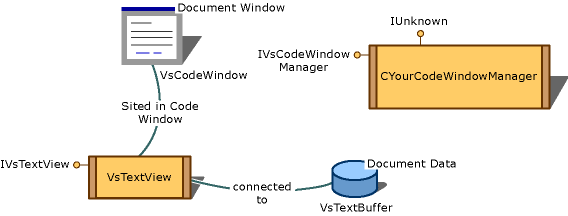

# Customizing Code Windows by Using the Legacy API
[!INCLUDE[vs2017banner](../includes/vs2017banner.md)]

A code window is a document window object that supports one or more text views. The exact features of a code window depend on the associated language service. In multiple-document interface (MDI) mode, the code window is the MDI child frame.  
  
 Code windows are controlled by language services, and each language service can provide its own code window manager. This enables the language service to add its own adornments to the code window, such as squiggles, colorization, and more. For more information about how to create a core window, see [Instantiating the Core Editor By Using the Legacy API](../extensibility/instantiating-the-core-editor-by-using-the-legacy-api.md).  
  
 A code window is an <xref:Microsoft.VisualStudio.Shell.Interop.IVsWindowFrame> object that has a text view and any adornments sited in the object. When you create the code window during your instantiation of the core editor, your language service can attach an <xref:Microsoft.VisualStudio.TextManager.Interop.IVsCodeWindowManager> to the code window, as is shown in the following illustration.  
  
   
Code window  
  
 The language service implements the code window manager and is responsible for managing adornments, such as a drop-down bar. The code window calls the <xref:Microsoft.VisualStudio.TextManager.Interop.IVsCodeWindowManager.AddAdornments%2A> method during code window initialization. When this call is made, the language service can add a drop-down bar or a button bar (<xref:Microsoft.VisualStudio.TextManager.Interop.IVsButtonBarClient>) to the code window.  
  
## In This Section  
 `Customizing Code Windows by Using the Legacy API`  
 Explains how to customize code windows using the legacy API.  
  
 [How to: Host An Editor in Another Editor](../extensibility/how-to-host-an-editor-in-another-editor.md)  
 Explains how to host a second editor inside an editor window.  
  
 [How to: Fire Events When the Editor Loses Focus](../extensibility/how-to-fire-events-when-the-editor-loses-focus.md)  
 Explains how to attach a document view to a document data object.  
  
## See Also  
 <xref:Microsoft.VisualStudio.TextManager.Interop.VsCodeWindow>   
 <xref:Microsoft.VisualStudio.TextManager.Interop.IVsTextView>   
 <xref:Microsoft.VisualStudio.TextManager.Interop.VsTextBuffer>   
 <xref:Microsoft.VisualStudio.TextManager.Interop.VsTextView>   
 [Instantiating the Core Editor By Using the Legacy API](../extensibility/instantiating-the-core-editor-by-using-the-legacy-api.md)   
 [Accessing theText View by Using the Legacy API](../extensibility/accessing-thetext-view-by-using-the-legacy-api.md)
