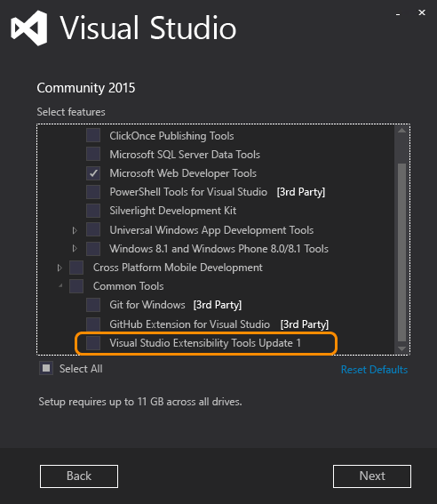
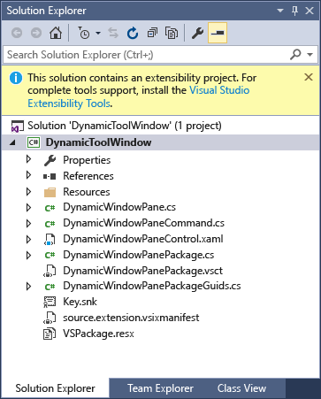

# Installing the Visual Studio SDK
[!INCLUDE[vs2017banner](../includes/vs2017banner.md)]

Starting in Visual Studio 2015, you do not install the Visual Studio SDK from the download center. It is included as an optional feature in Visual Studio setup. You can also install the VS SDK later on.  
  
## Installing the Visual Studio SDK as Part of a Visual Studio Installation  
 If you’d like to include the VSSDK in your Visual Studio installation, you must do a custom installation.  
  
> [!NOTE]
> In the installation executable, the Visual Studio SDK is called **Visual Studio Extensibility Tools**.  
  
1. Start the Visual Studio 2015 installation. You can install any edition of Visual Studio except Express.  
  
2. On the first screen, select **Custom**, not **Default**. Click **Next**.  
  
3. You should see a tree view of custom features. Open **Common Tools**. You should see **Visual Studio Extensibility Tools** .  
  
       
  
4. Check **Visual Studio Extensibility Tools** , then click **Next** and continue the installation.  
  
## Installing the Visual Studio SDK after Installing Visual Studio  
 If you decide to install the Visual Studio SDK after completing your Visual Studio installation, you should follow the following procedure:  
  
1. Go to **Control Panel / Programs / Programs and Features**, and look for **Visual Studio 2015**. You can install the Visual Studio SDK for any edition of Visual Studio 2015 except Express.  
  
2. Right-click **Visual Studio 2015**, and then click **Change**. You should see the installation page.  
  
3. Follow the same procedure as in **Installing the Visual Studio SDK as Part of a Visual Studio Installation** above.  
  
4. Click the **Visual Studio Extensibility Tools** link to install the Visual Studio SDK.  
  
## Installing the Visual Studio SDK from a Solution  
 If you open a solution with an extensibility project without first installing the VSSDK, you will be prompted by a highlighted information bar above the Solution Explorer. It should look something like the following:  
  
   
  
## Installing the Visual Studio SDK from the Command Line  
 You can install the VSSDK from the command line by using the **/InstallSelectableItems** switch with the Visual Studio installer. For details about using command-line parameters with the installer, see [Installing Visual Studio 2015](../install/install-visual-studio-2015.md).  
  
 Here is how to install the VSSDK silently using the Visual Studio 2015 Community installer:  
  
```  
vs_community.exe /s /installSelectableItems VS_SDK_GROUPV1  
```  
  
 Note that you must use the Visual Studio installer that matches your installed version of Visual Studio. For example, if you have Visual Studio Enterprise installed on your computer, you must run the Visual Studio Enterprise installer (vs_enterprise.exe).
