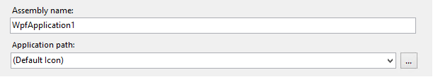
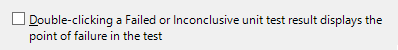
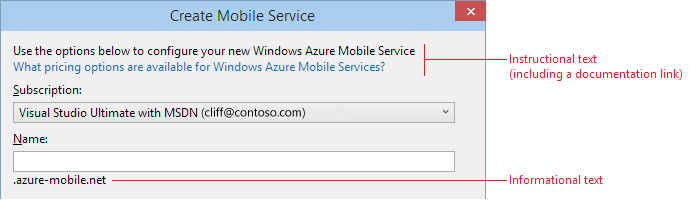
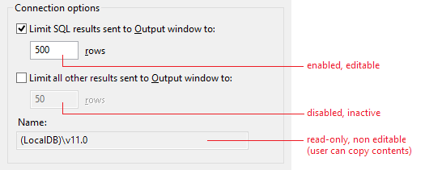
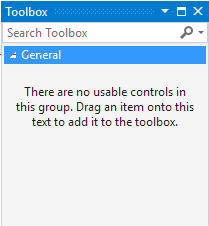
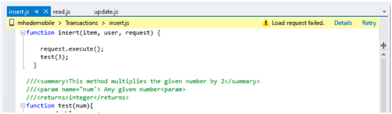
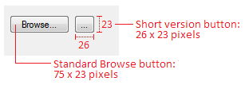
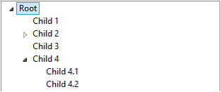
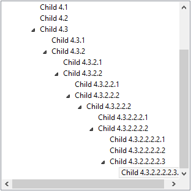
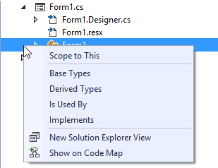

# Common Control Patterns for Visual Studio
[!INCLUDE[vs2017banner](../../includes/vs2017banner.md)]

##  Common controls

### Overview
 Common controls make up the majority of the user interface in Visual Studio. Most common controls used in the Visual Studio interface should follow the [Windows Desktop interaction guidelines](https://msdn.microsoft.com/library/windows/desktop/dn742399.aspx). This document is specific to Visual Studio and covers special situations or details that augment those Windows guidelines.

#### Common controls in this topic

- [Scrollbars](../../extensibility/ux-guidelines/common-control-patterns-for-visual-studio.md#BKMK_Scrollbars)

- [Input fields](../../extensibility/ux-guidelines/common-control-patterns-for-visual-studio.md#BKMK_InputFields)

- [Combo boxes and drop-down lists](../../extensibility/ux-guidelines/common-control-patterns-for-visual-studio.md#BKMK_ComboBoxesAndDropDowns)

- [Check boxes](../../extensibility/ux-guidelines/common-control-patterns-for-visual-studio.md#BKMK_CheckBoxes)

- [Radio buttons](../../extensibility/ux-guidelines/common-control-patterns-for-visual-studio.md#BKMK_RadioButtons)

- [Group frames](../../extensibility/ux-guidelines/common-control-patterns-for-visual-studio.md#BKMK_GroupFrames)

- [Text controls](../../extensibility/ux-guidelines/common-control-patterns-for-visual-studio.md#BKMK_TextControls)

- [Buttons and hyperlinks](../../extensibility/ux-guidelines/common-control-patterns-for-visual-studio.md#BKMK_ButtonsAndHyperlinks)

- [Tree views](../../extensibility/ux-guidelines/common-control-patterns-for-visual-studio.md#BKMK_TreeViews)

#### Visual style
 The first thing to consider when styling controls is whether the controls will be used in themed UI. Controls in standard UI are non-themed UI and must follow [normal Windows Desktop style](https://msdn.microsoft.com/library/windows/desktop/dn742399\(v=vs.85\).aspx), meaning that they are not re-templated and should appear in their default control appearance.

- **Standard (utility) dialogs:** not themed. Do not re-template. Use basic control style defaults.

- **Tool windows, document editors, design surfaces and themed dialogs:** Use specialized themed appearance using the color service.

###  Scrollbars
 Scrollbars should follow [common interaction patterns for Windows scrollbars](https://msdn.microsoft.com/library/windows/desktop/bb787527\(v=vs.85\).aspx) unless they are augmented with content information, such as in the code editor.

###  Input fields
 For typical interaction behavior, follow the [Windows Desktop guidelines for text boxes](https://msdn.microsoft.com/library/windows/desktop/dn742442\(v=vs.85\).aspx).

#### Visual style

- Input fields should not be styled in utility dialogs. Use the basic style intrinsic to the control.

- Themed input fields should only be used in themed dialogs and tool windows.

#### Specialized interactions

- Read-only fields will have a gray (disabled) background but default (active) foreground.

- Required fields should have **\<Required>** as watermarks within them. You should not change the color of the background except in rare situations.

- Error validation: See [Notifications and Progress for Visual Studio](../../extensibility/ux-guidelines/notifications-and-progress-for-visual-studio.md)

- Input fields should be sized to fit the content, not to fit the width of the window in which they are shown, nor to arbitrarily match the length of a long field, such as a path. Length might be an indication to the user of limitations as to how many characters are allowed in the field.

     
     **Incorrect input field length: It is unlikely that the name will be this long.**

     
     **Correct input field length: The input field is a reasonable width for the expected content.**

###  Combo boxes and drop-down lists
 For typical interaction behavior, follow the [Windows Desktop guidelines for drop-down lists and combo boxes](https://msdn.microsoft.com/library/windows/desktop/dn742404\(v=vs.85\).aspx).

#### Visual style

- In utility dialogs, do not re-template the control. Use the basic style intrinsic to the control.

- In themed UI, combo boxes and drop-downs follow the standard theming for the controls.

#### Layout
 Combo boxes and drop-downs should be sized to fit the content, not to fit the width of the window in which they are shown, nor to arbitrarily match the length of a long field, such as a path.

 

 **Incorrect field length for a drop-down control**

 

 **Correct field length for a drop-down control**

###  Check boxes
 For typical interaction behavior, follow the [Windows Desktop guidelines for check boxes](https://msdn.microsoft.com/library/windows/desktop/dn742401\(v=vs.85\).aspx).

#### Visual style

- In utility dialogs, do not re-template the control. Use the basic style intrinsic to the control.

- In themed UI, check boxes follow the standard theming for the controls.

#### Specialized interactions

- Interaction with a check box must never pop a dialog or navigate to another area.

- Align check boxes with the baseline of the first line of text.

     
     **Incorrect check box alignment: Check box is centered on the text.**

     
     **Correct check box alignment: Check box is aligned with the baseline of the first line of text.**

###  Radio buttons
 For typical interaction behavior, follow the [Windows Desktop guidelines for radio buttons](https://msdn.microsoft.com/library/windows/desktop/dn742436\(v=vs.85\).aspx).

#### Visual style
 In utility dialogs, do not style radio buttons. Use the basic style intrinsic to the control.

#### Specialized interactions
 It is not necessary to use a group frame to enclose radio choices.

###  Group frames
 For typical interaction behavior, follow the [Windows Desktop guidelines for group frames](https://msdn.microsoft.com/library/windows/desktop/dn742405\(v=vs.85\).aspx).

#### Visual style
 In utility dialogs, do not style group frames. Use the basic style intrinsic to the control.

#### Layout

- It is not necessary to use a group frame to enclose radio choices, unless you need to maintain group distinction in a tight layout.

- Never use a group frame for a single control.

- It is sometimes acceptable to use a horizontal rule instead of a group frame container.

##  Text controls

### Labels

#### Active label state

##### Utility (standard) dialogs)

- In general, follow the Windows Desktop guidance for control labels.

- In utility dialogs, labels should appear non-bold, in the standard environment font and text color. See [Fonts and Formatting for Visual Studio](../../extensibility/ux-guidelines/fonts-and-formatting-for-visual-studio.md).

- Ellipses should always follow labels.

##### Signature (themed) dialogs)
 Label controls may be bold or light gray.

#### Disabled label state
 Labels should reflect the appearance of the control they are associated with. For example, if the associated control is disabled, then the label should appear gray and disabled. This is usually handled by the OS and requires no special treatment.

#### Dynamic labels
 Dynamic labels change based on the current selection. Whenever possible, use dynamic labels in master/detail layouts to help the user understand that the displayed information is relevant to a specific selection and not general information.

 

 **Example of a dynamic label used with dynamic content**

#### Instructional text
 Some interface elements benefit from instructional text to help the user understand the UI purpose or to indicate which action to take.

- Instructional text is most common at the top of dialogs, but can appear in other areas to give instruction to a complex control grouping.

- Instructional text is non-interactive, but may contain hyperlinks to Help topics.

- Use instructional text sparingly and only when needed.

##### Formatting
 Instructional text should be Environment font, standard (non-themed) control text. See [Fonts and Formatting for Visual Studio](../../extensibility/ux-guidelines/fonts-and-formatting-for-visual-studio.md).

 For details on writing instructional text, see [UI text and terminology](../../extensibility/ux-guidelines/ui-text-and-help-for-visual-studio.md#BKMK_UITextAndTerminology).

 

 **Instructional text in a Visual Studio dialog**

#### Informational text
 Informational text is text that gives the user additional information. It may be static or dynamic, or used as a notification. It is always read-only, but if it is useful for the user to have the ability to copy the information, dynamic text should be placed in a control container such as a read-only text field.

##### Dynamic (context-specific) text
 Dynamic information text changes depending on context, such as when the user switches focus. Often, but not always, dynamic content is paired with a dynamic label.

 

 **Dynamic informational text changes depending on context.**

##### Formatting
 There are two ways to display read-only text fields: either directly on the UI surface (see above) or contained within another control, such as a group frame or text box. Either is correct depending on the situation. It is up to the feature designer to determine how to present the read-only information.

 Text can be inside a read-only text box. This generally indicates that the content can be selected and copied, although it cannot be edited.

 

 **Informational text formatting for read-only fields**

#### Watermarks
 While the wording might be the same, the difference between watermarks and instructional text is that watermarks are replaced with content when the control/window is not empty, and instructional text remains visible at all times.

 Watermarks should be used when a window or control is empty. They indicate what needs to be done to populate the area and may include action links to open relevant windows, such as a drag source.

##### Visual style

- Watermarks should be centered horizontally within the window.

- Watermarks should be center-aligned, not left-aligned.

- Watermarks may be vertically centered or positioned near the top of the area. If located near the top of the area, there must be enough space above so that the watermark stands out.

- Use the `Environment.GrayText` color token and standard environment font. Hyperlinks should use the standard hyperlink shared tokens: `Environment.PanelHyperlink`, `Environment.PanelHyperlinkHover`, `Environment.PanelHyperlinkPressed`, and `Environment.PanelHyperlinkDisabled`.

- Watermarks cannot be selected on the background

- If possible, include links in the watermark to help the user get started.

  

  

  **Examples of watermark text in Visual Studio**

##  Buttons and hyperlinks

### Overview
 Buttons and link controls (hyperlinks) should follow [basic Windows Desktop guidance on hyperlinks](https://msdn.microsoft.com/library/windows/desktop/dn742406\(v=vs.85\).aspx) for usage, wording, sizing, and spacing.

### Choosing between buttons and links
 Traditionally, buttons have been used for actions and hyperlinks have been reserved for navigation. Buttons may be used in all cases, but the role of links has been expanded in Visual Studio so that buttons and links are more interchangeable in some conditions.

 When to use command buttons:

- Primary commands

- Displaying windows used to gather input or making choices, even if they are secondary commands

- Destructive or irreversible actions

- Commitment buttons within wizards and page flows

  Avoid command buttons in tool windows, or if you need more than two words for the label. Links can have longer labels.

  When to use links:

- Navigation to another window, document, or web page

- Situations that require a longer label or short sentence to describe the intent of the action

- Tight spaces where a button would overwhelm the UI, provided that the action is not destructive or irreversible

- De-emphasizing secondary commands in situations where there are many commands

#### Examples
 

 **Command links used in the InfoBar following a status message**

 

 **Links used in the CodeLens popup**

 

 **Links used for secondary commands where buttons would attract too much attention**

### Common buttons

#### Text
 Follow the writing guidelines in [UI text and terminology](../../extensibility/ux-guidelines/ui-text-and-help-for-visual-studio.md#BKMK_UITextAndTerminology).

#### Visual style

##### Standard dialogs
 Most buttons in Visual Studio will appear in standard dialogs and should not be styled. They should reflect the standard appearance of buttons as dictated by the operating system.

##### Themed
 In some instances, buttons may be used within styled UI and these buttons must be styled appropriately. See [Dialogs](../../extensibility/ux-guidelines/application-patterns-for-visual-studio.md#BKMK_Dialogs) for information on themed controls.

### Special buttons

#### Browse… buttons
 **[Browse…]** buttons are used in grids, dialogs, and tool windows and other modeless UI elements. They display a picker that assists the user in filling a value into a control. There are two variations of this button, long and short.

 

 **The long [Browse…] button**

 

 **The ellipsis-only short [...] button**

 When to use the ellipsis-only short button:

- If there is more than one long **[Browse…]** button in a dialog, such as when several fields allow for browsing. Use the short **[...]** button for each to avoid the confusing access keys created by this situation (**&Browse** and **B&rowse** in the same dialog).

- In a tight dialog, or when there is no reasonable place to put the long button.

- If the button will appear in a grid control.

  Guidelines for using the button:

- Do not use an access key. To access it using the keyboard, the user must tab from the adjacent control. Ensure that the tab order is such that any browse button falls immediately after the field that it will fill. Never use an underscore below the first period.

- Set the Microsoft Active Accessibility (MSAA) **Name** property to **Browse...** (including the ellipsis) so that screen readers will read it as "Browse" and not "dot-dot-dot" or "period-period-period." For managed controls, this means setting the **AccessibleName** property.

- Never use an ellipsis **[...]** button for anything except a browse action. For example, if you need a **[New...]** button but don't have enough room for the text, then the dialog needs to be redesigned.

##### Sizing and spacing
 

 **Sizing [Browse…] buttons**

 

 **Spacing [Browse…] buttons**

#### Graphical buttons
 Some buttons should always use a graphical image and never include text to conserve space and avoid localization problems. These are often used in field pickers and other sortable lists.

> [!NOTE]
> Users have to tab to these buttons (there are no access keys), so place them in a sensible order. Map the name property of the button to the action that it takes so that screen readers correctly interpret the button action.

|||
|-|-|
|Add||
|Remove||
|Add All||
|Remove All||
|Move Up||
|Move Down||
|Delete||

##### Sizing and spacing
 Sizing for graphical buttons is the same as for the short version of the **[Browse…]** button (26x23 pixels):

 

 **Appearance of a graphical image on button, with and without transparent color showing**

### Hyperlinks
 Hyperlinks are well suited to navigation-based actions, such as opening a Help topic, modal dialog, or wizard. If a hyperlink is used for a command, it should always display a visible and noticeable change to the UI. In general, actions that commit to an action (such as Save, Cancel, and Delete) are better communicated using a button.

#### Writing style
 Follow the [Windows Desktop guidance for user interface text](https://msdn.microsoft.com/library/windows/desktop/dn742478\(v=vs.85\).aspx). Don't use "Learn more about," "Tell me more about," or "Get help with this" phrasing. Instead, phrase Help link text in terms of the primary question answered by the Help content. For example, “**How do I add a server to the Server Explorer?**”

#### Visual style

- Hyperlinks should always use [The VSColor Service](../../extensibility/ux-guidelines/colors-and-styling-for-visual-studio.md#BKMK_TheVSColorService). If a hyperlink is not styled correctly, it flashes red when active or shows a different color after being visited.

- Do not include underlines at the control resting state unless the link is a sentence fragment within a full sentence, such as in a watermark.

- Underlines should not appear on hover. Instead, the feedback to the user that the link is active is a slight color change and the appropriate link cursor.

##  Tree views

### Overview
 Tree views provide a way to organize complex lists into parent-child groups. A user can expand or collapse parent groups to reveal or hide underlying child items. Each item within a tree view can be selected to provide further action.

 This topic covers acceptable use, proper design, and functionality of tree views.

#### In this topic

- [Visual style](../../extensibility/ux-guidelines/common-control-patterns-for-visual-studio.md#BKMK_TreeViewVisualStyle)

- [Interactions](../../extensibility/ux-guidelines/common-control-patterns-for-visual-studio.md#BKMK_TreeViewInteractions)

###  Visual style

#### Expanders
 Tree view controls should conform to the expander design used by Windows and Visual Studio. Each node uses an expander control to reveal or hide underlying items. Using an expander control provides consistency for users who might encounter different tree views within Windows and Visual Studio.

 

 **Correct: proper style of tree view node using an expander control**

 

 **Incorrect: improper style of tree view node**

#### Selection
 When a node is selected within the tree view, the highlight should expand to the full width of the tree view control. This helps users clearly identify which item they have selected. Selection colors should reflect the current Visual Studio theme.

 

 **Correct: highlight of the selected node fits the entire width of the tree view control.**

 

 **Incorrect: highlight of the selected node does not fit the entire width of the tree view control.**

#### Icons
 Icons should only be used in tree view controls if they assist in visually identifying differences between items. In general, icons should be used only in heterogeneous lists in which the Icons carry information to differentiate the types of elements. In a homogeneous list using icons can frequently be seen as noise and should be avoided. In that case the group icon (parent) can convey the type of items within it. The exception to this rule would be if the icon is dynamic and is used to indicate state.

#### Scroll bars
 Scroll bars should always be hidden if the content fits within the tree view control. It is acceptable for scrollbars to be hidden, or semi-transparent in a scrollable window and appear when the window containing the tree view has focus, or upon hover of the tree view itself.

 

 **Both vertical and horizontal scroll bars are displayed because the contents have exceeded the limits of the tree view control.**

###  Interactions

#### Context menus
 A tree view node can reveal submenu options in a context menu. Typically, this occurs when a user has right-clicked an item or pressed the Menu key on a Windows keyboard with the item selected. It's important that the node gains focus and is selected. This helps the user identify which item the submenu belongs to.

 

 **The item that has generate the context menu gains focus to notify the user which item has been selected.**

#### Keyboard
 The tree view should provide the ability to select items and expand/collapse nodes using the keyboard. This ensures that navigation meets our accessibility requirements.

##### Tree view control
 Visual Studio tree controls should follow common keyboard navigation:

- **Up Arrow:** Select items by moving up the tree

- **Down Arrow:** Select items by moving down the tree

- **Right Arrow:** Expand a node in the tree

- **Left Arrow:** Collapse a node in the tree

- **Enter key:** Initiate, load, execute selected item

##### Trid (tree view and grid view)
 A trid control is a complex control which contains a tree view within a grid. Expanding, collapsing, and navigating the tree should respect the same keyboard commands as a tree view, with the following additions:

- **Right Arrow:** Expand a node. After the node is expanded, it should continue navigating to the nearest column on the right. Navigation should stop at the end of the row.

- **Tab:** Navigates to the nearest cell on the right.  At the end of the row, navigation continues to the next row.

- **Shift + Tab:** Navigates to the nearest cell on the left.  At the beginning of the row, navigation continues to the rightmost cell in the previous row.

  

  **A trid control in Visual Studio**
