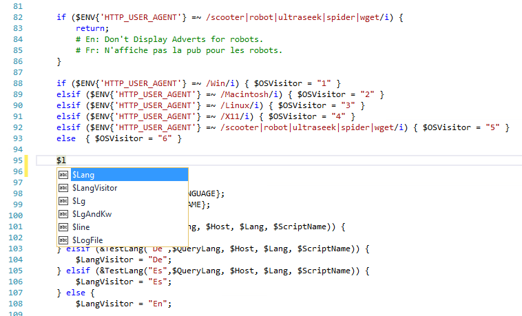

# Adding Visual Studio editor support for other languages
[!INCLUDE[vs2017banner](../includes/vs2017banner.md)]

Learn about how the Visual Studio editor supports reading and navigating through different computer languages and how you can add Visual Studio editor support for other languages.

## Syntax colorization, statement completion, and Navigate To support
 Features in the Visual Studio editor such as syntax colorization, statement completion, and Navigate To can help you more easily read, create, and edit your code. The following screenshot shows an example of editing a Perl script in Visual Studio. The syntax is automatically colorized. For example, remarks in the code are colored green, code is black, paths are red, and statements are blue. The Visual Studio editor automatically applies syntax colorization to any language it supports. In addition, when you begin to enter a known language keyword or object, statement completion displays a list of possible statements and objects. Statement completion can help you create code more quickly and easily.

 

 Visual Studio currently provides syntax colorization and basic statement completion support for the following languages using [TextMate Grammars](https://manual.macromates.com/en/language_grammars). If your favorite language isn't in the table, though, don't worry - you can add it.

|||||||
|-|-|-|-|-|-|
|Bat|F#|Java|Markdown|Rust|Visual Basic|
|Clojure|Go|JavaDoc|Objective-C|ShaderLab|Visual C#|
|CMake|Groovy|JSON|Perl|ShellScript|Visual C++|
|CoffeeScript|HTML|LESS|Python|SQL|VBNet|
|CSS|INI|LUA|R|Swift|XML|
|Docker|Jade|Make|Ruby|TypeScript|YAML|

 In addition to syntax colorization and basic statement completion, Visual Studio also has a feature called [Navigate To](https://blogs.msdn.microsoft.com/benwilli/2015/04/09/visual-studio-tip-3-use-navigate-to/). This feature enables you to quickly search code files, file paths and code symbols. Visual Studio provides Navigate To support for the following languages.

- Go

- Java

- JavaScript

- PHP

- TypeScript

- Visual Basic

- Visual C++

- Visual C#

  All of these file types have  the features described earlier even if support for a given language hasn't yet  been installed. Installing specialized support for some languages may provide additional language support, such as IntelliSense or other advanced language features such as Light Bulbs.

## Adding support for non-supported languages
 Visual Studio 2015 Update 1 and later versions provide language support in the editor by using [TextMate Grammars](https://manual.macromates.com/en/language_grammars). If your favorite programming language currently isn't supported in the Visual Studio editor, first, search the web - a TextMate bundle for the language may already exist. If you can't find one, though, you can add support for it yourself in Visual Studio 2015 Update 1 or later by creating a TextMate bundle  model for language grammars and snippets.

 Add any new TextMate Grammars for Visual Studio in the following folder:

 %userprofile%\\.vs\Extensions

 Under this base path, add the following folder(s) if they apply to your situation:

|Folder Name|Description|
|-----------------|-----------------|
|\\*\<language name>*|The language folder. Replace *\<language name>* with the name of the language. For example, **\Matlab**.|
|\Syntaxes|The grammar folder. Contains the grammar .json files for the language, such as **Matlab.json**.|
|\Snippets|The snippets folder. Contains snippets for the language.|

 In Windows, %userprofile% resolves to the path: c:\Users\\*\<user name>*. If the extensions folder does not exist on your system, you will need to create it. If the folder already exists, it will be hidden.

 For details about how to create TextMate Grammars, see [TextMate – Introduction to Language Grammars: How to add source code syntax highlighting embedded in HTML](https://developmentality.wordpress.com/2011/02/08/textmate-introduction-to-language-grammars/) and [Notes on how to create a Language Grammar and Custom Theme for a Textmate Bundle](https://benparizek.com/notebook/notes-on-how-to-create-a-language-grammar-and-custom-theme-for-a-textmate-bundle).

## See Also
 [Visual Studio 2013 Navigate To Improvements](https://blogs.msdn.microsoft.com/mvpawardprogram/2013/10/22/visual-studio-2013-navigate-to-improvements/)
 [Walkthrough: Creating a Code Snippet](../ide/walkthrough-creating-a-code-snippet.md)
 [Walkthrough: Displaying Statement Completion](../extensibility/walkthrough-displaying-statement-completion.md)
