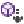

# Class View and Object Browser Icons
[!INCLUDE[vs2017banner](../includes/vs2017banner.md)]

Class View** and the **Object Browser** display icons that represent code entities, for example, namespaces, classes, functions, and variables. The following table illustrates and describes the icons.

|Icon|Description|Icon|Description|
|----------|-----------------|----------|-----------------|
||Namespace||Method or Function|
||Class||Operator|
||Interface||Property|
||Structure||Field or Variable|
||Union||Event|
||Enum||Constant|
||TypeDef||Enum Item|
||Module||Map Item|
||Extension Method||External Declaration|
||Delegate||Error|
||Exception||Template|
||Map||Unknown|
||Type Forwarding|||

## Signal Icons
 The following signal icons apply to all the previous icons and indicate their accessibility.

> [!NOTE]
> If your project is included in a source control database, additional signal icons may be displayed to indicate source-control status, such as checked in or checked out.

|Icon|Description|
|----------|-----------------|
|\<No Signal Icon>|Public. Accessible from anywhere in this component and from any component that references it.|
||Protected. Accessible from the containing class or type, or those derived from the containing class or type.|
||Private. Accessible only in the containing class or type.|
||Sealed.|
||Friend/Internal. Accessible only from the project.|
||Shortcut. A shortcut to the object.|

## See Also
 [Viewing the Structure of Code](../ide/viewing-the-structure-of-code.md)
