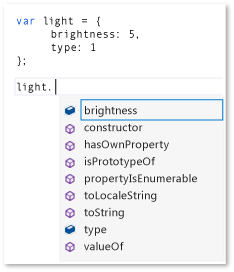
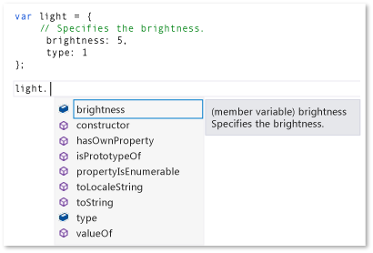
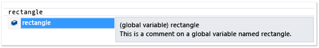
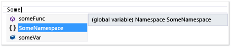
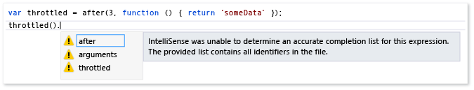

# Extending JavaScript IntelliSense
[!INCLUDE[vs2017banner](../includes/vs2017banner.md)]

The JavaScript IntelliSense extensibility feature enables you to customize IntelliSense results in the JavaScript editor for third-party libraries. This can improve the experience of developers who use these libraries.

 The JavaScript language service provides IntelliSense features for third-party JavaScript libraries that are added to a project. For most libraries, statement completion is provided automatically by the language service. The following illustration shows an example of statement completion:

 

 If your library includes descriptions of variables, functions, and objects in standard JavaScript comment tags (//), you automatically benefit, by default, from IntelliSense extensibility features, which provide descriptive information in a pop-up box that appears to the right of elements in a completion list, or when you type the opening parenthesis in a function call. The comments in the pop-up box contain the description of the member. The following example shows the pop-up box for a completion list.

 

 To further improve the developer experience, you might want to provide type information to developers in the pop-up box. You can provide type information by using JavaScript [XML Documentation Comments](../ide/xml-documentation-comments-javascript.md) instead of standard comment tags. You add XML Documentation Comments by using triple-slash comment tags (///) and a defined set of XML elements.

 Alternatively, you can provide type information by using JavaScript IntelliSense extensibility. This feature enables you to customize IntelliSense results by creating JavaScript extensions and adding them to the script context. In the extension, which is a JavaScript file, you subscribe to events that are exposed by the `intellisense` object of the language service. JavaScript IntelliSense extensibility is the preferred solution for libraries if a behavior pattern in the library prevents the JavaScript language service from providing the desired level of IntelliSense support, and if an alternative to declarative XML Documentation Comments is also needed. By customizing the IntelliSense results, you can create a first-class IntelliSense experience, regardless of any behavioral patterns that might restrict the language service's default capabilities. For more information, see [Statement Completion for Identifiers](../ide/statement-completion-for-identifiers.md).

## Adding an Extension to the Script Context
 For an IntelliSense extension to be executed, it needs to be added to the current script context. The extension can be automatically added to the script context by the automatic discovery mechanism, or you can add the extension to the script context manually by using reference groups or the reference directive.

 The automatic discovery mechanism enables the language service to automatically find extensions that follow the file naming convention *libraryname*.intellisense.js, and that are located in the same directory as the library to which the extension applies. For example, a valid extension for the jQuery library would be jQuery.intellisense.js. For more restrictive jQuery extensions, you can use file names such as jQuery-1.7.1.intellisense.js (a version-specific extension) or jQuery.ui.intellisense.js (an extension for a scoped jQuery library). The most restrictive version of the extension is used if more than one extension is found for a given library.

 If you want to use the extension for all your JavaScript project files, you might instead choose to add the extension to a reference group. There are several types of reference groups, either those that include implicit references and those that include dedicated worker references. To add an extension, you typically need to add the file as an implicit reference group, either **Implicit (Windows)**, **Implicit (Web)**. Implicit references are in scope for every .js file opened in the Code Editor. When you use this method, you need to add both the extension and the file that the extension is supplementing.

 Use the **IntelliSense** page of the **Options** dialog box to add an extension as a reference group. You can access the **IntelliSense** page by choosing **Tools**, **Options** on the menu bar, and then choosing **Text Editor**, **JavaScript**, **IntelliSense**, **References**. For more information about reference groups, see [JavaScript IntelliSense](../ide/javascript-intellisense.md) and [Options, Text Editor, JavaScript, IntelliSense](../ide/reference/options-text-editor-javascript-intellisense.md).

 If you want to use the extension for a specific set of files, use a reference directive. When you use this method, you need to reference both the extension and the file the extension is supplementing. For information about using the reference directive, see [JavaScript IntelliSense](../ide/javascript-intellisense.md).

## Handling IntelliSense events
 The extensibility feature enables you to customize IntelliSense results by subscribing to events such as the `statementcompletion` event of the language service `intellisense` object. The following example shows a simple extension that's used by the language service to hide members that begin with an underscore from statement completion. This code is contained in underscorefilter.js and is in the \\\\*Visual Studio installation path*\JavaScript\References folder.

```javascript
intellisense.addEventListener('statementcompletion', function (event) {
    if (event.targetName === "this") return;

    var filterRegex;

    if (event.target === undefined || event.target === window)
        filterRegex = /^_.*\d{2,}/;
    else
        filterRegex = /^_.*/;

    event.items = event.items.filter(function (item) {
        return !filterRegex.test(item.name);
    });
});
```

 In the preceding code, the extension checks the [targetName Property](#TargetName) and [target Property](#Target) properties of the `statementcompletion` event object to exclude objects such as `this` and `window`, and to ensure that a valid statement completion list can be identified. If a completion list can be identified, the extension updates the statement completion [items Property](#Items) collection by filtering out members that begin with an underscore.

 For additional examples, look in the \\\\*Visual Studio installation path*\JavaScript\References folder. The showPlainComments.js file in this folder provides examples of using other events to provide default IntelliSense support for standard JavaScript comment tags (//). Like underscorefilter.js, showPlainComments.js is already available as a working extension, and you can see the resulting IntelliSense information when using comment tags in your code for variables, functions, and objects. For additional examples, see [Code Examples](#CodeExamples).

> [!WARNING]
> If you modify the extension files included with Visual Studio, you may disable JavaScript IntelliSense or the feature supported by the extension.

 In your extension code, you can create handlers for the following event types by using `addEventListener`:

- `statementcompletion`, which adds a handler for a statement completion event. Statement completion provides a list of members for a particular type that appears after you type a special character such as a period (.), or a list of identifiers that appears while you type or when you press CTRL + J. The handler receives an event object of type `CompletionEvent`, which supports the following members: [items Property](#Items), [target Property](#Target), [targetName Property](#TargetName), and [scope Property](#Scope).

- `signaturehelp`, which adds a handler for IntelliSense Parameter Info. Parameter information gives you information about the number, names, and types of parameters required by a function. The handler receives an event object of type `SignatureHelpEvent`, which supports the following members: [target Property](#Target), [parentObject Property](#ParentObject), [functionComments Property](#FunctionComments), [functionHelp Property](#FunctionHelp).

- `statementcompletionhint`, which adds a handler for IntelliSense Quick Info. The Quick Info pop-up box shows the complete declaration for identifiers in your code. The handler receives an event object of type `CompletionHintEvent`, which supports the following members: [completionItem Property](#CompletionItem), and [symbolHelp Property](#SymbolHelp).

  For examples that show IntelliSense features such as statement completion, parameter information, and Quick Info, see [Using IntelliSense](../ide/using-intellisense.md).

> [!NOTE]
> In JavaScript, Quick Info refers to the pop-up box that appears to the right of a completion list. You cannot manually invoke Quick Info.

## <a name="intellisenseObject"></a> intellisense Object
 The following table shows the functions that are available for the `intellisense` object. The `intellisense` object is available only at design time.

|Function|Description|
|--------------|-----------------|
|`addEventListener(type, handler);`|Adds an event handler for an IntelliSense event.<br /><br /> `type` is a string value. Valid values include `statementcompletion`, `signaturehelp`, and `statementcompletionhint`.<br /><br /> `handler` is an event handler function that receives an event object of one of the following types:<br /><br /> -   `CompletionEvent`, used for the `statementcompletion` event.<br />-   `SignatureHelpEvent`, used for the `signaturehelp` event.<br />-   `CompletionHintEvent`, used for the `statementcompletionhint` event.<br /><br /> For examples that use this function, see [Code Examples](#CodeExamples).|
|`annotate(obj, doc);`|Specifies documentation for an object by copying documentation comments from one object to another object.<br /><br /> `obj` specifies the object to which to copy the documentation.<br /><br /> `doc` specifies the object from which to copy the documentation.<br /><br /> For an example that shows how to use this function, see [Adding IntelliSense Annotations](#Annotations).|
|`getFunctionComments(func);`|Returns the comments for a specified function.<br /><br /> `func` specifies the function for which comments are returned.<br /><br /> You can set the `func` parameter by using `completionItem.value`.<br /><br /> The returned `functionComments` object includes the following members: `above`, `inside`, and `paramComment`. For more information, see the [functionComments Property](#FunctionComments) property.<br /><br /> `getFunctionComments` can be called only from within one of the event handlers that are registered by `addEventListener`.<br /><br /> For an example that shows how to use this function, see \\\\*Visual Studio installation path*\JavaScript\References\showPlainComments.js.|
|`logMessage(msg);`|Sends diagnostic messages to the Output window.<br /><br /> `msg` is a string that contains the message.<br /><br /> For an example that shows how to use this function, see [Sending Messages to the Output Window](#Logging).|
|`nullWithCompletionsOf(value);`|Returns a special null value for which the completion list is determined by the object passed in the `value` parameter.<br /><br /> `value` determines the completion list for the returned value. `value` can be any type.<br /><br /> The null return value is treated as null at design-time, but the completion list for the return value is the same as the completion list for the `value` parameter.<br /><br /> One use for this function is to provide IntelliSense for a return value when the return type is predictable at runtime, but the return value is `null` at design-time.|
|`redirectDefinition(func, definition);`|Instructs IntelliSense to use the provided definition function instead of the original func function when parameter help or **Go To Definition** is requested.<br /><br /> `func` specifies the target function.<br /><br /> `definition` specifies the function to be used instead of the target function for parameter information and **Go To Definition**.|
|`setCallContext(func, thisArg);`|Sets the call context, or scope, for the specified function.<br /><br /> `func` specifies the function for which to set the scope.<br /><br /> `thisArg` is an object literal to which the `this` keyword can refer to, which specifies the new scope for the member. You can include arguments to pass in this parameter, for example, `intellisense.setCallContext(func, { thisArg: "", args: [23,2] });`<br /><br /> `setCallContext` provides behavior similar to `Function.prototype.bind`, except that it used only for design-time IntelliSense support. You can use `setCallContext` to set the function scope if you need to simulate a call to code that is not otherwise reachable, so that when you call the function, the function call will include the correct scope and arguments.|
|`undefinedWithCompletionsOf(value);`|Returns a special undefined value for which the completion list is determined by the object passed in the `value` parameter.<br /><br /> `value` determines the completion list for the returned value. `value` can be any type.<br /><br /> The undefined return value is treated as undefined at design-time, but the completion list for the return value is the same as the completion list for the `value` parameter.<br /><br /> One use for this function is to provide IntelliSense for a return value when the return type is predictable at runtime, but the return value is undefined at design-time.|
|`version()`|Returns the Visual Studio version.|

## Event Members
 The following sections describe the members that are exposed in the event object for the following events: `statementcompletion`, `signaturehelp`, and `statementcompletionhint`.

### <a name="CompletionItem"></a> completionItem Property
 Returns the identifier, known as the completion item, for which a Quick Info pop-up box is requested. This property is available for the `statementcompletionhint` event object and for the [items Property](#Items) property of the `statementcompletion` event object.

 Return value: `completionItem` object

 Following are the members of the `completionItem` object:

- `name`. Read/write when used in the `items` collection; otherwise, read-only. Returns a string that identifies the completion item.

- `kind`. Read/write when used in the `items` collection; otherwise, read-only. Returns a string that represents the type of completion item. The possible values are method, field, property, parameter, variable, and reserved.

- `glyph`. Read/write when used in the `items` collection; otherwise, read-only. Returns a string that represents an icon that's displayed in the completion list. The possible values for `glyph` use the following format: vs:*glyphType*, where *glyphType* corresponds to the language-independent members in the <xref:Microsoft.VisualStudio.Language.Intellisense.StandardGlyphGroup> enumeration. For example, `vs:GlyphGroupMethod` is one possible value for `glyph`. When `glyph` is not set, the `kind` property determines the default icon.

- `parentObject`. Read-only. Returns the parent object.

- `value`. Read-only. Returns an object that represents the value of the completion item.

- `comments`. Read-only. Returns a string that contains the comments that are above the field or variable.

- `scope`. Read-only. Returns the scope of the completion item. The possible values are global, local, parameter, and member.

### <a name="Items"></a> items Property
 Gets or sets the array of statement completion items. Each element in the array is a [completionItem Property](#CompletionItem) object. The `items` property is available for the `statementcompletion` event object.

 Return value: array

### <a name="FunctionComments"></a> functionComments Property
 Returns the comments for the function. This property is available for the `signaturehelp` event object.

 Return value: `comments` object

 Following are the members of the `comments` object:

- `above`. Returns the comments above the function.

- `inside`. Returns the comments inside the function, typically in VSDoc format.

- `paramComments`. Returns an array representing comments for each parameter in the function. The members of the array include:

  - `name`. Returns a string representing the parameter name.

  - `comment`. Returns a string that contains the parameter comment.

### <a name="FunctionHelp"></a> functionHelp Property
 Returns the Help for the function. This property is available for the `signaturehelp` event object.

 Return value: `functionHelp` object

 Following are the members of the `functionHelp` object:

- `functionName`. Read/write. Returns a string that contains the function name.

- `signatures`. Read/write. Gets or sets the array of function signatures. Each element in the array is a `signature` object. Some `signature` properties, such as `locid`, correspond to common [XML Documentation Comments](../ide/xml-documentation-comments-javascript.md) attributes.

  The members of the `signature` object include:

  - `description`. Read/write. Returns a string that describes the function.

  - `locid`. Read/write. Returns a string identifier that contains localization information about the function.

  - `helpKeyword`. Read/write. Returns a string that contains the Help keyword.

  - `externalFile`. Read/write. Returns a string that represents the file that contains the member ID.

  - `externalid`. Read/write. Returns a string that represents the member ID of the function.

  - `params`. Read/write. Gets or sets the array of parameters for the function. Each element in the parameters array is a `parameter` object that has properties that correspond to the following attributes of the [\<param>](../ide/param-javascript.md) element:

    - `name`. Read/write. Returns a string that represents the parameter name.

    - `type`. Read/write. Returns a string that represents the parameter type.

    - `elementType`. Read/write. If the type is `Array`, returns a string that represents the type of the elements in the array.

    - `description`. Read/write. Returns a string that describes the parameter.

    - `locid`. Read/write. Returns a string identifier that contains localization information about the function.

    - `optional`. Read/write. Returns a string that indicates whether the parameter is optional. `true` indicates that the parameter is optional; `false` indicates that it isn't.

  - `returnValue`. Read/write. Gets or sets a return value object with properties that correspond to the following attributes of the [\<returns>](../ide/returns-javascript.md) element:

    - `type`. Read/write. Returns a string that represents the return type.

    - `elementType`. Read/write. If the type is `Array`, returns a string that represents the type of the elements in the array.

    - `description`. Read/write. Returns a string that describes the return value.

    - `locid`. Read/write. Returns a string identifier that contains localization information about the function.

    - `helpKeyword`. Read/write. Returns a string that contains the Help keyword.

    - `externalFile`. Read/write. Returns a string that represents the file that contains the member ID.

    - `externalid`. Read/write. Returns a string that represents the member ID of the function.

### <a name="ParentObject"></a> parentObject Property
 Returns the parent object of a member function. For example, for `document.getElementByID`, `parentObject` returns the `document` object. This property is available for the `signaturehelp` event object.

 Return value: object

### <a name="Target"></a> target Property
 Returns an object that represents the item to the left of the trigger character, which is a period (.). For functions, `target` returns the function for which Parameter Info is requested. This property is available for the `statementcompletion` and `signaturehelp` event objects.

 Return value: object

### <a name="TargetName"></a> targetName Property
 Returns a string that represents the target. For example, for "this.", `targetName` returns "this". For "A.B" (when the cursor is after "B"), `targetName` returns "B". This property is available for the `statementcompletion` event object.

 Return value: string

### <a name="SymbolHelp"></a> symbolHelp Property
 Returns the completion item for which a Quick Info pop-up box is requested. This property is available for the `statementcompletionhint` event object.

 Return value: `symbolHelp` object.

 Some properties of the `symbolHelp` object, such as `locid`, correspond to common [XML Documentation Comments](../ide/xml-documentation-comments-javascript.md) attributes.

 Following are the members of the `symbolHelp` object:

- `name`. Read/write. Returns a string that contains the identifier name.

- `symbolType`. Read/write. Returns a string that represents the symbol type. Possible values include Unknown, Boolean, Number, String, Object, Function, Array, Date, and Regex.

- `symbolDisplayType`. Read/write. Returns a string that contains the type name to display. If `symbolDisplayType` isn't set, `symbolType` is used.

- `elementType`. Read/write. If the `symbolType` is `Array`, returns a string that represents the type of the elements in the array.

- `scope`. Read/write. Returns a string that represents the scope of the symbol. Possible values include global, local, parameter, and member.

- `description`. Read/write. Returns a string that contains a description of the symbol.

- `locid`. Read/write. Returns a string identifier that contains localization information about the symbol.

- `helpKeyword`. Read/write. Returns a string that contains the Help keyword.

- `externalFile`. Read/write. Returns a string that represents the file that contains the member ID.

- `externalid`. Read/write. Returns a string that represents the member ID of the symbol.

- `functionHelp`. Read/write. Returns a [functionHelp Property](#FunctionHelp), which might contain information when the `symbolType` is Function.

### <a name="Scope"></a> scope Property
 Returns the completion scope of the event. The possible values for the completion scope are global and members. This property is available for the `statementcompletion` event object.

 Return value: string

## Debugging IntelliSense extensions
 You can't debug extensions, but you can use the [intellisense Object](#intellisenseObject) function to send information to the Visual Studio Output window. For an example that shows how to use this function, see [Sending Messages to the Output Window](#Logging) later in this topic. For `logMessage` to work, at least one event handler must be registered in an extension.

## <a name="CodeExamples"></a> Code Examples
 This section includes code examples that show how to use the IntelliSense extensibility APIs. There are also other ways to use these APIs. For additional examples, see the following files in the \\\\*Visual Studio installation path*\JavaScript\References folder. These are working examples used by the JavaScript language service.

- underscoreFilter.js. This code hides private members from IntelliSense. It includes event handlers for the `statementcompletion` event.

- showPlainComments.js. This code provides IntelliSense support for standard comments. It includes event handlers for the `signaturehelp` and `statementcompletionhint` events.

### <a name="Annotations"></a> Adding IntelliSense Annotations
 The following procedure shows how to provide IntelliSense documentation support for a third-party library without modifying the library directly. To do this, you can use `intellisense.annotate` in an extension.

 For this example to work, you need the following JavaScript files in your project:

- demoLib.js, which is a project file that represents a third-party library.

- demoLib.intellisense.js, which is the IntelliSense extension. This file doesn't need to be included in the project, but it does need to be in the same folder as exampleLib.js.

- appCode.js, which is a project file that represents app code.

##### To add an IntelliSense annotation

1. Add the following code to demoLib.js.

    ```javascript
    function someFunc(a) { };
    var rectangle;

    ```

2. Add the following code to demoLib.intellisense.js.

    ```javascript
    intellisense.annotate(someFunc, function (a) {
        /// <signature>
        /// <summary>Description of someFunc</summary>
        /// <param name="a">Param a</param>
        /// </signature>
    });

    intellisense.annotate(window, {
        // This is a comment on a global variable named rectangle.
        rectangle: undefined
    });
    ```

3. Add the following reference directive as the first line in appCode.js. The path used here indicates that the JavaScript files are in the same folder.

    ```javascript
    /// <reference path="demoLib.js" />

    ```

4. In appCode.js, type the following code. You'll see the XML documentation comments in the extension displayed as IntelliSense Parameter Info.

     

5. In appCode.js, type the following code. While you type, you'll see the standard comments in the extension displayed as IntelliSense Quick Info.

     

### <a name="Logging"></a> Sending Messages to the Output Window
 The following procedure shows how to send messages to the Output window. You can send messages to help debug IntelliSense extensions.

 For this example to work, you need the following JavaScript files in your project:

- exampleLib.js, which is a project file that represents a third-party library.

- exampleLib.intellisense.js, which is the IntelliSense extension. This file doesn't need to be included in the project, but it does need to be in the same folder as exampleLib.js.

- appCode.js, which is a project file that represents app code.

##### To send a message to the Output window

1. Add the following code to exampleLib.js.

    ```javascript
    var someVar = {
        a: 1,
        b: 'hello'
    };
    ```

2. Add the following code to exampleLib.intellisense.js.

    ```javascript
    intellisense.addEventListener('statementcompletion', function (e) {
        // Prints out statement completion info: Either (1) the member
        // list, if the trigger character was typed, or (2) the
        // statement completion identifiers.
        // e.target represents the object left of the trigger character.
        intellisense.logMessage(
            e.target ? 'member list requested, target: ' + e.targetName : 'statement completion for current scope requested');

        // Prints out all statement completion items.
        e.items.forEach(function (item) {
            intellisense.logMessage('[completion item] ' + item.name + ', kind:' + item.kind + ', scope:' + item.scope + ', value:' + item.value);
        });
    });
    ```

3. Add the following reference directive as the first line in appCode.js. The path used here indicates that the JavaScript files are in the same folder.

    ```javascript
    /// <reference path="exampleLib.js" />

    ```

4. In the Output window, choose **JavaScript Language Service** in the **Show output from** list. (To view the Output window, select **Output** from the View menu.)

5. In appCode.js, type the following code. While you type, the Output window shows messages from the language service. The first message in the Output window indicates that statement completion for the current scope has been requested.

    ```javascript
    some
    ```

     Following is a partial view of the output you should see.

    ```scr
    03:16:14.3113: statement completion for current scope requested
    03:16:14.3113: [completion item] break, kind:reserved, scope:undefined, value:undefined
    03:16:14.3113: [completion item] case, kind:reserved, scope:undefined, value:undefined
    03:16:14.3113: [completion item] catch, kind:reserved, scope:undefined, value:undefined

    …
    ```

6. Choose the **Clear All** button in the Output window.

7. Type the following code. The first message in the output window indicates that a member list has been requested.

    ```javascript
    someVar.
    ```

     Following is a partial view of the output you should see:

    ```scr
    03:17:43.4032: member list requested, target: someVar
    03:17:43.4032: [completion item] a, kind:field, scope:member, value:1
    03:17:43.4032: [completion item] b, kind:field, scope:member, value:hello
    03:17:43.4032: [completion item] constructor, kind:method, scope:member, value:

    …
    ```

### <a name="Icons"></a> Changing the IntelliSense icons
 The following procedure shows how to change the icons displayed by IntelliSense by default. This might be useful when you provide IntelliSense information about library-specific concepts such as namespaces, classes, interfaces, and enumerations.

 For available icon values, see <xref:Microsoft.VisualStudio.Language.Intellisense.StandardGlyphGroup>.

 For this example to work, you need the following JavaScript files in your project:

- exampleLib.js, which is a project file that represens a third-party library.

- exampleLib.intellisense.js, which is the IntelliSense extension. This file doesn't need to be included in the project, but it does need to be in the same folder as exampleLib.js.

- appCode.js, which is a project file that represents app code.

##### To change the icons

1. Add the following code to exampleLib.js.

    ```javascript
    function Namespace(name) {
        this._isNamespace = true;
        window[name] = this;
    };

    function Enum(values) {
        var e = Object.create(values);
        e._isEnum = true;
        return e;
    };

    var SomeNamespace = new Namespace('SomeNamespace');
    // A constructor function is considered a class.
    SomeNamespace.SomeClass1 = function () { }
    SomeNamespace.Enum1 = new Enum({ VALUE1: 0, VALUE2: 1 });
    ```

2. Add the following code to exampleLib.intellisense.js.

    ```javascript
    intellisense.addEventListener('statementcompletion', function (e) {
        e.items.forEach(function (item) {
            // Detect a namespace by using the _isNamespace flag.
            if (item.value && item.value._isNamespace) {
                item.glyph = 'vs:GlyphGroupNamespace';
                }

            if (item.parentObject && item.parentObject._isNamespace) {
                // The item is a member of a namespace.

                // All constructor functions that are part of a namespace
                // are considered classes.
                // A constructor function starts with
                // an uppercase letter by convention.
                if (typeof item.value == 'function' && (item.name[0].toUpperCase()
                    == item.name[0])) {
                    item.glyph = 'vs:GlyphGroupClass';
                }

                // Detect an enumeration by using the _isEnum flag.
                if (item.value && item.value._isEnum) {
                    item.glyph = 'vs:GlyphGroupEnum';
                }
            }
        });
    });

    intellisense.addEventListener('statementcompletionhint', function (e) {
        if (e.completionItem.value) {
            if (e.completionItem.value._isNamespace) {
                e.symbolHelp.symbolDisplayType = 'Namespace';
            }
            if (e.completionItem.value._isEnum) {
                e.symbolHelp.symbolDisplayType = 'Enum';
            }
        }
    });
    ```

3. Add the following reference directive as the first line in appCode.js. The path used here indicates that the JavaScript files are in the same folder.

    ```javascript
    /// <reference path="exampleLib.js" />

    ```

4. In appCode.js, type the following code. While you type, you'll see that the icon for the namespace has changed to "{}", as is used in C#.

     

5. In appCode.js, type the following code. While you type, you'll see a new enumeration icon for the Enum1 member, and a new class icon for the SomeClass1 member.

     

### <a name="Overriding"></a> Avoiding run-time effects on IntelliSense results
 The JavaScript language service runs code to dynamically provide IntelliSense information. As a result, run-time behavior can occasionally interfere with desired results. The following procedure shows how to override IntelliSense results when run-time behavior results in incorrect IntelliSense.

 For this example to work, you need the following JavaScript files in your project:

- exampleLib.js, which is a project file that represents a third-party library.

- exampleLib.intellisense.js, which is the IntelliSense extension. This file doesn't need to be included in the project, but it does need to be in the same folder as exampleLib.js.

- appCode.js, which is a project file that represents app code.

##### To avoid run-time effects on IntelliSense results

1. Add the following code to exampleLib.js.

    ```javascript
    function after(count, func) {
        return function () {
            if (--times < 1) {
                return func.apply(this, arguments);
            }
        };
    };
    ```

     In the preceding code, the wrapped function ignores initial calls, based on the value of `count`, and doesn't return results.

2. Add the following reference directive as the first line in appCode.js. The path used here indicates that the JavaScript files are in the same folder.

    ```javascript
    /// <reference path="exampleLib.js" />

    ```

3. In appCode.js, type the following code. The identifier list appears instead of IntelliSense because the wrapped function is never called, which means that the `throttled` function doesn't return any results.

     

4. Add the following code to exampleLib.intellisense.js. This will change the design-time behavior so that IntelliSense is shown for the wrapped function, as expected.

    ```javascript
    window.after = function (count, func) {
        // Just return func.
        return func;
    };
    ```

5. In appCode.js, test the results by typing the same code that you typed previously. This time, IntelliSense provides the desired information.

     

## See Also
 [JavaScript IntelliSense](../ide/javascript-intellisense.md)
 [Statement Completion for Identifiers](../ide/statement-completion-for-identifiers.md)
