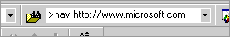

# Find/Command Box
[!INCLUDE[vs2017banner](../includes/vs2017banner.md)]

You can search for text and run Visual Studio commands from the **Find/Command** box. The **Find/Command** box is still available as a toolbar control, but is no longer visible by default. You can display the **Find/Command** box by choosing **Add or Remove Buttons** on the **Standard** toolbar and then choosing **Find**.

 To run a [!INCLUDE[vsprvs](../includes/vsprvs-md.md)] command, preface it with a greater than (>) sign.

 The **Find/Command** box retains the last 20 items entered and displays them in a drop-down list. You can navigate through the list by choosing the arrow keys.

 
Find/Command Box

## Searching for Text
 By default, when you specify text in the **Find/Command** box and then choose the ENTER key, Visual Studio searches the current document or tool window using the options that are specified in the **Find in Files** dialog box. For more information, see [Finding and Replacing Text](../ide/finding-and-replacing-text.md).

## Entering Commands
 To use the **Find/Command** box to issue a single [!INCLUDE[vsprvs](../includes/vsprvs-md.md)] command or alias rather than search for text, enter the [!INCLUDE[vsprvs](../includes/vsprvs-md.md)] command, prefaced with a greater than (>) symbol. For example:

```
>File.NewFile c:\temp\MyFile /t:"General\Text File"
```

 Alternatively, you can also use the Command window to enter and execute single or multiple commands. Some commands or aliases can be entered and executed by themselves; others have required arguments in their syntax. For a list of commands that have arguments, see [Visual Studio Commands](../ide/reference/visual-studio-commands.md).

## Escape Characters
 A caret (^) character in a command line means that the character immediately following it is interpreted literally, rather than as a control character. This can be used to embed straight quotation marks ("), spaces, leading slashes, carets, or any other literal characters in a parameter or switch value, with the exception of switch names. For example,

```
>Edit.Find ^^t /regex
```

 A caret functions the same whether it is inside or outside quotation marks. If a caret is the last character on the line, it is ignored.

## See Also
 [Command Window](../ide/reference/command-window.md)
 [Finding and Replacing Text](../ide/finding-and-replacing-text.md)
