# Getting Started with Debugging in Visual Studio 2015
[!INCLUDE[vs2017banner](../includes/vs2017banner.md)]

Visual Studio 2015 provides a powerful integrated set of project build and debugging tools. In this topic, find out how to start using the most basic set of debugging UI features.

 Note: Links to more advanced features and platform- or feature-specific topics are at the bottom of this page.

## My code doesn’t work. Help me, Visual Studio 2015!
 So you’ve figured out the editor and you’ve created some code. Now, you want to start debugging that code. In Visual Studio 2015, as with most IDEs, there are two phases to debugging: building the code to catch and resolve project and compiler errors; and running that code in the environment to catch and resolve run-time and dynamic errors.

### Configuring a Build
 There are two basic types of build configuration: **Debug** and **Release**. The first configuration produces a slower, larger executable that allows for a richer interactive run-time debugging experience, but should never be shipped. The second builds a faster, more optimized executable that’s appropriate to ship (at least from the perspective of the compiler).

 The default build configuration is **Debug**.

 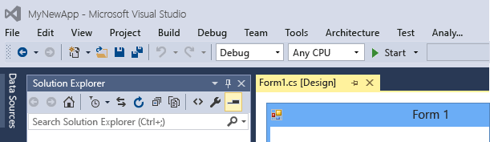

 You can also specify a specific build platform to target, such as **x86** (32-bit Intel CPUs), **x64** (64-bit Intel CPUs), and **ARM** (ARM CPUs, only supported for certain app types). The default is  **x86** for managed and native projects. To change it, click on build platform dropdown and select a different platform or **Configuration Manager…**

 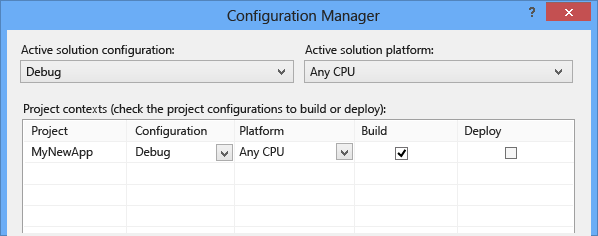

 You can specify a targeted build configuration using the **Configuration Manager**. Launch it, click the **Configuration** or the **CPU** dropdown, and select **New…** to create a new build or platform.

 

 Starting out, just use **Debug** and **x86** as your build configuration and platform, respectively. When you’re done coding and debugging, change the configuration to **Release** and target a specific platform. (Older versions of Visual Studio provided an **AnyCPU** default platform for .Net code projects.)

 Note: When you build your project, the configuration and platform values are also used to determine what project directory path is created to store the executable. Typically, this is **\<path-to-project>\\<project-name\>\\<configuration\>\\<platform\>**. For example, a project with a configuration of `Debug` and a platform of `x86` would be found under `Projects\MyProjectNameHere\MyProjectNameHere\bin\Debug\x86`. This can be useful if you have your own tools or scripts that manage these built executables.

### Building your Code
 With your build configured, it’s time to actually build your project. The easiest way to do it to press F7, but you can also start the build by selecting **Build->Build Solution** from the main menu.

 

 You can observe the build process in the **Output** status window at the bottom of the Visual Studio UI. Errors, warnings, and build operations are displayed here. If you have errors (or if you have a warnings above a configured level), your build will fail. You can click on the errors and warnings to go to the line where they occurred. Rebuild your project by pressing either **F7** again (to recompile only the files with errors) or **Ctrl+Alt+F7** (for a clean and complete rebuild).

 There are two build tabbed windows in the results window below the editor: the **Output** window, which contains the raw compiler output (including error messages); and the **Error List** window, which provides a sortable and filterable list of all errors and warnings.

 When successful, you will see results like this in the **Output** window.

 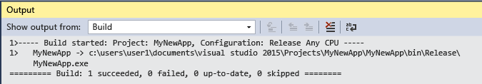

### Reviewing the Error List
 Unless you’ve made no modifications to code you’ve previously and successfully compiled, you probably have an error. If you’re new to coding, you probably have lots of them. Errors are sometimes obvious, such a simple syntax error or incorrect variable name, and sometimes they are difficult to understand, with only a cryptic code to guide you. For a cleaner view of the issues, navigate to the bottom of the build **Output** window, and click the **Error List** tab. This takes you to a more organized view of the errors and warnings for your project, and gives you some extra options as well.

 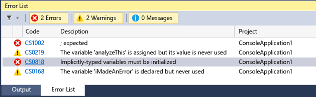

 Click on the error line in the **Error List** window and jump to the line the error occurs in. (Or turn on line numbers by clicking in the **Quick Launch** bar in the upper-right, typing “line numbers” into it, and pressing Enter. This is the fastest way to get to **Options** window entry where you can turn on line numbers. Learn to use the **Quick Launch** bar and save yourself a lot of UI clicks!)

 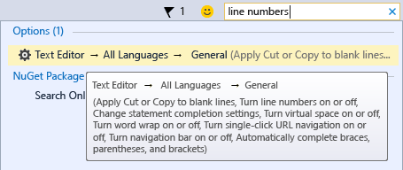

 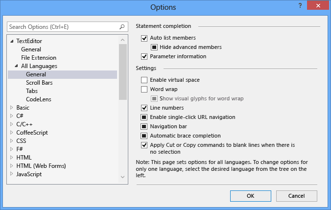

 Use Ctrl+G to quickly jump to the line number where the error occurred.

 The error is identified by a red “squiggle” underscore. Hover over it for additional details. Make the fix and it will go away, although you may introduce a new error with the correction. (This is called a “regression”.)

 

 Walk through the error list and address all the errors in your code.

 

### Reviewing Errors in Detail
 Many errors may make no sense to you, phrased as they are in the terms of the compiler. In those cases, you will need additional information. From the **Error List** window, you can do an automatic Bing search for more information on the error (or warning) by right-clicking on the corresponding entry line and selecting **Show Error Help** from the context menu.

 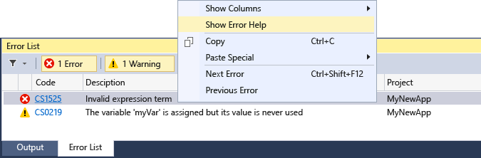

 This launches a tab inside Visual Studio 2015 that hosts the results of a Bing search for the error code and text. The results are from many different sources on the Internet, and not all may be helpful.

 Alternatively, you can click on the hyperlinked error code value in the **Code** column of the **Error List**. This will launch a Bing search for just the error code.

### Performing Static Code Analysis
 “Static code analysis” is a fancy way of saying “automatically check my code for common problems that can lead to run-time errors or problems in code management”. Get in the habit of running it once you’ve cleaned up the obvious errors preventing build, and take some time to address the warnings it may produce. You’ll save yourself some headaches down the road, as well as learn a few code style techniques.

 Press Alt+F11 (or select **Analyze->Run Code Analysis on Solution** from the top menu) to start static code analysis. This may take some time if you have a lot of code.

 

 Any new or updated warnings will appear in the **Error List** tab at the bottom of the IDE. Click on the warnings to jump to them.

 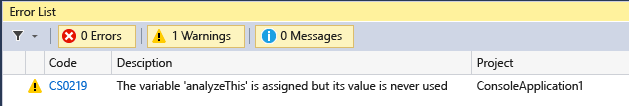

 The warnings will be identified with a bright yellow-green squiggle instead of a red one. Hover over them for more detail, and right-click on them to get a context menu to assist in fixes or refactoring options.

 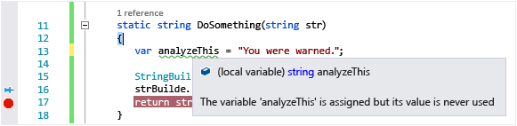

### Using Light Bulbs to Fix or Refactor Code
 Light Bulbs are a new feature for Visual Studio 2015 that let you refactor code inline. They are an easy way to fix common warnings quickly and effectively. To access them, right-click on a warning squiggle (or press Ctrl+. while hovering over the squiggle), and then select **Quick Actions**.

 

 You will see a list of possible fixes or refactors you can apply to that line of code.

 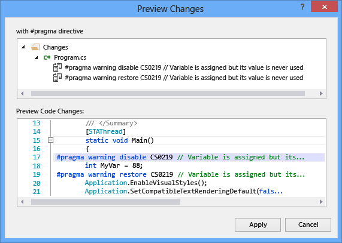

 Light Bulbs can be used wherever the code analyzers determine there is an opportunity to fix, refactor, or improve your code. Click on any line of code, right-click to open the context menu, and select **Quick Options** (or, again, if you prefer efficiency, press Ctrl+.). If there is area refactoring or improvement options available, they will be displayed; otherwise, the message `No quick options available here` will be displayed in the lower-left corner bezel of the IDE.

 

 With experience, you can quickly use the arrow keys and Ctrl+. to check for Quick Option refactoring opportunities and clean up your code!

 For more information on Light Bulbs, read [Perform quick actions with light bulbs](../ide/perform-quick-actions-with-light-bulbs.md).

### Debugging Your Running Code
 Now that you’ve successfully built your code and performed a little clean up, run it by pressing F5 or selecting **Debug->Start Debugging**. This will start your app in a debug environment so you can observe its behavior in detail. The Visual Studio 2015 IDE changes while your app is running: the **Output** window is replaced by two new ones (in the default window configuration), the **Autos/Locals/Modules/Watch** tabbed window and the **Call Stack/Breakpoints/Exception Settings/Output** tabbed window. These windows have multiple tabs which allow you to inspect and evaluate your app’s variables, threads, call stacks, and various other behaviors as it runs.

 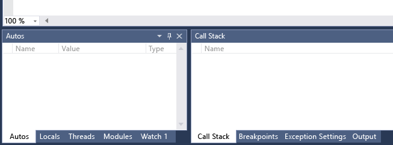

 Try various actions with your app and observe the changes. If something appears abnormal, pause the app by pressing Ctrl+Alt+Break (or click on the **Pause** button).

 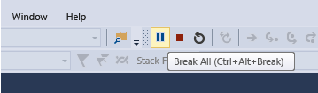

 Press F5 to continue running the app (or click the **Continue** button).

 

 You can stop your app by pressing Shift+F5 or by clicking the **Stop** button. Or, you can simply close the app’s main window (or command line dialog).

 If your code ran perfectly and exactly as expected, congratulations! Change the build configuration to **Release** and rebuild it for deployment! (Professionals may want to jump to the bit on Unit Testing at the end, though.) However, if it hung, or crashed, or gave you some strange results, you’ll need to find the source of those problems and fix the bugs.

### Setting Simple Breakpoints
 Breakpoints are the most basic and essential feature of reliable debugging. A breakpoint indicates where Visual Studio should suspend your running code so you can take a look at the values of variables, or the behavior of memory, or whether or not a branch of code is getting run. You do NOT need to rebuild a project after setting and removing breakpoints.

 Set a breakpoint by clicking in the far margin of the line where you want the break to occur, or select the line of code and press F9. When you run your code, it will stop before the instructions for this line of code are executed.

 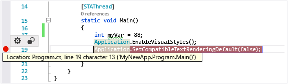

 When the code breaks, the marked line of code has not executed yet. At this point, you may want to execute the instructions for the line of code marked by the breakpoint and inspect the changed values. This is called “stepping into” the code. If the marked code is a method call, you can step into it by pressing F11. You can also “step over” the line of code by pressing F10. For more details on breakpoint step actions, read [Navigating through Code with the Debugger](../debugger/navigating-through-code-with-the-debugger.md).

 Common uses for breakpoints include:

1. To narrow down the source of a crash or hang, scatter them throughout and around the code of the method call you think is causing the failure. As you step through the code, remove and then reset the breakpoints closer together until you find the offending line of code.

2. When you introduce new code, set a breakpoint at the beginning of it and step through the code to make sure it is behaving as expected.

3. If you have implemented a complicated behavior, set breakpoint(s) for the algorithmic code so you can inspect the values of the variables and data when the program breaks.

4. If you are writing C or C++ code, use breakpoints to stop the code so you can inspect address values (look for NULL) and reference counts when debugging for memory-related failures.

   For more information on using breakpoints, read [Using Breakpoints](../debugger/using-breakpoints.md)

### Setting Conditional Breakpoints
 If you have a breakpoint in a loop or recursion, or if you have a lot of breakpoints which you frequently step through, use a conditional breakpoint to ensure that your code is suspended ONLY when specific conditions are met. Otherwise, you’ll be pressing F11 an awful lot.

 To set a conditional breakpoint and suspend your code when a variable is set to a certain value or passes a certain threshold, click in the margin to set a breakpoint, and then select the “cog” from the hover menu that appears.

 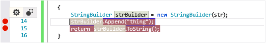

 You will see a dialog that looks like this where you can set specific conditions for the break to occur.

 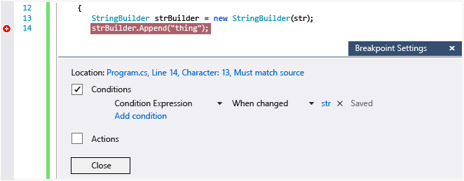

 For more detail on how to declare the expressions used to evaluate conditional breakpoints, check out the Channel9 video [Breakpoint Configuration Experience in Visual Studio 2015](https://channel9.msdn.com/Events/Visual-Studio/Connect-event-2014/711).

### Inspecting Your Code at Run-time
 When your running code hits a breakpoint and halts, you can inspect your variables and call stacks to determine what is going on. Are the values in the ranges you expect to see? Are calls being made in the right order?

 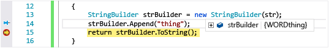

 Hover over a variable to see the value(s) and reference(s) it currently contains. If you see a value you didn’t expect, you probably have a bug in the preceding or calling lines of code. Move breakpoints up or add conditions to the existing breakpoints to narrow your search further.

 Additionally, Visual Studio 2015 displays the Diagnostic Tools window, where you can observe your app’s CPU and memory usage over time. Use them to look for unanticipated heavy CPU usage or memory allocation. Use it in conjunction with the **Watch** window and breakpoints to determine what’s causing unexpected heavy usage or unreleased resources.

 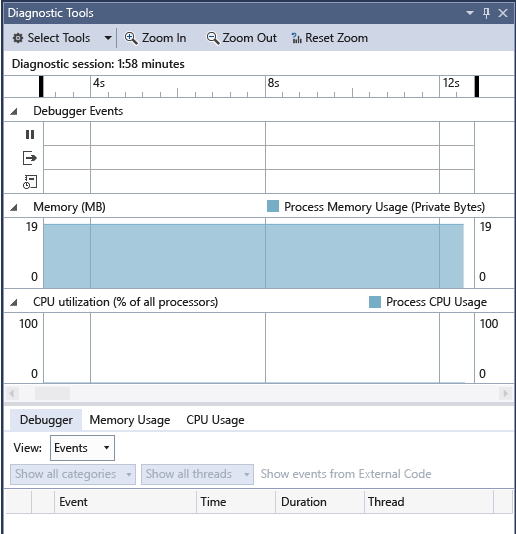

### Running Unit Tests
 Unit tests are programs that exercise code paths in your app or service. Visual Studio 2015 installs the Microsoft unit testing frameworks for both managed and native code. Use a unit testing framework to create unit tests, run them, and report the results of these tests. Rerun unit tests when you make changes to test that your code is still working correctly. When you use Visual Studio 2015 Enterprise, you can run tests automatically after every build.

 To get started, read [Generate unit tests for your code with IntelliTest](../test/generate-unit-tests-for-your-code-with-intellitest.md).

 To learn more about unit tests in Visual Studio 2015 and how they can help you create better quality code, read [Unit Test Basics](../test/unit-test-basics.md).

## See Also
 [Debugging in Visual Studio](../debugger/debugging-in-visual-studio.md)
 [Debugger Settings and Preparation](../debugger/debugger-settings-and-preparation.md)
 [Debug 64-Bit Applications](../debugger/debug-64-bit-applications.md)
 [Debugger Basics](../debugger/debugger-basics.md)
