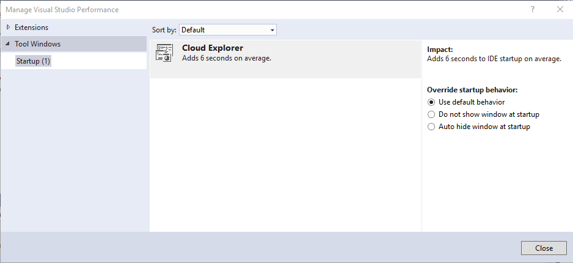

# Optimize Visual Studio Startup Time
[!INCLUDE[vs2017banner](../includes/vs2017banner.md)]

Ideally, Visual Studio should always start up as quickly as possible. However, Visual Studio extensions and open tool windows can adversely affect startup time because they load automatically at startup. The **Manage Visual Studio Performance** window enables you to not only see which extensions and features affect Visual Studio startup time, but also lets you determine their loading behavior so you have more control over how quickly Visual Studio starts up.

## Control startup behavior

To avoid extending startup time, Visual Studio 2017 and later avoid loading extensions during startup, using an on-demand-load approach. This means that extensions don't open immediately after Visual Studio starts, but rather open asynchronously on an as-needed basis after startup. Also, because tool windows left open in a prior Visual Studio session can slow startup time, Visual Studio opens tool windows in a more intelligent way to avoid impacting startup time.

If Visual Studio detects slow startup, a pop-up message appears, alerting you to the extension or tool window that's causing the slowdown. The message also provides a link to the **Manage Visual Studio Performance** dialog box, which lists the extensions and tools windows that are affecting startup performance. This dialog box enables you to change extension and tool window settings to improve startup performance.

The **Manage Visual Studio Performance** dialog box has two categories: **Extensions** and **Tool Windows**.

### Control extensions
If an extension is slowing down Visual Studio startup, the extension appears in the **Manage Visual Studio Performance dialog** box when you choose one of the extension types. If the impact on startup time (which is listed under the **Impact** section) is unacceptably  high, you can choose to always disable the extension at startup by choosing the **Disable** button. You can re-enable the extension for future sessions by using the Extension Manager or the Manage Visual Studio Performance dialog box.

In addition to startup extensions, you can also disable extensions that load when solutions load, or when a user types. Just choose the scenario to see a list of the associated extensions.

### Control tool windows
If a tool window is slowing down Visual Studio startup, you can choose to leave it at its default behavior (giving you no benefit in startup speed), or you can override its behavior by choosing one of two behaviors:

- **Do not show window at startup:** If you choose this option, the specified tool window will always be closed when you open Visual Studio, even if left open in a previous session. You can open the tool window from the menu.
- **Auto hide window at startup:** If a tool window was left open in a previous session, choosing this option will collapse the tool window's group at startup to avoid initializing the tool window. This is a good choice if you use a tool window often, because the tool window is still available, but no longer negatively affects Visual Studio startup time.

If you later change your mind, you can revert any of these options in the **Manage Visual Studio Performance** dialog box. To open the **Manage Visual Studio Performance** dialog box, on the menu bar, choose **Help**, **Manage Visual Studio Performance**.
