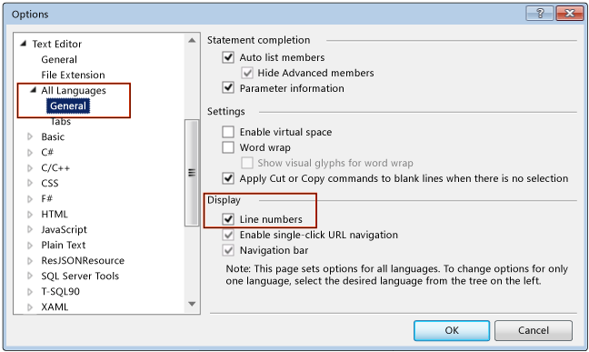

# How to: Display Line Numbers in the Editor
[!INCLUDE[vs2017banner](../../includes/vs2017banner.md)]

You can display or hide line numbering in your code.

> [!NOTE]
> Depending on your active settings, the dialog boxes and menu commands that appear might differ from the ones that are described here. To change your settings, open **Tools / Import and Export Settings**. For more information, see [Customizing Development Settings in Visual Studio](https://msdn.microsoft.com/22c4debb-4e31-47a8-8f19-16f328d7dcd3).

## Display Line Numbers in Code
 Line numbers aren't added to your code; they're just for reference. If you want line numbers to print, in the **Print** dialog box, select the **Include line numbers** check box.

#### To display line numbers in code

1. On the menu bar, choose **Tools**, **Options**. Expand the **Text Editor** node, and then select either the node for the language you are using, or **All Languages** to turn on line numbers in all languages. Or you can type **line number** in the **Quick Launch** box.

2. 

> [!NOTE]
> Depending on your language or settings, you may have to select the **Show All Settings** check box in the **Options** dialog box to reveal the **All Languages** sub-node.

## See Also
 [Customizing the Editor](../../ide/customizing-the-editor.md)
 [Text Editor Options Dialog Box](../../ide/reference/text-editor-options-dialog-box.md)
 [Writing Code](../../ide/writing-code-in-the-code-and-text-editor.md)
