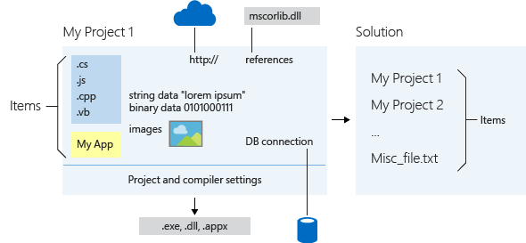

# Solutions and Projects in Visual Studio
[!INCLUDE[vs2017banner](../includes/vs2017banner.md)]

When you create an app, application, website, Web App, script, plug-in, etc in Visual Studio, you start with a *project*. In a logical sense, a project contains of all the source code files, icons, images, data files and anything else that will be compiled into an executable program or web site, or else is needed in order to perform the compilation.  A project also contains all the compiler settings and other configuration files that might be needed by various services or components that your program will communicate with.

 In a literal sense, a project is an XML file (*.vbproj, \*.csproj, \*.vcxproj) that defines a virtual folder hierarchy along with paths to all the items it "contains" and all the build settings. In Visual Studio, the project file is used by Solution Explorer to display the project contents and settings. When you compile your project, the MSBuild engine consumes the project file to create the executable. You can also customize projects to product other kinds of output.

 A project is contained, in a logical sense and in the file system, within a *solution*, which may contain one or more projects, along with build information, Visual Studio window settings, and any miscellaneous files that aren't associated with any project. In a literal sense, the solution is a text file with its own unique format; it is generally not intended to be edited by hand.

 A solution has an associated *.suo file that stores settings, preferences and configuration information for each user that has worked on the project.

 The following diagram shows the relationship between projects and solutions, and the items they logically contain.

 

 You can also create custom project and item templates. For more information, see [Creating Project and Item Templates](../ide/creating-project-and-item-templates.md).

## Creating new projects
 The easiest way to create a new project is to start with a pre-defined project template, which consists of a basic set of pre-generated code files, config files, assets, and settings that get you started creating a particular type of application or website in a particular programming language. These templates are what you see in the **New Project Dialog** when you choose **File &#124; New &#124; Project** or **File &#124; New &#124; Web Site** from the main menu, and then navigate. For more information, see [Creating Solutions and Projects](../ide/creating-solutions-and-projects.md) and  [NIB Creating Projects from Templates](https://msdn.microsoft.com/7c36d86a-6b79-4480-8228-0f925f1204b2).

## Managing projects in Solution Explorer
 After you create a new project, you use **Solution Explorer** to view and manage projects and solutions and their associated items. The following illustration shows Server Explorer with a C# solution that contains two projects.

 

## In This Section

- [Creating Solutions and Projects](../ide/creating-solutions-and-projects.md)

- [Adding and Removing Project Items](../ide/adding-and-removing-project-items.md)

- [Managing Project and Solution Properties](../ide/managing-project-and-solution-properties.md)

- [Managing references in a project](../ide/managing-references-in-a-project.md)

- [Application Properties](../ide/application-properties.md)

- [Managing Assembly and Manifest Signing](../ide/managing-assembly-and-manifest-signing.md)

- [How to: Specify an Application Icon (Visual Basic, C#)](../ide/how-to-specify-an-application-icon-visual-basic-csharp.md)

- [Targeting a Specific .NET Framework Version](../ide/targeting-a-specific-dotnet-framework-version.md)

- [Creating Project and Item Templates](../ide/creating-project-and-item-templates.md)

## See Also
 [Visual Studio IDE](../ide/visual-studio-ide.md)
