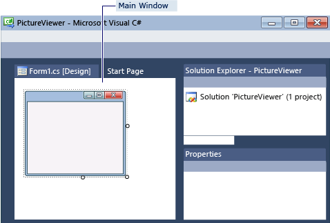

# Step 1: Create a Windows Forms Application Project
[!INCLUDE[vs2017banner](../includes/vs2017banner.md)]

When you create a picture viewer, the first step is to create a Windows Forms Application project.

 For a video version of this topic, see [Tutorial 1: Create a Picture Viewer in Visual Basic - Video 1](https://go.microsoft.com/fwlink/?LinkId=205209) or [Tutorial 1: Create a Picture Viewer in C# - Video 1](https://go.microsoft.com/fwlink/?LinkId=205199). These videos use an earlier version of Visual Studio, so there are slight differences in some menu commands and other user interface elements. However, the concepts and procedures work similarly in the current version of Visual Studio.

### To create a Windows Forms Application project

1. On the menu bar, choose **File**, **New**, **Project**. The dialog box should look like this.

     
New project dialog box

2. Choose either **Visual C#** or **Visual Basic** in the **Installed Templates** list.

3. In the templates list, choose the **Windows Forms Application** icon. Name the new form **PictureViewer**, and then choose the **OK** button.

     Visual Studio creates a solution for your program. A solution acts as a container for all of the projects and files needed by your program. These terms will be explained in more detail later in this tutorial.

4. The following illustration shows what you should now see in the Visual Studio interface.

    > [!NOTE]
    > Your window layout may not look exactly like this illustration. The precise window layout depends on the version of Visual Studio, the programming language you are using, and other factors. However, you should verify that all three windows appear.

     
IDE window

     The interface contains three windows: a main window, **Solution Explorer**, and the **Properties** window.

     If any of these windows are missing, restore the default window layout by, on the menu bar, choosing **Window**, **Reset Window Layout**. You can also display windows by using menu commands. On the menu bar, choose **View**, **Properties Window** or **Solution Explorer**. If any other windows are open, close them by choosing the **Close** (x) button in their upper-right corners.

5. The illustration shows the following windows (going clockwise from the upper-left corner):

    - **Main window** In this window, you'll do most of your work, such as working with forms and editing code. In the illustration, the window shows a form in the Form Editor. At the top of the window, the **Start Page** tab and the **Form1.cs [Design]** tab appear. (In Visual Basic, the tab name ends with .vb instead of .cs.)

    - **Solution Explorer  window** In this window, you can view and navigate to all items in your solution. If you choose a file, the contents of the **Properties** window changes. If you open a code file (which ends in .cs in Visual C# and .vb in Visual Basic), the code file or a designer for the code file appears. A designer is a visual surface onto which you can add controls such as buttons and lists. For Visual Studio forms, the designer is called the Windows Forms Designer.

    - **Properties  window** In this window, you can change the properties of items that you choose in the other windows. For example, if you choose Form1, you can change its title by setting the **Text** property, and you can change the background color by setting the **Backcolor** property.

    > [!NOTE]
    > The top line in **Solution Explorer** shows **Solution 'PictureViewer' (1 project)**, which means that Visual Studio created a solution for you. A solution can contain more than one project, but for now, you'll work with solutions that contain only one project.

6. On the menu bar, choose **File**, **Save All**.

     As an alternative, choose the **Save All** button on the toolbar, which the following illustration shows.

     
Save All toolbar button

     Visual Studio automatically fills in the folder name and the project name and then saves the project in your projects folder.

### To continue or review

- To go to the next tutorial step, see [Step 2: Run Your Program](../ide/step-2-run-your-program.md).

- To return to the overview topic, see [Tutorial 1: Create a Picture Viewer](../ide/tutorial-1-create-a-picture-viewer.md).
