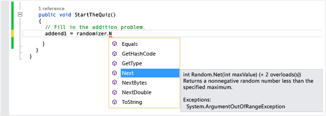
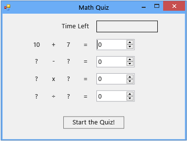

# Step 2: Create a Random Addition Problem
[!INCLUDE[vs2017banner](../includes/vs2017banner.md)]

In the second part of this tutorial, you make the quiz challenging by adding math problems that are based on random numbers. You also create a method that's named `StartTheQuiz()` and that fills in the problems and starts the countdown timer. Later in this tutorial, you'll add the subtraction, multiplication, and division problems.

> [!NOTE]
> This topic is part of a tutorial series about basic coding concepts. For an overview of the tutorial, see [Tutorial 2: Create a Timed Math Quiz](../ide/tutorial-2-create-a-timed-math-quiz.md).

### To create a random addition problem

1. In the form designer, choose the form (Form1).

2. On the menu bar, choose **View**, **Code**.

     Form1.cs or Form1.vb appears, depending on the programming language that you're using, so that you can view the code behind the form.

3. Create a `Random` object by adding a `new` statement near the top of the code, like the following.

     [!code-csharp[VbExpressTutorial3Step2#1](../snippets/csharp/VS_Snippets_VBCSharp/vbexpresstutorial3step2/cs/form1.cs#1)]
     [!code-vb[VbExpressTutorial3Step2#1](../snippets/visualbasic/VS_Snippets_VBCSharp/vbexpresstutorial3step2/vb/form1.vb#1)]

     You've added a `Random` object to your form and named the object **randomizer**.

     `Random` is known as an object. You've probably heard that word before, and you learn more about what it means for programming in the next tutorial. For now, just remember that you can use `new` statements to create buttons, labels, panels, OpenFileDialogs, ColorDialogs, SoundPlayers, Randoms, and even forms, and those items are referred to as objects. When you run your program, the form is started, and the code behind it creates a `Random` object and names it **randomizer**.

     Soon you'll build a method to check the answers, so your quiz must use variables to store the random numbers that it generates for each problem. See [Variables](https://msdn.microsoft.com/library/4cfaa06d-4ae3-4307-897b-cf599dc24caa) or [Types](https://msdn.microsoft.com/library/f782d7cc-035e-4500-b1b1-36a9881130ad). To properly use variables, you must declare them, which means listing their names and data types.

4. Add two integer variables to the form, and name them **addend1** and **addend2**.

    > [!NOTE]
    > An integer variable is known as an int in C# or an Integer in Visual Basic. This kind of variable stores a positive or negative number from -2147483648 through 2147483647 and can store only whole numbers, not decimals.

     You use a similar syntax to add an integer variable as you did to add the `Random` object, as the following code shows.

     [!code-csharp[VbExpressTutorial3Step2#2](../snippets/csharp/VS_Snippets_VBCSharp/vbexpresstutorial3step2/cs/form1.cs#2)]
     [!code-vb[VbExpressTutorial3Step2#2](../snippets/visualbasic/VS_Snippets_VBCSharp/vbexpresstutorial3step2/vb/form1.vb#2)]

5. Add a method that's named `StartTheQuiz()` and that uses the `Random` object's `Next()` method to show the random numbers in the labels. `StartTheQuiz()` will eventually fill in all of the problems and then start the timer, so add a comment. The function should look like the following.

     [!code-csharp[VbExpressTutorial3Step2#3](../snippets/csharp/VS_Snippets_VBCSharp/vbexpresstutorial3step2/cs/form1.cs#3)]
     [!code-vb[VbExpressTutorial3Step2#3](../snippets/visualbasic/VS_Snippets_VBCSharp/vbexpresstutorial3step2/vb/form1.vb#3)]

     Notice that when you enter the dot (.) after **randomizer** in the code, an IntelliSense window opens and shows you all of the `Random` object's methods that you can call. For example, Intellisense lists the `Next()` method, as follows.

     
Next method

     When you enter a dot after an object, IntelliSense shows a list of the object's members, such as properties, methods, and events.

    > [!NOTE]
    > When you use the `Next()` method with the `Random` object, such as when you call `randomizer.Next(50)`, you get a random number that's less than 50 (from 0 through 49). In this example, you called `randomizer.Next(51)`. You used 51 and not 50 so that the two random numbers will add up to an answer that's from 0 through 100. If you pass 50 to the `Next()` method, it chooses a number from 0 through 49, so the highest possible answer is 98, not 100. After the first two statements in the method run, each of the two integer variables, `addend1` and `addend2`, hold a random number from 0 through 50. This screenshot shows Visual C# code, but IntelliSense works the same way for Visual Basic.

     Take a closer look at these statements.

     [!code-csharp[VbExpressTutorial3Step2#18](../snippets/csharp/VS_Snippets_VBCSharp/vbexpresstutorial3step2/cs/form1.cs#18)]
     [!code-vb[VbExpressTutorial3Step2#18](../snippets/visualbasic/VS_Snippets_VBCSharp/vbexpresstutorial3step2/vb/form1.vb#18)]

     The statements set the **Text** properties of **plusLeftLabel** and **plusRightLabel** so that they display the two random numbers. You must use the integer's `ToString()` method to convert the numbers to text. (In programming, string means text. Label controls display only text, not numbers.

6. In the design window, either double-click the **Start** button, or choose it and then choose the Enter key.

     When a quiz taker chooses this button, the quiz should start, and you've just added a Click event handler to implement that behavior.

7. Add the following two statements.

     [!code-csharp[VbExpressTutorial3Step2#4](../snippets/csharp/VS_Snippets_VBCSharp/vbexpresstutorial3step2/cs/form1.cs#4)]
     [!code-vb[VbExpressTutorial3Step2#4](../snippets/visualbasic/VS_Snippets_VBCSharp/vbexpresstutorial3step2/vb/form1.vb#4)]

     The first statement calls the new `StartTheQuiz()` method. The second statement sets the **Enabled** property of the **startButton** control to **False** so that the quiz taker can't choose the button during a quiz.

8. Save your code, run it, and then choose the **Start** button.

     A random addition problem appears, as the following illustration shows.

     
Random addition problem

     In the next step of the tutorial, you'll add the sum.

### To continue or review

- To go to the next tutorial step, see [Step 3: Add a Countdown Timer](../ide/step-3-add-a-countdown-timer.md).

- To return to the previous tutorial step, see [Step 1: Create a Project and Add Labels to Your Form](../ide/step-1-create-a-project-and-add-labels-to-your-form.md).
