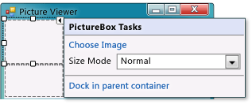
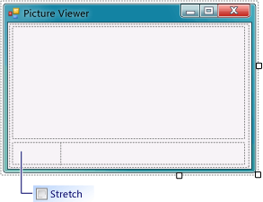

# Step 5: Add Controls to Your Form
[!INCLUDE[vs2017banner](../includes/vs2017banner.md)]

In this step, you add controls, such as a `PictureBox` control and a `CheckBox` control, to your form. You then add buttons to your form.

 For a video version of this topic, see [Tutorial 1: Create a Picture Viewer in Visual Basic - Video 2](https://go.microsoft.com/fwlink/?LinkId=205211) or [Tutorial 1: Create a Picture Viewer in C# - Video 2](https://go.microsoft.com/fwlink/?LinkId=205200). These videos use an earlier version of Visual Studio, so there are slight differences in some menu commands and other user interface elements. However, the concepts and procedures work similarly in the current version of Visual Studio.

### To add controls to your form

1. Go to the Toolbox tab (located on the left side of the Visual Studio IDE) and expand the **Common Controls** group. This shows the most common controls that you see on forms.

2. Choose the TableLayoutPanel control on the form. To verify that the TableLayoutPanel is selected, make sure that its name appears in the dropdown list box at the top of the **Properties** window. You can also choose form controls by using the dropdown list box at the top of the **Properties** window. Choosing a control this way can often be easier than choosing a tiny control with a mouse.

3. Double-click the **PictureBox** item to add a PictureBox control to your form. Because the TableLayoutPanel is docked to fill your form, the IDE adds the PictureBox control to the first empty cell (the upper left corner).

4. Choose the new PictureBox control to select it, and then choose the black triangle on the new PictureBox control to display its task list, as shown in the following picture.

     
PictureBox tasks

    > [!NOTE]
    > If you accidentally add the wrong type of control to your TableLayoutPanel, you can delete it. Right-click the control, and then choose **Delete** on its context menu. You can also remove controls from the form by using the menu bar. On the menu bar, choose **Edit**, **Undo**, or **Edit**, **Delete**.

5. Choose the **Dock in parent container** link. This automatically sets the PictureBox **Dock** property to **Fill**. To see this, choose the PictureBox control to select it, go to the **Properties** window, and be sure that the **Dock** property is set to **Fill**.

6. Make the PictureBox span both columns by changing its **ColumnSpan** property. Choose the PictureBox control and set its **ColumnSpan** property to **2**. Also, when the PictureBox is empty, you want to show an empty frame. Set its **BorderStyle** property to **Fixed3D**.

    > [!NOTE]
    > If you don't see a **ColumnSpan** property for your PictureBox, then it's likely that the PictureBox was added to the form rather than the TableLayoutPanel. To fix this, choose the PictureBox, delete it, choose the TableLayoutPanel, and then add a new PictureBox.

7. Choose the TableLayoutPanel on the form and then add a **CheckBox** control to the form. Double-click the **CheckBox** item in the Toolbox to add a new CheckBox control to the next free cell in your table. Because a PictureBox takes up the first two cells in the TableLayoutPanel, the CheckBox control is added to the lower-left cell. Choose the **Text** property and type in the word **Stretch**, as shown in the following picture.

     
TextBox control with Stretch property

8. Choose the TableLayoutPanel on the form, and then go to the **Containers** group in the Toolbox (where you got your TableLayoutPanel control) and double-click the **FlowLayoutPanel** item to add a new control to the last cell in the PictureBox (bottom right). Then dock the FlowLayoutPanel in the TableLayoutPanel (either by choosing **Dock in parent container** on the FlowLayoutPanel's black triangle task list, or by setting the FlowLayoutPanel's **Dock** property to **Fill**).

    > [!NOTE]
    > A FlowLayoutPanel is a container that arranges other controls in neat rows in order. When you resize a FlowLayoutPanel, if it has room to lay out all of its controls in a single row, it does that. Otherwise, it arranges them in lines, one on top of the other. You will use a FlowLayoutPanel to hold four buttons. If the buttons arrange one on top another when added, be sure that the FlowLayoutPanel is selected before adding the buttons. Although it was stated earlier that each cell can hold only one control, the lower-right cell of the TableLayoutPanel has four button controls. This is because you can put a control in a cell that holds other controls. That kind of control is called a container, and the FlowLayoutPanel is a container.

### To add buttons

1. Choose the new FlowLayoutPanel that you added. Go to **Common Controls** in the Toolbox and double-click the **Button** item to add a button control called **button1** to your FlowLayoutPanel. Repeat to add another button. The IDE determines that there's already a button called **button1** and calls the next one **button2**.

2. Typically, you add the other buttons using the Toolbox. This time, choose **button2**, and then on the menu bar, choose **Edit**, **Copy** (or press Ctrl+C). On the menu bar, choose **Edit**, **Paste** (or press Ctrl+V) to paste a copy of your button. Now paste it again. The IDE has now added **button3** and **button4** to the FlowLayoutPanel.

    > [!NOTE]
    > You can copy and paste any control. The IDE names and places the new controls in a logical manner. If you paste a control into a container, the IDE chooses the next logical space for placement.

3. Choose the first button and set its **Text** property to **Show a picture**. Then set the **Text** properties of the next three buttons to **Clear the picture**, **Set the background color**, and **Close**.

4. The next step is to size the buttons and arrange them so they align to the right side of the panel. Choose the FlowLayoutPanel and look at its **FlowDirection** property. Change it so it's set to **RightToLeft**. As soon as you do, the buttons should align themselves to the right side of the cell, and reverse their order so that the **Show a picture** button is on the right.

    > [!NOTE]
    > If the buttons are still in the wrong order, you can drag the buttons around the FlowLayoutPanel to rearrange them in any order. You can choose a button and drag it left or right.

5. Choose the **Close** button to select it. Hold down the CTRL key and choose the other three buttons, so that they are all selected. While all the buttons are selected, go to the **Properties** window and scroll up to the **AutoSize** property. This property tells the button to automatically resize itself to fit all of its text. Set it to **true**. Your buttons should now be sized properly and be in the right order. (As long as all four buttons are selected, you can change all four **AutoSize** properties at the same time.) The following picture shows the four buttons.

     
Picture Viewer with four buttons

6. Now run your program again to see your newly laid out form. Choosing the buttons and the check box doesn't do anything yet, but it will work soon.

### To continue or review

- To go to the next tutorial step, see [Step 6: Name Your Button Controls](../ide/step-6-name-your-button-controls.md).

- To return to the previous tutorial step, see [Step 4: Lay Out Your Form with a TableLayoutPanel Control](../ide/step-4-lay-out-your-form-with-a-tablelayoutpanel-control.md).
