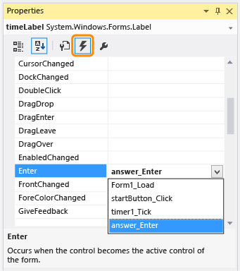

# Step 5: Add Enter Event Handlers for the NumericUpDown Controls
[!INCLUDE[vs2017banner](../includes/vs2017banner.md)]

In the fifth part of this tutorial, you'll add Enter event handlers to make entering answers for quiz problems a little easier. This code will select and clear the current value in each NumericUpDown control as soon as the quiz taker chooses it and starts to enter a different value.

> [!NOTE]
> This topic is part of a tutorial series about basic coding concepts. For an overview of the tutorial, see [Tutorial 2: Create a Timed Math Quiz](../ide/tutorial-2-create-a-timed-math-quiz.md).

### To verify the default behavior

1. Run your program, and start the quiz.

     In the NumericUpDown control for the addition problem, the cursor flashes next to **0** (zero).

2. Enter `3`, and note that the control shows **30**.

3. Enter `5`, and note that **350** appears but changes to **100** after a second.

     Before you fix this problem, think about what's happening. Consider why the **0** didn't disappear when you entered `3` and why **350** changed to **100** but not immediately.

     This behavior may seem odd, but it makes sense given the logic of the code. When you choose the **Start** button, its **Enabled** property is set to **False**, and the button appears dimmed and is unavailable. Your program changes the current selection (focus) to the control that has the next lowest TabIndex value, which is the NumericUpDown control for the addition problem. When you use the Tab key to go to a NumericUpDown control, the cursor is automatically positioned at the start of the control, which is why the numbers that you enter appear from the left side and not the right side. When you specify a number that's higher than the value of the **MaximumValue** property, which is set to 100, the number that you enter is replaced with the value of that property.

### To add an Enter event handler for a NumericUpDown control

1. Choose the first NumericUpDown control (named "sum") on the form, and then, in the **Properties** dialog box, choose the **Events** icon on the toolbar.

     The **Events** tab in the **Properties** dialog box displays all of the events that you can respond to (handle) for the item that you choose on the form. Because you chose the NumericUpDown control, all of the events listed pertain to it.

2. Choose the **Enter** event, enter `answer_Enter`, and then choose the Enter key.

     
Properties dialog box

     You've just added an Enter event handler for the sum NumericUpDown control, and you've named the handler **answer_Enter**.

3. In the method for the **answer_Enter** event handler, add the following code.

     [!code-csharp[VbExpressTutorial3Step5_6#11](../snippets/csharp/VS_Snippets_VBCSharp/vbexpresstutorial3step5_6/cs/form1.cs#11)]
     [!code-vb[VbExpressTutorial3Step5_6#11](../snippets/visualbasic/VS_Snippets_VBCSharp/vbexpresstutorial3step5_6/vb/form1.vb#11)]

     This code may look complex, but you can understand it if you look at it step by step. First, look at the top of the method: `object sender` in C# or `sender As System.Object` in Visual Basic. This parameter refers to the object whose event is firing, which is known as the sender. In this case, the sender object is the NumericUpDown control. So, in the first line of the method, you specify that the sender isn't just any generic object but specifically a NumericUpDown control. (Every NumericUpDown control is an object, but not every object is a NumericUpDown control.) The NumericUpDown control is named **answerBox** in this method, because it will be used for all of the NumericUpDown controls on the form, not just the sum NumericUpDown control. Because you declare the answerBox variable in this method, its scope applies only to this method. In other words, the variable can be used only within this method.

     The next line verifies whether answerBox was successfully converted (cast) from an object to a NumericUpDown control. If the conversion was unsuccessful, the variable would have a value of `null` (C#) or `Nothing` (Visual Basic). The third line gets the length of the answer that appears in the NumericUpDown control, and the fourth line selects the current value in the control based on this length. Now, when the quiz taker chooses the control, Visual Studio fires this event, which causes the current answer to be selected. As soon as the quiz taker starts to enter a different answer, the previous answer is cleared and replaced with the new answer.

4. In Windows Forms Designer, choose the difference NumericUpDown control.

5. In the **Events** page of the **Properties** dialog box, scroll down to the **Enter** event, choose the drop-down arrow at the end of the row, and then choose the `answer_Enter` event handler that you just added.

6. Repeat the previous step for the product and quotient NumericUpDown controls.

7. Save your program, and then run it.

     When you choose a NumericUpDown control, the existing value is automatically selected and then cleared when you start to enter a different value.

### To continue or review

- To go to the next tutorial step, see [Step 6: Add a Subtraction Problem](../ide/step-6-add-a-subtraction-problem.md).

- To return to the previous tutorial step, see [Step 4: Add the CheckTheAnswer() Method](../ide/step-4-add-the-checktheanswer-parens-method.md).
