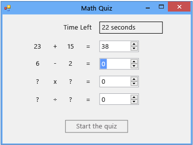

# Step 6: Add a Subtraction Problem
[!INCLUDE[vs2017banner](../includes/vs2017banner.md)]

In the sixth part of this tutorial, you'll add a subtraction problem and learn how to perform the following tasks:

- Store the subtraction values.

- Generate random numbers for the problem (and be sure that the answer is between 0 and 100).

- Update the method that checks the answers so that it checks the new subtraction problem too.

- Update your timer's Tick event handler so that the event handler fills in the correct answer when time runs out.

### To add a subtraction problem

1. Add two integer variables for the subtraction problem to your form, between the integer variables for the addition problem and the timer. The code should look like the following.

     [!code-csharp[VbExpressTutorial3Step5_6#12](../snippets/csharp/VS_Snippets_VBCSharp/vbexpresstutorial3step5_6/cs/form1.cs#12)]
     [!code-vb[VbExpressTutorial3Step5_6#12](../snippets/visualbasic/VS_Snippets_VBCSharp/vbexpresstutorial3step5_6/vb/form1.vb#12)]

     The names of the new integer variables—**minuend** and **subtrahend**—aren't programming terms. They're the traditional names in arithmetic for the number that's being subtracted (the subtrahend) and the number from which the subtrahend is being subtracted (the minuend). The difference is the minuend minus the subtrahend. You could use other names, because your program doesn't require specific names for variables, controls, components, or methods. You must follow rules such as not starting names with digits, but you can generally use names such as x1, x2, x3, and x4. However, generic names make code difficult to read and problems nearly impossible to track down. To keep variable names unique and helpful, you'll use the traditional names for multiplication (multiplicand × multiplier = product) and division (dividend ÷ divisor = quotient) later in this tutorial.

     Next, you'll modify the `StartTheQuiz()` method to provide random values for the subtraction problem.

2. Add the following code after the "Fill in the subtraction problem" comment.

     [!code-csharp[VbExpressTutorial3Step5_6#13](../snippets/csharp/VS_Snippets_VBCSharp/vbexpresstutorial3step5_6/cs/form1.cs#13)]
     [!code-vb[VbExpressTutorial3Step5_6#13](../snippets/visualbasic/VS_Snippets_VBCSharp/vbexpresstutorial3step5_6/vb/form1.vb#13)]

     To prevent negative answers for the subtraction problem, this code uses the `Next()` method of the `Random` class a little differently from how the addition problem does. When you give the `Next()` method two values, it picks a random number that's greater than or equal to the first value and less than the second one. The following code chooses a random number from 1 through 100 and stores it in the minuend variable.

     [!code-csharp[VbExpressTutorial3Step5_6#21](../snippets/csharp/VS_Snippets_VBCSharp/vbexpresstutorial3step5_6/cs/form1.cs#21)]
     [!code-vb[VbExpressTutorial3Step5_6#21](../snippets/visualbasic/VS_Snippets_VBCSharp/vbexpresstutorial3step5_6/vb/form1.vb#21)]

     You can call the `Next()` method of the `Random` class, which you named "randomizer" earlier  in this tutorial, in multiple ways. Methods that you can call in more than one way are referred to as overloaded, and you can use IntelliSense to explore them. Look again at the tooltip of the IntelliSense window for the `Next()` method.

     
Intellisense window tooltip

     The tooltip shows **(+ 2 overload(s))**, which means that you can call the `Next()` method in two other ways. Overloads contain different numbers or types of arguments, so that they work slightly differently from one another. For example, a method might take a single integer argument, whereas one of its overloads might take an integer and a string. You choose the correct overload based on what you want it to do. When you add the code to the `StartTheQuiz()` method, more information appears in the Intellisense window as soon as you enter `randomizer.Next(`. Choose the Up Arrow and Down Arrow keys to cycle through the overloads, as the following illustration shows.

     
Overload for Next() method in IntelliSense

     In this case, you want to choose the last overload, because you can specify minimum and maximum values.

3. Modify the `CheckTheAnswer()` method to check for the correct subtraction answer.

     [!code-csharp[VbExpressTutorial3Step5_6#14](../snippets/csharp/VS_Snippets_VBCSharp/vbexpresstutorial3step5_6/cs/form1.cs#14)]
     [!code-vb[VbExpressTutorial3Step5_6#14](../snippets/visualbasic/VS_Snippets_VBCSharp/vbexpresstutorial3step5_6/vb/form1.vb#14)]

     In Visual C#, `&&` is the `logical and` operator. In Visual Basic, the equivalent operator is `AndAlso`. These operators indicate "If the sum of addend1 and addend2 equals the value of the sum NumericUpDown and if minuend minus subtrahend equals the value of the difference NumericUpDown." The `CheckTheAnswer()` method returns `true` only if the answers to the addition and the subtraction problems are both correct.

4. Replace the last part of the timer's Tick event handler with the following code so that it fills in the correct answer when time runs out.

     [!code-csharp[VbExpressTutorial3Step5_6#22](../snippets/csharp/VS_Snippets_VBCSharp/vbexpresstutorial3step5_6/cs/form1.cs#22)]
     [!code-vb[VbExpressTutorial3Step5_6#22](../snippets/visualbasic/VS_Snippets_VBCSharp/vbexpresstutorial3step5_6/vb/form1.vb#22)]

5. Save and run your code.

     Your program includes a subtraction problem, as the following illustration shows.

     
Math quiz with subtraction problem

### To continue or review

- To go to the next tutorial step, see [Step 7: Add Multiplication and Division Problems](../ide/step-7-add-multiplication-and-division-problems.md).

- To return to the previous tutorial step, see [Step 5: Add Enter Event Handlers for the NumericUpDown Controls](../ide/step-5-add-enter-event-handlers-for-the-numericupdown-controls.md).
