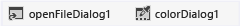

# Step 7: Add Dialog Components to Your Form
[!INCLUDE[vs2017banner](../includes/vs2017banner.md)]

To enable your program to open picture files and choose a background color, in this step, you add an **OpenFileDialog** component and a **ColorDialog** component to your form.

 A component is like a control in some ways. You use the Toolbox to add a component to your form, and you set its properties using the **Properties** window. But unlike a control, adding a component to your form doesn't add a visible item that the user can see on the form. Instead, it provides certain behaviors that you can trigger with code. It's a component that opens an **Open File** dialog box.

 For a video version of this topic, see [Tutorial 1: Create a Picture Viewer in Visual Basic - Video 3](https://go.microsoft.com/fwlink/?LinkId=205213) or [Tutorial 1: Create a Picture Viewer in C# - Video 3](https://go.microsoft.com/fwlink/?LinkId=205202). These videos use an earlier version of Visual Studio, so there are slight differences in some menu commands and other user interface elements. However, the concepts and procedures work similarly in the current version of Visual Studio.

### To add dialog components to your form

1. Choose the Windows Forms Designer (Form1.cs [Design] or Form1.vb [Design]) and then open the **Dialogs** group in the Toolbox.

    > [!NOTE]
    > The **Dialogs** group in the Toolbox has components that open many useful dialog boxes for you, which can be used for opening and saving files, browsing folders, and choosing fonts and colors. You use two dialog components in this project: **OpenFileDialog** and **ColorDialog**.

2. To add a component called **openFileDialog1** to your form, double-click **OpenFileDialog**. To add a component called **colorDialog1** to your form, double-click **ColorDialog** in the Toolbox. (You use that one in the next tutorial step.) You should see an area at the bottom of Windows Forms Designer (beneath the Picture Viewer form) that has an icon for each of the two dialog components that you added, as shown in the following picture.

     
Dialog components

3. Choose the **openFileDialog1** icon in the area at the bottom of the Windows Forms Designer. Set two properties:

    - Set the **Filter** property to the following (you can copy and paste it):

        ```
        JPEG Files (*.jpg)|*.jpg|PNG Files (*.png)|*.png|BMP Files (*.bmp)|*.bmp|All files (*.*)|*.*
        ```

    - Set the **Title** property to the following: **Select a picture file**

         The **Filter** property settings specify the kinds of file types that will display in the **Select a picture** file dialog box.

    > [!NOTE]
    > To see an example of the **Open File** dialog box in a different application, open Notepad or Paint, and on the menu bar, choose **File**, **Open**. Notice how there's a **Files of type** drop-down list at the bottom. You just used the **Filter** property in the **OpenFileDialog** component to set that up. Also, notice how the **Title** and **Filter** properties are bold in the **Properties** window. The IDE does that to show you any properties that have been changed from their default values.

### To continue or review

- To go to the next tutorial step, see [Step 8: Write Code for the Show a Picture Button Event Handler](../ide/step-8-write-code-for-the-show-a-picture-button-event-handler.md).

- To return to the previous tutorial step, see [Step 6: Name Your Button Controls](../ide/step-6-name-your-button-controls.md).
