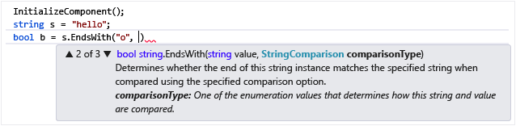

# Using IntelliSense
[!INCLUDE[vs2017banner](../includes/vs2017banner.md)]

IntelliSense is the general term for a number of features: List Members, Parameter Info, Quick Info, and Complete Word. These features help you to learn more about the code you are using, keep track of the parameters you are typing, and add calls to properties and methods with only a few keystrokes.

 Many aspects of IntelliSense are language-specific. For more information about IntelliSense for different languages, see the topics listed under See Also.

## List Members
 A list of valid members from a type (or namespace) appears after you type a trigger character (for example, a period (`.`) in managed code or `::` in C++). If you continue typing characters, the list is filtered to include only the members that begin with those characters.

 After selecting an item, you can insert it into your code by pressing TAB or by typing a space. If you select an item and type a period, the item appears followed by the period, which brings up another member list. When you select an item but before you insert it, you get Quick Info for the item.

 In the member list, the icon to the left represents the type of the member, such as namespace, class, function, or variable. For a list of icons, see [Class View and Object Browser Icons](../ide/class-view-and-object-browser-icons.md). The list may be quite long, so you can press PAGE UP and PAGE DOWN to move up or down in the list.

 

 You can invoke the **List Members** feature manually by typing CTRL+J, clicking **Edit/IntelliSense/List Members**, or clicking the **List Members** button on the editor toolbar. When it is invoked on a blank line or outside a recognizable scope, the list displays symbols in the global namespace.

 To turn List Members off by default (so that it does not appear unless specifically invoked), go to **Tools/Options/All Languages** and deselect **Auto list members**. If you want to turn off List Members only for a specific language, go to the **General** settings for that language.

 You can also change to suggestion mode, in which only the text you type is inserted into the code. For example, if you enter an identifier that is not in the list and press TAB, in completion mode the entry would replace the typed identifier. To toggle between completion mode and suggestion mode, press CTRL+ALT+SPACEBAR or click **Edit/IntelliSense/Toggle Completion Mode**.

## Parameter Info
 Parameter Info gives you information about the number, names, and types of parameters required by a method, attribute generic type parameter (in C#), or template (in C++).

 The parameter in bold indicates the next parameter that is required as you type the function. For overloaded functions, you can use the UP and DOWN arrow keys to view alternative parameter information for the function overloads.

 

 When you annotate functions and parameters with XML Documentation comments, the comments will display as Parameter Info. For more information, see [Supplying XML Code Comments](../ide/supplying-xml-code-comments.md).

 You can manually invoke Parameter Info by clicking **Edit IntelliSense/Parameter Info**, typing CTRL+SHIFT+SPACE, or clicking the **Parameter Info** button on the editor toolbar.

## Quick Info
 Quick Info displays the complete declaration for any identifier in your code.

 

 When you select a member from the **List Members** box, Quick Info also appears.

 

 You can manually invoke Quick Info by clicking **Edit/IntelliSense/Quick Info**, typing CTRL+I, or clicking the **Quick Info** button on the editor toolbar.

 If a function is overloaded, IntelliSense may not display information for all forms of the overload.

 You can turn Quick Info off In C++ by setting **Tools/Options/Text Editor/C/C++/Advanced/Auto Quick Info** to `false`.

## Complete Word
 Complete Word completes the rest of a variable, command, or function name once you have entered enough characters to disambiguate the term. You can invoke Complete Word by clicking **Edit/IntelliSense/Complete Word**, typing CTRL+SPACE, or clicking the **Complete Word** button on the editor toolbar.

## IntelliSense Options
 IntelliSense options are on by default. To turn them off, click **Tools/Options/Text Editor** and deselect **Parameter information** or **Auto list members** if you do not want the List Members feature.

## Troubleshooting IntelliSense
 The IntelliSense options may not work as you expect in certain cases.

 **The cursor is below a code error.** You might not be able to use IntelliSense if an incomplete function or other error exists in the code above the cursor because IntelliSense might not be able to parse the code elements. You can resolve this problem by commenting out the applicable code.

 **The cursor is in a code comment.** You can't use IntelliSense if the cursor is in a comment in your source file.

 **The cursor is in a string literal.** You can't use IntelliSense if the cursor is in the quotation marks around a string literal, as in the following example:

```
MessageBox( hWnd, "String literal|") )
```

 **The automatic options are turned off.** By default, IntelliSense works automatically, but you can disable it. Even if automatic statement completion is disabled, you can invoke an IntelliSense feature.

## See Also
 [Visual Basic-Specific IntelliSense](../ide/visual-basic-specific-intellisense.md)
 [Visual C# IntelliSense](../ide/visual-csharp-intellisense.md)
 [JavaScript IntelliSense](../ide/javascript-intellisense.md)
 [Supplying XML Code Comments](../ide/supplying-xml-code-comments.md)
