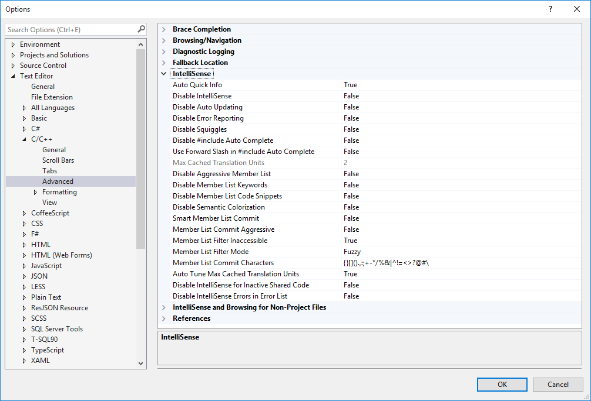
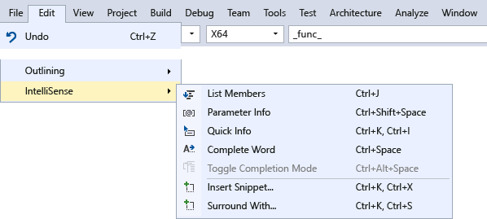
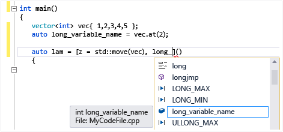
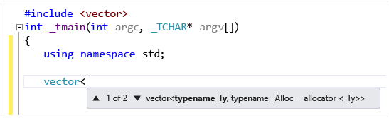
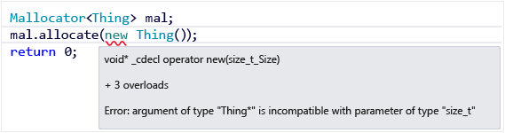

# Visual C++ Intellisense
[!INCLUDE[vs2017banner](../includes/vs2017banner.md)]

In Visual Studio 2015, IntelliSense is available for single code files as well as for files in projects. In cross-platform projects, some IntelliSense features are available in .cpp and .c files in the shared code project even when you are in an Android or iOS context.

## IntelliSense features in C++
 IntelliSense is a name given to a set of features that make coding more convenient. Since different people have different ideas about what is convenient, virtually all of the IntelliSense features can be enabled or disabled in the **Text Editor, C/C++, Advanced** property page.

 

 You can use the menu items and keyboard shortcuts shown in the following image to access IntelliSense.

 

### Statement completion and member list
 When you start typing a keyword, type, function, variable name, or other program element that the compiler recognizes, the editor offers to complete the word for you

 For a list of the icons and their meanings, see [Class View and Object Browser Icons](../ide/class-view-and-object-browser-icons.md).

 

 The first time member list is invoked it only shows members that are accessible for the current context. If you use **Ctrl + J** after that, it shows all members regardless of accessibility. If you invoke it a third time, an even wider list of program elements is shown. You can turn off statement completion in the **C/C++ General Options** page.

 

### Parameter Help
 When you type an opening brace of a function call, or angle bracket on a class template variable declaration, the editor shows a small window with the parameter types for each overload of the function or constructor. The "current" parameter--based on the cursor location--is in bold. You can turn off Statement completion in the **C/C++ General Options** page.

 

### Quick Info
 When you hover the mouse cursor over a variable, a small window appears inline that shows the type information and the header in which the type is defined. Hover over a function call to see the function's signature. You can turn off Quick Info in the **Text Editor, C/C++, Advanced** page.

 

## Error squiggles
 Squiggles under a program element (variable, keyword, brace, type name, and so on) call your attention to an error or potential error in the code. A green squiggle appears when you write a forward declaration, to remind you that you still need to write the implementation. A purple squiggle appears in a shared project when there is an error in code that is not currently active, for example when you are working in the Windows context but enter something that would be an error in an Android context. A red squiggle indicates a compiler error or warning in active code that you need to deal with.

 

## Code Colorization and Fonts
 The default colors and fonts can be changed by using the **Environment, Fonts and Colors** property page. You can change the fonts for many UI windows here, not just the editor. The settings that are specific to C++ begin with "C++"; the other settings are for all languages.

## Cross-Platform IntelliSense
 In a shared code project, some IntelliSense features such as squiggles are available even when you are working in an Android context. If you write some code that would result in an error in an inactive project, IntelliSense still shows squiggles, but they are in a different color than squiggles for errors in the current context.

 Here’s an OpenGLES Application that is configured to build for Android and iOS. The illustration shows shared code being edited. In the first image, Android is the active project:

 

 Notice the following:

- The #else branch on line 8 is grayed out to indicate inactive region, because `__ANDROID__` is defined for Android project.

- The greeting variable at line 11 is initialized with identifier HELLO, which has a purple squiggle. This is because no identifier HELLO is defined in the currently inactive iOS project. While in Android project line 11 would compile, it won’t in iOS. Since this is shared code, that is something you should change even though it compiles in the currently active configuration.

- Line 12 has red squiggle on identifier BYE; this identifier is not defined in the currently selected active project.

  Now, change the active project to iOS.StaticLibrary and notice how the squiggles change.

  

  Notice the following:

- The #ifdef branch on line 6 is grayed out to indicate inactive region, because *_ANDROID\\*\_ is not defined for iOS project.

- The greeting variable at line 11 is initialized with identifier HELLO, which now has red squiggle. This is because no identifier HELLO is defined in the currently active iOS project.

- Line 12 has purple squiggle on identifier BYE; this identifier is not defined in currently inactive Android.NativeActivity project.

## Single File IntelliSense
 When you open a single file outside of any project, you still get IntelliSense. You can enable or disable particular features by going to **Text Editor, C/C++, Advanced** to turn on or off IntelliSense features. To configure IntelliSense for single files that aren't part of a project, look for **IntelliSense and Browsing for Non-Project Files** in the **Advanced** section. See [Visual C++ Guided Tour](https://msdn.microsoft.com/499cb66f-7df1-45d6-8b6b-33d94fd1f17c).

 

 By default, single file IntelliSense only uses standard include directories to find header files. To add additional directories, open the shortcut menu on the Solution node, and add your directory to **Debug Source Code** list, as the following illustration shows:

 

## See Also
 [Using IntelliSense](../ide/using-intellisense.md)
