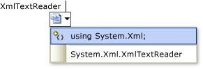

# Visual C# IntelliSense
[!INCLUDE[vs2017banner](../includes/vs2017banner.md)]

Visual C# IntelliSense is available when coding in the editor, and while you debugging in the [Immediate Mode](../ide/reference/immediate-window.md) command window.

## Completion Lists
 The IntelliSense completion lists in Visual C# contain tokens from List Members, Complete Word, and more. It provides quick access to:

- Members of a type or namespace,

- Variables, commands, and functions names,

- [Code snippets](#CodeSnippets),

- [Language Keywords](#Keywords),

- [Extension Methods](#ExtensionMethods)

  The Completion List in C# is also smart enough to filter out irrelevant tokens and pre-select a token based on context. For more information, see [Filtered Completion Lists in C#](../misc/filtered-completion-lists-in-csharp.md) and [Pre-selected Completion List Items in C#](../misc/pre-selected-completion-list-items-in-csharp.md).

###  Code Snippets in Completion Lists
 In Visual C#, the completion list includes code snippets to help you easily insert predefined bodies of code into your program. Code snippets appear in the completion list as the snippet's [Shortcut Element (Intellisense Code Snippets)](https://msdn.microsoft.com/052cc97a-5c70-42f8-b398-4c3adf670cfa).  For more information about code snippets that are available in Visual C# by default, see [Visual C# Code Snippets](../ide/visual-csharp-code-snippets.md).

###  Language Keywords in Completion Lists
 In Visual C#, the completion list also includes language keywords. For more information about C# language keywords, see [C# Keywords](https://msdn.microsoft.com/library/e929b0f2-4b92-4d37-8060-23d323b098ad).

###  Extension Methods in Completion Lists
 In Visual C#, the completion list includes Extension Methods that are in scope.

> [!NOTE]
> The completion list does not display all extension methods for <xref:System.String> objects.

 Extension methods use a different icon than instance methods. For a listing of list icons, see [Class View and Object Browser Icons](../ide/class-view-and-object-browser-icons.md). When an instance method and extension method with the same name are both in scope, the completion list displays the extension method icon.

### Filtered Completion Lists
 IntelliSense removes unnecessary members from the completion list by using filters.

 Visual C# filters the completion lists that appear for these items:

- **Interfaces and base classes.** IntelliSense automatically removes items from the interface and base class completion lists, in both class declaration base and interface lists and constraint lists. For example, enums do not appear in the completion list for base classes, because enums cannot be used for base classes. The completion list of base classes only contains interfaces and namespaces. If you select an item in the list and then type a comma, IntelliSense removes base classes from the completion list because Visual C# does not support multiple inheritance. The same behavior occurs for constraint clauses also.

- **Attributes**: When you apply an attribute to a type, the completion list is filtered so that the list only contains those types that descend from the namespaces that contain those types, such as <xref:System.Attribute>.

- `as` and `is` operators.

- **Catch clauses.**

- **Object Initializers:** Only members that can be initialized will appear in the completion list.

- **new keyword**: When you type `new` and then press the SPACEBAR, a completion list appears. An item is automatically selected in the list, based on the context in your code. For example, items are automatically selected in the completion list for declarations and for return statements in methods.

- **as and is Operators:** A filtered completion list is displayed automatically when you press the SPACEBAR after you have typed the `as` or `is` keyword.

- Events: When you type the keyword `event`, the completion list only contains delegate types.

- Parameter help automatically sorts to the first method overload that matches the parameters as you enter them. If multiple method overloads are available, you can use the up and down arrows to navigate to the next possible overload in the list.

## Most recently used members
 IntelliSense remembers the members that you have recently selected in the pop-up [List Members](../ide/using-intellisense.md) box for automatic object name completion. The next time you use Member List, the most recently used members are shown at the top. The history of most recently used members is cleared between each session in the IDE.

## override
 When you type [override](https://msdn.microsoft.com/library/dd1907a8-acf8-46d3-80b9-c2ca4febada8) and then press SPACEBAR, IntelliSense displays all of the valid base class members that you can override in a pop-up list box. Typing the return type of the method after `override` will prompt IntelliSense to only show methods that return the same type. When IntelliSense cannot find any matches, it will display all of the base class members.

## Automatic Code Generation

### Add using
 The Add using IntelliSense operation enables you to maintain your focus on the code you are writing rather than requiring you to shift your focus to another part of the code.

 To initiate the Add using operation, position the cursor on a type reference that cannot be resolved. For example, when you create a console application and then add `XmlTextReader` to the body of the `Main` method, a smart tag will appear under the rightmost character of `XmlTextReader`, since it appears as a type reference that cannot be resolved.

 

 You can then invoke the Add using by selecting it from **Resolve** submenu of the **IntelliSense** menu or the context menu, or by invoking Add using through the smart tag. The smart tag is only visible when the cursor is positioned on, or adjacent to, the unbound type.

 

### Organize usings
 The **Organize Usings** options sort and remove `using` and `extern` declarations without changing the behavior of the source code. Over time, source files may become bloated and difficult to read because of unnecessary and unorganized `using` directives. The **Organize Usings** options compact source code by removing unused `using` directives and improves readability by sorting them.

 To see the available options in the Visual Studio IDE, on the **Edit** menu, point to **IntelliSense**, and then point to **Organize Usings**. The IDE provides the following options to organize and remove `usings` directives:

### Implement Interface
 IntelliSense provides an option to help you implement an [interface](https://msdn.microsoft.com/library/7da38e81-4f99-4bc5-b07d-c986b687eeba) while working in the Code Editor. Normally, to implement an interface properly you must create a method declaration for every member of the interface in your class. Using IntelliSense, after you type the name of an interface in a class declaration, a smart tag is displayed. The smart tag gives you the option to implement the interface automatically, using explicit or implicit naming. Under explicit naming, the method declarations carry the name of the interface; under implicit naming, the method declarations do not indicate the interface to which they belong. An explicitly named interface method can only be accessed through an interface instance, and not through a class instance. For more information, see [Explicit Interface Implementation](https://msdn.microsoft.com/library/181c901f-0d4c-4f29-97fc-895079617bf2).

 Implement Interface will generate the minimum number of method stubs that is required to satisfy the interface. If a base class implements parts of the interface, then those stubs are not regenerated.

### Implement abstract base class
 IntelliSense provides an option to help you implement members of an abstract base class automatically while working in the Code Editor. Normally, to implement members of an abstract base class requires creating a new method definition for each method of the abstract base class in your derived class. Using IntelliSense, after typing the name of an abstract base class in a class declaration, a smart tag is displayed. The smart tag gives you the option to implement the base class methods automatically.

 The method stubs that are generated by the Implement Abstract Base Class feature are modeled by the code snippet defined in the file MethodStub.snippet. Code Snippets are modifiable. For more information, see [Walkthrough: Creating a Code Snippet](../ide/walkthrough-creating-a-code-snippet.md).

### Generate from usage
 The **Generate From Usage** feature enables you to use classes and members before you define them. You can generate a stub for any class, constructor, method, property, field, or enum that you want to use but have not yet defined. You can generate new types and members without leaving your current location in code. This minimizes interruption to your workflow.

 A wavy underline appears under each undefined identifier. When you rest the mouse pointer on the identifier, an error message appears in a tooltip.

 To display the appropriate options, you can use one of the following procedures:

- Click the undefined identifier. A short underline appears under the leftmost character. Rest the mouse pointer on the short underline, and a smart tag (an icon) appears. Click the smart tag.

- Click the undefined identifier, and then press CTRL+. (period).

- Right-click the undefined identifier, and then click **Generate**.

  The options that appear can include the following:

- **Generate property stub**

- **Generate field stub**

- **Generate method stub**

- **Generate class**

- **Generate new type** (for a class, struct, interface, or enum)

## Generate event handlers
 In the Code Editor, IntelliSense can help you hook up methods (event handlers) to event fields.

 When you type the `+=` operator after an event field in a .cs file, IntelliSense prompts you with the option to press the TAB key. This inserts a new instance of a delegate that points to the method handling the event.

 

 If you press TAB, IntelliSense automatically finishes the statement for you and displays the event handler reference as selected text in the Code Editor. To complete the automatic event hookup, IntelliSense prompts you to press the TAB key again to create an empty stub for the event handler.

 

> [!NOTE]
> If a new delegate that is created by IntelliSense references an existing event handler, IntelliSense communicates this information in the tooltip. You can then modify this reference; the text is already selected in the Code Editor. Otherwise, automatic event hookup is complete at this point.

 If you press TAB, IntelliSense stubs out a method with the correct signature and puts the cursor in the body of your event handler.

> [!NOTE]
> Use the **Navigate Backward** command on the **View** menu (CTRL+-) to go back to the event hookup statement.

 The following task shows how IntelliSense automatically hooks up an event handler named `button1_Click` to an event field named `button1.Click`.

## See Also
 [Visual Studio IDE](../ide/visual-studio-ide.md)
