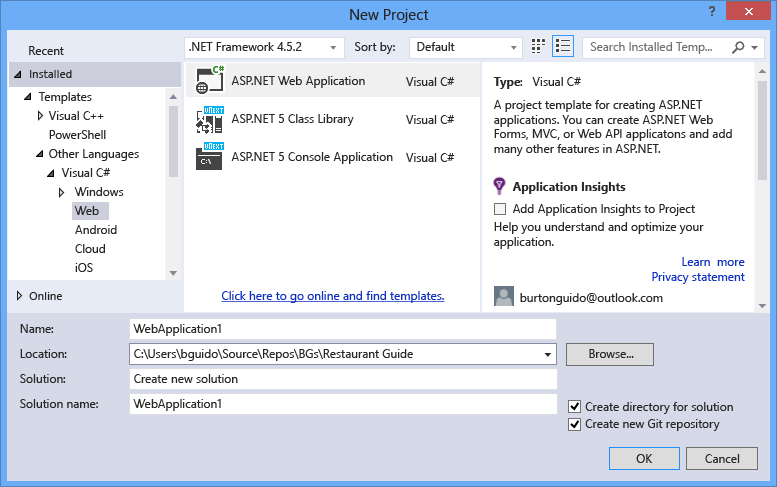
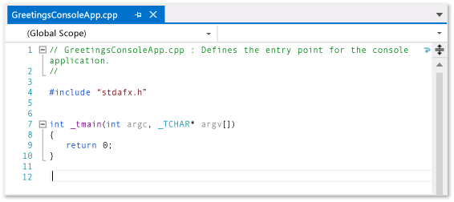
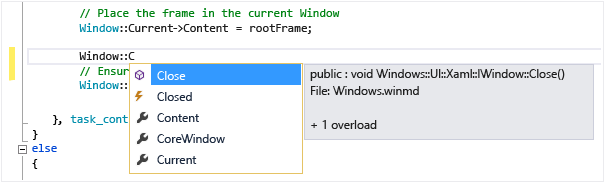
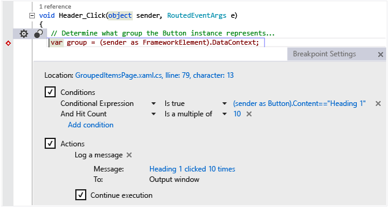
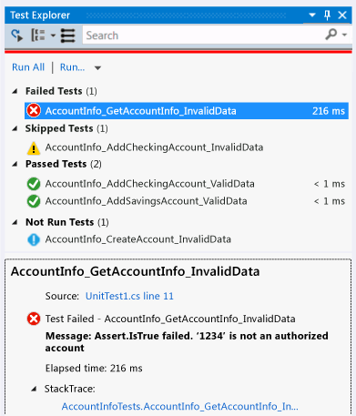
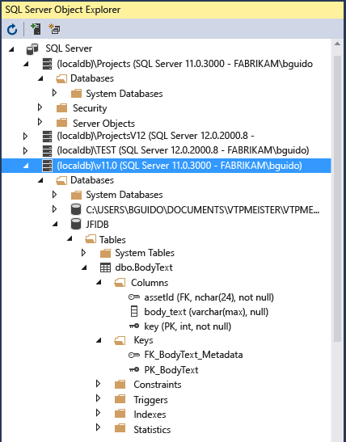

# Visual Studio IDE
[!INCLUDE[vs2017banner](../includes/vs2017banner.md)]
Microsoft Visual Studio 2015 is a suite of tools for creating software, from the planning phase through UI design, coding, testing, debugging, analyzing code quality and performance, deploying to customers, and gathering telemetry on usage. These tools are designed to work together as seamlessly as possible, and are all exposed through the Visual Studio Integrated Development Environment (IDE).

You can use Visual Studio to create many kinds of applications, from simple store apps and games for mobile clients, to large, complex systems that power enterprises and data centers. You can create:

- Apps and games that run not only on Windows, but also Android and iOS.

- Websites and web services based on ASP.NET, JQuery, AngularJS, and other popular frameworks.

- Applications for platforms and devices as diverse as Azure, Office, Sharepoint, Hololens, Kinect, and Internet of Things, to name just a few examples.

- Games and graphics-intensive applications for a variety of Windows devices, including Xbox, using DirectX.

Visual Studio by default provides support for C#, C and C++, JavaScript, F#, and Visual Basic. Visual Studio works and integrates well with third-party applications like Unity through the [Visual Studio Tools for Unity](../cross-platform/visual-studio-tools-for-unity.md) extension and Apache Cordova through [Visual Studio Tools for Apache Cordova](https://msdn.microsoft.com/library/db446f2c-6ba4-4c76-aac5-4c66f43b8c42). You can extend Visual Studio yourself by creating custom tools that perform specialized tasks.

If you’ve never used Visual Studio before, learn the basics with our [Get Started Developing with Visual Studio](../ide/get-started-developing-with-visual-studio.md) tutorials and walkthroughs.

If you want to find out about new features in Visual Studio 2015, see [What's New in Visual Studio 2015](../what-s-new-in-visual-studio-2015.md).

## Visual Studio Setup
 You can find out which edition of Visual Studio is right for you at [Visual Studio Editions](https://visualstudio.microsoft.com/vs/).

 You can install Visual Studio 2015 by downloading it from [Visual Studio Downloads](https://www.visualstudio.com/downloads/download-visual-studio-vs.aspx). If you need to know more about the installation process, see [Installing Visual Studio 2015](../install/install-visual-studio-2015.md).

## IDE Basics
 The following image shows the Visual Studio IDE with an open project, and the Solution Explorer window for navigating in the project files, and the Team Explorer window for navigating source control and work item tracking. The features in the title bar that are called out are explained below in more detail.

 

### Signing in
 When you start Visual Studio for the first time, you can sign in using your Microsoft account, or your work or school account. Being signed in allows you to synchronize your settings, such as window layouts, across multiple devices and connect automatically to the services you might need, such as Azure subscriptions and Visual Studio Team Services. If you have a subscription-based license, you'll need to sign in to Visual Studio on a regular basis in order to keep your license token fresh. If you have a product key license, you don't have to sign in, but doing so makes it more convenient to connect to Visual Studio Team Services and your accounts with Azure, Office 365, Salesforce.com. For more information, see [Signing in to Visual Studio](../ide/signing-in-to-visual-studio.md).

 If you have multiple Visual Studio Team Services accounts, Azure accounts or MSDN subscriptions, you can link them and access resources and services in all your accounts with a single sign-in. For more information, see [Work with multiple user accounts](../ide/work-with-multiple-user-accounts.md).

### Staying up to date
 The notification icon in the upper right of the title bar tells you when updates are available for Visual Studio or any related components that you have installed. You can choose whether to dismiss or act on these notifications. For more information, see [Visual Studio Notifications](../ide/visual-studio-notifications.md).

### Finding things and getting help
 The [Quick Launch](../ide/reference/quick-launch-environment-options-dialog-box.md) window shown below is a fast way to find Visual Studio commands, tools, features, and so on when you don't know the keyboard shortcut or menu location. Just type what you are looking for and Quick Launch will give you a link to it.

 

 MSDN is the Microsoft web site for technical documentation; you are reading this page on MSDN right now! In Visual Studio, you can press **F1** to go to the MSDN help page for the active window. You can also press **F1** in the code editor to go to the MSDN help page for the API or keyword at the current caret position. For example, in a C# file, place the caret somewhere in or just at the end of a `System.String` declaration, and press **F1** to go to the MSDN help page for <xref:System.String>.

### Giving feedback
 It's easy to give us feedback on Visual Studio whenever you like. Click the feedback icon in the title bar next to **QuickLaunch** and then click on **Report a Problem** or **Provide a Suggestion**. Pre-release editions of Visual Studio also have a **Rate this Product** option. We look at all these comments and use them to improve the product. For more information, see [Talk to Us](../ide/talk-to-us.md).

### Personalizing the IDE
 You can customize the window layout to fit your development style. You can dock, float or hide any window at any time, and you also can run the editor in full-screen mode. You can create and save multiple custom window layouts that show only the windows you need for specific contexts. For example, you can create a full-screen layout so that all you see is the code editor. And you can create different layouts for debugging and for team operations. For more information, see [Customizing window layouts](../ide/customizing-window-layouts-in-visual-studio.md).

 You can customize Visual Studio in many other ways, and roam your settings if you work on multiple machines. For more information, see [Personalizing the  IDE](../ide/personalizing-the-visual-studio-ide.md).

 There are keyboard shortcuts for almost everything, and you can customize them as well. To create new shortcuts, type "Keyboard" in Quick Launch to open the Keyboard dialog box. From there, you can press F1 to go to the MSDN help page if you need more information about the options. For more information, see [Default Keyboard Shortcuts in Visual Studio](../ide/default-keyboard-shortcuts-in-visual-studio.md).

## Connecting to Visual Studio Team Services and Team Foundation Server
 Visual Studio Team Services (VSTS) is a cloud-based service for hosting software projects and enabling collaboration in teams. VSTS supports both Git and Team Foundation Source Control systems, as well as Scrum, CMMI and Agile development methodologies. Team Foundation Version Control (TFVC) uses a single, centralized server repository to track and version files. Local changes are always checked in to the central server where other developers can get the latest changes. Team Foundation Server (TFS) 2015 is the application lifecycle management hub for Visual Studio. It enables everyone involved with the development process to participate using a single solution. TFS is useful for managing heterogeneous teams and projects, too.

 If you have a Visual Studio Team Services account or a Team Foundation Server on your network, you connect to it through the Team Explorer window. From this window you can check code into or out of source control, manage work items, start builds, and access team rooms and workspaces. You can open Team Explorer from **Quick Launch** or on the main menu from **View &#124; Team Explorer** or from **Team &#124; Manage Connections**.  For more information about Visual Studio Team Services, see [www.visualstudio.com](https://www.visualstudio.com/). For more information about Team Foundation Server, see [Team Foundation Server](https://www.visualstudio.com/products/tfs-overview-vs).

 The following image shows the Team Explorer pane for a solution that is hosted in VSTS:

 

## Creating solutions and projects
 Although you can use Visual Studio to browse individual code files, more commonly you will be working in a *project*. A Visual Studio project is a collection of files and resources that are compiled to a single binary executable file for applications (for example, an .exe, DLL, or appx). For non-ASP.NET websites, no executable is produced and the project contains only the HTML, JavaScript files, and images. Because sometimes you might need to create multiple binaries or websites that are closely related, Visual Studio has the concept of the Solution, which can contain multiple projects or websites. When you create a project, you are actually creating a project-in-a-solution, and you can add more projects to that solution later if you need to. For example, if you have a DLL project, you can add an .exe project to the solution that loads and consumes the DLL.

 A *project template* is a collection of pre-populated code files and configuration settings that get you set up quickly to create a specific kind of application. Visual Studio comes with many project templates to choose from, and if none of the default templates work for you, you can create your own. After you create a project with a template, you can start writing your own code in it, either in the files provided or in new files you add. For more information, see [Solutions and Projects](../ide/solutions-and-projects-in-visual-studio.md). The following illustration shows the New Project dialog with the project templates that are available for ASP.NET applications.

 

## Designing the user interface
 A designer is an intuitive tool that enables you to create a user interface without writing code. You can drag UI controls such as list boxes, calendars, and buttons from the [Toolbox](../ide/reference/toolbox.md) window onto a design surface that represents the window or dialog box. You can resize and rearrange the elements without writing any code. Designers are included for any project type that has a user interface.

 If your project has a XAML-based user interface, the default designer is Blend for Visual Studio, a sophisticated graphics tool that works seamlessly with Visual Studio.

 

|||
|-|-|
||**Design view** Displays the visual design of your document. In this view, you can draw or modify objects on the design surface.|
||**Breadcrumb** Quickly move between template-editing mode, style-editing mode, and object-editing scope for a selected object.|
||**Zoom** Use to zoom the design surface or objects on the design surface.|
||**Design surface controls** Use these controls (**Show snap grid**, **Snap to gridlines** and **Turn on or off snapping to snaplines**) to set snapping options. Snapping is useful for lining objects up to each other or to evenly-spaced lines on the design surface.|
||**Code editor** Edit your XAML, C#, C++ or Visual Basic code manually in the Code editor.|

 For more information, see [Designing XAML in Visual Studio and Blend for Visual Studio](../designers/designing-xaml-in-visual-studio.md).

## Writing, navigating and understanding code
 If you are a developer, the editor window is where you will probably spend most of your time. Visual Studio includes editors for C#, C++, Visual Basic, JavaScript, XML, HTML, CSS, and F#, and third parties offer plug-in editors (and compilers) for many other languages.

 You can edit individual files in the text editor by clicking **File &#124; Open &#124; File.** To edit files in an open project, click on the file name in Solution Explorer. The code is colorized, and you can personalize the color scheme by typing “Colors” in Quick Launch. You can have lots of text editor tabbed windows open at once. You can split each window independently. You can also run the text editor in full-screen mode.

 

 The text editor is highly interactive (if you want it to be) with many productivity features that help you write better code faster. The features vary by language, and you don’t have to use any of them (Type "Editor" in Quick Launch) to turn features on or off: Some of the common productivity features are:

1. [Refactoring](../ide/refactoring-in-visual-studio.md) includes operations such as intelligent renaming of variables, moving selected lines of code into a separate function, moving code to other locations, redordering function parameters, and more.

2. *IntelliSense* is an umbrella term for a set of popular features that display type information about your code directly in the editor and, in some cases, write small bits of code for you. It’s like having basic documentation inline in the editor, which saves you from having to look up type information in a separate help window. IntelliSense features vary by language. For more information, see [Visual C# IntelliSense](../ide/visual-csharp-intellisense.md), [Visual C++ Intellisense](../ide/visual-cpp-intellisense.md), [JavaScript IntelliSense](../ide/javascript-intellisense.md), [Visual Basic-Specific IntelliSense](../ide/visual-basic-specific-intellisense.md). The following illustration shows some IntelliSense features at work:

    

3. **Squiggles** alert you to errors or potential problems in your code in real time as you type, which enables you to fix them immediately without waiting for the error to be discovered during compilation or run time. If you hover over the squiggle, you see additional information about the error. A light bulb may also appear in the left margin with suggestions for how to fix the error. For more information, see [Perform quick actions with light bulbs](../ide/perform-quick-actions-with-light-bulbs.md).

    

4. [Bookmarks](../ide/setting-bookmarks-in-code.md) enable you to navigate quickly to specific lines in files that you are actively working on.

5. The [Call Hierarchy](../ide/reference/call-hierarchy.md) window can be invoked in the text editor context menu to show the methods that call, and are called by, the method under the caret.

6. **Code Lens** enables you to find references and changes to your code, linked bugs, work items, code reviews, and unit tests, all without leaving the editor. For more information, see [Find code changes and other history](../ide/find-code-changes-and-other-history-with-codelens.md).

7. The **Peek to Definition** window shows a method or type definition inline, without navigating away from your current context. This window now works for XAML, too.

8. The **Go To Definition** context menu option takes you directly to the place where the function or object is defined. Other navigation commands are also available by right-clicking in the editor.

9. A related tool, the [Object Browser](https://msdn.microsoft.com/f89acfc5-1152-413d-9f56-3dc16e3f0470), enables you to inspect .NET or Windows Runtime assemblies on your system to see what types they contain and what methods and properties those types contain.

     

   Most of the items on the Edit menu and View menu relate to the code editor in some way. For more information about the editor, see [Writing Code](../ide/writing-code-in-the-code-and-text-editor.md) and [Editing Your Code](https://www.visualstudio.com/features/ide-vs).

## Compiling and building your code

To build a project means to compile the source code and perform whatever steps are necessary to produce the executable. Different languages have different build operations, and regular websites don't build at all. Regardless of the project type, the Build menu is the standard location for these commands. To compile and run your code with a single keystroke, press F5. Every compiler is completely configurable through the IDE. The Build toolbar enables you to specify whether to build a debug version of your program, with symbols and extra error checking enabled to support breakpoints and single stepping in the debugger, or a release build, which is what you will ultimately give to customers. You can configure more build settings and many other settings on the property page for a project. Right-click on the project node in Solution Explorer and choose Properties. You can also run builds from the command line.

The output from the build, including an error or success messages, appear in the **Output** window. The **Error List** shows detailed information on build errors.

## Debugging your code
 Visual Studio’s state-of-the-art debugger enables you to debug code running in your local project, on a remote device, or on an emulator such as the ones for Android or Windows Phone. You can step through code one statement at a time and inspect variables as you go, you can step through multi-threaded applications, and you can set breakpoints that are only hit when a specified condition is true. All of this can be configured in the code editor itself, so that you don't have to leave the context of your code.

 

 The debugger itself has multiple windows that enable you to view and manipulate local variables, the call stack, and other aspects of the runtime environment. You can find these windows on the **Debug** menu.

 The [Immediate Window](../ide/reference/immediate-window.md) enables you to type in an expression and see its result immediately.

 The [IntelliTrace](https://msdn.microsoft.com/629e9660-c59a-446b-8c30-290059158f61) window records each method call and other events in a running .NET program and can help you to quickly locate where a problem originates.

 For more information, see [Debugging in Visual Studio](../debugger/debugging-in-visual-studio.md).

## Testing your code
 Visual Studio includes a unit test framework for managed code (.NET) and one for native C++. To create unit tests, simply add a Test Project to your solution, write your tests, and then run them from the Test Explorer window. For more information, see [Unit Test Your Code](../test/unit-test-your-code.md).

 

## Analyzing code quality and performance
 Visual Studio includes powerful tools for static and runtime analysis. The static analysis tools help you identify potential errors in design, globalization, interoperability, performance, security, and other categories. Performance testing, or profiling, involves measuring how your program runs. You access these tools from the **Analyze** menu. For more information, see [Improving Quality with Visual Studio Diagnostic Tools](https://msdn.microsoft.com/library/73baa961-c21f-43fe-bb92-3f59ae9b5945).

## Connecting to cloud services and databases
 The [Server Explorer](https://msdn.microsoft.com/library/4ea29b3b-bbb2-45e4-9082-eaf635c41c4d) window in Visual Studio shows the resources in all the accounts managed under your personalization account (the one you logged in with), including SQL Server instances, Azure, Salesforce.com, Office 365, and websites.

 

 Visual Studio includes [Microsoft SQL Server Data Tools](https://msdn.microsoft.com/data/tools.aspx) (SSDT), which enable you to build, debug, maintain, and refactor databases. You can work with a database project, or directly with a connected database instance on- or off-premises.

 The SQL Server Object Explorer in Visual Studio offers a view of your database objects similar to SQL Server Management Studio. SQL Server Object Explorer allows you to do light-duty database administration and design work, including editing table data, comparing schemas, and executing queries by using contextual menus right from the SQL Server Object Explorer. SSDT also includes special project types and tools for developing SQL Server 2012 Analysis Services, Reporting Services, and Integration Services Business Intelligence (BI) solutions (formerly known as Business Intelligence Development Studio).

 

## Deploying your finished application
 When your application is ready to deploy to customers, Visual Studio provides the tools to do that, whether you’re deploying to the Windows Store, to a SharePoint site, or with InstallShield or Windows Installer technologies. It's all accessible via the IDE. For more information, see [Deploying Applications, Services, and Components](../deployment/deploying-applications-services-and-components.md).

## Architecture and modeling tools (Enterprise only)
 You can use Visual Studio architecture and modeling tools to design and model your app. These tools help you to visualize the code's structure, behavior, and relationships. You can create models at different levels of detail throughout the application lifecycle as part of your development process. You can track requirements, tasks, test cases, bugs, and other work associated with your models by linking model elements to Team Foundation Server work items and your development plan. For more information, see [Design and model your app](../modeling/analyze-and-model-your-architecture.md).

## Extending Visual Studio through the Visual Studio SDK
 Visual Studio is an extensible platform. A Visual Studio extension is a custom tool that integrates with the IDE. You can add third-party extensions or create your own. For more information, see [Developing Visual Studio Extensions](https://msdn.microsoft.com/library/5b1b5db3-6005-44cf-83b0-e608d7764d14).

 The [Visual Studio User Experience Guidelines](../extensibility/ux-guidelines/visual-studio-user-experience-guidelines.md) are an essential reference for anyone writing extensions for Visual Studio. These platform-specific guidelines include information on dialog design, fonts, colors, icons, common controls, and other interaction patterns that will make your new feature integrate seamlessly with Visual Studio.

## In this Guide

|||
|-|-|
|[User Accounts and Updates](../ide/user-accounts-and-updates.md)|[Personalizing the  IDE](../ide/personalizing-the-visual-studio-ide.md)|
|[How to: Move Around in the IDE](../ide/how-to-move-around-in-the-visual-studio-ide.md)|[Get Started Developing with Visual Studio](../ide/get-started-developing-with-visual-studio.md)|
|[Finding and Using Visual Studio Extensions](../ide/finding-and-using-visual-studio-extensions.md)|[Solutions and Projects](../ide/solutions-and-projects-in-visual-studio.md)|
|[Writing Code](../ide/writing-code-in-the-code-and-text-editor.md)|[Debugging in Visual Studio](../debugger/debugging-in-visual-studio.md)|
|[Profiling Tools](../profiling/profiling-tools.md)|[Improve Code Quality](https://msdn.microsoft.com/library/73baa961-c21f-43fe-bb92-3f59ae9b5945)|
|[Designing User Interfaces](../designers/designing-user-interfaces.md)|[Analyzing and Modeling Architecture](../modeling/analyze-and-model-your-architecture.md)|
|[Compiling and Building](../ide/compiling-and-building-in-visual-studio.md)|[Deploying Applications, Services, and Components](../deployment/deploying-applications-services-and-components.md)|
|[Visual Studio IDE 64-Bit Support](../ide/visual-studio-ide-64-bit-support.md)|[Security](../ide/security-in-visual-studio.md)|
|[Visual Studio Samples](../ide/visual-studio-samples.md)|[Microsoft Help Viewer](../ide/microsoft-help-viewer.md)|
|[Globalizing and Localizing Applications](../ide/globalizing-and-localizing-applications.md)|[UI Reference](../ide/reference/general-user-interface-elements-visual-studio.md)|

## See Also

- [Installing Visual Studio 2015](../install/install-visual-studio-2015.md)
- [Editing Your Code](https://www.visualstudio.com/features/ide-vs)
- [What's New in Visual Studio 2015](../what-s-new-in-visual-studio-2015.md)
- [Porting, Migrating, and Upgrading Visual Studio Projects](../porting/porting-migrating-and-upgrading-visual-studio-projects.md)
- [Talk to Us](../ide/talk-to-us.md)